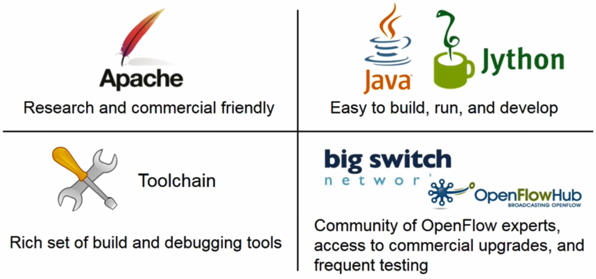
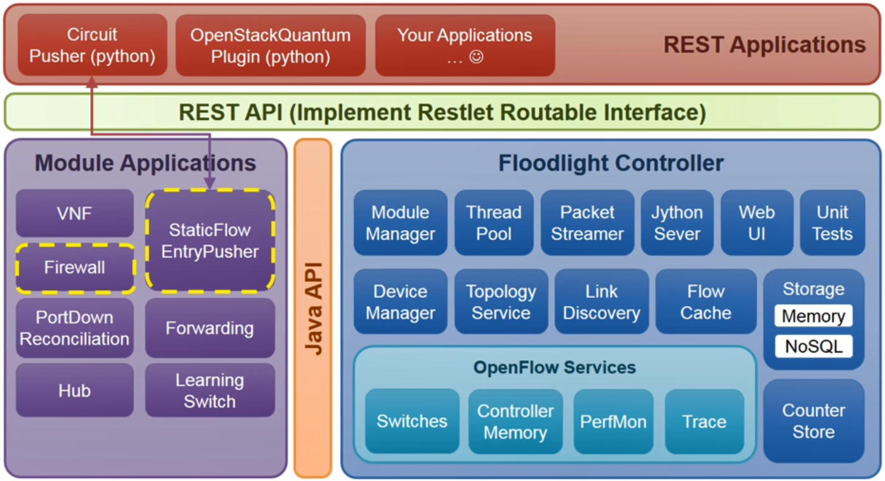
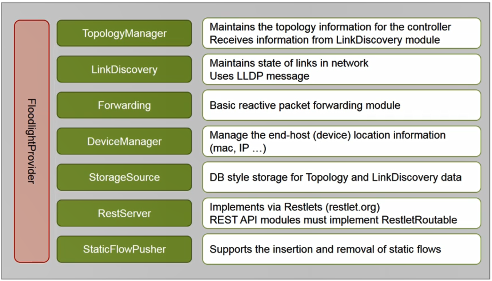
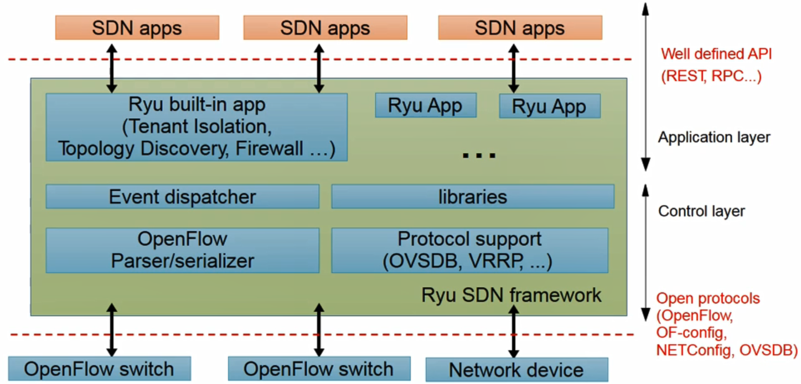
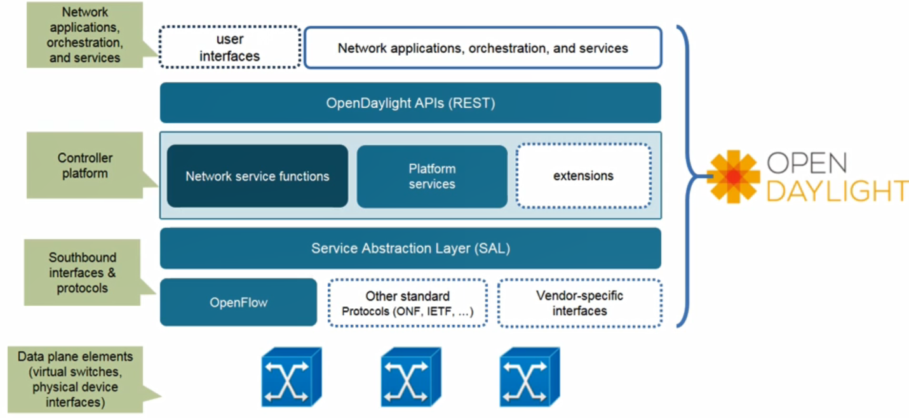
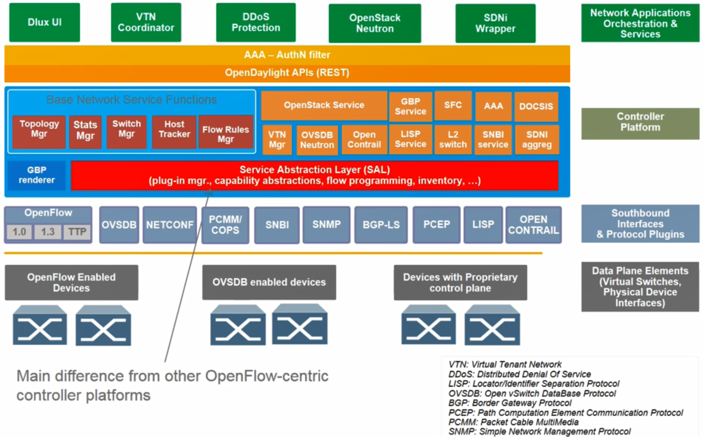
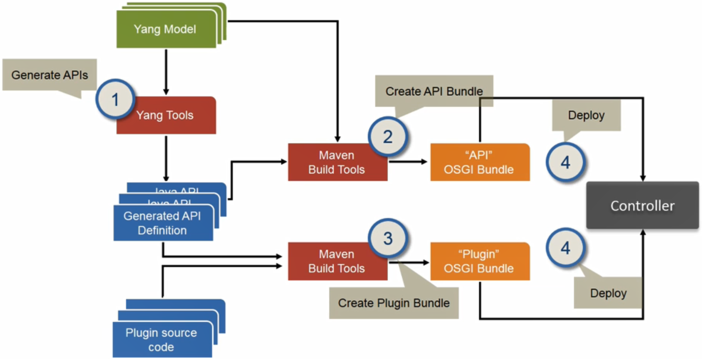
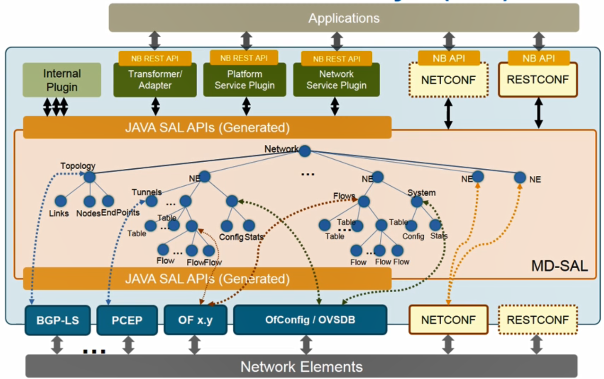

# SDN Controller 2

## Introduction to Floodlight

- Floodlight

  - 자바 기반의 SDN 컨트롤러

  - 현재는 연구 목적으로 일부만 사용

    

- Architecture

  

- Application Modules

  - Forwarding : 기본적으로 제공된 Reactive Forwarding 어플리케이션
  - Static Flow Entry Pusher : Proactive Forwarding 어플리케이션
  - Firewall : 사용자가 ACL(Access Control List) 룰을 정의하면 해당 룰을 참고해 특정 트래픽을 허용할지 말지를 결정
  - Virtual Network Filter(VNF) : MAC 기반의 네트워크 isolation을 해주는 어플리케이션

- Module Description(Core Service)

  

## Introduction to Ryu

- Ryu

  - 일본 엔티티에서 파이썬으로 개발한 SDN 컨트롤러
  - 오픈플로우 어플리케이션을 빌드하기 위한 플랫폼
  - 플로우에 대한 제어를 통해 네트워크를 지능적으로 관리
  - 특징
    - Vendor-neutral한 오픈 인터페이스 제공
    - 통합된 SDN 컨트롤러가 아닌 다양한 SDN 어플리케이션을 개발할 수 있는 플랫폼/프레임워크 제공
  - 제공하는 기능
    - 오픈플로우 프로토콜
    - 이외에도 NetCONF, SNMP, OVSDB
    - 어플리케이션/라이브러리
      - topology view, firewall, OpenFlow Restful 등등

- Architecture

  

## OpenDaylight Scope and Projects

- OpenDayLight Framework

  

- OpenDaylight Projects

  - 오픈데이라이트는 초기 15개 이상의 서브 프로젝트를 수행

- 2차버전 Helium Architecture

  - 여러 하위 프로젝트를 통하여 더 많은 모듈들이 추가
    - 대표적으로 South-bound에는 SNMP, BGP-lS등이 추가
    - SAL 확장하여 오픈플로우 뿐만 아니라 다양한 South-bound 프로토콜 지원
  - Service Function Chaining(SFC), 트리플 어웨이, Virtual Tenent Network(VTN), OVS Neutron 등 실용성 있는 어플리케이션을 개발하여 컨트롤러와 통합

  

- Plugin Build Process

  

- Model-Driven Service Abstraction Layer(SAL)

  - 추상화 계층
  - MDSAL은 네트워크 장비의 복잡한 설정 내용을 모델을 통해 표준화하기 위해 제안
  - Maven 툴을 이용해 생성된 OSGI Bundle은 자바 SAL API에 해당하는 내용으로 컨트롤러 플랫폼에 정의된 서비스들을 이런 API를 호출을 통하여 관련된 오브젝트 생성
  - 생성된 오브젝트는 다시 관련된 South-Bound 인터페이스를 호출시 포함되어 특정 네트워크 장비와 통신시 사용
    - 오픈플로우 장비와 통신을 원하는 경우 MDSAL에 정의된 플로우 테이블, 플로우 등 오브젝트로 설치할 플로우 룰을 표현하고 이 오브젝트를 다시 오픈플로우 South-Bound 인터페이스를 통하여 오픈플로우 제어메시지에 포함시켜 관련된 오픈플로우 스위치에 내릴 수 있음
    - 스위치로부터 올라오는 제어메시지가 있을 경우 South-Bound 인터페이스를 통하여 플로우 룰 내용이 추출되고 MDSAL에 의하여 추상화되어 FlowObject로 변화된 후에 상위 서비스에 의하여 호출. YANG과 NetCONF도 비슷하게 동작

  

