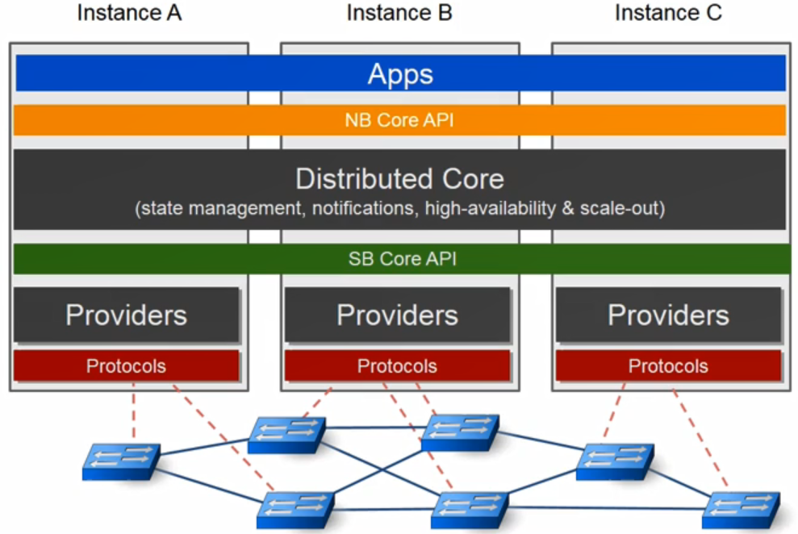
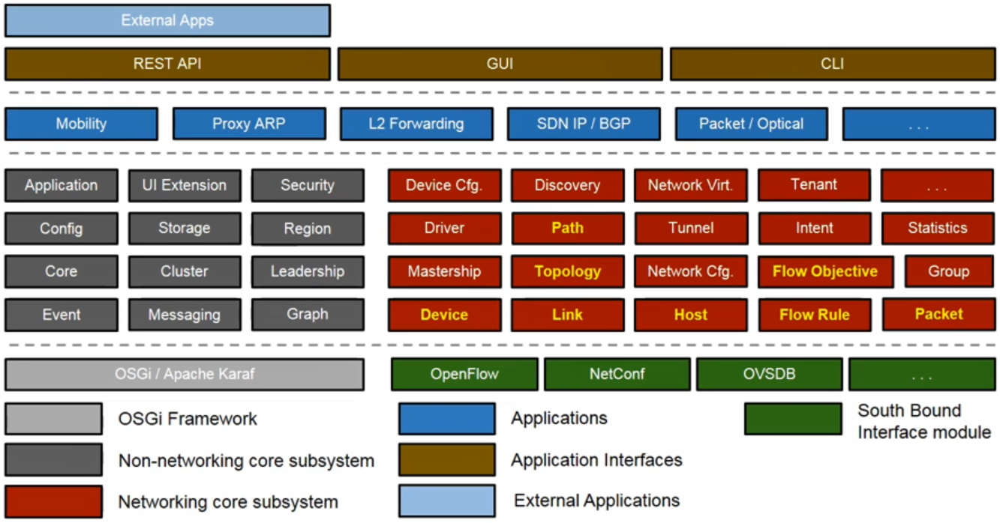
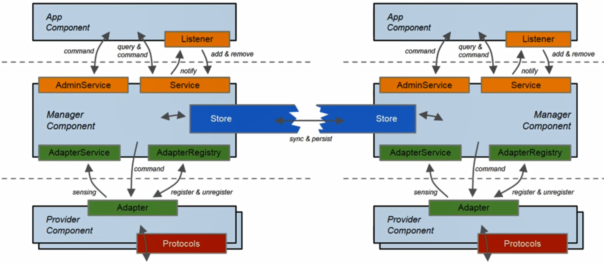
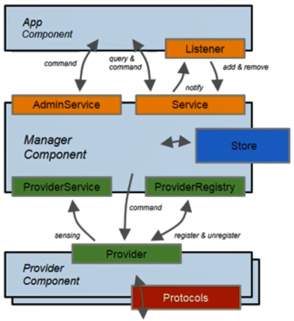

# 13. Introduction to Open Network Operating System(ONOS)

## Why are SPs Interested in SDN and ONOS?

- CAPEX/OPEX 감소

- Bring cloud-style agility, flexibility, scalability to their networks

- 서비스 빠르게 개발

- 복잡도 줄임

  Service Provider의 SDN 요구사항

- 무선, 유선 모두 가능한 호환성

- 고가용성, 이상이 발생했을 때 지속적으로 서비스가 가능하게

- 사용이 쉬움

- 가격이 싼 화이트 하드웨어로 제공

ONOS는 서비스 요구사항을 만족시키는 SDN 컨트롤러 오픈소스 플랫폼

## Service Provider Networks

- WAN core backbone

  - MPLS 그 위에 TE를 돌리는 형태
  - 200~300개의 라우터를 지원하고 10000개의 포트를 지원해야 함

- Metro Networks

- Cellular Access Networks

  - 모바일 네트워크
  - 많은 디바이스 관리
  - 10만개 디바이스를 관리

  SDN 컨트롤러는 많은 장비를 제어해야 한다

## ONOS Introduction

- ONOS : Open Network Operating System
  - 서비스 프로바이더 네트워크를 관리하고 제어하기 위해 제안된 컨트롤러
  - 디자인 목표
    - Code modularity
    - Configurability
      - 실시간으로 설정을 바꿀 수 있음
    - Separation of Concern
      - 각 계층에서 개발할 때 개발자는 자기가 개발하는 계층만 생각하고 개발하고 다른 계층은 신경쓰지 않음
    - Protocol agnosticism
      - 특정 프로토콜에 바인딩된 개발하지 않음

## ONOS Distributed Architecture

- 분산 컨트롤러

- 논리적으로 볼때 하나의 컨트롤러

  - 서로 연결되어 데이터를 공유

  

- 각 계층에서 사용되는 기능

  - High Availability(HA)
  - Load Balancing(LB)

  

## ONOS Core Subsystem

- ONOS는 다양한 Subsystem으로 구성

- Subsystem = Service

- 기능에 따라 카테고리를 나눔

  

- Subsystem 구조

  - 3가지의 컴포넌트로 구성

  

- Provider

  - ProviderService 인터페이스를 통한 코어 어플리케이션 제공 및  프로토콜 별 라이브러리를 통해 다양한 프로토콜 지원

- Manager

  - Core에서 Provider Component로부터 정보를 받아 어플리케이션 및 기타 서비스에 제공
  - 정보 저장

- Application

  - 다양한 기능 제공
  - Manager Component가 집계한 정보를 사용하고 제어

  