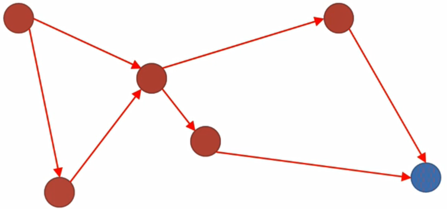

# SDN Distributed Core

- 물리적으로 떨어진 각 ONOS 컨트롤러(노드)들끼리 서로 통신하고 네트워크 상태 메세지를 교환 및 동기화 할 수 있도록 처리해주는 가장 중요한 컴포넌트

## Distributed Architecture

- 특징

  - Distributed
    - 여러개의 분산 컨트롤러는 하나의 클러스터를 형성할 수 있음
  - Symmetric
    - 각 ONOS 인스턴스는 똑같은 소프트웨어 스택을 실행하고 있고 똑같은 설정을 가짐
  - Fault-tolerant
    - 스위치에서 보면 컨트롤러는 마스터 컨트롤러와 스탠바이 컨트롤러로 나뉨
    - 마스터 컨트롤러는 스위치에 대해 2가지 권한을 가짐
      - 해당 스위치의 상태를 받음
      - 스위치에 룰을 내려줄 수 있음
    - 스탠바이 컨트롤러
      - 상태를 받을 수 있지만 룰을 내려주거나 쓰기에 관련된 액션은 수행 못함
    - 만약 마스터 컨트롤러에 오류가 발생하면 스탠바이 컨트롤러가 일을 수행

  

### 네트워크 상태 정보 저장 및 동기화

- 컨트롤러는 스위치로부터 받은 상태정보를 자바 오브젝트화하여 알고르짐을 이용해 분산 토폴로지 스토어에 저장

  

- 다른 컨트롤러는 분산 토폴로지 스토어에서 관련 정보를 쿼리해서 받음

  

### Distributed Primitives

- 자기 자신의 UseCase에 맞게 분산 Primitives를 활용해 네트워크 상태 정보 동기화
- 대표적인 4가지 Primitives
  - EventuallyConsistentMap<K, V>
    - 상태정보를 저장하고 바로 동기화하지 않고 일정 시간 뒤에 동기화
  - ConsistentMap<K, V>
    - EventuallyConsistentMap보다 빠르게 동기화
  - DistributedQueue<E>
    - Map이 아닌 Queue 자료구조 방식으로 동기화
  - AtomicCounter
    - 자바의 AtomicLong을 분산버전으로 새로 구현한 Primitives

### 분산 아키텍처에서 정보 동기화 방법

- Strong Consistency

  - Strong Consistency를 보장하기 위하여 
    - Raft Consensus Protocol을 사용

- Eventual Consistency

  - Gossip Protocol

- Copycat

  - Strong Consistency를 구현하기 위한 다양한 오픈소스 중 하나
  - 자바로 구현된 Strong Consistency

- 동작과정

  - 클러스터에 컨트롤러가 5개가 있다고 할때 메시지를 5개 파트로 나눔
  - 하나의 파트를 3개의 노드에 복사
  - 3개에 복사해서 주는 이유
    - 하나의 노드가 동작하지 않아도 똑같은 메시지를 다른 노드에서 복사해오기 위하여
    - 3개 중 하나가 리더로 동작

  

### Raft Consensus Protocol

- 리더선출법
  - 리더는 주변 노드들에게 주기적으로 하트비트를 전송
    - 주변 노드들은 리더가 정상적으로 동작하는 것으로 간주
  - 팔로워들은 주변 노드들에게 리더십 Voting 요청을 보냄
    - 받은 팔로워와 리더는 리퀘스트를 허용할지 말지를 보내줌
    - 대부분의 팔로워들로부터 긍정적인 결과를 받으면 해당 팔로워가 리더로 선출
    - valid leader에게 리퀘스트 vote를 받으면 해당 노드는 팔로워
    - 만약 아무도 선출에 성공하지 못하면 텀노드를 하나 증가하고 새로운 election을 시작

### Gossip Protocol(or Epidemic Protocol)

- EventuallyConsistentMap을 구현하기 위해 사용

- 전염병이 전파되는 상황을 모방하여 만듬

- Raft Consensus Protocol보다는 consistent 레벨이 낮고 동기화되는 시간이 느림

  