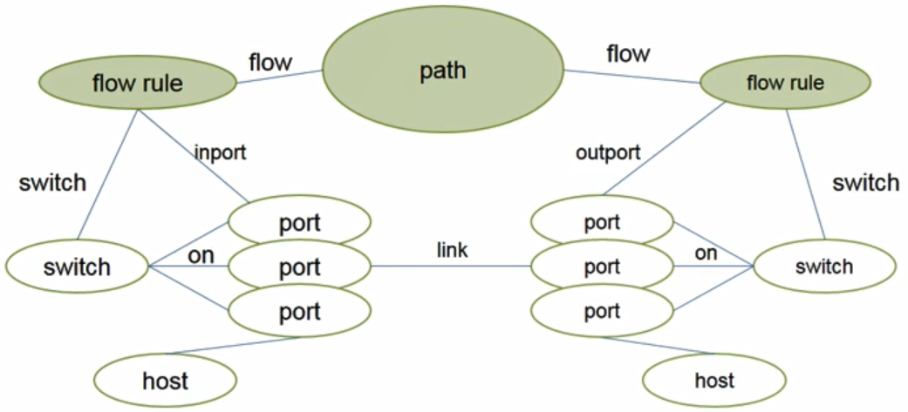
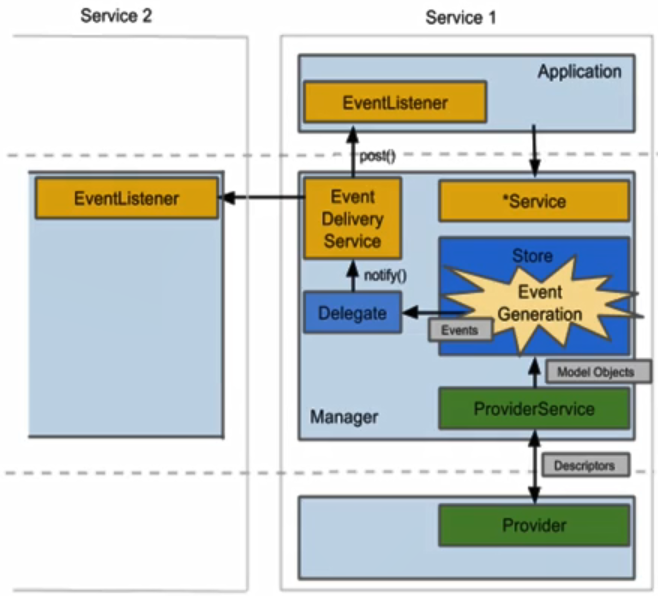
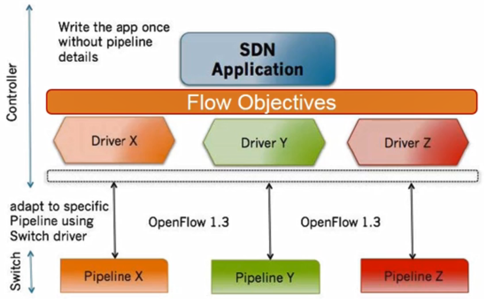
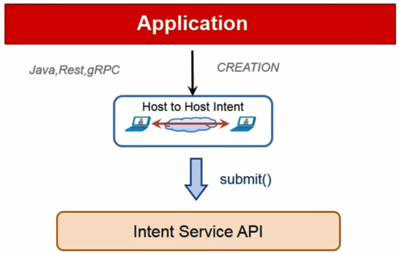
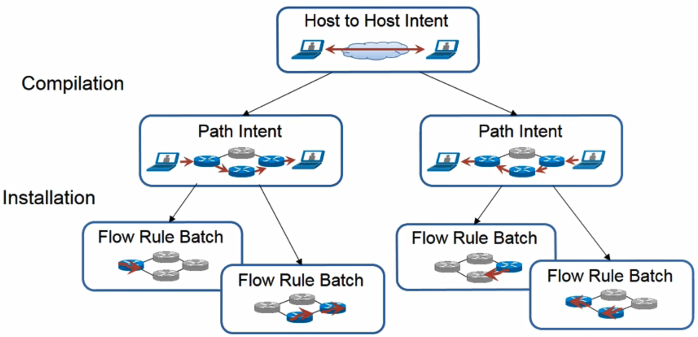
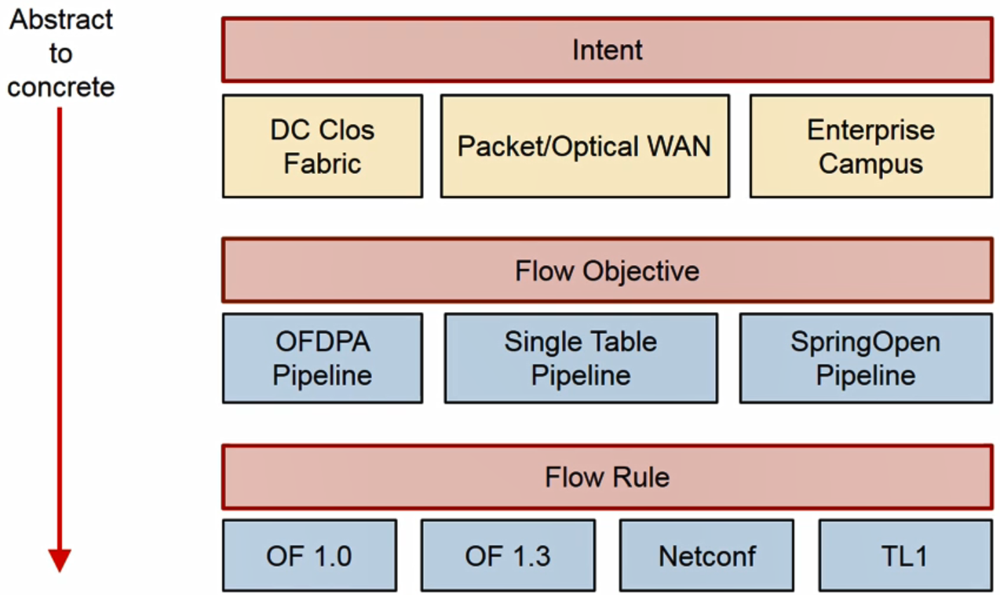

# 15. ONOS Northbound

- Northbound
  - ONOS Core와 어플리케이션 사이에 위치한 인터페이스
  - 3가지 종류의 추상화 Northbound 존재
    - Intents
    - Network Models
    - Flow Objectives
  - 각 Northbound의 컴포넌트들은 네트워크 상태에 대한 추상화를 제공
    - 애플리케이션 개발자들은 네트워크에 대한 지식이 없이도 자기자신의 애플리케이션 개발 가능

## Interact with GUI

- ONOS Web GUI
  - A sinigle-page web application
  - topology view를 제공

## Interact with ONOS CLI

- ONOS CLI
  - Karaf's 기반으로 개발
  - 자바의 프레임워크로서 전체 자바 VM을 재실행하지 않고도 새로운 자바 어플리케이션을 실시간으로 설치하고 삭제하고 활성화시킬 수 있음
  - ONOS는 karaf에서 제공하는 CLI extention을 이용해 사용자가 직접 ONOS 커맨드를 만들어 넣을 수 있음
- Access CLI
  - 로컬에 설치된 ONOS 실행 방법
    - `onos-karaf clean`
  - 원격에 설치된 ONOS 실행 방법
    - onos-pakage를 통하여 onos source로부터 바이너리를 패키징하고 패키징된 바이너리를 여러개의 onos들의 배포하기 위해 `stc setup` 명령어 실행
    - 배포된 후 각각의 원격 노드에 접속하여 `onos`명령어를 실행하면 gui에 접속 가능

## Interact with ONOS REST and gRPC

- REST API
  - onos와 서로 상호 연동 및 통신 가능
  - JSON과 HTTP/1.1 기반의 전통적 rest api 제공
  - Swagger라는 오픈소스를 이용해 소스코드로부터 Rest API 동적으로 생성해서 개발자가 직접 문서를 보고 시스템을 개발
  - 하지만 속도가 느림
    - JSON 포맷을 사용
    - HTTP/1.1을 사용하기 때문에 비동기식 통신 지원하지 않음
- gRPC
  - HTTP/2.0 기반으로 하기 때문에 비동기식 통신이 가능하고 스트리밍 가능
  - protobuf라고 부르는 형식으로 모든 데이터를 압축하여 바이너리 형태로 전달하기 때문에 전달할 데이터양이 줄어듬
    - 외부 시스템과 연동할 때 네트워크에 부하를 줄임
  - REST API보다 6배 좋은 성능을 보임

## Key Northbound Abstractions

- Network Graph
  - 네트워크 인프라 상에 위치한 여러 네트워크 장비, 링크, 호스트들을 추상화
- Flow Objective
  - 디바이스 중심에 추상화를 제공
  - data-plane의 프로그래밍하면서 테이블 파이프라인을 독립적으로 수행 가능
- Intent
  - 네트워크 중심의 추상화

### Network Graph

- 그래프 기반의 추상화

  - Ditected, cylic된 그래프
  - 각각의 노드들은 오브젝트(디바이스, 링크  등)
  - protocol-specific network element를 protocol-agnostic network element(Model Object)로 매핑
  - Model Objects
    - Topology
      - Device, Port, Hosts, Link
    - Control
      - Flow rule, role value
    - Packets
      - Outbound/Inbound packet

  

- Descriptions

  - 모델 오브젝트들을 묶어서 관리
  - Descriptions은 하나 혹은 하나 이상의 모델 오브젝트로 구성
    - Ex) HostDescription은 호스트의 MAC과 IP 주소에 대한 조합

- Events

  - 모델 오브젝트, Descriptions의 컨셉을 이용해서 네트워크에 발생하는 이벤트들을 protocol-agnostic한 이벤트로 전환해서 주변 스토어나 상위에 있는 어플리케이션에 제공

  

## Flow Objective Subsystems

- 같은 오픈플로우 버전을 사용하고 있어도 각 벤더들에서 장비를 실현하는 방법이 다름에 따라 스위치 파이프라인을 실행하는 방법도 다를 수 있음

- 새로운 장비 추상화 방법을 제안

  - **Flow Objective**

- 개발자는 스위치의 하드웨어 구성을 몰라도 원하는 기능을 프로그래밍 가능

  -  어떤 종류의 스위치를 사용해도 상관없이 개발자가 Flow Objective를 사용해서 어플리케이션을 개발하면 해당 어플리케이션은 거의 모든 스위치 파이프라인을 실행하는데 사용 가능

- 실현 방식은 PC의 드라이브와 매우 흡사

  - 윈도우에서 특정 개발자가 어플리케이션을 개발할 때 해당 윈도우가 설치된 하드웨어에 어떤 디바이스가 설치가 되었고 디바이스 스펙을 알 필요없이 윈도우에서 제공하는 추상화 API를 이용해서 개발 가능
  - Flow Objective는 내부적으로 디바이스라는 컨셉을 사용해 하나의 드라이버는 특정 스위치의 파이프라인에 1:1 매핑
    - 따라서 개발자는 Objective를 정의해서 내려주면 드라이버에 의해서 특정 디바이스에 맞는 플로우 룰로 자동으로 변환하여 ONOS Protocol 계층을 지나 원하는 디바이스에 전달

- 3가지 인터페이스

  - Filtering Objective
  - Forwarding Objective
  - Next Objective

  

## Intent Framework

- Intent Framework

  - 두 대의 호스트 사이에 연결을 하도록 프로그래밍할려면 4개 이상의 플로우 룰을 필요한 스위치에 모두 설정해야 함
  - 어플리케이션 개발자들이 이를 일일이 설정해야 하면 많은 노력이 들기 때문에 더 추상화시켜준 컨셉으로 만들어진 것이  Intent Framework
  - Intent를 이용해 복잡한 과정을 생략 가능
  - Intent는 policy기반의 관리를 할 수 있도록 제공
    - SDN Intent Framework를 통해 어플리케이션은 더 많은 밴드위스가 필요하거나 QoS를 보장하고 싶으면 복잡한 룰을 내리는게 아니라 얼마만큼의 밴드위스가 필요한지 정의만 해주면 됨

  

- Intent 동작과정

  - 컨트롤러가 Intent의 요청을 받으면 해당 Intent에 고유한 ID 할당
  - 해당 Intent를 내려주게 되면 Application ID를 할당
  - Intent는 컴파일링 과정을 거침
    - Host to Host Intent는 돌아오는 경로와 가는 경로의 두개의 Intent가 생성

  

## Network Programming

- 정리

  

## Configuration

- ONOS 네트워크 설정 방법
- Network Configuration (netcfg)
  - 특정 서비스 등록, 설정에 대한 업데이트를 바꿀 수 있음
- Device Configuration
  - 특정 디바이스에 대한 설정을 바꿀 수 있음
- Dynamic Configuration (WIP)
  - YANG 기반의 서비스 모델을 이용해 ONOS가 동작하는 과정에서 특정 장비를 관리하기 위한 자바 인터페이스를 생성하고 해당 인터페이스를 통해 원하는 장비를 제어