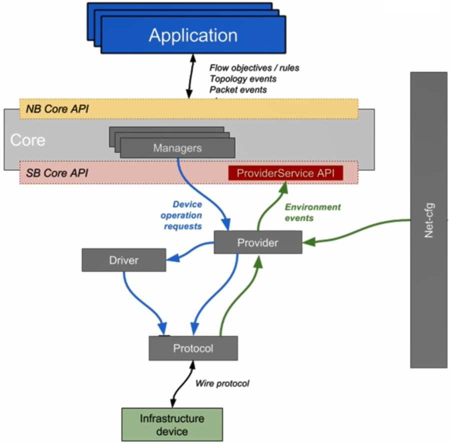
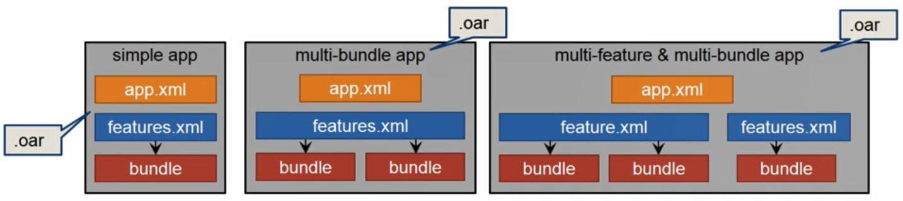
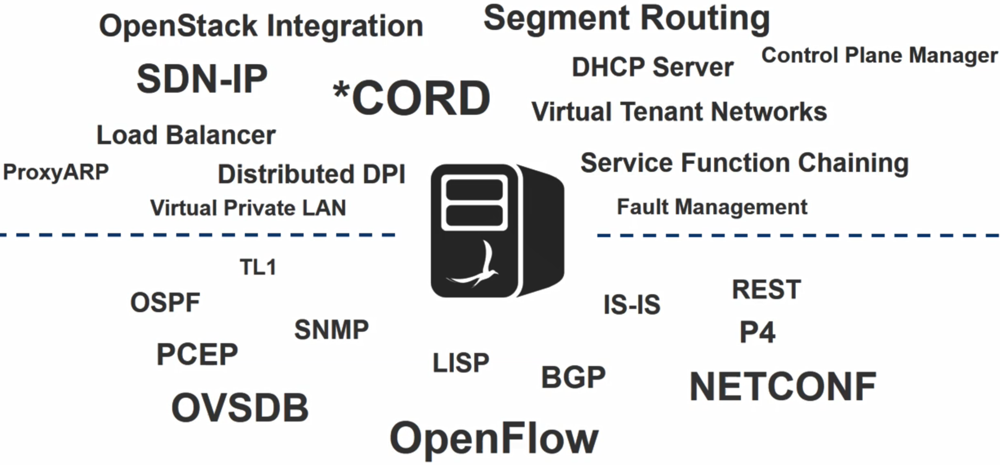

# 16. ONOS Southbound & Application

- Southbound

  - protocol
    - 각 네트워크 장비와의 통신
    - 네트워크 장비에서 발생하는 컨트롤 메시지들을 관련된 네트워크 이벤트로 변환해서 provider로 전달
  - provider
    - onos 분산 코어와 통신
  - driver
    - 실제 디바이스의 behavior를 추상화

  

## Southbound Overview

- Southbound Protocols

  - OpenFlow
  - OVSDB
  - NETCONF+YANG
  - SNMP
  - P4
  - BGPLS, ISIS, OSPF
  - gRPC ...

- Southbound Interface Interactions

  

### Southbound Protocols

- 각 프로토콜 모듈은 ONOS와 디바이스의 통신에 필요한 여러가지 기능을 포함
- OpenFlow
  - FlowMods, GroupMods
- REST
  - Implements CURD operations
- NETCONF
  - Open/close session, setConfiguration, getConfiguration
- 대부분 이런 기능은 써드파티 라이브러리를 이용해 개발
  - Openflowj, snmp4j, thrift, gRPC, netty, etc.

## Applications

- Karaf application이라 볼 수 있음

  - onos는 apache karaf 프레임워크 위에서 동작하는 karaf bundle 어플리케이션

- Karaf 기반이기 때문에 onos 실행 중 어플리케이션ㄴ들을 동적으로 설치하고 삭제, 재시작하는 과정들이 가능

  

- Application Package

  - single .oar 파일로 패키징
    - oar파일은 JAR파일과 유사
      - 설정에 필요한 .xml 파일들과 번들들을 포함
    - onos-maven-plugin 파일을 통해 oar파일 생성

  

- Application Types
  - Application as a mere Component
    - 외부에 API 노출 x, self-contained
  - Application with Service Interface
    - 여러 API를 외부에 노출(CLI, REST API, web gui)
  - Application may have its own state
    - 자체적으로 상태를 갖고 어플리케이션이 실행되고 관리

### ONOS Recap

