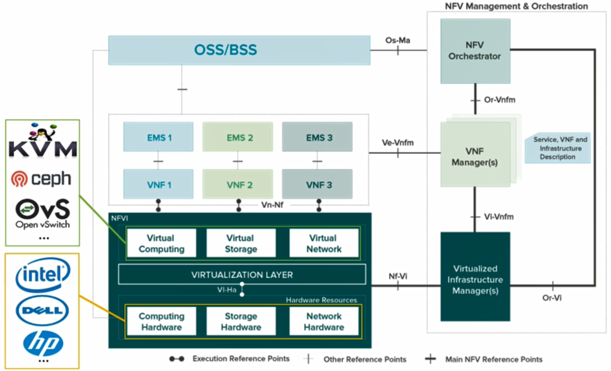
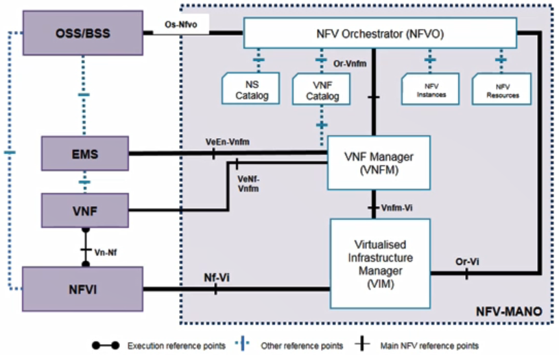
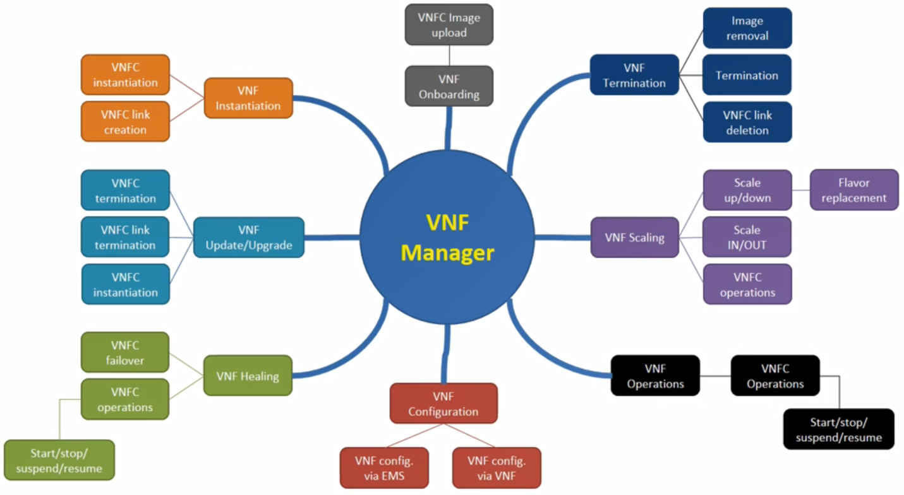

# 18. NFV-MANO #1

## Introduction

- 5G 기술 중에 핵심으로 꼽히는게 NFV
- NFV는 유무선 네트워크 장비에 가상화 기술을 적용하고 하드웨어 중심인 기능을 소프트웨어로 구현하는 기술
- 과거 새로운 네트워크 서비스나 기술이 등장할때마다 하드웨어에 종속된 소프트웨어 구조때문에 하드웨어, 소프트웨어를 모두 재설계하고 네트워크를 다시 구축해야 했음
  - NFV를 이용해 이를 해결
- NFVI
  - 하이퍼바이저에 의하여 하드웨어 리소스가 가상화된 형태로 제공
- 가상 리소스위에서 다양한 가상 네트워크 Function들이 개발되고 구동됨
  - VNF는 독립된 매니지먼트 시스템 EMS에 의하여 관리됨

- NFV Reference Architecture

  

- NFV-MANO

  - MANO의 가장 큰 장점은 새로운 네트워크 기능을 배포하기 위하여 기존에는 오랜 시간이 걸렸지만 MANO에서는 새로운 네트워크 기능을 배포하기 위하여 수시간의 시간만 필요

  - 구성

    - NFV Orchestrator(NFVO)
      - VNF 생명주기, 전역 리소스 관리를 담당하고 NFVI 리소스 요청을 인증하고 validation하는 역할을 함
    - VNF Manager(VNFM)
      - NFVI와 EMS 사이의 설정과 이벤트 리포팅을 코디네이션하는 역할
    - Virtualized Infrastructure Manager(VIM)
      - NFVI 컴퓨트, 스토리지와 네트워크 리소스를 제어하고 관리

    

### NFV Orchestrator Summary

- NFV Orchestrator(NFVO)
  - VNF와 포워딩 그래프를 사용하여 VNF 오케스트레이션을 실현
  - 분할된 VNF들을 이용하여 end-to-end 네트워크 서비스를 템플릿화함
  - VNF가 사용하는 가상 리소스를 체크하고 할당
  - VNF는 포워딩 그래프를 통하여 서로 연결
    - 연결성 정보는 VNF Forwarding Graphs Descriptor를 통해 정의
    - VNF Forwarding Graph는 SDN Controller 혹은 SFC(Service Function Chaining) API를 통해 렌더링 
  - NFVO는 여러개의 VIMs 환경에서도 VNF를 오케스트레이션할 수 있음
- Example
  - OpenStack Tacker, Open Source MANO, OpenBaton, Open-O, etc.

### Virtual Infra Manager Summary

- Virtual Infra Manager (VIM)
  - NFVI 컴퓨트, 스토리지, 네트워크 리소스를 제어하고 관리
  - Northbound API를 외부에 노출하며 노출된 API는 VNFM에 사용됨
  - Operations
    - 물리 리소소와 가상 리소스의 매핑관리
    - 가상링크, 네트워크, 서브넷, 포트 및 시큐리티 그룹등을 정리하는 것을 통해 VNF 포워딩 그래프 관리에 필요한 부가 기능 제공
    - NFVI 하드웨어 리소스와 소프트웨어 리소스의 저장소를 관리
    - notification을 통하여 성능 및 장애 정보를 수집
    - 소프트웨어 이미지 관리
- Examples
  - OpenStack, CloudStack, VMware, WAS, etc.

### VNF Manager

- Functional Blcoks

  - 일부만 지원해도 VNFM이라고 할 수 있음

  

