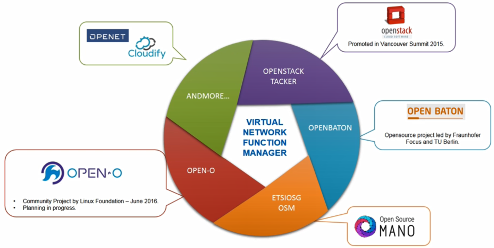
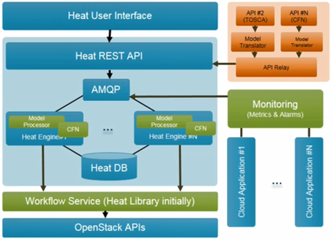
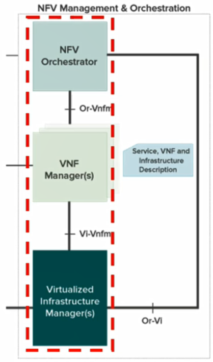
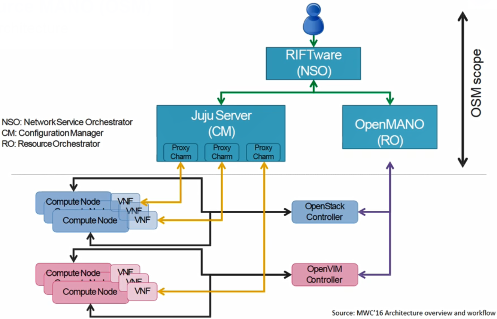
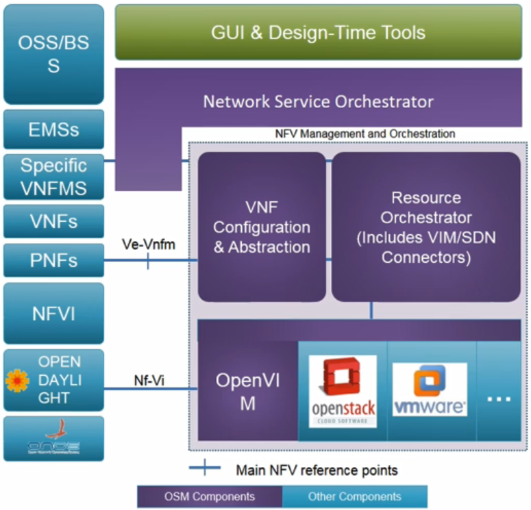
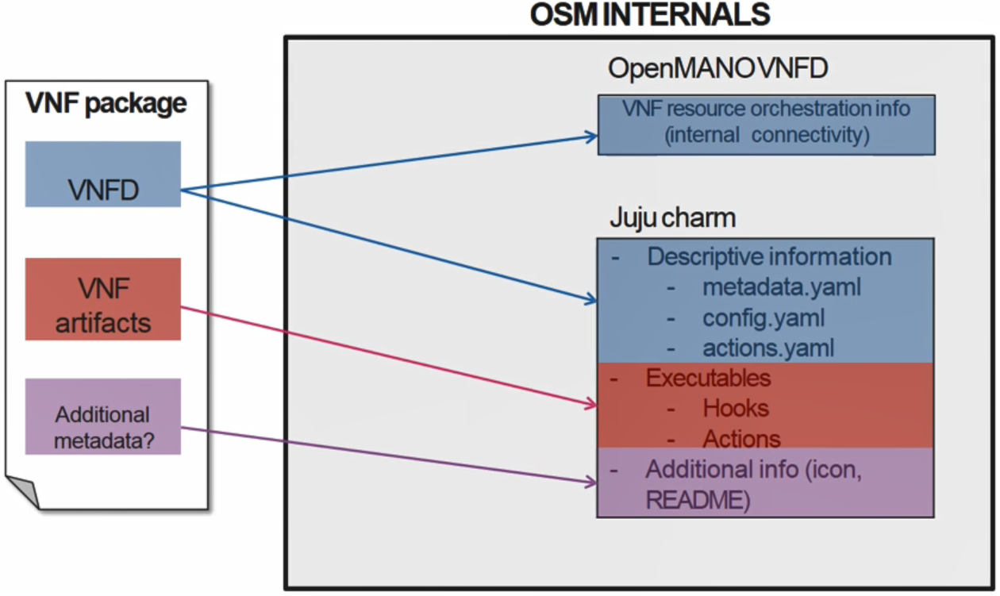

# 19. NFV-MANO 2

## NFVO and VNFM

- **Open Source NFVOs and VNFMs**

### **OpenStack Tacker**

- 오픈스택 커뮤니티에서 개발중인 NFV MANO
- NFVO와 VNFM을 통합한 형태
- 제공하는 기능
  - VNF Catalog - VNFDs in database
  - VNF 인스턴스화와 종료 기능 - HEAT and TOSCA
  - VNF specific한 관리 드라이버를 통하여 VNF 설정을 내릴 수 있음

- Tacker Architecture

  

### OpenStack HEAT

- 오픈스택 컴포터는트 자체에 오케스트레이션을 담당하는 컴포넌트

  - MANO orchestrator에 일부 기능 커버

- 자동으로 리소스를 설정하고 스택에 배포할 수 있음

- 스택

  - 특정 템플릿에 연관된 일련의 리소스의 집합

- 템플릿

  - AWS CloudFormation
    - JSON 포맷
  - HOT(Heat Orchestration Template)
    - YAML 포맷

- 컴포넌트

  - heat-api
  - heat-api-cfn
  - heat-engine

  

### Open Source MANO (OSM)

- 엣지에서 개발

- 서비스 프로바이더들에 의해 프로젝트가 시작

  - 기존의 기타 오픈소스들을 통합하는 것으로 시작

- OpenStack Tacker와 유사하게 NFVO와 VNFM을 구현

  - 새롭게 구현된 것이 아닌 기존의 오픈소스들을 참조하여 개발

-  NFVO

  - Resource Orchestrator(RO) : **OpenMANO**
  - Network Service Orchestrator(NSO) : **RIFTware**

- VNFM

  - VNF models & configuration
  - Juju charms

- Multiple connectors

  - OpenVIM, OpenStack, VMWare, etc.
  - SDN
    - Support ODL and Floodlight

  

- Overall Architecture

  

- 호환을 위한 다양한 기능 제공

  - OSM은 다양한 SDN 컨트롤러를 통합하기 위한 여러가지 플러그인 인터페이스 제공
    - 플로우 룰을 OpenVIM API를 통하여 네트워크 장비들에 내림
  - 다양한 VIM들을 통합하기 위한 플러그인 모델 제공
  - 제네릭한 VNFM과 Specific한 VNFM 모두를 지원
  - 레거시 미들웨어들과 호환성을 제공하기 위하여 Physical Network Function(PNF) 제공
  - Greenfield와 Brownfield Deployments 제공

  

- OpenMANO

  - 리소스 오케스트레이션을 담당하는 컴포넌트
  - OpenVIM
    - NFVI 테넌트, VM Image, Flavor 관리
  - OpenMANO
    - VNF 카탈로그, 네트워크 서비스 카탈로그 관리
    - 네트워크 서비스와 VNF 배포를 담당
  - OpenMANO-GUI

  

- RIFTWare
  - Network Service Orchestrator(NSO)
  - 카탈로그 관리 기능을 통하여 네트워크 서비스(NS) 및 VNF 패키지를 생성하고 업데이트하는 역할 수행
  - UI Composer
    - Catalog manager
    - Canvas
    - VNF/NS descriptor editor
  - Data model translator
    - YANG Model 지원
- Juju
  - 오픈 소스 어플리케이션 모델링 툴로 Service-Oriented Architecture와 배포를 가능하게 함
  - 개발된 서비스들은 Charms로 불림
  - CHarms는 Charms Store 커뮤니티에서 제공
  - 가장 큰 단점은 Ubuntu에서만 동작
  - OSM에서의 Juju
    - 제네릭한 VNFM의 여러 기능을 제공
- Juju Charm
  - metadata.yaml
    - VNF 메타 정보와 charm에 의하여 제공해야 할 서비스 정보, 필수 파일
  - config.yaml(optional)
    - 실행되는 서비스 혹은 어플리케이션 실행에 필요한 옵션들을 포함한 설정 파일
  - Hooks
    - 특정 어플리케이션을 설치, 시작, 중지, 삭제, 설정

- VNFD with Juju Charm의 관계

  