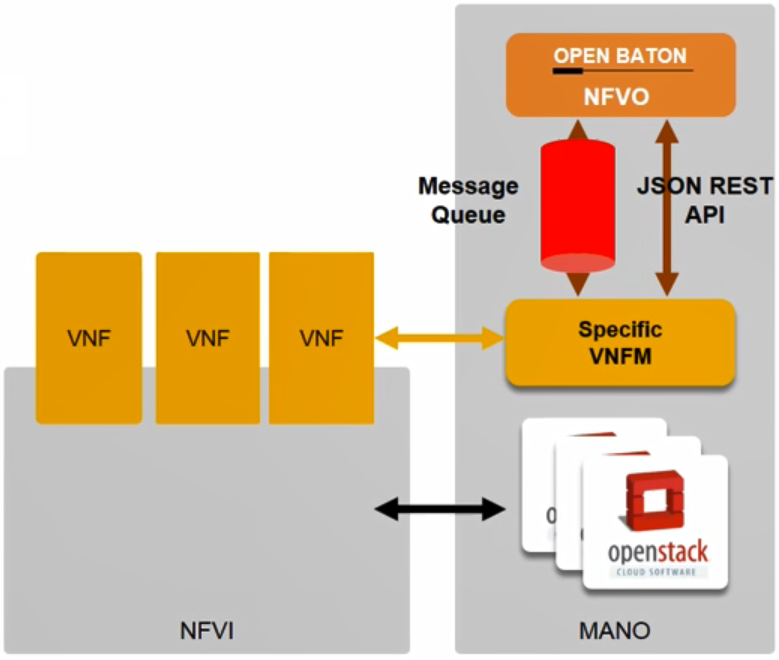
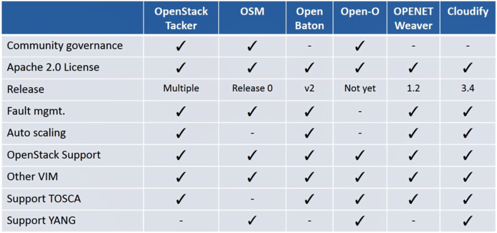

# 20. NFV-MANO 3

### Open Baton

- 특징
  - MANO
  - NFVO + VNFM
    - NFVO : NSD 생명주기 관리
    - VNFM : generic과 specific VNFM 둘 다 제공
  - Open Baton은 OSM과 다르게 TOSCA 템플릿을 통하여 VNF 프로비저닝 수행
  - 오토스케일링 엔진 탑재
  - 멀티 VIM 제공
  - 라이브러리 제공
    - 개발자들은 제공되는 라이브러리를 이용해 자신만의 VNFM을 개발하고 빌드할 수 있음
  - 대시보드 제공

- **Generic VNFM**

  - 사용자는 VNFM을 사용하여 NFVO로부터 특정 가상 인프라 리소스를 할당받을 수 있음
  - 실행가능한 오퍼레이션
    - Instantiation, Modification, Starting and stopping of the virtual services
  - generic EMS를 통하여 specific한 설정 스크립트 실행 가능
  - Juju와 Juju 플러그인을 통해 연동 가능

- generic VNFM을 이용하여 사용자가 정의한 VNF를 통합 가능

  - Implements installation scripts
  - Builds custom VNF package
  - Configures OpenBaton EMS
  - Configures generic VNFM
  - Provides VNFD
  - Provides VM images

  

- **Specific VNFM**

  - 가상 리소스를 프로비저닝하는 두가지 방법 존재
    - VIM 드라이버를 통해 직접 프로비저닝
    - NFVO한테 프로비저닝 요청을 보내어 하는 방법
  - specific VNFM이 NFVO와 상호 연동 방법
    - 메시지 큐를 통한 Publish/Subscribe 방법
    - RESTful API

- VNFM 구현 방법

  - Solution 1
    - NFVO에서 제공하는 REST API를 조사하여 해당 API에 맞는 VNFM 구현
    - 통신 한계 때문에 다량의 데이터나 요청에 짧은 시간에 그걸 처리하기 위해 오버헤드 발생
  - Solution 2
    - OpenBaton에서 지원하는 Java SDK를 사용하는 방법
    - Java SDK를 사용하면 Native JAVA API를 직접 호출할 수 있기 때문에 성능상 많은 이득

  

- **모니터링 기능**

  - Zabbix 모니터링 툴을 사용하여 NFVI와 VNF에 대한 모니터링 수행
  - Autoscaling Engine(AE)를 이용하여 Zabbix에서 모니터링된 결과를 근거하여 Scail in/out 수행
  - Network Slicing Engin(NSE)를 사용하여 VM간 통신을 수행

  

### Open-O

- 오픈소스 MANO 프로젝트

  - 실제 실현하고자 하는 범위가 MANO 이상

- Open-O가 추구하고자 하는 것

  - Open-O를 통하여 carrier로 하여금 OSS(Operation Support System)부터 OSS(Open Source Software)로 진화하는 것

- 드라이버를 통하여 NFVO, VNFM, EMS와 VIM 등을 지원

  

  

### OPENT "Weaver"

- VNF 생명주기 관리 제공
- VNFM 기능 제공
- 모든 VNF상에 위치한 VNF를 단일 포인트 제어 및 설정으로 관리하고 API 형태로 외부에 노출

### Cloudify

- TOSCA 기반
- generic VNFM만 지원
- 강력한 모니터링, 로그 수집, 힐링, 스케일링 기능 제공

### Summary

