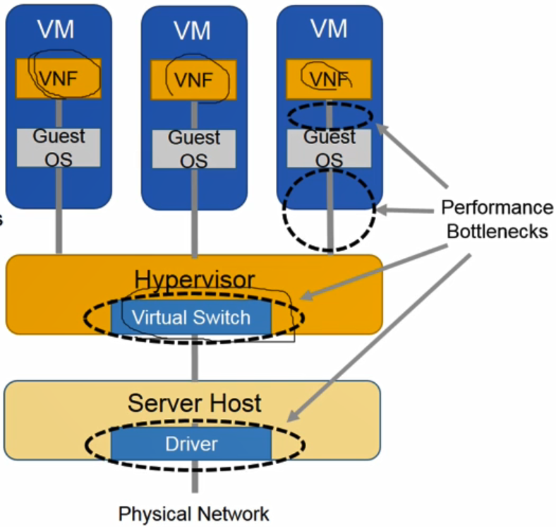
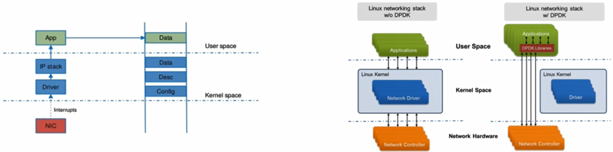
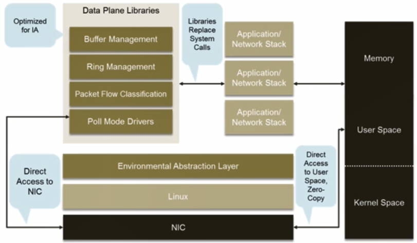
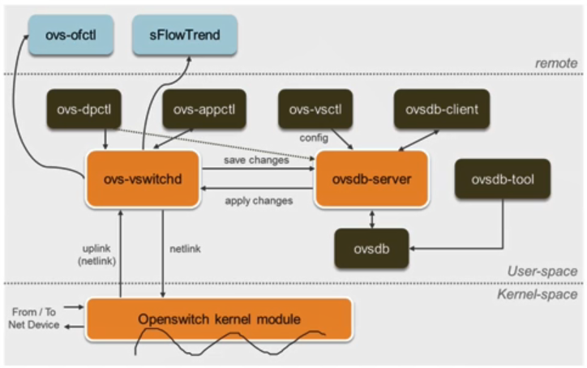
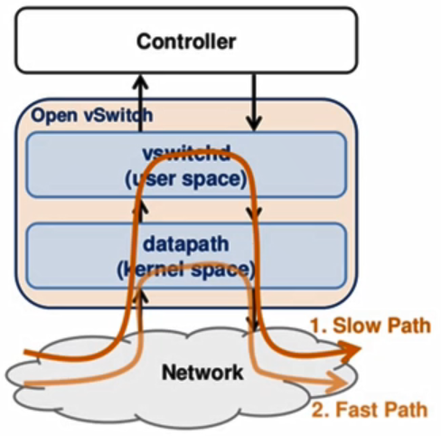
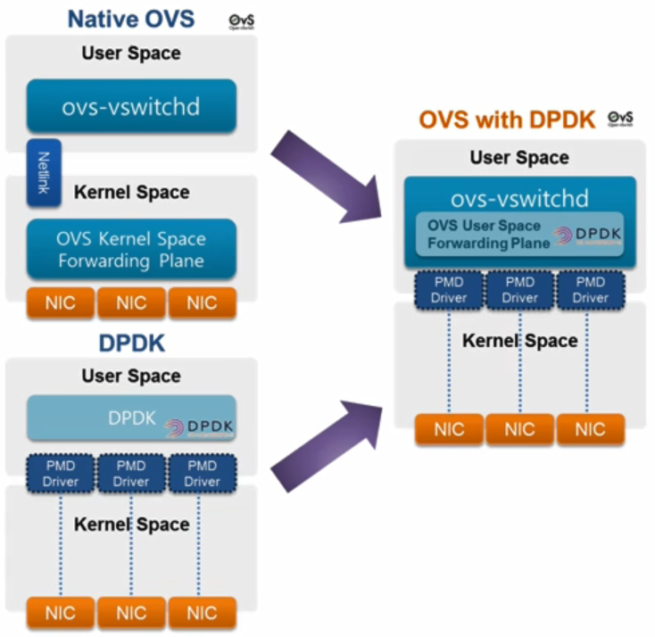
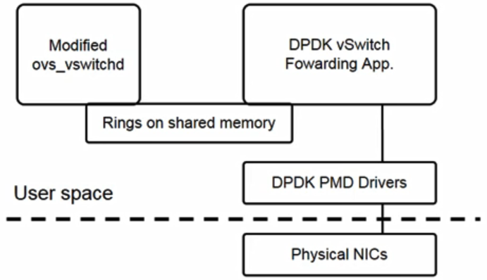
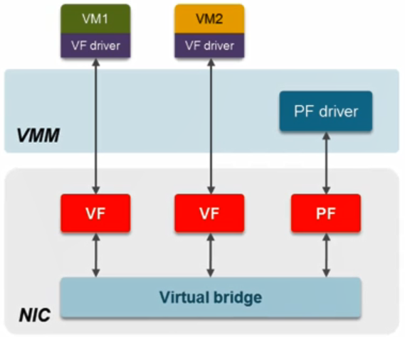
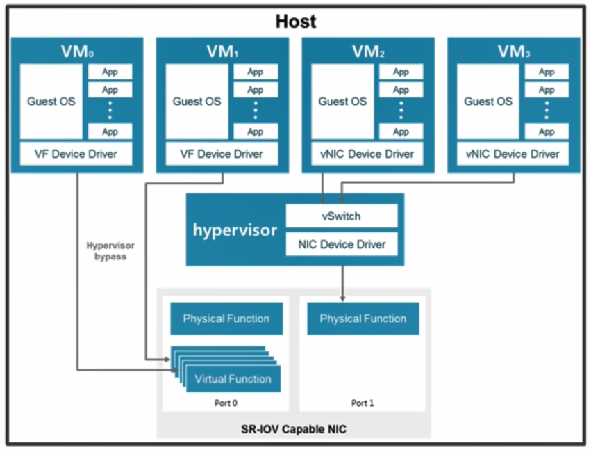

# 21. Fast Packet Processing Methods

### Software Packet Switching

- NFV

  - 고속 패킷 프로세싱을 위한 기술 필요

  

### DPDK

- DPDK(Data Plane Development Kit)

  - 리눅스 운영체제로 동작하는 서버에서 패킷 프로세싱에 리눅스 커널 내부에 존재하는 네트워킹 스택 사용
    - 패킷 단위로 인터럽트를 발생시킴
    - kernel networking stack과 실제 응용 프로그램이 존재하는 user space 사이를 오고가기 때문에 context switching이 많이 발생
    - 그에 따른 메모리 카피가 많이 발생
    - 일반적인 용도의 서버로 사용할 때는 동작할 때 성능에 큰 문제가 없음
    - NFV환경의 VNF를 사용하려면 VNF에 패킷을 빠르게 공급하거나 입출력하기에는 이러한 기존 방식에는 성능에 제약이 있음
  - 고속 패킷 프로세싱을 위한 유저 스페이스의 라이브러리 집합 혹은 DPDK 기반의 네트워크 응용 개발을 위한 프레임워크라고 정의할 수 있음
    - 패킷은 cpu interrupt를 발생시키지 않고 dpdk 전용 user space로 전달
    - 고속 패킷 프로세싱을 위한 CPU affinity, huge page, multi-queue와 같은 다양한 네트워크 커스터마이제이션 기술들을 지원

  

- **DPDK Features**

  - Environment Abstraction Layer(EAL)
    - 하드웨어 환경 추상화
  - Poll Mode Drivers(PMD)
    - 네트워크 I/O를 하기 위한 Direct Memory Access 기술
    - 네트워크 카드로 수신되는 패킷들이 기존 linux 네트워크에 커널 네트워크 스택을 거치지 않고 바로 user space의 dpdk 응용 프로그램이나 네트워크 인터페이스 카드로 전달되도록 하는 핵심적인 역할을 수행하는 컴포넌트
  - Memory Manager
  - Buffer Manager
  - Queue Manager
  - Packet Flow Classification
    - 수신된 패킷의 헤더를 분석해 그룹핑

  

### Open vSwitch

- Open vSwitch(OVS)
  - NFV 구성을 위해서 서버 가상화 환경에서 가장 일반적이고 많이 사용하는 가상 소프트웨어 스위치
  - VM간의 통신, VM과 외부와의 통신을 위해서 호스트 서버 내에서 기본적인 패킷 스위칭 기느을 수행
  - 관리 프로토콜을 통한 다양한 네트워킹 서비스 및 SDN 제어 매커니즘 지원
    - IPv6, tunneling, NIC bonding, 포트 미러링 등의 다양한 네트워크 기능들을 지원
    - 오픈플로우, OVSDB, NetFlow, sFlow, (R)SPAN, etc
  - Key Components
    - kernel module : forwarding, de/encapsulation, cache lookup
    - ovs-vswitchd : overall forwarding logic management (from remote)
    - ovsdb-server : an access to configuration details (ovsdb)
  
  

- OvS의 패킷 프로세싱

  - 가상 인터페이스에 패킷이 도착했을 때 해당 패킷을 어떻게 처리하는 가
  - **Fast path**
    - ovs kernel module이 해당 패킷에 매칭되는 플로우 룰을 캐시 테이블에서 찾음
    - 캐시 테이블에 해당 룰이 존재하면 룰에 따라 처리
  - **Slow path**
    - 만약 해당 포워딩 룰이 캐시에 없으면 커널 모듈은 vswitch 데몬에 해당 패킷 정보를 제공
    - vswitchd는 그 정보를 바탕으로 사용자가 설정한 모든 포워딩 룰들을 포함하고 있는 포워딩 테이블에서 해당 패킷을 처리할 수 있는 포워딩 룰을 찾아 이를 다시 커널 모듈에 캐시 테이블에 등록
    - 이후 커널 모듈은 방금 등록된 포워딩 룰을 바탕으로 패킷을 처리
    - 추가적인 과정이 포함되어 Slow path
    - context switching 이 빈번하게 일어나고, 메모리 카피와 전체 테이블을 lookup해야된다는  요구사항이 있어 Throughput, PPS, delay 성능 저하

  

### OVS-DPDK

- Open vSwitch with DPDK (OVS-DPDK)

  - DPDK 기반으로 유저 스페이스에서 DPDK를 이용해 다시 구현된 Open vSwitch
  - 기존의 OVS는 user space와 kernel space에서 ovs의 주요 컴포넌트들이 따로 동작
  - DPDK로 재구현되면서 user space에서 모든 컴포넌트 구현됨

- Features

  - EAL
  - vHost-user port (Virtual switch <-> VM virtual NIC)
  - Multi-queue support in vHost-user
  - Tunneling support : VxLAN, GRE, Geneve
  - QoS support
  - DPDK statistics

  

- OVS-DPDK Details

  - Native OVS와 달리 패킷 포워딩을 위한 패스가 계층화되지 않고 모두 user space 처리
  - 기본적으로 DPDK의 PMD를 기반으로 동작하기 때문에 context switching, memory copy에 따른 성능 저하를 대폭 줄임
  - OVS-DPDK는 대표적으로 3개의 쓰레드
    - Packet reception
      - PMD 기반으로 특정 DPDK 기반 인터페이스로부터 패킷을 수신하거나 그쪽으로 패킷을 송신하는 역할을 담당
    - Flow classification / lookup
      - 패킷 헤더 정보를 고속으로 판단해서 이를 네트워크 플로우라는 개념으로 분류
    - Packet transmission
      - PMD 기반으로 특정 DPDK 기반 인터페이스로부터 패킷을 수신하거나 그쪽으로 패킷을 송신하는 역할을 담당
  - 호스트 서버가 제공하는 공유 메모리 위에서 RING기반의 queue를 사용해서 DPDK 쓰레드들과 위에서 동작하는 DPDK 응용프로그램 간의 커뮤니케이션 및 연산 처리를 고속으로 수행

  

### SR-IOV

- SR-IOV(Single Root I/O Virtualization)

  - 고속 패킷 프로세싱을 위해 하드웨어적인 접근 방식
  - NIC 가상화하는 기술
  -  SR-IOV로 구성된 데이터 패스는 호스트 서버의 하이퍼바이저, 가상 스위치를 일체 경유하지 않고 호스트 서버의 물리적인 네트워크 카드와 VM을 직접 연결
    - 서버 가상화에 따른 오버헤드가 발생하지 않음
    - 속도면에서 가장 빠름
  - 여러 개의 VF들로부터 굉장히 많은 I/O가 발생하는데 이를 처리하기 위해 단일 큐를 사용하면 Single Root IOV라고 하고 multi queues를 이용해 처리하며 Multi Root IOV라고 함

  

#### Hybrid Approach

- 하지만 SR-IOV의 구조상 가상 스위치를 경유하지 않기 때문에 호스트 내부에서 VM들간의 통신이 필요할 때 패킷 스위칭을 제공할 수 없고 가상 스위치가 제공하는 각종 부가적인 네트워크 서비스 및 별도의 제어 평면 기능 사용 불가

- 사용목적에 따라 SR-IOV와 가상 스위치를 결합시켜 사용할 필요가 있음

  - VM 0,1 : 호스트 박스, 호스트 외부와의 고속 통신을 요구하는 VNF를 배치하고 있음
  - VM 2,3 : VM 상호간의 통신을 하거나 추가적으로 외부와의 통신이 필요한 VNF가 동작

  