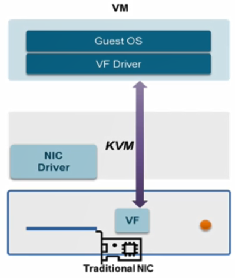
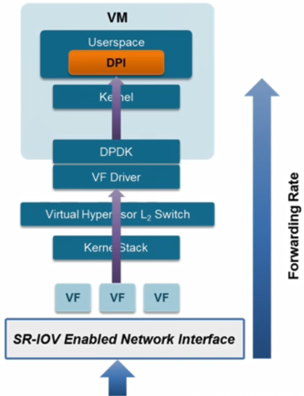
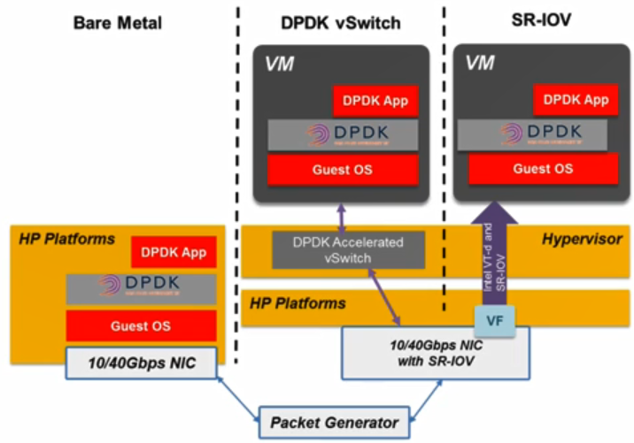
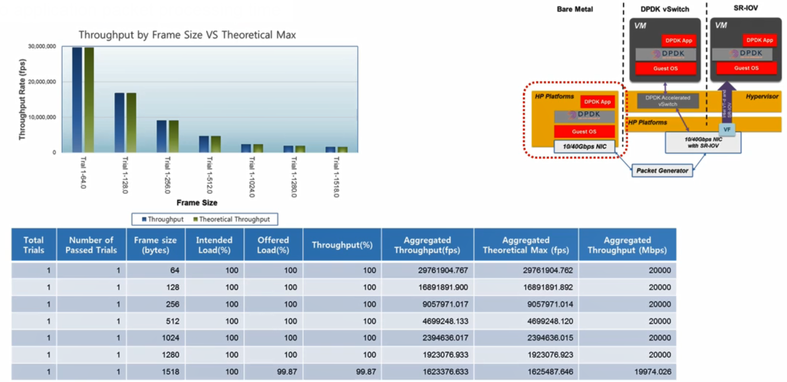
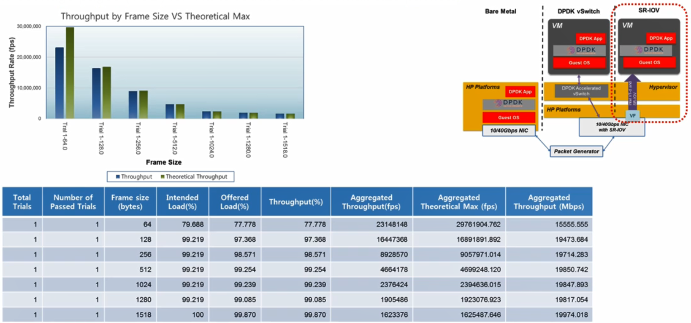
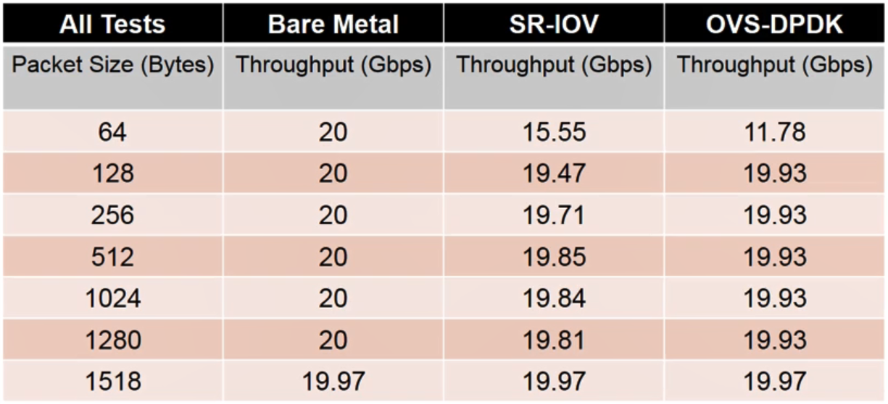

# 22. Datapath Composition

### Datapath 구성 방안

#### (1) Original OVS in Host + Virtio in VM

- 일반적인 모드로 동작하는 OVS를 호스트 서버에 가상스위치로써 배치

- VM을 Virtio 기반의 가상 네트워크 인터페이스를 가지도록 구성

  - Virtio : VM의 가상 네트워크 인터페이스 카드를 위한 표준화된 가상 드라이버

- 일반적으로 가장 많이 사용되고 쉽게 구현 가능한 방법

- VM 마이그레이션, 특히 라이브 마이그레이션할때도 구성이 단순해 유리한 방법

  - 하지만 고속 패킷 프로세싱 기술이 사용되지 않기 때문에 VM에서 동작하는 VNF를 위한 속도 측면에서 한계점 존재 

  

#### (2) OVS-DPDK in Host + DPDK PMD in VM

- 가상스위치로써 OVS-DPDK를 사용

- DPDK 라이브러리를 이용해서 DPDK로 구현된 응용을 VM 동작하는 VNF로 구현한 datapath 구성

  

#### (3) SR-IOV in Host + VF Driver in VM

- 호스트 서버에서 SR-IOV 지원하는 카드를 이용해서 Virtual Function(VF)을 만들고 만든 VF를 VM에 가상 인터페이스에 바로 연결하는 방법

- 가상스위치를 경유하지 않고 패킷 프로세싱을 할 수 있어 패킷 전달 속도 면에서 가장 우수

- 가상스위치가 제공하는 여러 네트워크 기능들을 사용할 수 없음

-  VF과 VM간에 바인딩 정보가 존재하여 VM을 다른 호스트 서버로 마이그레이션할 때 fix된 정보들 때문에 마이그레이션하는데 제약사항이 있음

  

#### (4) SR-IOV in Host + DPDK in VM

- 가장 높은 수준의 고속 패킷 프로세싱을 요구하는 VNF에 적합한 데이터패스 구성

- 호스트서버에 물리 네트워크 인터페이스 카드를 SR-IOV로 지원하는 카드를 사용해서 VF를 구성

- VF를 VM에 Virtual Interface 혹은 VF Driver에 다이렉트하게 연결하는 SR-IOV 구성

- VM에서는 DPDK PMD thread를 이용해서 수신된 패킷을 DPDK 기반 응용으로 고속으로 패킷 프로세싱하는 구조

- 이러한 수준의 구성을 요구하는 VNF의 예

  - 패킷 헤더 및 페이로드를 인스펙션하는 DPI과 같은 네트워크 기능들이 VNF로 구현되었을 때 적합

  

#### Datapath Composition Comparison

### Performance Evaluation

- (3)과 (4)의 성능 비교

  

#### Bare Metal

-  추가적인 패킷 프로세싱 없이 단순히 throughput 측정

- 20G/bps의 throuput을 패킷 사이즈에 관계없이 보여줌

  

#### SR-IOV (with DPDK)

- 64바이트 패킷에서 성능이 떨어짐

#### OVS-DPDK

- 다른 패킷 사이즈에서는 비슷한 성능을 보이지만 64바이트 패킷에서 50% 정도의 성능을 보임

- 성능이 감소하는 이유

  - DPDK에 PMD thread가 잘 동작하기 위해서는 호스트 서버에 CPU 코어를 전용해서 사용해야함
  - 이때 코어가 감당할 수 있는 수준 이상으로 패킷이 많이 발생해 pps값이 급증하게 되면 CPU 코어에 대한 감당할 수 있는 이상으로 부하가 발생해 패킷 드랍이 발생 

  

#### Conclusion

- OVS-DPDK 기반 데이터 패스 구성이 SR-IOV 구성에 비해서 평균 90% 정도 수준의 throughput을 보여주는 것을 확인 가능
- 반면에 OVS-DPDK가 가장 좋은 성능을 낸다고 보이는 SR-IOV 기술 대비 굉장히 근접한 성능을 보이기 때문에 실효성에 대해 설명할 수 있음
- SR-IOV에서 제공하지 못하는 다양한 SDN 기반 가상 스위치 제어 기능을 OVS-DPDK에서 사용 가능
  - 따라서 다양한 VNF 예제들에 적용할 수 있음
- 또한 OVS-DPDK가 버전 업을 하고 있기 때문에 성능 수준이 증가
- https://download.01.org/packet-processing/
- 

