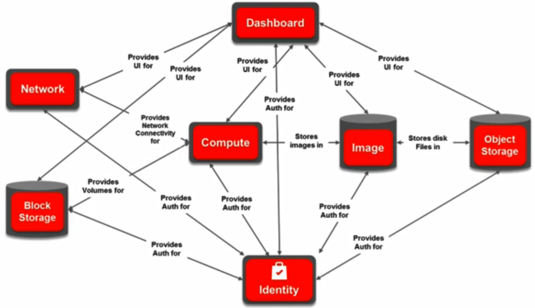

# 23. OpenStack Introduction

### OpenStack Overview

- 오픈스택은 Rackspace와 NASA의 공동 프로젝트

  - 2015년부터 OpenStack Foundation에 의해 관리

- Intel, HP, RedHat, IBM 등 참여

- 클라우드 컴퓨팅 매니지먼트 / OS

  - 인프라 서버들을 클러스트화하고 이것들을 가상화해서 서버위에서 승인된 사용자가 VM들을 생성하고 VM 간의 네트워크 구축하는 등의 기능을 수행할 수 있음
  - 그 외에도 가상화된 인프라에서 Hadoop, bare metal provisioning 등의 기술 지원

  

### OpenStack Core Components / Services

- OpenStack이 제공하는 주요 기술들은 주요 서비스 컴포넌트들에 의해서 실행
- Keystone(Identity, Authentication)
  - 오픈스택 관리자, 사용자들의 권한 부여 및 서비스 실행을 위한 접근 제어 및 인증 기능을 수행
  - 오픈스택에 모든 대부분의 서비스들은 내부적으로는 REST API를 사용
  - REST API 과정에 필요한 토큰들도 관리
- Glance(Image service)
  - VM 생성시 사용되는 기본 VM 이미지들을 관리하는 서비스
  - Glance에 등록된 VM 이미지들마다 서로 다른 OS 가질 수도 있고 어플리케이션 스택 등을 가지게 구성할 수 있음
  - NFV에 관해서는 네트워크 기능 수행을 위해서 이미 구현된 VNF이 VM 이미지 형태로 Glance에 등록되어 오픈스택과 연동된 NFV MANO 컴포넌트, 외부 컴포넌트에 의해서 VM 형태로 생성되고 삭제되고 갱신되는 라이프 사이클 매니지먼트가 될 수 있음
- Cinder(Block storage)
  - 생성된 VM을 위해서 하드디스크 기반의 스토리지 서비스 제공
  - VM 생성시 기본적으로 할당된 스토리지 이외에 Cinder 컴포넌트를 이용해 별도의 스토리지 공간에서 대여해 VM에 할당
- Swift(Object storage)
  - 오픈스택 사용자의 VM에 저장되고 있는 데이터들을 복제해서 오픈스택의 다른 머신에 데이터들을 분산 저장함으로써 데이터를 안전하게 백업하고 보관하는 서비스 제공

- Neutron(Network management)
  - 관리자 입장에서 전체 인프라의 네트워크를 구성하고 관리할 때 사용자 입장에서는 사용자에게 isolate된 VM간에 네트워크를 구성할 때 VM간의 연결성을 설정하고 네트워크 전반에 걸친 매니지먼트 시스템을 제공
  - virtual router, virtual switch, virtual NIC
- Nova(Compute)
  - VM 생성, 제거, 중단, 마이그레이션 등 VM 라이프 사이클 전반에 관련된 관리 수행
  - VM 생성 요청시에 VM이 배치가 되는 가장 적절한 호스트 서버를 찾아 생성
    - 이 과정에서 해당 VM의 Glance를 통해 제공되는 설치 이미지, Neutron을 통해 제공되는 네트워크 구성, Cinder나 Swift를 통한 스토리지 구성 등을 반영하기 위해 다른 컴포넌트와 상호작용하면서 동작
- Horizon(Dashboard)
  - 앞서 소개된 주요 서비스 및 이에 대한 전반적인 구성을 감시, 관리할 수 있도록 오픈스택의 관리자, 사용자들에게 웹 브라우저 기반의 대시보드 제공
  - 사용자 권한에 따라 CLI를 사용해서 보다 세부적인 구성 및 관리가 가능하지만 Horizon이 제공하는 대시보드를 통해서 보다 유저 친화적이고 중앙 집중화된 환경에서 오픈스택 활용 가능

### External Access

- 오픈스택 외부에서 오픈스택 서비스를 사용하기 위해서는 오픈스택 CLI를 사용하거나 Horizon의 대시보드를 사용하는 2가지 방법 존재

- 2가지 방법 모두 각 서비스 컴포넌트에 정의된 서비스 별 REST API를 호출하는 것으로 변환

  - ex) VM을 생성하기 위해서는 CLI나 대시보드를 사용해서 요청을 했을 때 내부적으로는 NOVA 컴포넌트의 REST API를 호출하는 것으로 변환

  

### Internal Communication 

- AMQP(Advanced Message Queuing Protocol)
  - AMQP 방식을 지원하기 위한 Message broker로써 자바로 구현된 RabbitMQ 사용
- SQL
  - 오픈스택의 사용자 메타 데이터, 인증 정보, 사용자 정보, 네트워크 구성 정보, VM들의 프로파일들 그외에 사용자 수준의 다양한 정보 존재
  - 이러한 정보를 저장하기 위한 SQL 기반의 MySQL/MariaDB 같은 데이터베이스 사용
  - 서비스가 실제로 사용되기 위해서는 다른 서비스와 서로 상호작용을 통해서 실행되는데 그때 AMQP 방식의 Message Queuing과 더해서 데이터베이스에 필요한 정보를 조회해 활용하고 저장

### General Architecture

- 오픈스택에서는 인프라를 구성하기위한 서버들을 일반적으로 노드(node)라고 지칭

- Controller node

  - 오픈스택의 주요 서비스들의 컴포넌트를 구동시키는 서버로써 오픈스택 외부에서 인터넷을 타고 들어오는 요청은 모두 컨트롤러 노드로 전달되서 각 서비스 컴포넌트의 REST API를 호출시킴으로써 실행
  - AMQP와 SQL기반의 데이터베이스 등도 다 컨트롤러 노드에 설치되고 운영 

- Network node

  - 오픈스택 네트워크(Neutron 서비스 컴포넌트)를 실행하고 있으며 오픈스택 사용자를 위한 가상 라우터 서비스 (DHCP) 제공
  - 오픈스택 사용자를 위한 네트워킹 구성을 위한 다양한 네트워크 기술들과 기술들을 구현하고 있는 구현체들을 통합, 관리, 운영하는 노드

- Compute node

  - VM이 생성되고 동작하는 호스팅 서버를 의미
  - 이를 위해 Nova 컴포넌트가 설치되어서 동작하는 VM의 라이프사이클을 관리하고 서버의 자원관리 수행
  - VM을 많이 생성할 수록 컴퓨트 노드가 많이 필요
    - 스케일이 커짐에 따라 컨트롤러 노드와 네트워크 노드도 여러 개가 사용

- Management Network

  - 노드들이 물리적으로 떨어져 있는데 노드들간에 서비스 실행을 위해 상호 필요한 부분을 API 호출을 통해 서비스를 실행
  - 오픈스택에 내부 컨트롤 메시지들을 위한 전용 네트워크

- Data (guest) Network

  - 물리적으로 떨어진 컴퓨트 노드에 위치한 VM들간에 트래픽을 주고 받기 위한 네트워크
  - 이를위해 VXLAN, VLAN과 같은 터널링 기술들 사용
  - VM에서 오픈스택 외부와의 통신을 위해 네트워크 노드와의 업링크, 다운링크의 역할 수행

- External Network

  - 네트워크 노드를 통해서 제공되는 컴퓨트 노드에 VM과 외부 인터넷에 연결성을 위한 네트워크

- API Network

  - 오픈스택 외부에서 대시보드, CLI를 이용한 요청이 오픈스택에 들어왔을 때 컨트롤러 노드로 전달하기 위한 네트워크로써 외부의 요청은 컨트롤러 노드에 전달되서 각 컨트롤러 노드의 서비스 컴포넌트의 API 서버를 통해서 각 서비스 실행을 위한 노드들에 실행을 위해 Management Network로 요청이 전달

  

