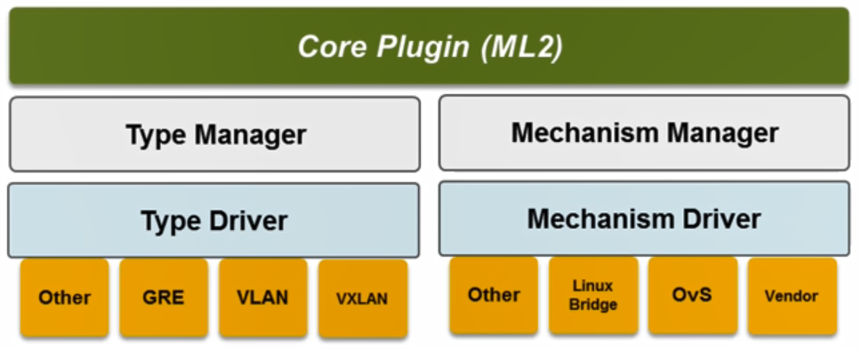
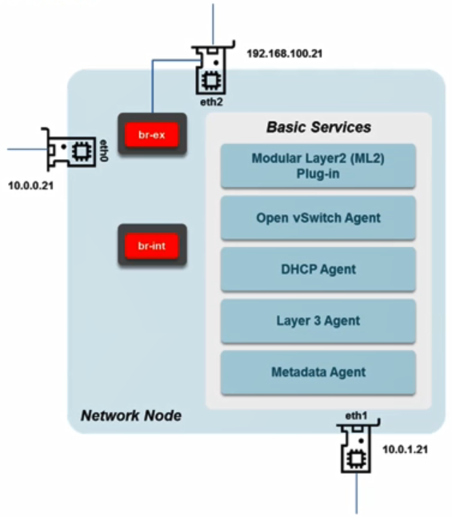
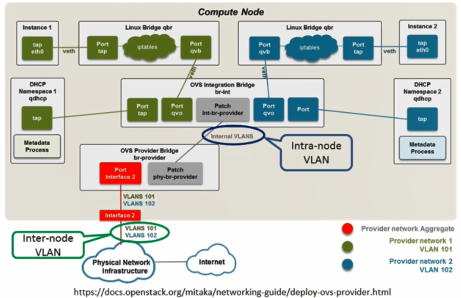
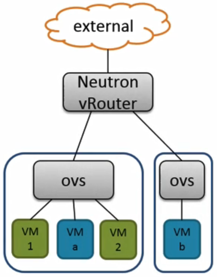

# 24. OpenStack Networking

## OpenStack Networking (Neutron)

- Modular Layer 2 (ML2) plugin

  - 네트워크 구성의 타입(GRE, VXLAN...)과 이러한 네트워크 타입을 구현하는 기술들 Mechanism(Linux Bridge, OvS, Vendor...)을 통해 이러한 Type의 네트워크를 구성할 수 있다는 것이 기본 컨셉
  - ML2는 Type과 Mechanism에 대해서 통합하는 공통의 인터페이스를 제공하며 이를 통해서 Neutron이 Layer 2 네트워킹 서비스를 사용할 수 있게 함
    - 이러한 공통 인터페이스 덕분에 새로운 네트워크 타입이나 기존 구현 기술외에 벤더 specific한 추가적인 구현 기술을 인터페이스에 맞게 쉽게 추가 가능
    - 새로 추가된 기술도 기존 구현 기술과 동시에 사용되더라도 문제없이 동작
  - 오픈스택에서 게스트가 고유의 네트워크를 구성하고자 할 때 네트워크 타입과 네트워크 타입을 구현하기 위한 Mechanism을 설정해야 함
    - 기본적으로 사용하는 네트워크 타입 : GRE, VLAN, VXLAN
    - 구현하는 기술 : OvS, Linux Bridge ...
  - ML2는 Neutron 서버로부터 서비스 요청을 수신해서 해당 게스트의 네트워크 타입 및 구현 기술에 맞게 서비스가 실행이 되도록 실제 컴퓨트 노드나 네트워크 노드에 설치되어 있는 Mechanism 에이전트들에게 명령을 전달하는 역할도 수행

  

- ML2이외에 Neutron에 포함되는 다른 구성요소

  - Layer 2 agent
    - 네트워크 노드 및 컴퓨트 노드에 설치가 되어서 ML2로부터 전달받은 서비스 요청을 실제 설치된 해당 노드에서 수행하는 역할
    - ex) 컴퓨트 노드에서 VM과 가상 스위치 연결을 구성할 때 OVS나 Linux bridge를 사용할 수 있는데 이러한 Mechanism들이 오픈스택에 관리자/사용자로부터 서비스 요청에 따라서 동작하도록 하는 에이전트가 설치됨
    - Agent for OVS / Linux bridge / SR-IOV NIC Switch / MacVTap / Hyper-V / other...
  - Layer 3 agent
    - 네트워크 노드에 설치되고 게스트를 위한 가상 라우터 기반 L3 라우팅을 제공
    - 추가적인 서비스로 가상 라우터, NAT, VPN, load balancer를 제공
  - DHCP agent
    - 컴퓨트 노드에 설치되서 거기에 배치되는 VM 인스턴스에 대해서 DHCP 관련된 작업들을 수행
    - 오픈스택 환경에서 게스트, tenant 들은 고유의 isolate된 네트워킹을 구성 가능
  - Metadata agent
    - 공통의 인프라로부터 고유의 isolated된 인프라를 구성할 수 있는데 따라서 특정 tenant에 귀속되는 정보들을 metadata agent를 통해서 따로 관리
    - 그 정보들은 tenant, private ip 대역, ssh-keys, tenant에 할당된 namespace
  - Security group
    - tenant 수준에서 정의된 일종의 방화벽 정책
    - 여러개 생성 가능
    - 추가적으로 생성되는 VM들도 생성된 여러개 Security group 중에서 원하는 정책을 해당 VM에 적용 가능
    - 기본적인 역할은 특정 VM 인스턴스에서 송신하고 수신하는 트래픽들을 제어하는 역할
      - 방화벽에 가까운 역할을 수행

  

- 오픈스택 네트워킹 구성 예제

  - 네트워크 타입은 VLAN

  - 구현 기술은 OVS

  - 아래 그림과 같이 구성됨

  - 이러한 네트워크 구성은 2가지로 구분됨

    - Provider Network
      - 컴퓨트 노드 외부로 나가는 트래픽의 라우팅 기능을 오픈스택 관리자 혹은 서비스를 공급하는 공급자에 의해서 이미 설치된 라우터나 장비들의 라우팅 기능을 전적으로 의존하는 네트워크

    

    - Self Service Network
      - Neutron의 L3 Agent의 가상 라우터를 통해서 Provider Network와 달리 Physical한 네트워크 장비 인프라에 의존하지 않고 Virtual Router를 통해서 오픈스택 외부와의 통신을 수행

    

