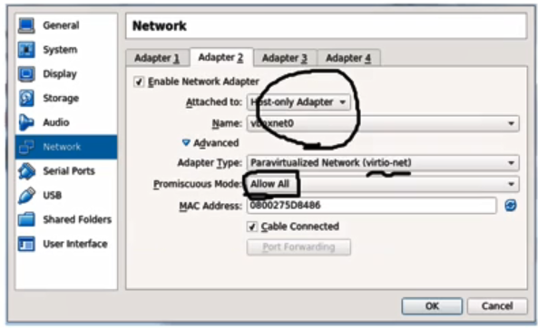
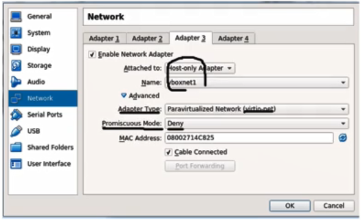

# 25. OpenStack Installation

## Environment Overview

​	

### Preparation

- Host machine
  - 12 core, 24 GB memory, 1TB HDD
  - X11 forwarding support for VirtualBox GUI in Linux
- Linux shell client
  - 호스트 머신에 접속하거나 VM위에서 설치될 컨트롤 노드, 컴퓨트 노드에 접속하기 위한 목적
  - Window : Putty (+ Xming), Xshell (+ Xmanager)
  - Mac OS : Xquartz
- VirtualBox
  - 호스트 머신에 설치되며 가장 최근 버전 설치
- VM Images
  - 강의에서 제공되는 VM
  - CentOS 7.3
  - Controller node : 2 vCPU, 4GB memory, 10GB HDD
  - Compute node : 4 vCPU, 4GB memory, 10GB HDD
  - 사용하는 호스트 서버의 자원이 충분하다면 이것보다 더 많은 리소스를 할당


### VM Image Import

- Virtual Box에 Controller VM, Compute VM 차례대로 임포트
- Reinitialize the MAC address of all network cards 선택


### NAT Network Setup

- File - Preferences - Network - NAT Networks

- Add a new NAT network and edit it

- Uncheck "Supports DHCP"

  


### Host-only Networks Setup

- Create two host-only networks

  - vboxnet0 (192..168.56.0/24) - 오픈스택 설치 이후에 VM 인스턴스들 간에 통신을 위한 커뮤니케이션 링크로써 게스트 네트워크 구성(VLAN)
  - vboxnet1 (10.10.1.0/24) - 오픈스택과는 별개로 호스트서버에서 컨트롤 노드와 컴퓨트 노드의 제어를 하기 위한 SSH connection을 위한 목적

- File - Preferences - Network - Host-only Networks

- Edit the selected network

- Disable DHCP server

  


### VM Network Setting

- Machine - Settings - Network

- Check the adapter 1~3 of the given two VMs

  - Adapter 1 : NAT Network (192.168.11.0/24), Adapter Type (virtio-net), Promiscuous Mode(Allow All, only for Controller VM)

    

  - Adapter 2 : Host-only Adapter (vboxnet0, 192.168.56.0/24), Adapter Type(virtio-net), Promiscuous Mode (Allow All for both nodes)

    

  - Adapter 3 : Host-only Adapter (vboxnet1, 10.10.1.0/24), Adapter Type (virtio-net)

    


### Packstack Installation

- Stat the two VMs(Host-only ssh 접속을 위한 VM)

- Stop NetworkManager, firewalld service stop, SELinux가 permissive mode로 동작하도록 설정

  ```bash
  $ systemctl disable NetworkManager
  $ service NetworkManager stop
  $ systemctl disable firewalld
  $ service firewalld stop
  $ setenforce 0
  ```

- Install Packstack package( only in the Controller VM)

  - Packstack : 레드햇 기반의 리눅스 서버에서 오픈 스택을 자동으로 설치해주는 툴
  - Packstack을 통해서 설치할 오픈스택은 오픈스택 Mitaka 버전 사용

  ```bash
  $ vim /etc/environment
  LANG=en_US.utf-8
  LC_ALL=en_US.utf-8
  $ yum install -y centos-release-openstack-mitaka
  $ yum update -y
  $ yum install -y openstack-packstack
  $ yum install -y openstack-utils
  ```


### Packstack Answer File

- Packstack은 설치 툴이고 Packstack이 자동 설치를 하기 위해서 참고하는 configuration 파일

  

#### Details on the Answer File Configurations

- `_SWIFT_INSTALL=n`, `_CEILOMETER_INSTALL=n`, `_CINDER_INSTALL=n`, `_NAGIOS_INSTALL=n`
  - 오픈스택의 부가적인 서비스 컴포넌트들 설치할지
  - 튜토리얼이기 때문에 자원이 한정적이라 필수적인 컴포넌트만 설치하고 부가적인 컴포넌트들은 설치하지 않음
- `_CONTROLLER_HOST=192.168.11.11`, `_COMPUTE_HOSTS=192.168.11.21`, `_NETWORK_HOSTS=192.168.11.11`
  - Management network IP on controller node, List of management network IPs on compute nodes, Management network IP on network nodes
- `_NETWORK_OVS_BRIDGE_MAPPINGS=extnet:br-ex,physnet1:br-vlan`
- 

