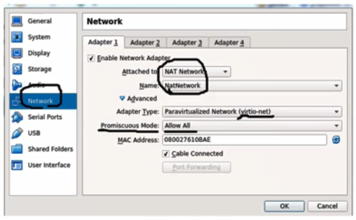
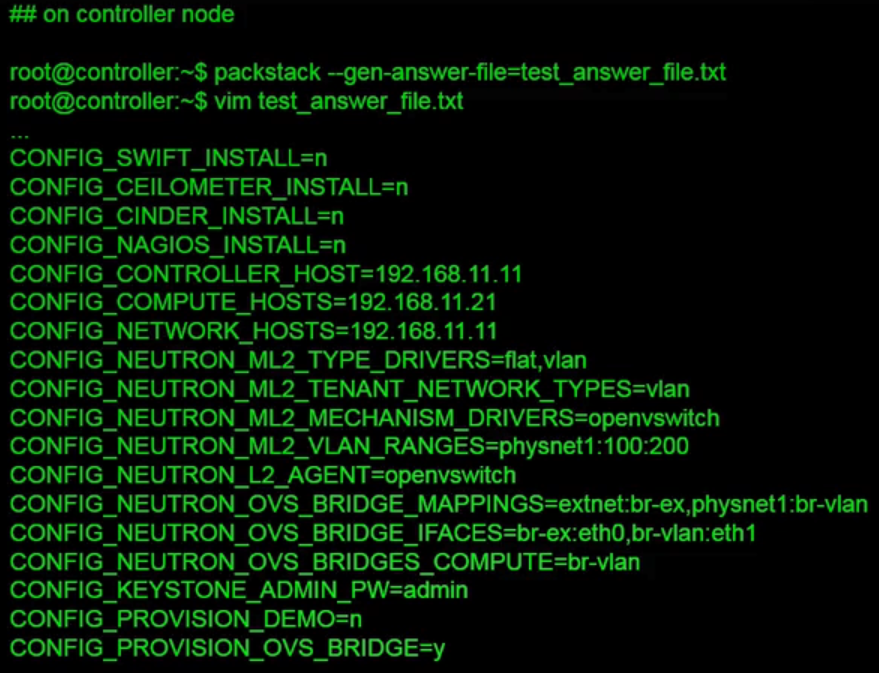

# 25. OpenStack Installation

## Environment Overview

​	

### Preparation

- Host machine
  - 12 core, 24 GB memory, 1TB HDD
  - X11 forwarding support for VirtualBox GUI in Linux
- Linux shell client
  - 호스트 머신에 접속하거나 VM위에서 설치될 컨트롤 노드, 컴퓨트 노드에 접속하기 위한 목적
  - Window : Putty (+ Xming), Xshell (+ Xmanager)
  - Mac OS : Xquartz
- VirtualBox
  - 호스트 머신에 설치되며 가장 최근 버전 설치
- VM Images
  - 강의에서 제공되는 VM
  - CentOS 7.3
  - Controller node : 2 vCPU, 4GB memory, 10GB HDD
  - Compute node : 4 vCPU, 4GB memory, 10GB HDD
  - 사용하는 호스트 서버의 자원이 충분하다면 이것보다 더 많은 리소스를 할당


### VM Image Import

- Virtual Box에 Controller VM, Compute VM 차례대로 임포트
- Reinitialize the MAC address of all network cards 선택


### NAT Network Setup

- File - Preferences - Network - NAT Networks

- Add a new NAT network and edit it

- Uncheck "Supports DHCP"

  


### Host-only Networks Setup

- Create two host-only networks

  - vboxnet0 (192..168.56.0/24) - 오픈스택 설치 이후에 VM 인스턴스들 간에 통신을 위한 커뮤니케이션 링크로써 게스트 네트워크 구성(VLAN)
  - vboxnet1 (10.10.1.0/24) - 오픈스택과는 별개로 호스트서버에서 컨트롤 노드와 컴퓨트 노드의 제어를 하기 위한 SSH connection을 위한 목적

- File - Preferences - Network - Host-only Networks

- Edit the selected network

- Disable DHCP server

  


### VM Network Setting

- Machine - Settings - Network

- Check the adapter 1~3 of the given two VMs

  - Adapter 1 : NAT Network (192.168.11.0/24), Adapter Type (virtio-net), Promiscuous Mode(Allow All, only for Controller VM)

    

  - Adapter 2 : Host-only Adapter (vboxnet0, 192.168.56.0/24), Adapter Type(virtio-net), Promiscuous Mode (Allow All for both nodes)

    

  - Adapter 3 : Host-only Adapter (vboxnet1, 10.10.1.0/24), Adapter Type (virtio-net)

    


### Packstack Installation

- Stat the two VMs(Host-only ssh 접속을 위한 VM)

- Stop NetworkManager, firewalld service stop, SELinux가 permissive mode로 동작하도록 설정

  ```bash
  $ systemctl disable NetworkManager
  $ service NetworkManager stop
  $ systemctl disable firewalld
  $ service firewalld stop
  $ setenforce 0
  ```

- Install Packstack package( only in the Controller VM)

  - Packstack : 레드햇 기반의 리눅스 서버에서 오픈 스택을 자동으로 설치해주는 툴
  - Packstack을 통해서 설치할 오픈스택은 오픈스택 Mitaka 버전 사용

  ```bash
  $ vim /etc/environment
  LANG=en_US.utf-8
  LC_ALL=en_US.utf-8
  $ yum install -y centos-release-openstack-mitaka
  $ yum update -y
  $ yum install -y openstack-packstack
  $ yum install -y openstack-utils
  ```


### Packstack Answer File

- Packstack은 설치 툴이고 Packstack이 자동 설치를 하기 위해서 참고하는 configuration 파일

  

#### Details on the Answer File Configurations

- `_SWIFT_INSTALL=n`, `_CEILOMETER_INSTALL=n`, `_CINDER_INSTALL=n`, `_NAGIOS_INSTALL=n`
  - 오픈스택의 부가적인 서비스 컴포넌트들 설치할지
  - 튜토리얼이기 때문에 자원이 한정적이라 필수적인 컴포넌트만 설치하고 부가적인 컴포넌트들은 설치하지 않음
- `_CONTROLLER_HOST=192.168.11.11`, `_COMPUTE_HOSTS=192.168.11.21`, `_NETWORK_HOSTS=192.168.11.11`
  - Management network IP on controller node, List of management network IPs on compute nodes, Management network IP on network nodes
- `_NETWORK_OVS_BRIDGE_MAPPINGS=extnet:br-ex,physnet1:br-vlan`, `_NEUTRON_OVS_BRIDGE_IFACES=br-ex:eth0,br-vlan:eth1`
  - ,를 기준으로 구분하고 :값으로 페어를 이룸
  - 앞에는 네트워크 이름, 뒤에는 해당 네트워크에 연결되는 브릿지 이름
  - extnet은 br-ex로 매핑되고 br-ex는 eth0인터페이스로 매핑됨
    - VM으로 생성한 NAT Network(eth0)에 물리는 노드의 네트워크 인터페이스가 br-ex브릿지로 연결이되고 br-ex 브릿지는 오픈스택 설치 이후에 생성되는데 br-ex 브릿지는 extnet이라는 네트워크로 연결
- `_NEUTRON_ML2_TENANT_NETWORK_TYPES=vlan`, `_NEUTRON_ML2_MECHANISM_DRIVERS=openvswitch`, `_NEUTRON_ML2_TYPE_DRIVERS=flat,vlan`
  - 테넌트 네트워크 타입은 vlan
    - 테넌트 트래픽을 구분하기 위해 vlan id 사용
  - ML2 메커니즘 드라이버는 openvswitch를 이용해 네트워크를 구현
  - TYPE Driver는 flat과 vlan 두 가지 유형의 네트워크를 오픈스택 구성할 때 사용하겠다고 명시
    - vlan은 게스트 네트워크를 위해서 사용
    - flat은 NAT Network(extnet)를 flat 타입으로 사용하기 때문에 명시
- `_NEUTRON_L2_AGENT=openvswitch`
  - 각 노드에서 openvswitch 에이전트를 설치하겠다고 명시
- `_NEUTRON_OVS_BRIDGES_COMPUTE=br-vlan`
  - 컴퓨트 노드가 추가됬을 때 컴퓨트 노드에 생성되는 VM 인스턴스들 간에 br-vlan에 연결되는 게스트 네트워크를 통해서 통신하겠다고 선언
- `_PROVISION_DEMO=n`
  - yes값으로 두면 샘플 환경(데몬 환경)이 구성됨
- https://github.com/openstack/packstack/blob/master/docs/packstack.rst

