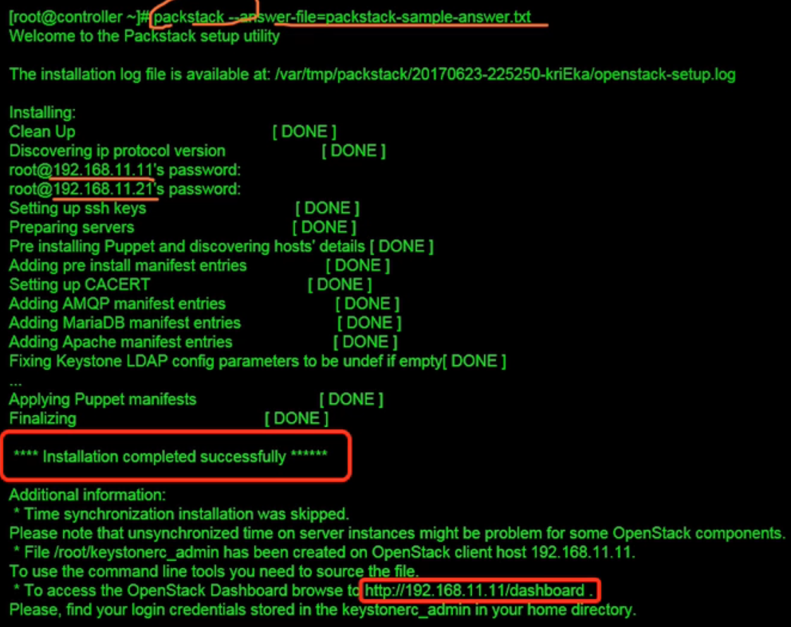
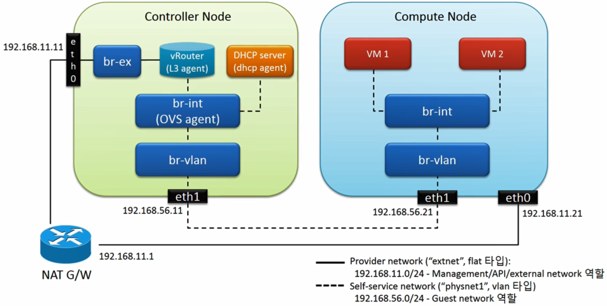
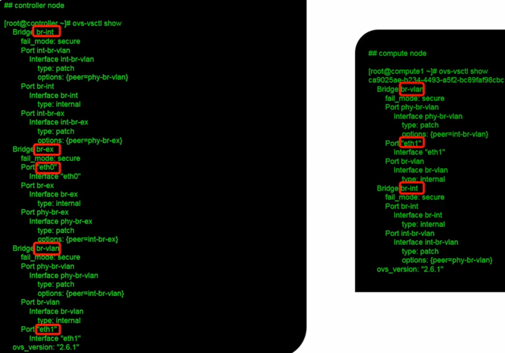
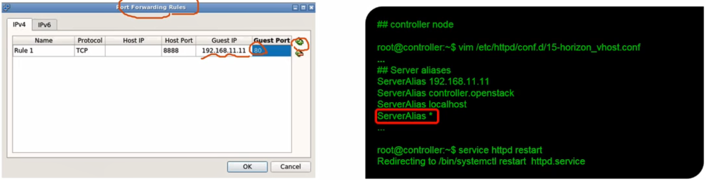

# OpenStack Installation 2

## OpenStack Installation 

- 컨트롤러 노드의 콘솔에서 packstack 명령어 입력

  - 컨틀로러 노드에서 실행하면 packstack이 원격으로 Puppet이나 SSH 접근을 통해서 연결된 컴퓨트 노드에도 관련된 오픈스택 구성요소를 설치함

  `packstack --answer-file=packstack-sample-answer.txt`

  packstack-sample-answer 파일은 강의에서 제공하는데 현재 없음

- 설치 완료 모습

  

- 오픈스택을 설치했을 때 구성되는 환경

  - NAT G/W라는 일종의 오픈스택 외부의 장치에 의해서 오픈스택 환경에서 외부로 나가는 라우팅 기능
    - 오픈스택의 네트워크 유형 중 Provider 네트워크에 해당
    - G/W 라우터가 컨트롤러 노드, 컴퓨트 노드에 직접 인터페이스를 통해서 계층화 과정없이 바로 물려있는데 이를 오픈스택에서 플랫 타입으로 부름

  

- `ip addr`, `route -n` 확인

  

- `ovs-vsctl show` 명령어를 통해서 브릿지들 생성 확인

  - 여기서 컨트롤러 노드에만 br-ex가 있는 이유
    - 실제적으로 오픈스택에서 생성된 VM 인스턴스들과 오픈스택 외부와의 external connectivity를 위한 역할을 하는게 네트워크 노드에서 담당
    - 컨트롤러 노드가 네트워크 노드의 역할을 동시에 수행

  

## Dashboard Access

- 오픈스택 설치 완료 후 대시보드를 통해서 GUI 환경에서 오픈스택 제어 가능

- OpenStack Dashboard(Horizon) URL

  - 컨트롤러 노드의 API 주소를 사용
  - http://192.168.11.11/dashboard
    - 하지만 해당 IP는 Virtual Box NAT 네트워크의 내부에서만 private network

-  어느 위치에서든 웹으로 접근이 가능하도록 Virtual Box에 포트 포워딩 룰 설정

  - File - Preferences - Network - NAT Networks - Edit "NatNetwork"

- 대시보드 내용 수정

  - 컨트롤러 노드에서 다음 파일을 수정하여 외부 어떤 요청이든 허용

  