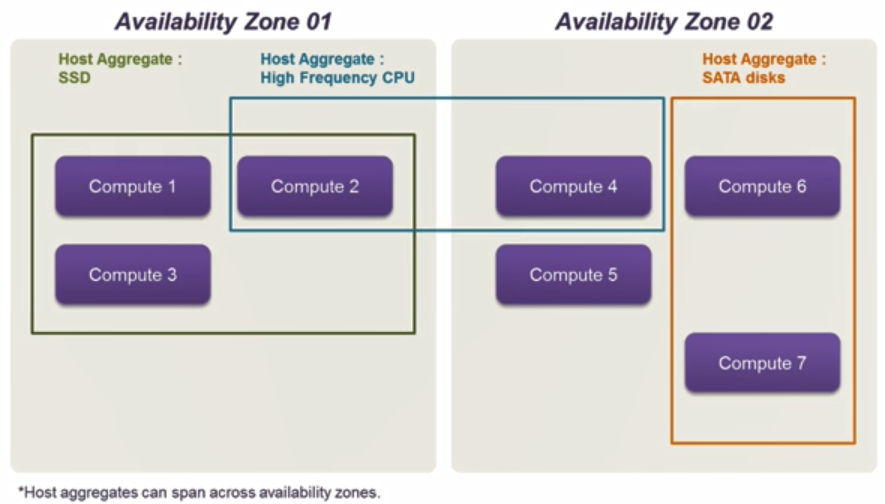
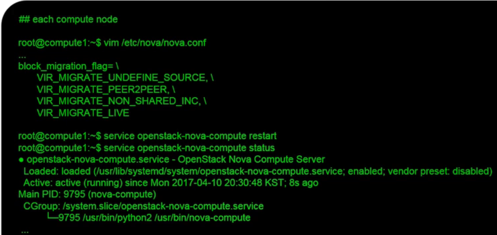
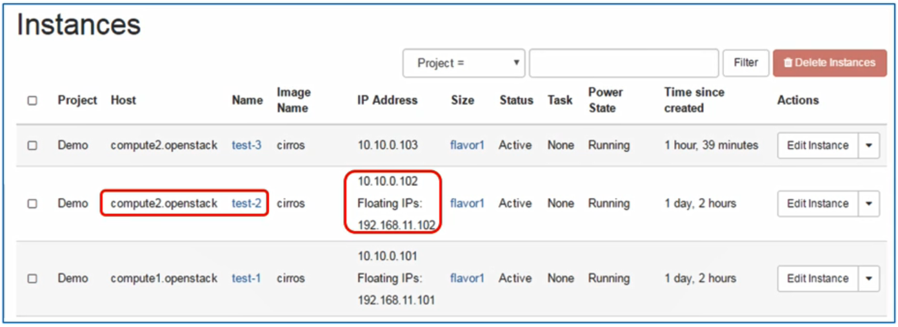

# 31. OpenStack Additional Setup - 2

## Availability Zone & Host Aggregates

- 실제 오픈스택 설치 후 운용 단계에서 오픈스택 사용자가 어떤 VM 인스턴스를 생성하려면 VM 인스턴스가 디플로이되는 특정 컴퓨트 노드를 지정하려는 요구사항 발생

  - 특정 VNF가 하이 퍼포먼스를 요구하면 서포트해줄 수 있는 고사양의 VM 인스턴스가 생성되어야 함
  - 따라서 그런 VM 인스턴스를 실제로 디플로이하는 컴퓨트 노드 또한 고사양의 컴퓨트 노드를 활용해야 됨

- 오픈스택에서는 Availability Zone과 Host Aggregates라는 개념으로 제공

- Availability Zone

  - 물리적으로 인접한 컴퓨트 노드를 클러스터링하는 단위

- Host Aggregates

  - 좀 더 논리적인 개념으로써 특정한 특성을 가진 컴퓨트 노드들을 물리적인 위치와 관계없이 서로 클러스터링하는 단위

  


## Host Aggregate (admin)

- 기본적으로 오픈스택 설치 이후에 모든 컴퓨트 노드들은 모두 "nova"라는 Availability Zone(AZ)에 포함되어 있음

- default AZ을 이용해 VM 인스턴스를 생성을 했을 때

  - Nova-scheduler라는 노바의 서브 컴포넌트가 자체적인 알고리즘을 가지고 Nova AZ에 속해있는 컴퓨트 노드 중에서 가장 자원 측면에서 효율적인 컴퓨트 노드를 선택해 VM 인스턴스를 생성
  - Nova-scheduler 알고리즘에 의존하지 않고 특정 컴퓨트 노드를 선택에서 VM 인스턴스를 생성하고 싶은 요구사항 필요

- Host Aggregate와 AZ 개념을 이용해 요구사항 만족

  - System - Host Aggregates - Create Host Aggregate

  


## Lanch a VM Instance on a Certain Availability Zone (Demo)

- Availability Zone - "compute2"

  


## VM Live Migration

- VM Migration은 특정 호스트 서버에서 동작 중인 VM을 오퍼레이션을 중단시키고 다른 데스티네이션 호스트 서버로 VM을 이주시킨 다음에 VM 런치해서 다시 동작

- VM Live Migration은 VM Migration 과정중에서 VM 라이프 사이클을 건드리지 않고 동작 중인 상태에서 원하는 호스트 서버로 Migration하는 개념

- VM Live Migration이 필요한 이유

  - System maintenance
    - 컴퓨트 노드가 커널 업그레이드나 고장시 shutdown이 필요해 재시작을 해야 하면 그 위에 동작 중인 VM 인스턴스는 중단되어야 함
    - 하지만 VM Live Migration을 통해서 대상 컴퓨트 노드로 해당 VM의 라이프 사이클을 변경시키지 않고 동작 중인 상태로 이전
  - Resource reallocation
    - 컴퓨트 노드에 VM 인스턴스가 많이 생성될 수 있고 그 위에 동작 중인 어플리케이션(VNF)이 하이 퍼포먼스를 요구하는데 VM이 많으면 VNF의 퍼포먼스를 유지할 수 없음
    - 그런 상황에서 VNF의 동작 상태에 영향을 미치지 않고 유휴 자원이 많은 컴퓨트노드로 해당 VM을 마이그레이션 하거나 새로운 컴퓨트 노드를 추가해 해당 컴퓨트 노드에 마이그레이션을 진행하여 퍼포먼스를 보장

- VM live migration types in OpenStack

  - Shared storage-based live migration
    - network 파일 시스템 혹은 Distribute 파일 시스템 같은 스토리지를 필요로 함
    - source 컴퓨트 노드와 destination 컴퓨트 노드 사이에 공유 스토리지가 필요
    - 스토리지는 필요없고 VM의 memory 파트만 카피
    - 마이그레이션 속도가 빠르지만 shared storage를 사용한기 때문에 VM의 I/O 스피드가 떨어지는 단점이 존재
  - Block live migration
    - VM의 memory와 disk(storage)까지 모두 카피
    - 마이그레이션 속도가 상대적으로 느리지만 shared storage가 필요 없음

- 관리자 입장에서 하기 때문에 OpenStack CLI를 이용

- 모든 노드에 공통적으로 설정해야 하는 사항

  1. SELinux를 permissive 모드로 설정
  2. hostname과 IP address 간에 바인딩을 설정
  3. 각각의 설정된 hostname들을 가지고 핑 테스트

  ```bash
  ## controller node
  
  $ setenforce 0
  $ vim /etc/hosts
  $ ping compute1.openstack
  $ ping compute2.openstack
  ```

  

- 각각의 컴퓨트 노드에 설정

  - Modify nova-compute component and restart it

    ```bash
    $ vim /etc/nova/nova.conf
    $ service openstack-nova-compute restart
    $ service openstack-nova-compute status
    ```

    


## Open Stack CLI

- 컨트롤러 노드로 접속하여 Packstack을 통해서 OpenStack 설치가 완료되면 "keystonerc_admin" 스크립트 파일이 자동 생성

- 설치된 오픈스택의 admin 계정에 대한 Authentication을 포함하는 스크립트를 실행시켜 어드민 계정으로 CLI를 사용

- Blcok live migration 사용

- Compute node 1의 VM을 Compute node 2로 마이그레이션

  ```bash
  $ source keystonerc_admin
  $ nova live-migration --block-migrate <instance id> <dest host name>
  ```

  

- Migrate "test-2" VM (192.168.11.102) in "compute1" to "compute2" node

- 중단없이 이전하기 때문에 ping이 끊기지 않고 전송됨

  


## After VM Live MIgration

