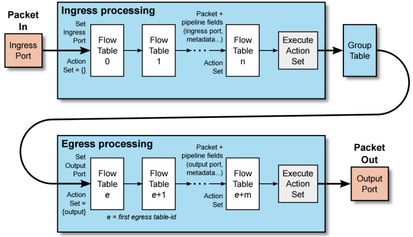

# OpenFlow Spec 정리

> 회사 강의 동영상에서 들은 OpenFlow Spec 문서 정리이다.

### 목차

- [Flow Table](#flow-table)
- [Group Table](#group-table)
- [Meter Table](#meter-table)
- [Egress Table](#egress-tablev15)
- [Protocol Types](#protocol-types)
- [Channel](#channel)
- [Ports](#ports)
- [OpenFlow 버전 변화](#openflow-버전-변화)

---

- **Flow Table**
  - 플로우 룰을 저장해 놓는 테이블
  - 패킷이 들어오면 매칭되는 룰의 정책에 따라 수행 
  - Multiple flow table 지원
    - 하드웨어와 같은 구조
- **Group Table**
  - 포트 그룹
  - load balancing
- **Meter Table**
  - rate of packets/Bytes을 측정 및 제어
  - QoS 지원

## Flow Table

- 
- Pipeline Processing
- 매치하는 플로우가 존재하면 instruction에 적혀있는 action들을 보고 수행
  - 이때 action을 바로 수행하지 않고 action set에 적어놓음
  - 테이블을 이동하며 끝까지 찾고 action set에 있는 action을 수행
- goto_table 액션이면 output action보다 먼저 수행
  - 이때 바로 output port로 내보내고 다른 action을 수행하고 싶으면 write-actions 수행 전에 apply-action으로 바로 즉시 수행

## Group Table

- 포트의 그룹
- 

- ActionBucket마다 포트 하나씩 할당
- All은 모든 bucket 전송
- select - 로드밸런싱, bucket들 중 선택해 전송
- Indirect - 하나의 bucket에만 전송
- Fast Failover - 한 포트로 전송하다 장애 발생하면 다른 포트로 전송

- FlowTalbe의 Instruction에 output을 Action set에 적고 그 후에 group table로 보내는 action이 있으면 Action Set에 있는 output action은 지워짐

## Meter Table

- 

- Group Table과 비슷하지만 output이 정의되지 않음
- write-action보다 우선적으로 나옴
- Meter Bands에 조건들이 있음
  - Band Type
    - dscp remark : IP패킷의 필드 중에 하나의 비트를 1로 표시해 라우터가 바쁘면 해당 패킷 drop
    - drop : 바로 해당 패킷 drop
  - Rate
    - 조건에 해당, 300으로 설정되어 있으면 300kbps를 넘어가면 Band Type을 수행
  - Burst
    - Burst가 20이고 Rate이 300이면 320kbps까지는 Band Type 수행 안함

## Egress Table(v1.5)

- output port 상황에서 추가적 processing
- 기존의 Ingress Processing과 비슷하지만 플로우 테이블마다 output port가 몇인지 필수로 들어감
- 

## Protocol Types

- 3 message type 지원
- **Controller-to-Switch**
  - Feature
  - Configuration
  - Packet-out
  - Modify-state
  - Barrier
- **Asynchronous**
  - Packet-in
  - Flow-removed
  - Port-status
- **Symmetic**
  - Hello
  - Echo

## Channel

#### v1.1 Connection Interruption

- **Fail Secure Mode**
  - 컨트롤러가 없지만 있는 것처럼 동작
  - packets과 messages는 drop
  - flows는 timeout에 따라 expire
- **Fail Standalone Mode**
  - 일반 L2 스위치나 라우터처럼 동작
  - switch OFPP_NORMAL port로 packets 처리

#### v1.2 Multiple Controllers

- **OFPCR_ROLE_EQUAL(default)**
  - 스위치는 연결된 모든 컨트롤러에게 packet-in 메시지를 보내고 룰을 전송받음
- **OFPCR_ROLE_MASTER**
- **OFPCR_ROLE_SLAVE**

## Ports

- Physical Port
- Logical Port
  - LAG(link Aggregation), tunnels
- Reserved Port
  - ALL : 전체 포트 전송
  - CONTROLLER : 컨트롤러에게 전송
  - TABLE : 컨트롤러가 받은 패킷에 대한 플로우 룰을 내려주고 패킷이 다시 플로우 테이블을 조회
  - IN_PORT : 들어온 포트로 전송

## OpenFlow 버전 변화

