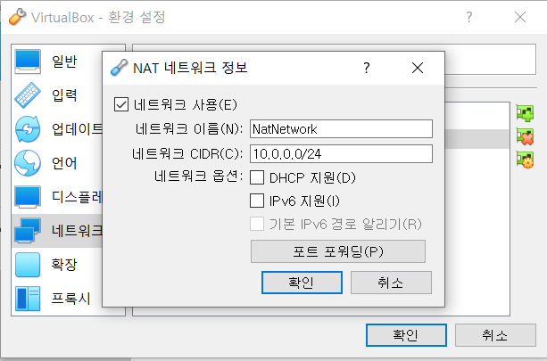
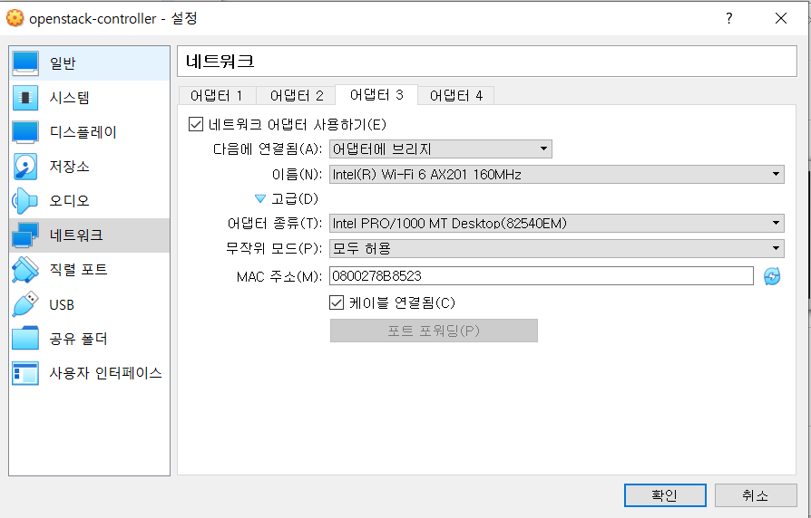
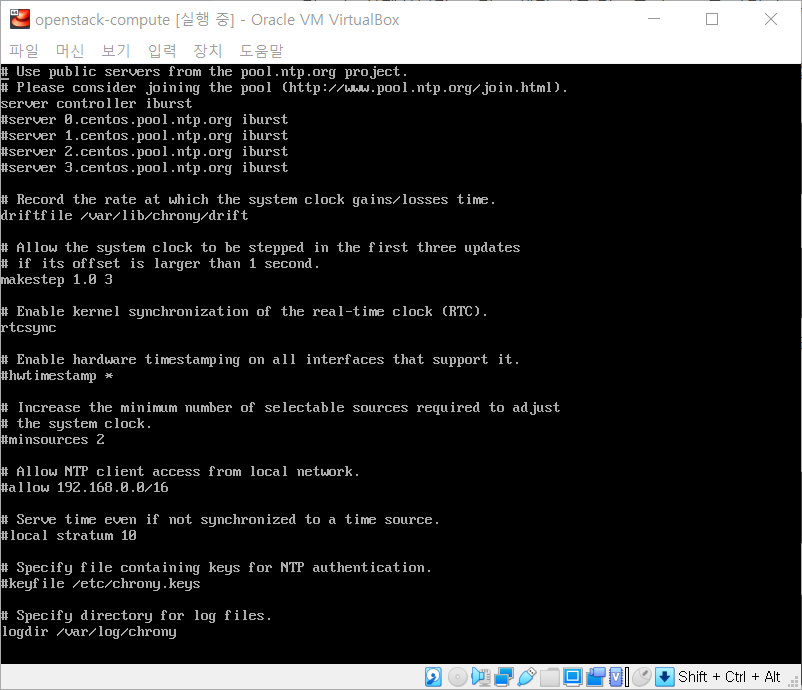
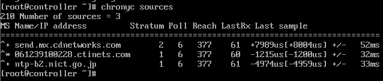
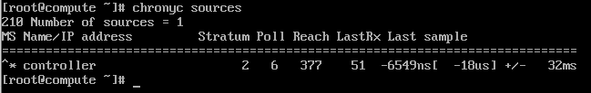
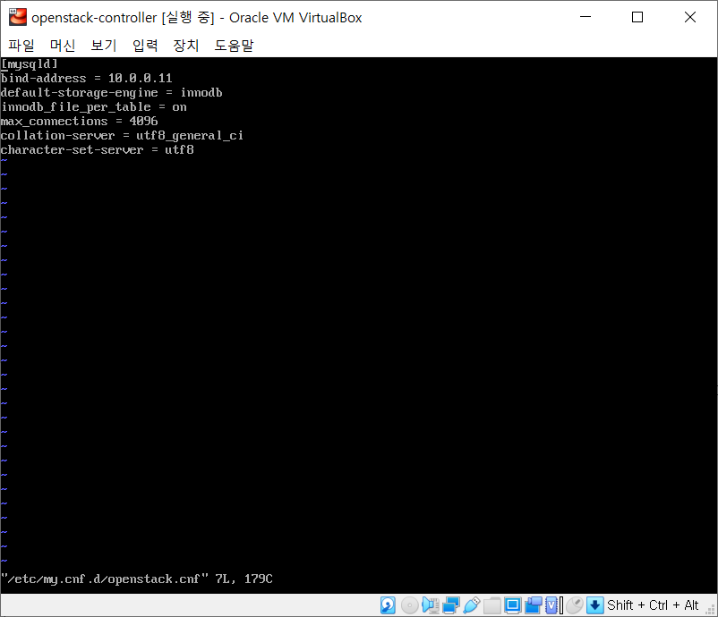
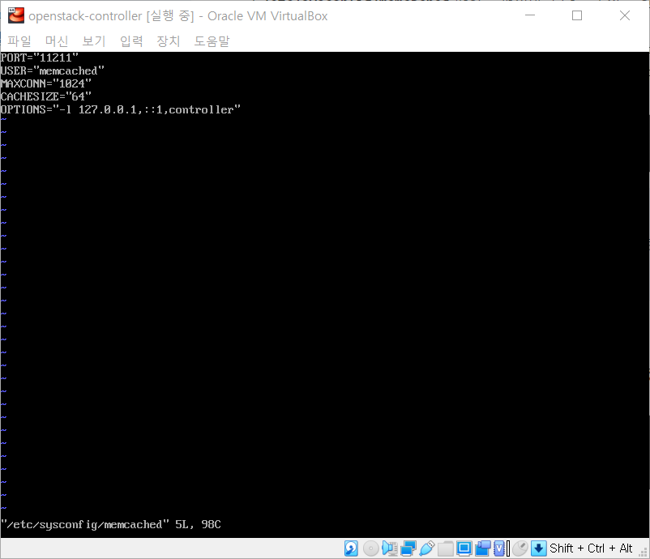
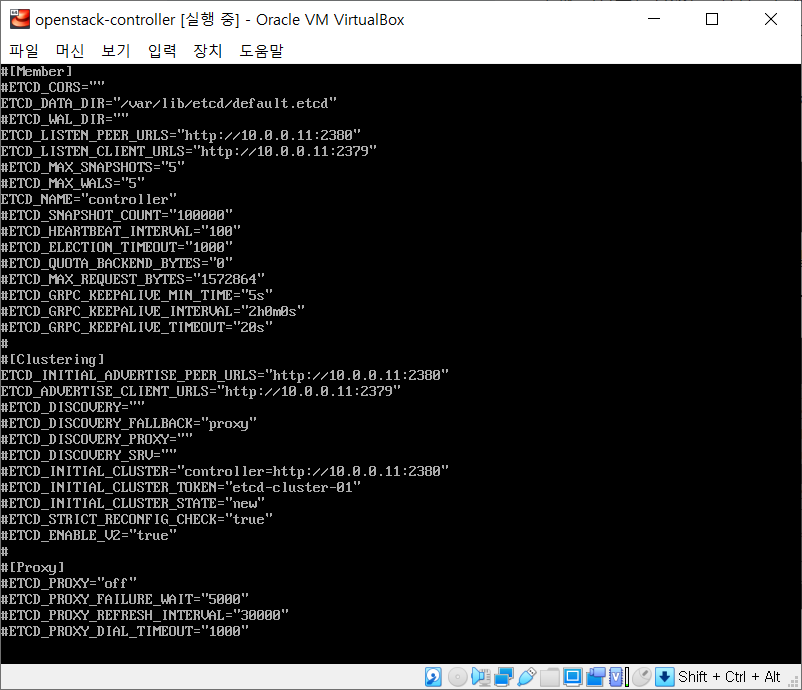

# 오픈스택 설치

> 오픈스택 [공식 문서](https://docs.openstack.org/ko_KR/install-guide/)를 통한 설치 과정입니다

- 오픈스택은 서로 보완하는 다양한 서비스를 통하여 Infrastructure-as-a-Service(IaaS) 솔루션을 제공합니다.
- Application Programing Interface(API)를 이용하여 각 서비스 통합을 쉽게 구성할 수 있습니다.

## 목차

- [개요](#개요)
  - [예제 구성도](#예제-구성도)
  - [네트워킹](#네트워킹)
- [환경 구성](#환경-구성)
  - [VM 설정](#vm-설정)
  - [보안](#보안)
- [호스트 네트워킹 설정](#호스트-네트워킹-설정)
  - [사용하는 네트워크](#사용하는-네트워크)
  - [각 노드 네트워크 인터페이스 설정](#각-노드-네트워크-인터페이스-설정)
  - [Controller 노드 IP 설정](#controller-노드-ip-설정)
  - [Compute 노드 IP 설정](#compute-노드-ip-설정)
  - [연결 확인](#연결-확인)
- [Network Time Protocol(NTP)](#network-time-protocolntp)
  - [Controller Node](#controller-node)
  - [다른 노드들(Compute Node)](#다른-노드들compute-node)
  - [검증](#검증)
- [OpenStack 패키지 설치](#openstack-패키지-설치)
- [SQL Database 설치](#sql-database-설치)
  - [구성요소 설치 및 구성](#구성요소-설치-및-구성)
  - [설치 마무리](#설치-마무리)
- [Message Queue 설치](#message-queue-설치)
  - [구성요소 설치 및 구성](#구성요소-설치-및-구성)
- [Memcached 설치](#memcached-설치)
  - [구성요소 설치 및 구성](#구성요소-설치-및-구성)
  - [설치 마무리](#설치-마무리)
- [Etcd 설치](#etcd-설치)
  - [구성요소 설치 및 구성](#구성요소-설치-및-구성)
  - [설치 마무리](#설치-마무리)


## 개요

### 예제 구성도

- 예제 아키텍처에서는 기본 VM 또는 인스턴스를 작동할 수 있는 최소 두 노드(호스트)가 필요합니다.
- 추가로 블록 스토리지와 오브젝트 스토리지를 구성하기 위해선 추가 노드를 설치해야 합니다.
- **해당 설치 예제에서는 Controller Node와 Compute Node만 사용합니다**


#### 하드웨어 요구사항

- **Controller Node**
  - ID 서비스, 이미지 서비스, 배치 서비스, 컴퓨트 관리, 네트워크 관리, 네트워크 에이전트와 대시보드를 실행합니다.
  - 또한 SQL database, message queue 그리고 NTP를 지원합니다.
  - 컨트롤러 노드는 최소한 두 개의 네트워크 인터페이스 카드를 필요로 합니다.
- **Compute Node**
  - Compute 노드는 인스턴스를 동작시키는 Compute부분에 해당하는 hypervisor를 실행합니다.
  - 가상 네트워크에 연결하는 네트워킹 서비스 에이전트를 실행하며 security groups를 통한 방화벽 서비스를 제공합니다.
  - 각 노드마다 최소 하나 이상의 네트워크 인터페이스 카드 필요

#### 설치 버전

- CentOS 7.9(Minimal)
  - 다른 패키지나 설정들의 충돌을 피하기 이하여 Minimal에서 진행합니다.
- OpenStack - Train
  - Train 이후에 나온 Ussuri 부터는 CentOS 8에서 진행해야 합니다.

### 네트워킹

#### Provider Network

- 핵심 layer-2 서비스 및 네트워크에 대한 VLAN 세그멘테이션이 가능한 단순한 방식으로 OpensTack 네트워킹 서비스를 배포합니다.
- 가상 네트워크를 물리 네트워크에 연결하여 L3 라우팅 서비스는 물리 테트워크에 의존합니다.
- Self Service Network, L3 라우팅 서비스, LBaaS, FWaaS와 같은 고급 서비스를 지원하지 않습니다.


#### Self Service Network

- Provider Network를 확장하여 VXLAN과 같은 오버레이 세그멘테이션 방식을 사용하고 L3 라우팅 서비스를 포함합니다.
- 가상 네트워크를 NAT를 사용하여 물리 네트워크로 라우팅합니다.


## 환경 구성

### VM 설정

- Controller 노드를 위한 가상 머신 생성
  - OS - CentOS 7(Minimal)
  - RAM - 4GB
  -  Storage - 10GB
  - CPU - 2
- Compute 노드를 위한 가상 머신 생성
  - OS - CentOS 7(Minimal)
  - RAM - 4GB
  - Storage - 20GB
  - CPU - 2
- Virtual Box NAT 설정
  - 환경 설정 - 네트워크 - 오른쪽에 NAT 추가 아이콘 클릭
  - 


### 보안

- 다음에서 사용하는 암호에 대한 서비스 목록과 관련된 설명
- 


## 호스트 네트워킹 설정

### 사용하는 네트워크

- management network(10.0.0.1/24)
- provider network(ip는 사용자 네트워크 환경에 따라 달라짐)
- 

### 각 노드 네트워크 인터페이스 설정

- Controller와 Compute 노드 모두 똑같이 설정해야 한다.

- Management Network
  - 

- Provider Network
  - 


### Controller 노드 IP 설정

- 첫 번째 인터페이스 설정(NAT, Management Network 대역)

  ```shell
  # /etc/sysconfig/network-scripts/ifcfg-enp0s3
  
  TYPE=Ethernet
  PROXY_METHOD=none
  BROWSER_ONLY=no
  BOOTPROTO=none
  DEFROUTE=yes
  IPV4_FAILURE_FATAL=no
  IPV6INIT=yes
  IPV6_AUTOCONF=yes
  IPV6_DEFROUTE=yes
  IPV6_FAILURE_FATAL=no
  IPV6_ADDR_GEN_MODE=stable-privacy
  NAME=enp0s3
  UUID=xxx-xxx-xxx-xxx-xxxx
  DEVICE=enp0s3
  ONBOOT=yes
  IPADDR=10.0.0.11
  PREFIX=24
  GATEWAY=10.0.0.1
  DNS1=8.8.8.8
  ```

  - 10.0.0.11 설정

- 두 번째 인터페이스 설정(Provider Network)

  ```shell
  # /etc/sysconfig/network-scripts/ifcfg-enp0s9
  # 저는 어댑터 3에 브릿지를 설정하여 enp0s9입니다. ip a를 통해 인터페이스 이름 확인하고 설정하시면 됩니다.
  
  TYPE=Ethernet
  PROXY_METHOD=none
  BROWSER_ONLY=no
  BOOTPROTO=none
  DEFROUTE=yes
  IPV4_FAILURE_FATAL=no
  IPV6INIT=yes
  IPV6_AUTOCONF=yes
  IPV6_DEFROUTE=yes
  IPV6_FAILURE_FATAL=no
  IPV6_ADDR_GEN_MODE=stable-privacy
  NAME=enp0s9
  UUID=xxx-xxx-xxx-xxx-xxxx
  DEVICE=enp0s9
  ONBOOT=yes
  ```
  - IP 주소를 할당하지 않음

- 설정을 적용하기 위해 재부팅

  `reboot`

- 노드 호스트 이름 구성

  ```shell
  # /etc/hosts
  # compute가 하나가 아닌 여러 개라면 숫자를 추가하여 구분해주시면 됩니다. ex)compute1
  
  # controller
  10.0.0.11	controller
  # compute
  10.0.0.31	compute
  ```

  - 원래 있는 localhost에 대한 이름은 그대로 두시고 입력하시면 됩니다.

### Compute 노드 IP 설정

- 첫 번째 인터페이스 설정(NAT, Management Network 대역)

  ```shell
  # /etc/sysconfig/network-scripts/ifcfg-enp0s3
  
  TYPE=Ethernet
  PROXY_METHOD=none
  BROWSER_ONLY=no
  BOOTPROTO=none
  DEFROUTE=yes
  IPV4_FAILURE_FATAL=no
  IPV6INIT=yes
  IPV6_AUTOCONF=yes
  IPV6_DEFROUTE=yes
  IPV6_FAILURE_FATAL=no
  IPV6_ADDR_GEN_MODE=stable-privacy
  NAME=enp0s3
  UUID=xxx-xxx-xxx-xxx-xxxx
  DEVICE=enp0s3
  ONBOOT=yes
  IPADDR=10.0.0.31
  PREFIX=24
  GATEWAY=10.0.0.1
  DNS1=8.8.8.8
  ```

  - Controller 노드와 설정은 거의 비슷하고 IP주소와 이름 등만 달라집니다.

- 두 번째 인터페이스 설정(Provider Network)

  ```shell
  # /etc/sysconfig/network-scripts/ifcfg-enp0s9
  # 저는 어댑터 3에 브릿지를 설정하여 enp0s9입니다. ip a를 통해 인터페이스 이름 확인하고 설정하시면 됩니다.
  
  TYPE=Ethernet
  PROXY_METHOD=none
  BROWSER_ONLY=no
  BOOTPROTO=none
  DEFROUTE=yes
  IPV4_FAILURE_FATAL=no
  IPV6INIT=yes
  IPV6_AUTOCONF=yes
  IPV6_DEFROUTE=yes
  IPV6_FAILURE_FATAL=no
  IPV6_ADDR_GEN_MODE=stable-privacy
  NAME=enp0s9
  UUID=xxx-xxx-xxx-xxx-xxxx
  DEVICE=enp0s9
  ONBOOT=yes
  ```

- 설정을 적용하기 위해 재부팅

  `reboot`

- 노드 호스트 이름 구성

  ```shell
  # /etc/hosts
  # compute가 하나가 아닌 여러 개라면 숫자를 추가하여 구분해주시면 됩니다. ex)compute1
  
  # controller
  10.0.0.11	controller
  # compute
  10.0.0.31	compute
  ```

### 연결 확인

```sh
root@controller$ ping -c 4 docs.openstack.org	# controller -> internet
root@controller$ ping -c 4 compute				# controller -> compute
root@compute$ ping -c 4 docs.openstack.org		# compute -> internet
root@compute$ ping -c 4 controller				# compute -> controller
```


## Network Time Protocol(NTP)

- 노드 사이의 서비스들의 동기화를 하기 위해 NTP를 구현하는 Chrony를 설치합니다.

### Controller Node

- 패키지 설치
  - `yum install chrony`

- `/etc/chrony.conf` 수정

  ```bash
  # 아래의 파일 내용은 주석이 안되어 있는 파일 내용만 입력하였습니다.
  # iburst와 allow가 들어간 줄만 공식 문서에서 추가하게 되어 있습니다.
  server 1.kr.pool.ntp.org iburst
  server 0.asia.pool.ntp.org iburst
  server 2.asia.pool.ntp.org iburst
  
  driftfile /var/lib/chrony/drift
  
  makestep 1.0 3
  
  rtcsync
  
  allow 10.0.0.0/24
  
  logdir /var/log/chrony
  ```

- NTP 서비스 다시 시작

  ```sh
  root$ systemctl enable chronyd.service
  root$ systemctl start chronyd.service
  ```

### 다른 노드들(Compute Node)

- 패키지 설치
  - `yum install chrony`

- `/etc/chrony.conf` 수정

  - `server controller iburst` 추가 이외에 다른 iburst 라인은 `#`으로 주석 처리

  - 

- NTP 서비스 다시 시작

  ```sh
  root$ systemctl enable chronyd.service
  root$ systemctl start chronyd.service
  ```

### 검증

- `root@controller$ chronyc sources`
  - 
- `root@compute$ chronyc sources`
  - 


## OpenStack 패키지 설치

- Controller와 Compute 모든 노드에서 진행

- OpenStack 저장소 활성화

  `yum install centos-release-openstack-train`

- 설치 마무리

  ```sh
  root$ yum upgrade
  root$ yum install python-openstackclient
  root$ yum install openstack-selinux
  ```

  

## SQL Database 설치

- 대부분의 OpenStack 서비스들은 SQL 데이터베이스를 사용하여 정보를 저장합니다.
- **Controller 노드에서 진행**

### 구성요소 설치 및 구성

- 패키지 설치

  - `yum install mariadb mariadb-server python2-PyMySQL`

- `/etc/my.cnf.d/openstack.cnf` 파일 생성 및 편집

  ```shell
  [mysqld]
  bind-address = 10.0.0.11
  default-storage-engine = innodb
  innodb_file_per_table = on
  max_connections = 4096
  collation-server = utf8_general_ci
  character-set-server = utf8
  ```

  - 

### 설치 마무리

- 데이터베이스 서비스를 시작하고 시스템 부팅시 시작하도록 설정합니다.

  ```sh
  root@controller$ systemctl enable mariadb.service
  root@controller$ systemctl start mariadb.service
  ```

- `mysql_secure_installtion` 스크립트를 실행하여 데이터베이스 `root` 계정에 비밀번호를 설정합니다.


## Message Queue 설치

- OpenStack은 서비스끼리 정보 교환 및 작업 조정 등을 위해 Message Queue를 사용합니다. 대부분의 배포판에서 지원하는 RabbitMQ 메시지 큐 서비스를 설치합니다.
- **Controller Node**에 설치

### 구성요소 설치 및 구성

- 패키지 설치
  - `yum install rabbitmq-server`

- 메시지 큐 서비스를 시작하고 부팅될 때 시작하도록 구성

  ```sh
  root@Controller$ systemctl enable rabbitmq-server.service
  root@Controller$ systemctl start rabbitmq-server.service
  ```

- openstack 사용자 추가
  - `rabbitmqctl add_user openstack <password>`
    - `<password>`에는 암호를 설정합니다.
- openstack 사용자에 대해 접근 권한 변경
  - `rabbitmqctl set_permissions openstack ".*" ".*" ".*"`


## Memcached 설치

- 서비스에 접근하기 위해 사용하는 Identity 서비스 인증 메커니즘에서 토큰을 캐싱하기 위한 Memcached를 설치합니다.
- **Controller Node**에서 진행

### 구성요소 설치 및 구성

- 패키지 설치
  - `yum install memcached python-memcached`
- `/etc/sysconfig/memcached` 파일 편집
  - `OPTIONS="-l 127.0.0.1,::1,controller"` 추가
  - 

### 설치 마무리

- 서비스 시작하고 부팅시 시작하도록 설정

  ```sh
  root$ systemctl enable memcached.service
  root$ systemctl start memcached.service
  ```


## Etcd 설치

- 지속적인 추적을 위한 안정적인 분산 키-값 저장소인 etcd를 설치합니다.
- **Controller Node**에서 진행

### 구성요소 설치 및 구성

- 패키지 설치

  `yum install etcd`

- `/etc/etcd/etcd.conf` 파일을 수정하여 관리 네트워크를 통해 다른 노드에서 접근이 가능하도록 설정

  ```bash
  #[Member]
  ETCD_DATA_DIR="/var/lib/etcd/default.etcd"
  ETCD_LISTEN_PEER_URLS="http://10.0.0.11:2380"
  ETCD_LISTEN_CLIENT_URLS="http://10.0.0.11:2379"
  ETCD_NAME="controller"
  #[Clustering]
  ETCD_INITIAL_ADVERTISE_PEER_URLS="http://10.0.0.11:2380"
  ETCD_ADVERTISE_CLIENT_URLS="http://10.0.0.11:2379"
  ETCD_INITIAL_CLUSTER="controller=http://10.0.0.11:2380"
  ETCD_INITIAL_CLUSTER_TOKEN="etcd-cluster-01"
  ETCD_INITIAL_CLUSTER_STATE="new"
  ```

  

### 설치 마무리

```bash
root$ systemctl enable etcd
root$ systemctl start etcd
```

