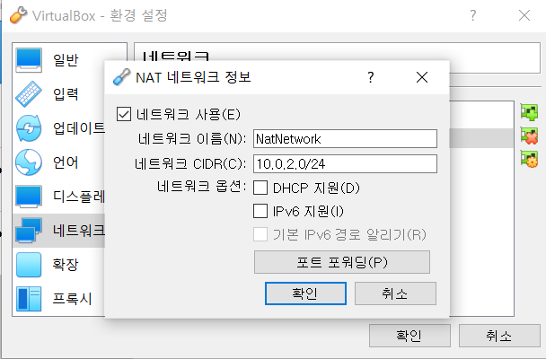

# 오픈스택 설치

> 오픈스택 [공식 문서](https://docs.openstack.org/ko_KR/install-guide/)를 통한 설치 과정입니다

- 오픈스택은 서로 보완하는 다양한 서비스를 통하여 Infrastructure-as-a-Service(IaaS) 솔루션을 제공합니다.
- Application Programing Interface(API)를 이용하여 각 서비스 통합을 쉽게 구성할 수 있습니다.


## 개요

### 예제 구성도

- 예제 아키텍처에서는 기본 VM 또는 인스턴스를 작동할 수 있는 최소 두 노드(호스트)가 필요합니다.
- 추가로 블록 스토리지와 오브젝트 스토리지를 구성하기 위해선 추가 노드를 설치해야 합니다.


#### 하드웨어 요구사항

- Controller Node
  - ID 서비스, 이미지 서비스, 배치 서비스, 컴퓨트 관리, 네트워크 관리, 네트워크 에이전트와 대시보드를 실행합니다.
  - 또한 SQL database, message queue 그리고 NTP를 지원합니다.
  - 컨트롤러 노드는 최소한 두 개의 네트워크 인터페이스 카드를 필요로 합니다.
- Compute Node
  - Compute 노드는 인스턴스를 동작시키는 Compute부분에 해당하는 hypervisor를 실행합니다.
  - 가상 네트워크에 연결하는 네트워킹 서비스 에이전트를 실행하며 security groups를 통한 방화벽 서비스를 제공합니다.
  - 각 노드마다 최소 하나 이상의 네트워크 인터페이스 카드 필요


### 네트워킹

#### Provider Network

- 핵심 layer-2 서비스 및 네트워크에 대한 VLAN 세그멘테이션이 가능한 단순한 방식으로 OpensTack 네트워킹 서비스를 배포합니다.
- 가상 네트워크를 물리 네트워크에 연결하여 L3 라우팅 서비스는 물리 테트워크에 의존합니다.
- Self Service Network, L3 라우팅 서비스, LBaaS, FWaaS와 같은 고급 서비스를 지원하지 않습니다.


#### Self Service Network

- Provider Network를 확장하여 VXLAN과 같은 오버레이 세그멘테이션 방식을 사용하고 L3 라우팅 서비스를 포함합니다.
- 가상 네트워크를 NAT를 사용하여 물리 네트워크로 라우팅합니다.


### 환경 구성

- Controller 노드를 위한 가상 머신 생성
  - OS - CentOS 7
  - RAM - 4GB
  -  Storage - 16GB
  - CPU - 2
- Compute 노드를 위한 가상 머신 생성
  - OS - CentOS 7
  - RAM - 4GB
  - Storage - 16GB
  - CPU - 4

- Virtual Box NAT 설정
  - 환경 설정 - 네트워크 - 오른쪽에 NAT 추가 아이콘 클릭
  - 


## 환경

### 보안

- 다음에서 사용하는 암호에 대한 서비스 목록과 관련된 설명
- 


### 호스트 네트워킹 설정

#### Host-only Networks Setup

- management network(10.0.0.1/24)
- provider network(203.0.113.1/24)
- 

#### 각 노드 네트워크 인터페이스 설정

- NAT Network
  - 

- Provider Network
  - 

- Management Network
  - 

- `/etc/sysconfig/network-scripts/ifcfg-<INTERFACE_NAME>` 파일 편집

  ```bash
  TYPE=Ethernet
  ONBOOT=yes
  BOOTPROTO=none
  ```

- `/etc/hosts` 파일 편집

  ```bash
  # controller
  10.0.0.11	controller
  # compute
  10.0.0.31	compute
  ```

#### 통신 확인

