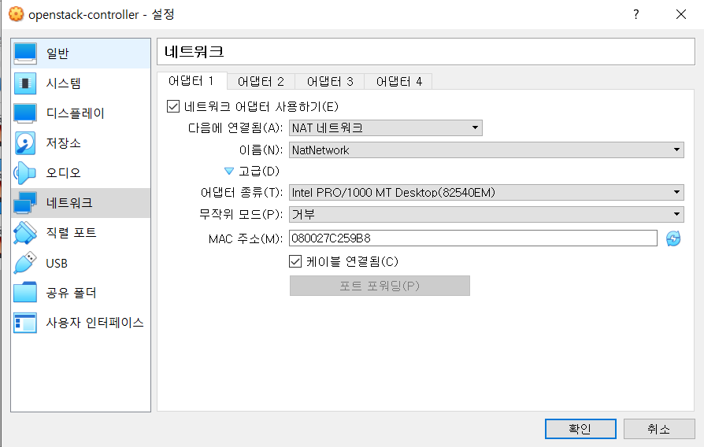

# 오픈스택 설치

> 오픈스택 [공식 문서](https://docs.openstack.org/ko_KR/install-guide/)를 통한 설치 과정입니다

- 오픈스택은 서로 보완하는 다양한 서비스를 통하여 Infrastructure-as-a-Service(IaaS) 솔루션을 제공합니다.
- Application Programing Interface(API)를 이용하여 각 서비스 통합을 쉽게 구성할 수 있습니다.


## 개요

### 예제 구성도

- 예제 아키텍처에서는 기본 VM 또는 인스턴스를 작동할 수 있는 최소 두 노드(호스트)가 필요합니다.
- 추가로 블록 스토리지와 오브젝트 스토리지를 구성하기 위해선 추가 노드를 설치해야 합니다.
- **해당 설치 예제에서는 Controller Node와 Compute Node만 사용합니다**


#### 하드웨어 요구사항

- **Controller Node**
  - ID 서비스, 이미지 서비스, 배치 서비스, 컴퓨트 관리, 네트워크 관리, 네트워크 에이전트와 대시보드를 실행합니다.
  - 또한 SQL database, message queue 그리고 NTP를 지원합니다.
  - 컨트롤러 노드는 최소한 두 개의 네트워크 인터페이스 카드를 필요로 합니다.
- **Compute Node**
  - Compute 노드는 인스턴스를 동작시키는 Compute부분에 해당하는 hypervisor를 실행합니다.
  - 가상 네트워크에 연결하는 네트워킹 서비스 에이전트를 실행하며 security groups를 통한 방화벽 서비스를 제공합니다.
  - 각 노드마다 최소 하나 이상의 네트워크 인터페이스 카드 필요

#### 설치 버전

- CentOS 7.9(Minimal)
  - 다른 패키지나 설정들의 충돌을 피하기 이하여 Minimal에서 진행합니다.
- OpenStack - Train
  - Train 이후에 나온 Ussuri 부터는 CentOS 8에서 진행해야 합니다.

### 네트워킹

#### Provider Network

- 핵심 layer-2 서비스 및 네트워크에 대한 VLAN 세그멘테이션이 가능한 단순한 방식으로 OpensTack 네트워킹 서비스를 배포합니다.
- 가상 네트워크를 물리 네트워크에 연결하여 L3 라우팅 서비스는 물리 테트워크에 의존합니다.
- Self Service Network, L3 라우팅 서비스, LBaaS, FWaaS와 같은 고급 서비스를 지원하지 않습니다.


#### Self Service Network

- Provider Network를 확장하여 VXLAN과 같은 오버레이 세그멘테이션 방식을 사용하고 L3 라우팅 서비스를 포함합니다.
- 가상 네트워크를 NAT를 사용하여 물리 네트워크로 라우팅합니다.


## 설치 환경 구성

### VM 환경

- Controller 노드를 위한 가상 머신 생성
  - OS - CentOS 7(Minimal)
  - RAM - 4GB
  -  Storage - 10GB
  - CPU - 2
- Compute 노드를 위한 가상 머신 생성
  - OS - CentOS 7(Minimal)
  - RAM - 4GB
  - Storage - 20GB
  - CPU - 2

- Virtual Box NAT 설정
  - 환경 설정 - 네트워크 - 오른쪽에 NAT 추가 아이콘 클릭
  - 


### 보안

- 다음에서 사용하는 암호에 대한 서비스 목록과 관련된 설명
- 


### 호스트 네트워킹 설정

#### 사용하는 네트워크

- management network(10.0.0.1/24)
- provider network(ip는 사용자 네트워크 환경에 따라 달라짐)
- 

#### 각 노드 네트워크 인터페이스 설정

- Controller와 Compute 노드 모두 똑같이 설정해야 한다.

- Management Network
  - 

- Provider Network
  - 


#### Controller 노드 IP 설정

- 첫 번째 인터페이스 설정(NAT, Management Network 대역)

  ```shell
  # /etc/sysconfig/network-scripts/ifcfg-enp0s3
  
  TYPE=Ethernet
  PROXY_METHOD=none
  BROWSER_ONLY=no
  BOOTPROTO=none
  DEFROUTE=yes
  IPV4_FAILURE_FATAL=no
  IPV6INIT=yes
  IPV6_AUTOCONF=yes
  IPV6_DEFROUTE=yes
  IPV6_FAILURE_FATAL=no
  IPV6_ADDR_GEN_MODE=stable-privacy
  NAME=enp0s3
  UUID=xxx-xxx-xxx-xxx-xxxx
  DEVICE=enp0s3
  ONBOOT=yes
  IPADDR=10.0.0.11
  PREFIX=24
  GATEWAY=10.0.0.1
  DNS1=8.8.8.8
  ```

  - 10.0.0.11 설정

- 두 번째 인터페이스 설정(Provider Network)

  ```shell
  # /etc/sysconfig/network-scripts/ifcfg-enp0s9
  # 저는 어댑터 3에 브릿지를 설정하여 enp0s9입니다. ip a를 통해 인터페이스 이름 확인하고 설정하시면 됩니다.
  
  TYPE=Ethernet
  PROXY_METHOD=none
  BROWSER_ONLY=no
  BOOTPROTO=none
  DEFROUTE=yes
  IPV4_FAILURE_FATAL=no
  IPV6INIT=yes
  IPV6_AUTOCONF=yes
  IPV6_DEFROUTE=yes
  IPV6_FAILURE_FATAL=no
  IPV6_ADDR_GEN_MODE=stable-privacy
  NAME=enp0s9
  UUID=xxx-xxx-xxx-xxx-xxxx
  DEVICE=enp0s9
  ONBOOT=yes
  ```
  - IP 주소를 할당하지 않음

- 설정을 적용하기 위해 재부팅

  `reboot`

- 노드 호스트 이름 구성

  ```shell
  # /etc/hosts
  # compute가 하나가 아닌 여러 개라면 숫자를 추가하여 구분해주시면 됩니다. ex)compute1
  
  # controller
  10.0.0.11	controller
  # compute
  10.0.0.31	compute
  ```

  - 원래 있는 localhost에 대한 이름은 그대로 두시고 입력하시면 됩니다.

#### Compute 노드 IP 설정

- 첫 번째 인터페이스 설정(NAT, Management Network 대역)

  ```shell
  # /etc/sysconfig/network-scripts/ifcfg-enp0s3
  
  TYPE=Ethernet
  PROXY_METHOD=none
  BROWSER_ONLY=no
  BOOTPROTO=none
  DEFROUTE=yes
  IPV4_FAILURE_FATAL=no
  IPV6INIT=yes
  IPV6_AUTOCONF=yes
  IPV6_DEFROUTE=yes
  IPV6_FAILURE_FATAL=no
  IPV6_ADDR_GEN_MODE=stable-privacy
  NAME=enp0s3
  UUID=xxx-xxx-xxx-xxx-xxxx
  DEVICE=enp0s3
  ONBOOT=yes
  IPADDR=10.0.0.31
  PREFIX=24
  GATEWAY=10.0.0.1
  DNS1=8.8.8.8
  ```

  - Controller 노드와 설정은 거의 비슷하고 IP주소와 이름 등만 달라집니다.

- 두 번째 인터페이스 설정(Provider Network)

  ```shell
  # /etc/sysconfig/network-scripts/ifcfg-enp0s9
  # 저는 어댑터 3에 브릿지를 설정하여 enp0s9입니다. ip a를 통해 인터페이스 이름 확인하고 설정하시면 됩니다.
  
  TYPE=Ethernet
  PROXY_METHOD=none
  BROWSER_ONLY=no
  BOOTPROTO=none
  DEFROUTE=yes
  IPV4_FAILURE_FATAL=no
  IPV6INIT=yes
  IPV6_AUTOCONF=yes
  IPV6_DEFROUTE=yes
  IPV6_FAILURE_FATAL=no
  IPV6_ADDR_GEN_MODE=stable-privacy
  NAME=enp0s9
  UUID=xxx-xxx-xxx-xxx-xxxx
  DEVICE=enp0s9
  ONBOOT=yes
  ```

- 설정을 적용하기 위해 재부팅

  `reboot`

- 노드 호스트 이름 구성

  ```shell
  # /etc/hosts
  # compute가 하나가 아닌 여러 개라면 숫자를 추가하여 구분해주시면 됩니다. ex)compute1
  
  # controller
  10.0.0.11	controller
  # compute
  10.0.0.31	compute
  ```

#### 연결 확인

```sh
root@controller$ ping -c 4 docs.openstack.org	# controller -> internet
root@controller$ ping -c 4 compute				# controller -> compute
root@compute$ ping -c 4 docs.openstack.org		# compute -> internet
root@compute$ ping -c 4 controller				# compute -> controller
```

