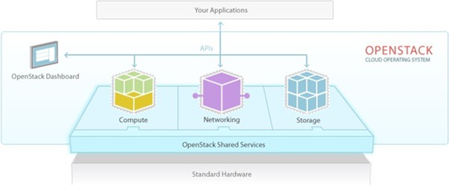
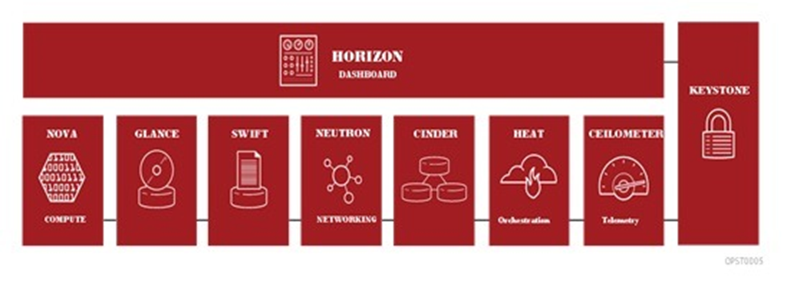

# 오픈스택 개요

> 오픈스택 간단 정리와 Logical Architecture 정리입니다.

## 오픈스택이란?

- 모든 타입의 클라우드 컴퓨팅 플랫폼을 개발하고 관리할 수 있는 오픈 소스 소프트웨어 기반의 클라우드 운영체제
- IaaS(Infrastructure as a Service) 형태의 클라우드 컴퓨팅 오픈 소스 프로젝트
- API를 통하여 IaaS에 필요한 각 서비스들을 쉽게 구성하고 관리 가능
- 

- 클라우드 컴퓨팅 시스템의 컴퓨팅, 네트워킹, 스토리지, 인증 및 이미지 등을 관리할 수 있는 여러 프로젝트 형태로 제공
- IaaS의 필수 기능 외에도 편의를 위해 오케스트레이션, 서비스 관리 등의 프로젝트도 제공
- 

## 오픈스택 프로젝트

### NOVA(Compute)

- 인스턴스 생성, 삭제, 메모리 관리 등 인스턴스의 라이프사이클 관리
- CPU, Memory, Network, Storage를 이용해 가상 머신 서비스를 제공

### NEUTRON(Networking)

- 오픈스택 네트워킹 기능을 제공하는 프로젝트
- 스위치, 서브넷 및 라우터를 포함하여 가상 네트워크 생성 및 관리
- 가상 방화벽, VPN, 로드 밸런서 등의 기능 제공

### CEILOMETER(Monitoring)

- 오픈스택 내 모든 서비스들의 자원 정보를 측정하고 관리하여 제공
- 서비스로부터 전송되는 알림을 모니터링하여 이벤트 및 데이터를 수집

### SWIFT(Object Storage)

- 오픈스택에서 사용되는 데이터 객체들을 저장하는 서비스
- 클러스터 내의 여러 개의 디스크 드라이브에 데이터가 분산되어 저장
- 동영상, 이미지, 디스크 이미지 등의 대용량, 비정형 데이터용 스토리지 

### CINDER(Block Storage)

- 인스턴스의 물리적인 데이터 공간을 제공하는 서비스
- 스냅샷 관리 기능을 제공하여 블록 스토리지 백업 및 복구 가능

### MANILA

- 공유 파일 시스템

- NFS, CIFS, HDFS, CEPHFS 등 지원

### KEYSTONE(Identity)

- 사용자에 대한 서비스들의 사용 인증 및 인가 서비스를 제공
- 사용자와 시스템의 접근 정책을 중앙에서 관리하며 모든 서비스들에 대해 제공

### GLANCE(Image)

- Nova 프로젝트에서 생성한 인스턴스에 설치할 OS 이미지들을 저장하는 서비스
- 생성할 인스턴스에 설치할 운영체제 이미지를 Glance에 드옥시키고 이미지를 이용하여 인스턴스 생성

### HEAT(Orchestration)

- 인프라 배포를 자동화할 수 있게 해주는 템플릿 기반의 오케스트레이션 서비스
- Heat Orchestration Template(HOT)을 이용해 자동화하여 오픈스택 프로젝트들의 API 호출을 수행함으로써 인프라를 쉽게 배포

### HORIZON(dashboard)

- 클라우드 관리자와 사용자들이 다양한 오픈스택 자원과 서비스를 관리하고 이용할 수 있도록 해주는 웹 인터페이스
- 웹 UI를 통해 인스턴스 생성, 삭제 및 관리 등을 쉽고 빠르게 처리

