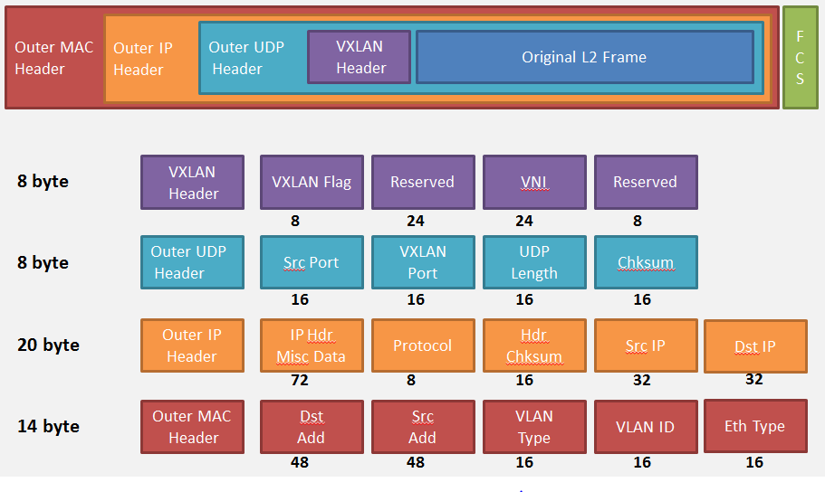
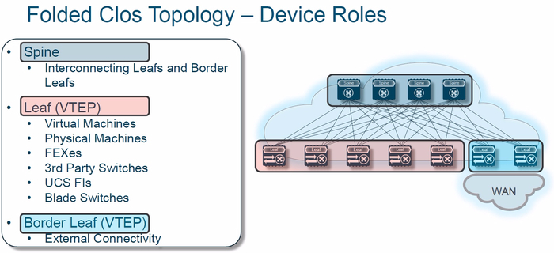
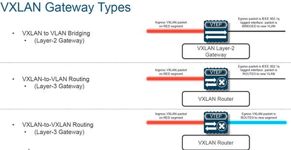
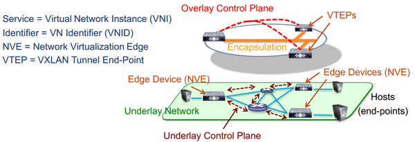
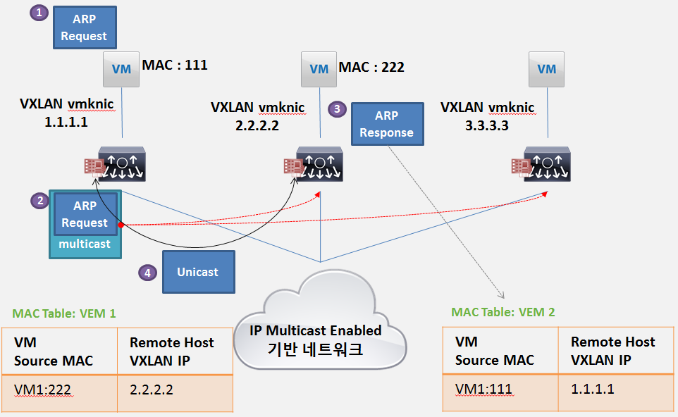

# VxLAN

VxLAN은 최근 클라우드의 발전과 가상화 기반 인프라의 발달로 인해 생겨나는 문제들을 해결하고 대응할 수 있어 주목받는 기술이다.

## VxLAN 이란?

### 기본 개념

- VxLAN은 VLAN을 확장한 개념으로 기존의 VLAN에서 만들 수 있는 네트워크보다 훨씬 더 많은 네트워크를 생성할 수 있다.
- VxLAN에서 `x`는 **eXtensible**으로 이름에서도 확장을 나타내고 있다.
- VLAN은 이더넷 프레임에 16bit(vlan, option, id)를 추가로 구성하여 Tag를 기반으로 동작하는데 이때 id로 사용할 수 있는 비트가 12bit이기 때문에 만들 수 있는 네트워크가 최대 4096개만 생성할 수 있었다.
- VxLAN은 VLAN의 문제를 해결하기 위해 50byte 헤더(Mac over IP, UDP Header, 24bit VLAN ID)를 추가로 구성하여 16,000,000개 이상의 VLAN을 제공할 수 있다.

### L2 Network와의 차이점

- 기본적인 L2 Network에서는 ARP 테이블을 수집하기 위해 Broadcast를 이용하며 MAC address는 스위치에서 수집하여 관리한다.
- 하지만 VxLAN은 VM들이 직접 ARP 테이블을 보유하고 vSwitch에서 테이블을 관리한다.
- VxLAN에서 BUM 트래픽에 대해서 IP Multicast를 기반으로 전송한다.
  - Multicast로 ARP 테이블을 갱신해하고 직접 해당 스위치쪽에 P2P Tunnel로 통신하는 방식이다.

## VxLAN을 사용하는 이유

### MAC Address Table의 한계

- 가상화 환경 이전에는 서버당 2개 정도의 MAC 주소를 가지고 운영하였다.
- 하지만 가상화 환경이 생기면서 VM이 생겨나 서버에 생성되는 VM에게 할당할 MAC이 필요하다
  - 이전처럼 VM마다 2개의 MAC을 할당하게 된다면 100개의 VM이 생성되면 총 200개의 MAC 주소가 생성된다.
- 하나의 서버에서 생성되는 VM이 100개만 해도 200개 정도의 MAC이 생성되는데 클라우드에서 서버가 늘어나고 VM이 늘어나면 MAC 주소는 기하급수적으로 늘어나게 된다.
- 이 많은 MAC 주소를 스위치의 MAC 테이블에 담게되면 스위치의 처리 속도와 메모리에 엄청난 무리가 갈 것이다.
- 이를 해결하기 위해 VxLAN은 스위치에서 MAC 주소를 담당하지 않고 가상 스위치에서 MAC 주소를 담당하게 하여 해결한다.

### 유연한 구성

- VLAN에서는 서로간의 통신을 위해 VLAN Trunk를 구성하는데 이는 정적이고 변경에 빠르게 대처하기가 힘들다
- VxLAN에서는 이러한 VLAN Trunk 없이 Multicast를 이용하여 Tree를 구성해 통신을 진행하기 때문에 동적이고 유연한 구성이 가능하다.

## VxLAN 용어 설명

#### VTEP(VxLAN Tunnel End Point)

- VxLAN Tunnel의 종단에 역할을 수행한다.
- VxLAN Tunnel간의 De-Encapsulation 역할을 수행한다.
- 하단의 End point에서는 VxLAN 동작 여부를 알지 못한다.

#### VNI(Virtual Network Identifier)

- VLAN과 VxLAN segment 간 mapping 구분자
- 같은 VLAN에 대해 여러 개의 VNI mapping이 가능하다.(tenant 관리)

#### NVE(Network Virtualization Interface)

- VxLAN De-Encapsulation이 발생하는 Logical Interface

#### VxLAN Segment

- VM간 통신을 위한 VxLAN Layer2 overlay  network

#### VxLAN Gateway

- VxLAN 과 non-VxLAN과의 통신을 위한 게이트웨이(=VTEP)

## VxLAN 네트워크 구조

- VxLAN에서 vSwitch는 매우 중요하다. vSwitch는 실제 MAC in IP/UDP를 관리하고 수집하는 역할을 하기 때문이다.
- VxLAN에서 가장 특이한 포인트는 바로 VTEP
  - VTEP는 앞서 설명한 것과 같이 VxLAN Tunnel의 종단 역할을 수행한다.
- 기존의 네트워크에 대한 기술적 제약을 뛰어넘기 위해 **Multicast 망을 차용해서 사용**한다.
  - Multicast 기반으로 VTEP 사이에 Direct Unicast Tunnel들이 생성되고 이를 통해 Unicast Frame이 전송된다.
  - VTEP들 간에는 IP Any source Multicast Group의 버스를 통해 새로운 망을 생성한다
  - Unknown/Broadcast/Multicast Frame은 VxLAN 헤더를 포함하여 VTEP들이 Multicast Bus를 통해 전송한다.

### VxLAN 패킷 구조

- VXLAN Header에 있는 VNI가 24bit를 가지기 때문에 16,000,000개의 VLAN을 생성할 수 있다.

## VxLAN Fabric은 Multicast 기반 Flood & Learn 방식으로 동작

- 

- 대표적인 데이터센터 네트워크
- Leaf 장비는 VTEP, Spine 장비는 Dummy L3SW 역할 수행

### VxLAN Gateway Types

- 
- Leaf간(VTEP)의 통신 상에서 A-VTEP 장비, B-VTEP 장비가 서로 통신
- L2 : A에서 같은 VNI를 통해 전달되어 B로 도착한 뒤, **같은 L2 Domain**임을 인지하고 B의 VLAN 내부로 전달
- L3 VxLAN-to-VLAN Routing : A에서 VxLAN Gateway까지 도달한 뒤 그 이후 B까지는 VxLAN이 아닌 **다른 라우팅 정보**를 통해 B로 라우팅
- L3 VxLAN-to-VxLAN Rounting : A에서 B로 VxLAN 간의 통신이 가능한 것을 확인한 뒤 다른 VNI간의 A에서 B로 **VxLAN 라우팅**을 통해 전달
- 
- VxLAN의 구분자는 VNI이다.
- VTEP간에 Control Plane 통신을 위해 경로를 찾고 Underlay Network는 Data Plane의 역할을 수행한다.
- **VxLAN의 Control-Plane은 Multicast가 반드시 필요**

### VxLAN 동작 방식

1. MAC 111인 VM이 MAC 222와 통신하려 하지만 ARP 테이블에 정보가 없어서 ARP Request를 전송(ARP Broadcast)
2. ARP Request는 vSwitch의 MAC 테이블에도 정보가 없어 VTEP Multicast Bust를 통해 ARP Request를 전송한다.
3. ARP Request를 받은 VM들은 IP 1.1, MAC 111을 MAC 테이블에 등록한다.
4. 그리고 VM은 Unicast를 통해 Request를 전송한 VM에게 응답한다.
5. 응답 받은 vSwitch는 IP 2.2, MAC 222를 등록한다.
6. 이후로 통신은 Unicast를 통해 이루어진다.
