# 포항공대 MOOC SDN/NFV 정리

> 포항공대 MOOC 과정에서 진행한 [SDN & NFV](https://kt.smartlearn.io/courses/course-v1:POSTECH+DSC506+K902/about) 교육 정리

## 목차

- [1. Challenges by Telcos](#1-challenges-by-telcos)
- [2. Open Networking Ecosystem 1](#2-open-networking-ecosystem-1)
- [3. Open Networking Ecosystem 2](#3-open-networking-ecosystem-2)
- [4. SDN/NFV Use Cases](#4-sdnnfv-use-cases)
- [5. SDN/NFV Forums, Conferences/Journals and Summary](#5-sdnnfv-forums-conferencesjournals-and-summary)
- [6. Introduction to SDN](#6-introduction-to-sdn)
- [7. Introduction to OpenFlow](#7-introduction-to-openflow)
- [8. Flow Table, Group Table and Meter Table](#8-flow-table-group-table-and-meter-table)
- [9. Operations in OpenFlow](#9-operations-in-openflow)
- [10. SDN Applications](#10-sdn-applications)
- [11. SDN Controllers 1](#11-sdn-controller-1)
- [12. SDN Controllers 2](#12-sdn-controllers-2)
- [13. Introduction to Open Network Operating System(ONOS)](#13-introduction-to-open-network-operating-systemonos)
- [14. SDN Distributed Core](#14-sdn-distributed-core)
- [15. ONOS Northbound](#15-onos-northbound)
- [16. ONOS Southbound & Application](#16-onos-southbound-&-application)
- [17. ONOS Code Walkthrough](#17-onos-code-walkthrough)
- [18. NFV-MANO #1](#18-nfv-mano-1)
- [19. NFV-MANO #2](#19-nfv-mano-2)
- [20. NFV-MANO #3](#20-nfv-mano-3)
- [21. Fast Packet Processing Methods](#21-fast-packetprocessing-methods)
- [22. Datapath Composition](#22-datapath-composition)
- [23. OpenStack Introduction](#23-openstack-introduction)
- [24. OpenStack Networking](#24-openstack-networking)
- [25. OpenStack Installation](#25-openstack-installation)
- [26. OpenStack Installation 2](#26-openstack-installation-2)
- [27. OpenStack Setup using Horizon - 1](27-openstack-setup-using-horizon-1)
- [28. OpenStack Setup using Horizon - 2](#28-openstack-setup-using-horizon-2)
- [29. OpenStack Setup using Horizon - 3](29-openstack-setup-using-horizon-3)
- [30. OpenStack Additional Setup - 1](#30-openstack-additional-setup-1)
- [31. OpenStack Additional Setup - 2](#31-openstack-additional-setup-2)
- [32. OpenStack CLI](#32-openstack-cli)
- [33. OVS-DPDK Installation on OpenStack - 1](#33-ovsdpdk-installation-on-openstack-1)
- 


---

# 1. Challenges by Telcos

- Telco들이 가지고 있는 네트워크 구조

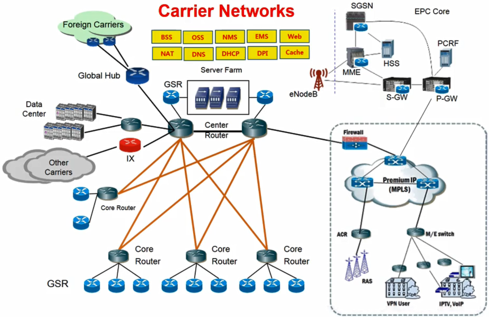

- 운영에 너무 많은 비용이 든다.
- SDN/NFV를 이용하여 비용을 줄이고 flexible한 환경 제공
- 위의 노란 박스는 NFV를 이용해 개선하고자 하는 미들웨어 박스
  - Network Function

### 트래픽의 폭발적인 증가

- 환경의 변화로 인하여 트래픽이 폭발적으로 증가하고 있음
- 이를 수용하기 위해 Telco 기업들은 많은 비용이 필요
  - 시설 확장
  - 인원 보충

### 비즈니스 패러다임 변화

- 컨텐츠를 피처폰에서는 통신 사업자가 지정한 기업이 개발하여 통신 사업자들이 검토하고 개발한 컨텐츠를 제공하여 수입을 개발자와 통신사업자가 공유
  - Closed Market
- 스마트폰이 나오면서 모든 사람, 기업이 개발을 하여 마켓에 올리고 수익은 개발자와 앱 스토어의 구글, 애플 등이 공유
  - Open Market

### TTM(Time To Market)

- 새로운 기능 추가나 변화에 너무 시간이 오래 걸림
- 페북, 구글, 아마존, 네이버 등은 Flexible하고 오픈 시스템을 이용하여 새로운 기능을 빠르게 추가하고 적용 가능
  - Shorter TTM
- 통신 사업자들은 Closed System이라 기능을 추가하려면 장비 벤더에게 요청하고 그것이 승인나고 추가하기 까지 시간이 오래걸림
  - Longer TTM

### 인터넷 플레이어의 확장

- 애플, 아마존, 구글 등의 서비스, 사업 아이템 확장
  - 클라우드 서비스, 유튜브, 앱스토어 등등
- 전세계 Telco 기업들에게 많은 영향을 끼침
- 또한 모바일 인스턴트 메시징 앱의 등장도 Telco들에게 영향
  - WhatsApp, KakaoTalk, WeChat, Line 등
  - SMS 사업에 많은 영향을 끼쳐 Telco 기업의 SMS 사업이 90%가 없어짐

### 결론

- Telco 기업이 운영하고 관리하는 인프라스트럭쳐는 지속적으로 비용이 많이 들어감

- 시설 투자에 비해 revenue와 profit이 지속적으로 감소

- 좀 더 flexible, agile, efficient한 운영 환경을 갖추어야 한다

- 많은 Telco 기업들이 SDN/NFV를 이용한 운영 환경을 갖추려 노력 중에 있음

  => **SDN/NFV = 'Open Networking'** promising solution


---

# 2. Open Networking Ecosystem 1

## Motivation for SDN/NFV

- 컴퓨팅분야

  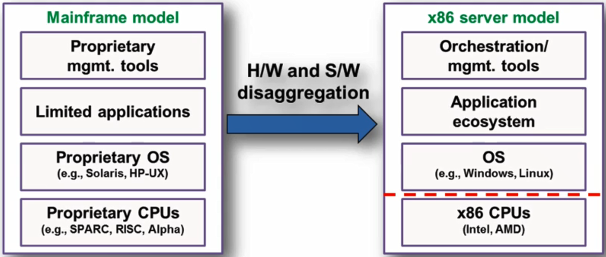

  - 메인프레임 모델을 20념 넘게 쓰다가 인텔과 AMD가 x86계열의 CPU를 제공하면서 다양한 시스템이 올라감
    - OS, 애플리케이션 등
  - 10년 전부터 클라우드 컴퓨팅이 제공되며 많은 비용을 지불하지 않고 환경 구축

- 네트워크분야

  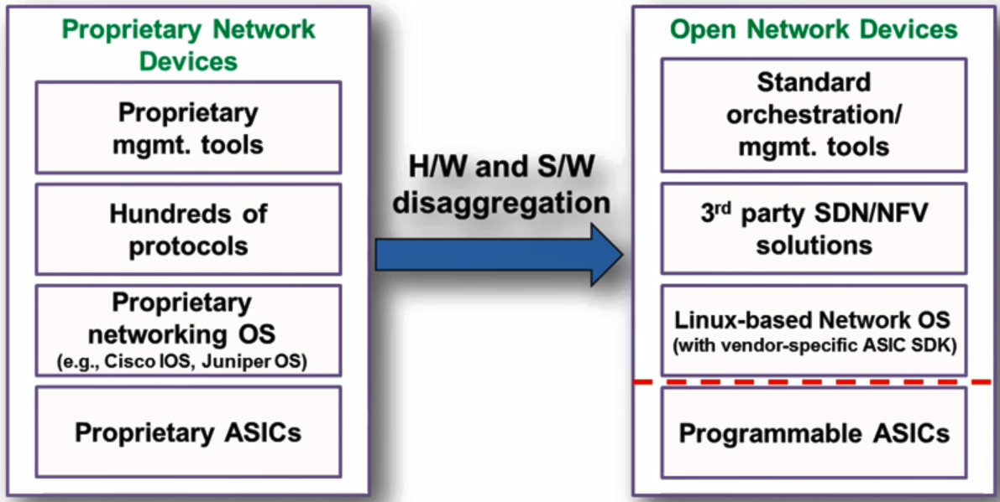

  - 최근까지 현재 대부분의 장비들이 proprietary한 변경이 쉽지 않은 시스템으로 운영

  => 하드웨어와 소프트웨어를 구분하여 제공. **SDN/NFV**

  - 오픈 네트워킁 환경으로 가는 것이 SDN/NFV의 핵심

## SDN / NFV

- Legacy Network

  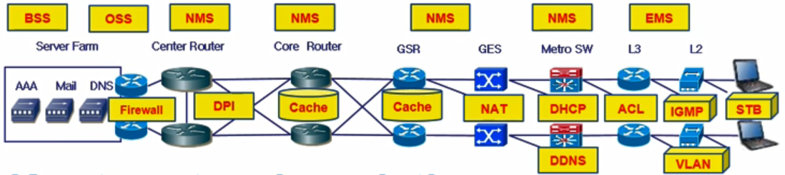

  - 노란 박스는 소프트웨어 기반
  - 하지만 라우터와 스위치 뿐만 아니라 네트워크 function들을 수행하는 시스템들이 하드웨어 기반으로 생성
  - 많은 비용이 들어감

- SDN/NFV

  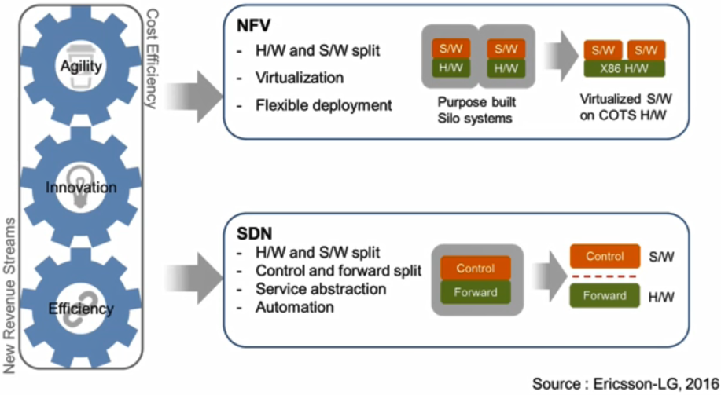

  - SDN의 핵심은 하드웨어와 소프트웨어를 분리
  - controller와 forward를 분리
    - 스위치는 패킷을 보내기만 함
    - 나머지 패킷 라우팅이나 네트워크의 전체 관리는 controller
  - NFV도 하드웨어와 소프트웨어를 분리
    - 가상화를 이용해 노란 박스에 있는 기능들을 따로 하드웨어를 구성하지 않고 하나의 하드웨어에 여러 개의 function들을 넣어서 동작
    - 하드웨어를 가상화하여 여러 개의 머신들이 있는 것 같이 Network Function을 올리는게 핵심

## SDN

- SDN
  - 컨트롤 플레인과 데이터 플레인 분리
  - 중앙에서(SDN Controller) 관리하고 authority를 제공
- OpenFlow(OF)
  - 가장 많이 사용하는 프로토콜
  - 컨트롤러와 장비를 연결해주는 커뮤니케이션 프로토콜
- SDN의 효과
  - Programmability
  - Agility
  - Flexibility
  - CAPEX/OPEX saving
  - Vendor neutrality

## NFV

- 하나의 불리서버에 VM, 컨테이너 등의 가상화 기술을 이용해 서버를 가상화를 시켜서 여러 개의 서버가 있는 것처럼 독립적인 운영 환경을 제공

- 컴퓨트, 스토리지, 네트워크 중 네트워크가 가장 늦음

- 네트워크에 구축되어 운영되는 비용이 많이 드는 네트워크 function들을 가상화시킴

  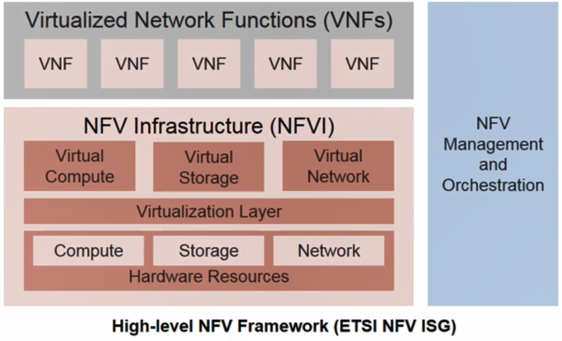

- 오른쪽의 NFV Management and Orchestration은 네트워크 가상화 인프라스트럭쳐 운영 관리하고 VNF를 관리

## SDN/NFV 사용이유

- Deliver Agility and Flexibility : 50%
- Reduce Operational Expenditures : 23%
- Accelerate Time to Market : 14%
- Reduce Capital Expenditures : 13%

## Open Networking Ecosystem

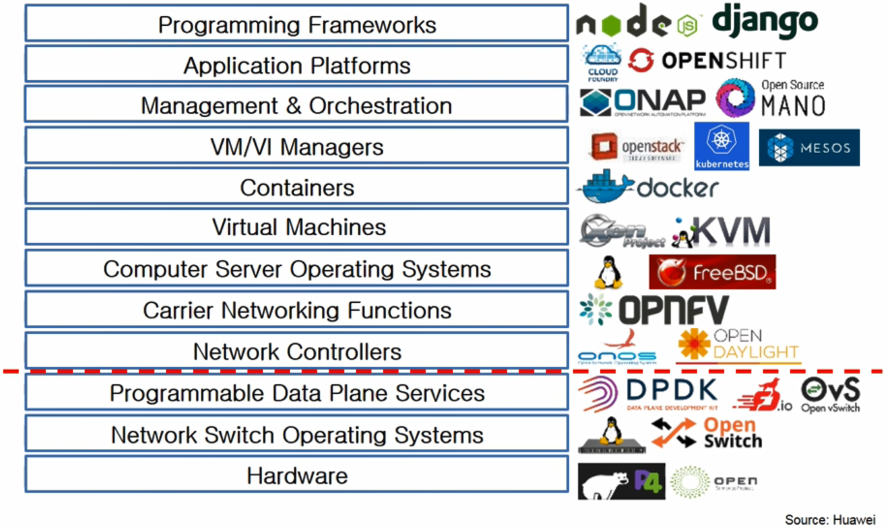

### Hardware

- **P4(Programming Protocol-independent Packet Processors)**
  - 프로세서들도 하이 레벨 프로그래밍을 통해 개발하여 운영이 되게 하는 오픈 소스 프로젝트
- **OCP(Open Compute Project)**
  - 서버를 운영하는데 비용이 많이 들어 자기들에 맞는 필요없는 부분은 빼고 필요한 것만 넣게 디자인하여 하드웨어를 개발
  - 서버로 시작하여 네트워크의 베어메탈 스위치에서도 쓰임


---

# 3. Open Networking Ecosystem 2

## Network Switch Operating Systems

- **Open Switch**

  - 라우팅과 오픈플로우 에이전트 포함

  

- **ONL(Open Network Linux)**

  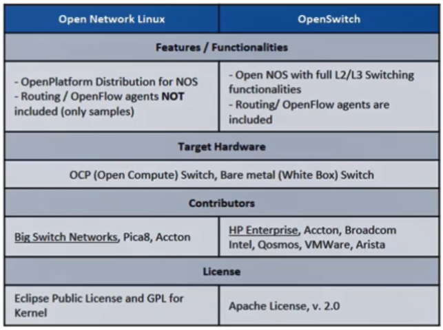

  

## Programmable Data Plane Services

- **DPDK(Data Plane Development Kit)**

  - fast packet processing 라이브러리 제공

- **FD.io**

  - cloud, VMs, containers, bare metal에서 사용할 수 있음

- **Open vSwitch**

  - 버추얼 머신들끼리 연결하기 위한 가상 스위치
  - 리눅스 베이스 가상화 플랫폼에서 실행
    - KVM, Virtual Box, Xen

  

## Network Controllers

- **ONOS**

  - Telco들을 위해 개발
  - Distributed Network OS
  - **scalability, high availability, high performance** and abstractions 제공

  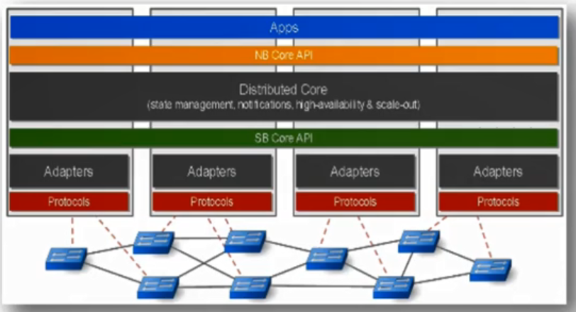

- **ODL**

  - 글로벌 벤더들이 주도한 오픈 소스 프로젝트
  - Southbound interface를 많이 제공

  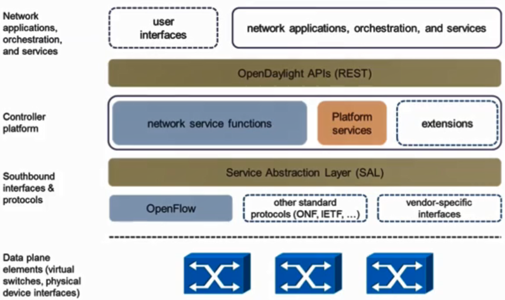

## Carrier Networking Functions

- **OPNFV**

  - NFV를 쉽게 하기 위한 인프라스트럭쳐를 설치하거나 function들을 개발하고 구축하는 것을 좀 더 쉽게하기 위한 오픈 소스 프로젝트
  - carrier-grade, integrated, 오픈 소스 플랫폼

  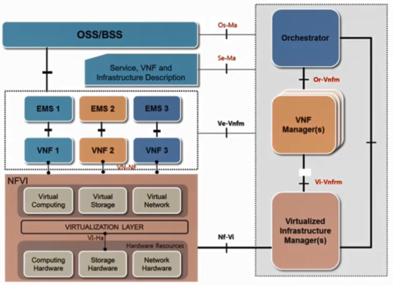

## Virtual Machines

- **Xen Project**

  - 컴퓨트 서버들을 가상화하는 핵심 오픈 소스 프로젝트
  - Supports multiple guest operating systems
    - Linux, Windows, NetBSD, FreeBSD
  - Supports multiple Cloud platforms
    - OpenStack, CLoudStack

  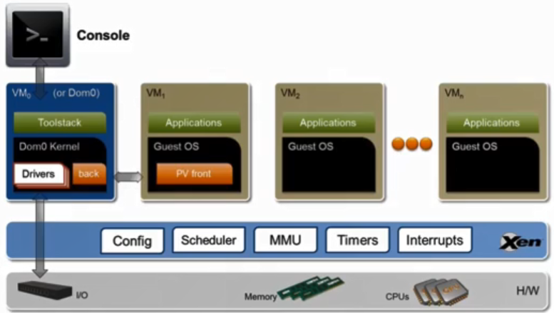

- **KVM(Kernel-based Virtual Machine)**

  - 리눅스 커널 2.6.20부터 제공
    - 커널을 설치하면 KVM이 포함

  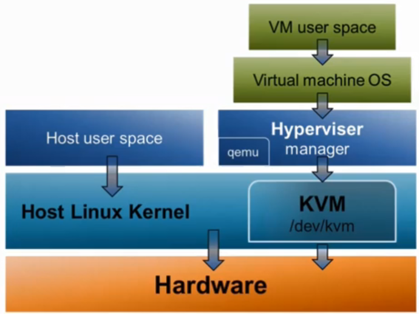

## Operating System

- **Linux, FreeBSD**
  - 무료로 제공

## Containers

- **Docker**

  

  

- **VMs vs. Containers**

  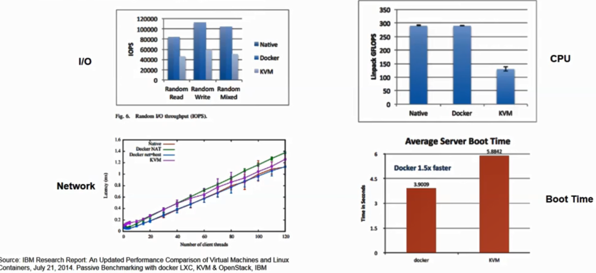

## VM/VI Managers

- **Kubernetes**

  - 컨테이너 관리하는데 사용하는 오픈 소스 프로젝트

- **Apache Mesos**

  - 가상 인프라스트럭쳐 관리
  - distributed systems kernel 오픈 소스 프로젝트
  - 컴퓨트 리소스들을 유용하게 관리하고 운영하는 툴

  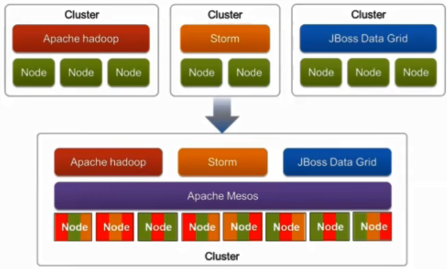

- **OpenStack**

  - 클라우드 컴퓨팅을 위한 소프트웨어 플랫폼 오픈 소스 프로젝트
  - compute, storage, networking 리소스들을 구축하고 운영하고 관리하는데 사용

  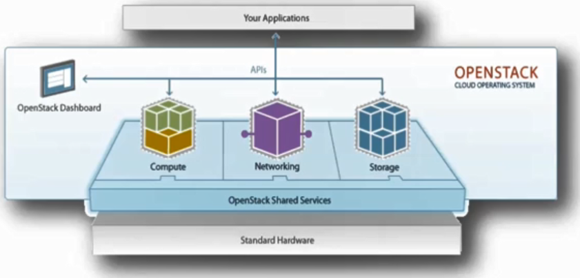

## Management & Orchestration

- **Open Source MANO (OSM)**

  - SDN/NFV를 구축하는데 사용
  - VIM은 오픈스택으로 구축하고 그 위는 MANO를 통해 관리

  

- **Open Network Automation Platform(ONAP)**

  - ECOMP와 Open-O를 합침

  

## Application Platforms

- **Cloud Foundry**

  - 클라우드 기반의 애플리케이션들을 쉽게 빌드하고 테스트하고 디플로이하는데 필요한 오픈 소스 프로젝트

  

- **OpenShift**

  - 클라우드 PaaS 오픈 소스 프로젝트

  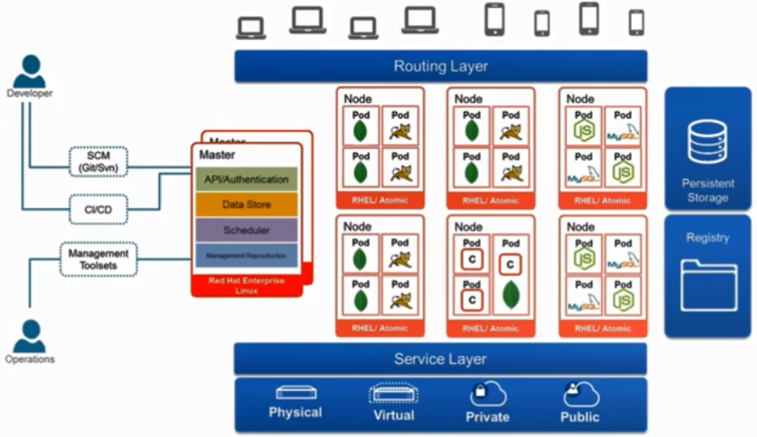

## Programming Frameworks

- Node.js, Django
  - 클라우드, 가상화 환경에서 쉽고 빠르게 개발할 수 있는 프레임워크를 제공하는 오픈 소스 프로젝트

## Open Source vs. Commercial Solutions


## A simple scenario for Open Networking Ecosystem

- Phase 1 - Infrastructure building & NFV Development

  

- Phase 2 - Network & Service Configuration

  


---

# 4. SDN/NFV Use Cases

## ONOS CORD(Central Office Re-architected as a Datacenter)

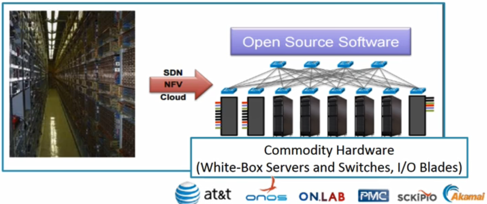

- R-CORD(Residential CORD)

  - 가정집에 제공하는 서비스들에 필요한 인프라

  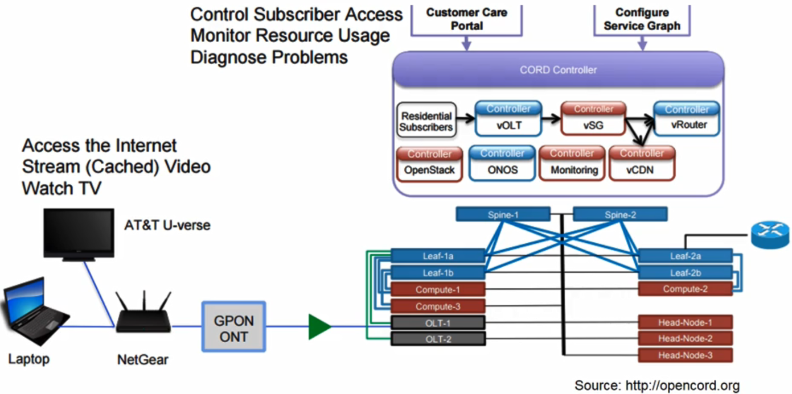

- E-CORD(Enterprise CORD)

  - 기업, 공장에 필요한 서비스

  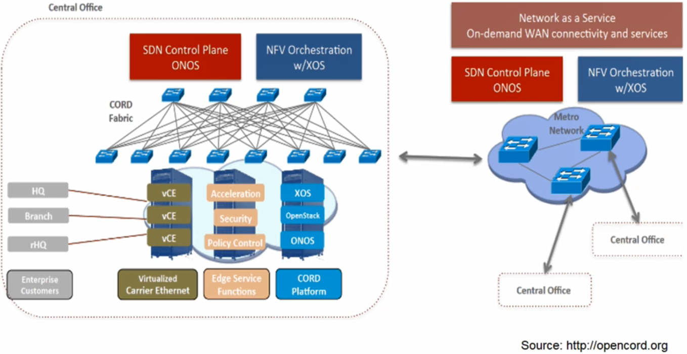

- M-CORD

  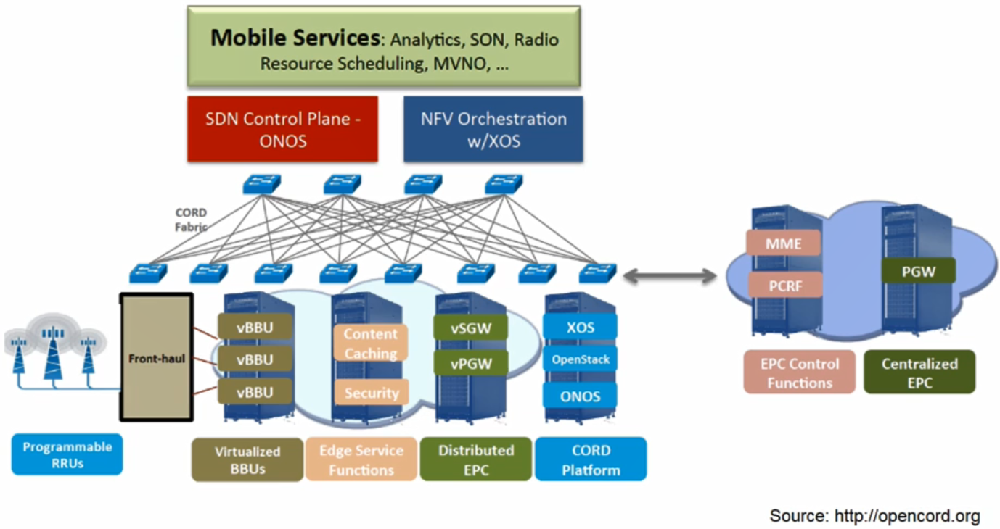

- A-CORD

  - 다양한 정보들을 분삭하는 CORD 환경 분석

  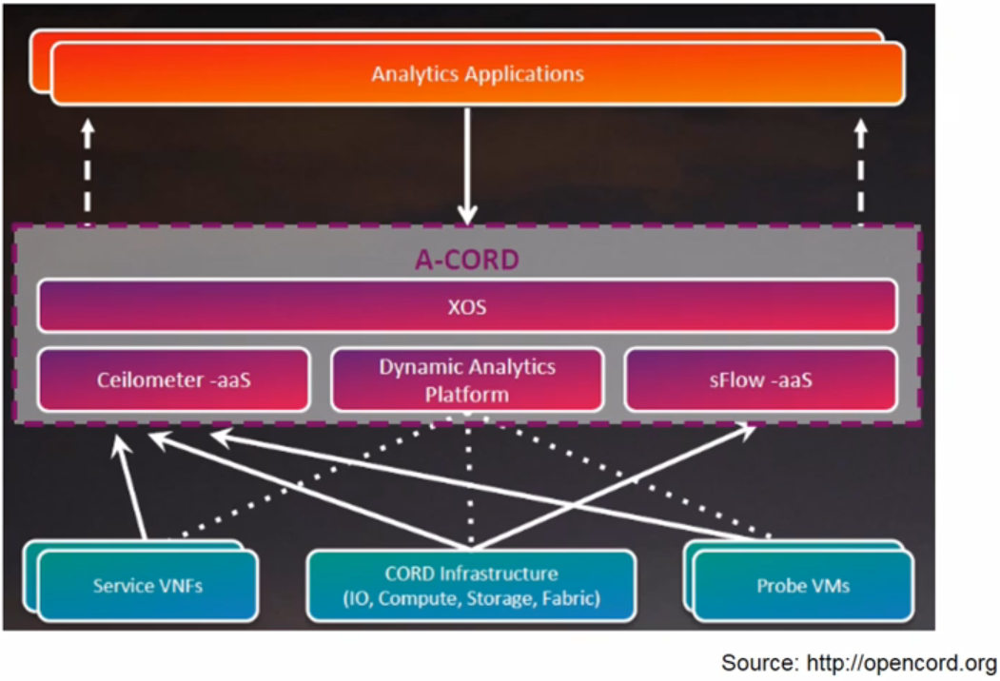

## 실제 사례

- Transport SDN - KT

  - [Challenge 1] Complex transport network environment having multi-vendor/domain/layer devices
  - [Solution 1] Centralize device control and PCE over multi-vendor devices
  - [Challenge 2] OPEX increase by segmented operations
  - [Solution 2] Simplify and automate provisioning processes

  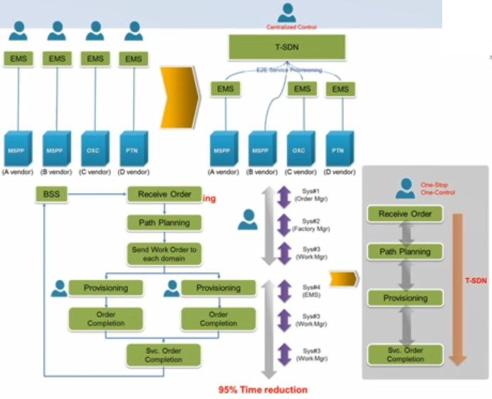

- KT's T-SDN Platform

  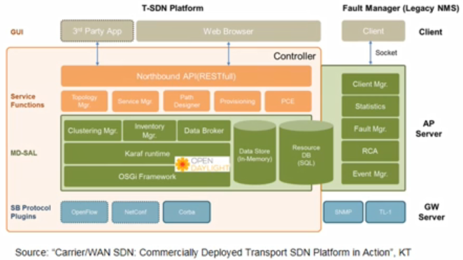


---

# 5. SDN/NFV Forums, Conferences/Journals and Summary

## ONF(Open Networking Foundation)

- SDN을 promoting하기 위해 설립
- 대표적인 통신 사업자들과 벤더들 참여
- OpenFlow 표준화
- Offers product and skills certifications
  - OpenFlow Conformance Testing Program
  - ONF-Certified SDN Professional Program (OCSP)
- ON.Lab과 합병을 통해 표준화와 오픈 소스 개발을 같이 제공

## SDN/NFV Forum

- 국내 SDN/NFV 포럼
- www.sdnnfv.org
- ICT 기반의 창의적 사회 실현
- 차세대 네트워크의 핵심, SDN/NFV 활성화 기반 마련
- ONK(Open Networking Korea)
  - 컨퍼런스 매년 2회 개최

## NetSoft

- 국제 컨퍼런스
- IEEE conference focusing on "**Network Softwarization**"
- sites.ieee.org/netsoft

## ONOS Build

- onosbuild.org
- ONOS 개발자들을 위한 컨퍼런스

## IJNM

- International Journal of Network Management
- 네트워크 매니지먼트 저널
- 최근 논문 무료 확인 가능
  - onlinelibrary.wiley.com/journal/10.1002/(ISSN)1099-1190/homepage/VirtualIssuesPage.html


---

# 6. Introduction to SDN

## Background

- 클라우드 서비스가 각광을 받게 되면서 많은 데이터 센터 네트워크가 구축되었고 이런 데이터 센터에 맞는 새로운 네트워크 패러다임이 필요
- 데이터센터의 트래픽 패턴이 변화
  - North-south 95% -> East-west:40~80%
  - North-south는 데이터센터와 외부의 통신
  - East-west는 데이터센터 내부의 서버끼리 통신
- 데이터센터 네트워크
  - 데이터 센터 네트워크는 다량의 스위치와 서버로 구성된 **Hyper scale network**
  - 각 스위치는 테라바이트의 트래픽을 처리
  - 3~4  tier architecture로 구성
    - 50%가 넘는 네트워크 리소스는 스위치를 연결하는데 사용되어 비효율적
- 새로운 네트워크 패러다임이 필요한 이유
  - 벤더의 종속성
    - 기존의 벤더의 장비들은 오픈 인터페이스와 표준 API가 부재
    - 통신사가 장비를 수정할 수 없음
    - 새로운 서비스를 제공하려 프로토콜을 개발해도 적용되기 너무 오래걸림
  - Fundamental problems of IP protocols
    - 많은 RFC 프로토콜들을 장비에 넣어 개발
    - 다양한 부가기능에 대한 설계 미흡
      - Lack of IPv4 addresses
      - Security
      - Management
      - Mobile service
    - 현재 인터넷 망은 정적

## SDN Background

- 문제들을 해결하기 2012년에 구글이 자신들의 네트워크를 OpenFlow기반으로 교체하여 해결
- 오픈플로우는 SDN에서 사용되는 프로토콜 중 하나

## Traditional Network

- 분산 프로토콜 사용하여 네트워크를 운용
  - 관리하기 어려운 단점
  - 네트워크 장비에서 문제가 발생하면 어디서 발생한지 찾기 어려움

## SDN Concept

- Control and Data Plane Functions 분리

  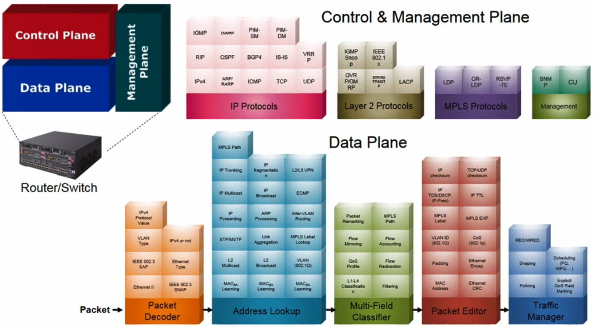

- SDN Switch(HW) and SDN Controller(SW)

- SDN 특징

  - control plane과 data plane의 분리
    - 네트워크 인텔리전스와 상태가 물리적으로 분리되어 있지만 논리적으로는 중앙 집중화 되어있음
    - 하위 네트워크 인프라가 어플리케이션으로 추상화되어 어플리케이션 개발자는 네트워크 장비에 대한 자세한 내용을 알 필요없이 어플리케이션 개발에만 집중
  - general purpose hardware 상에 제어 평면을 실행
    - 제어 평면에서 실행했던 기능을 특수한 네트워크 장비로부터 de-couple하여 상용 컴퓨터에서 제어 평면 기능을 실행
  - 데이터 평면에 대한 programmable을 제공
    - 중앙 엔티티에서 데이터 평면 상태를 유지, 제어, 프로그래밍 가능
    - 단일 네트워크 장비에 대한 제어 뿐만 아니라 전체 네트워크에 대한 제어를 가능

## SDN with Key Abstraction in the Control Plane

- SDN의 핵심은 제어 평면에서 데이터 평면을 제어하기 위해서 사용하는 SDN 프로토콜

  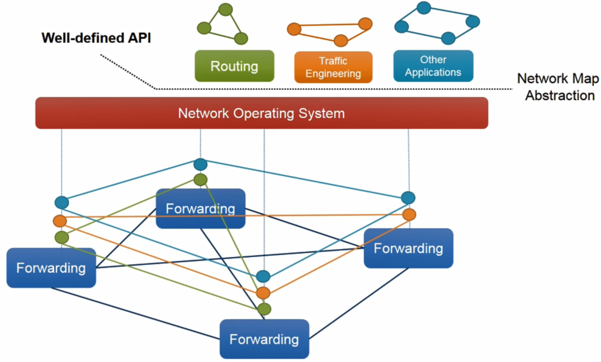

- 네트워크 운영체제와 데이터 평면 사이에 위치한 인터페이스

  - South-bound Api

- 네트워크 운영체제와 어플리케이션 사이에 위치한 인터페이스

  - North-bound Api


---

# 7. Introduction to OpenFlow

## SDN vs. OpenFlow

- ONF 정의
  - Software Defined Forwarding을 하는 네트워크 기술을 SDN이라 정의
    - open API를 통해 데이터 포워딩 제어
  - SDN은 관리 추상화 기능 제공
    - SDN의 추상화 기능을 통해 고급 어플리케이션 작성 가능
- SDN에서 OpenFlow 프로토콜을 가장 많이 사용
  - OpenFlow는 SDN 기술이지만 모든 SDN 기술이 OpenFlow를 사용하지는 않음
  - SDN에서 사용되는 수 많은 프로토콜 중 하나

## OpenFlow

- 네트워크 스위치 혹은 라우터의 데이터 평면에 접근해 제어하기 위한 통신 프로토콜
- 특징
  - 컴퓨팅관점에서 봤을 때 네트워크 제어를 위한 x86 instruction set과 흡사
  - control plane과 data plane을 분리
    - 오픈플로우 스위치의 데이터 평면은 여러개의 플로우 테이블을 포함하고 있으며 플로우 테이블은 또 여러 개의 플로우 엔트리로 구성
    - 오픈플로우 제어 평면에는 컨트롤러가 위치하며 컨트롤러를 통하여 운영자는 필요한 플로우 엔트리들을 스위치 플로우 테이블에 설치 가능
  - 오픈플로우는 내부 플로우 테이블을 보유하고 있으며, 표준화된 인터페이스로 플로우 엔트리 삭제,추가 및 변경
- Components
  - 오픈플로우 컨트롤러
    - Process packet match, instruction & action set, pipeline processing
  - 오픈플로우 스위치
    - secure channel, flow table

## 최초 오픈 플로우 스위치

- 일반 이더넷 스위치에 컨트롤러와 통신할 수 있는 에이전트를 포함한 펌웨어를 설치하여 실현

  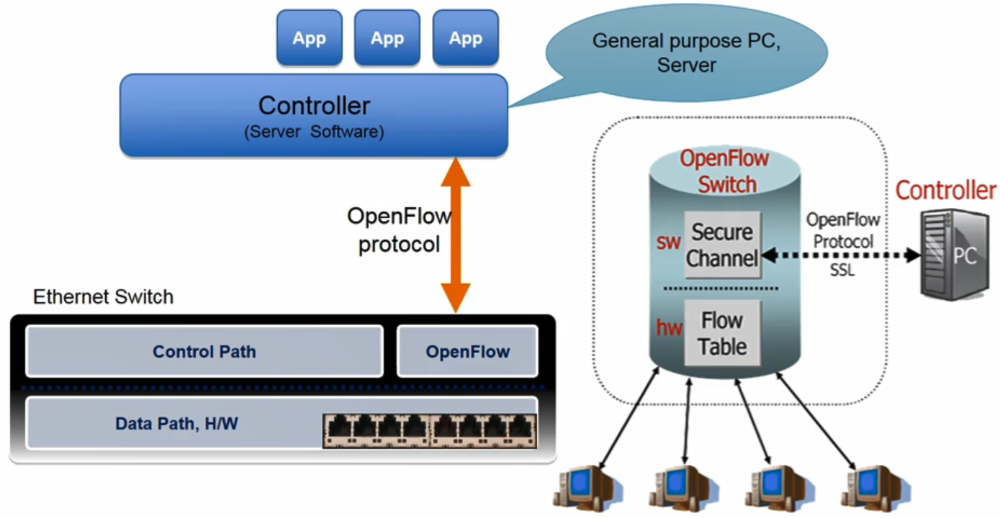

## 오픈플로우 지원 프로토콜

- 오픈플로우는 tcp 상에서 구현된 제어 프로토콜

- 컨트롤러는 TCP port 6633/6653을 통해 스위치와 통신

- 오픈플로우 메시지 구조

  - Type
    - 페이로드가 가변길이라 이것을 지정하기 위한 Message Length 필드 필요

  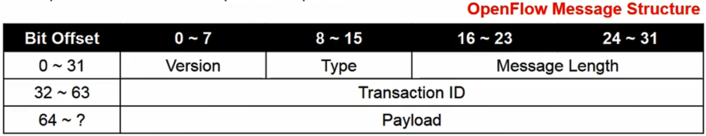

## OpenFlow Protocol Messages

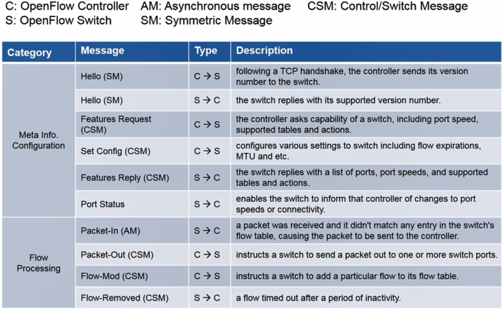

## OpenFlow Communication

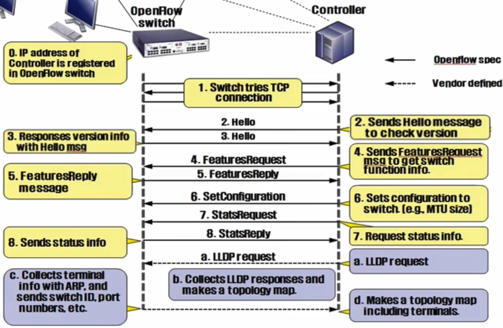


---

# 8. Flow Table, Group Table and Meter Table

## OpenFlow : Flow Table

- 스위치는 플로우 테이블을 가지며 플로우 테이블은 플로우 엔트리를 포함

- 플로우 엔트리는 스위치에 도달한 패킷을 어떻게 처리할지 정해진 룰

  - 매치와 인스트럭션으로 구성
    - 매치 필드는 L1 ~ L4에 이르는 패킷헤더의 내용을 포함
    - 패킷이 들어오면 플로우 테이블의 엔트리마다 패치 필드를 비교하여 매치되는 플로우 엔트리를 찾음
    - 찾은 플로우 엔트리에 정의된 인스트럭션으로 패킷을 처리

- Flow Table 예시

  

## Matching and Instruction Execution

- 플로우 엔트리에는 우선순위가 존재

  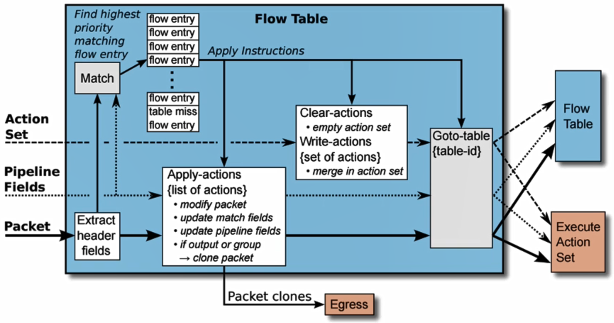

## Instructions & Actions in OpenFlow

- Instructions

  - 인스트럭션은 특정 패킷이 룰에 매칭이 되었을시 실행
  - 5가지 종류의 인스트럭션 존재
    - Meter meter_id : 매치가 된 패킷을 특정 미터 테이블로 이동
    - Apply-Actions : 액션셋에 정의된 액션들을 즉시 실행
    - Clear-Actions : 액션셋에 정의된 액션들을 모두 지움
    - Write-Actions : 액션셋에 새로운 액션을 추가하거나 업데이트하는 역할
    - Goto-Table : 매치가 된 패킷을 파이프라인을 통해 다음번 플로우 테이블이나 그룹테이블로 이동

  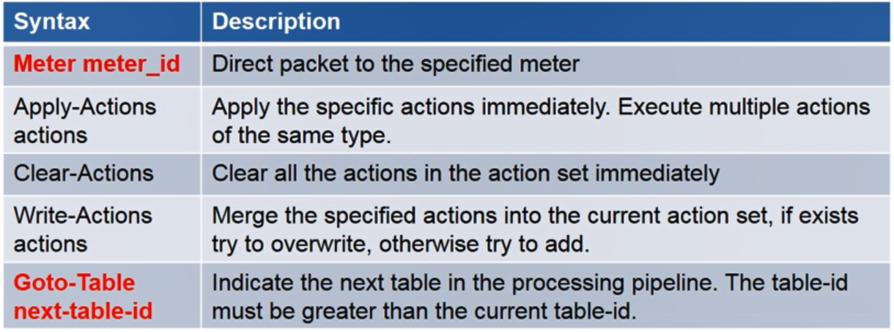

- Actions

  - 가장 대표적인 액션
    - set : 특정 필드에 새로운 값으로 세팅
    - qos : set_queue와 같은 QoS 액션을 패킷에 적용
    - group : 그룹 버킷에 정의한 액션을 순서대로 패킷에 적용
    - output : 매치된 패킷을 어떤 스위치 포트로 내보낼지 정의할 때 사용
    - push_MPLS : 스위치는 매치가 된 패킷에 MPLS 레이블을 추가하고 MPLS가 추가된 패킷은 추후에 MPLS 레이블을 제거하는 pop을 통해 레이블 제거
    - push_VLAN
    - pop

  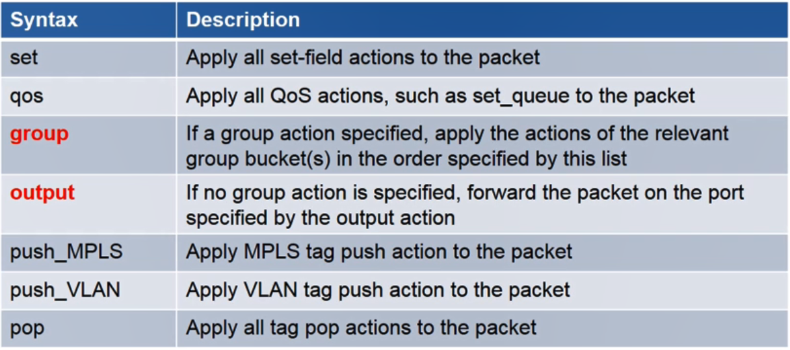

## OpenFlow Pipelining

- 오픈플로우 스위치에 위치한 플로우 테이블들은 순서를 가지고 있고 숫자 0으로부터 순번 시작
- 패킷은 플로우 테이블 숫자에 맞춰 순서대로 접근하여 플로우 엔트리와 매치 시도
- 오픈플로우 1.1부터 플로우 테이블 파이프 라인 기능 제공
  - 플로우 엔트리가 발견되면 해당 플로우 엔트리에 포함된 명령어 세트가 실행
  - goto-table로 명령어가 정의되어 있으면 다른 플로우 테이블로 보냄
  - 파이프라인은 앞으로만 패킷을 프로세싱하지 뒤로는 하지 않음
- 오픈플로우 1.5부터 Two stage pipeline processing 제공
  - Ingress processing
  - Egress processing


## OpenFlow Group Table

- 오픈플로우는 플로우 테이블말고도 그룹 테이블을 이용해 패킷을 효율적으로 포워딩

- Group Table & Types (version 1.1)

  - All: multicast
  - Select : load sharing
  - Indirect : simple indirection
  - Fast-failover : rerouting

  

- **Multicast**

  - Type = all

  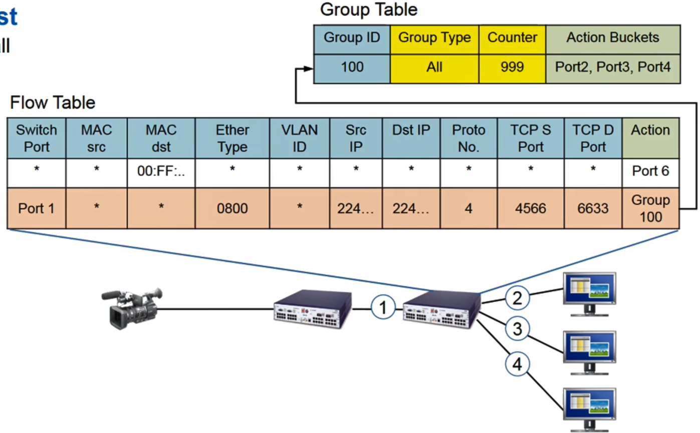

- **Load Balancing**

  - Type=select

  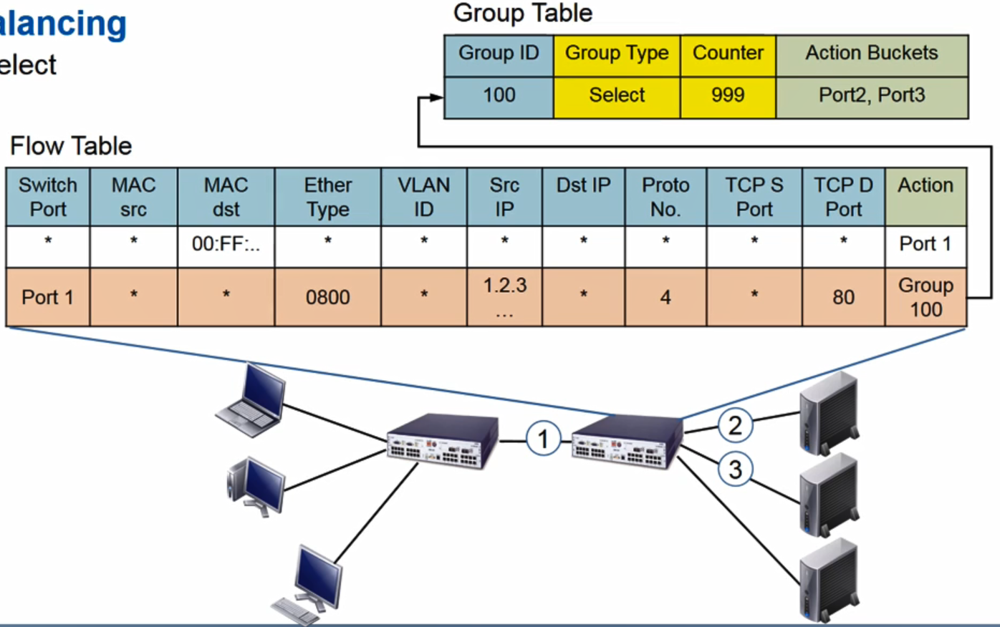

- **Indirection**

  - Type=indirect

  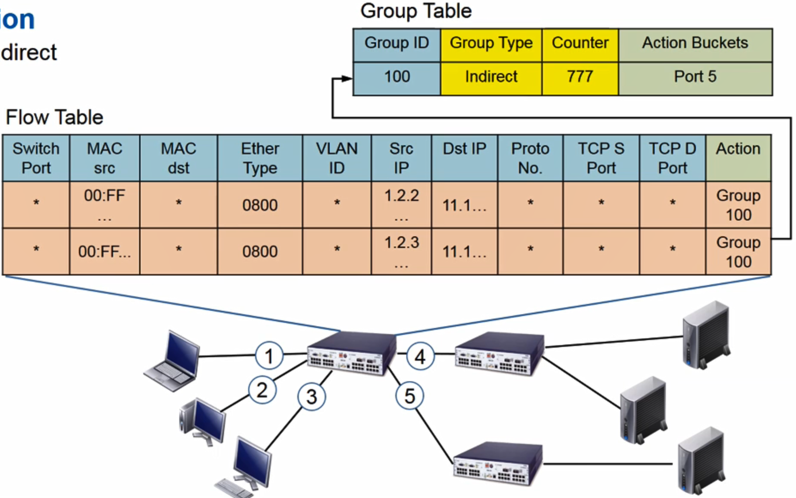

- **Fast Failover**

  - Type=fast-failover(ff)
  - 패킷 포워딩에 사용할 포트를 순차적으로 정의
    - 보통 프라이머리 포트가 항상 선택되어 패킷 포워딩에 사용
    - 프라이머리 포트가 정상적으로 수행되지 않을 시 세컨더리 포트가 사용

  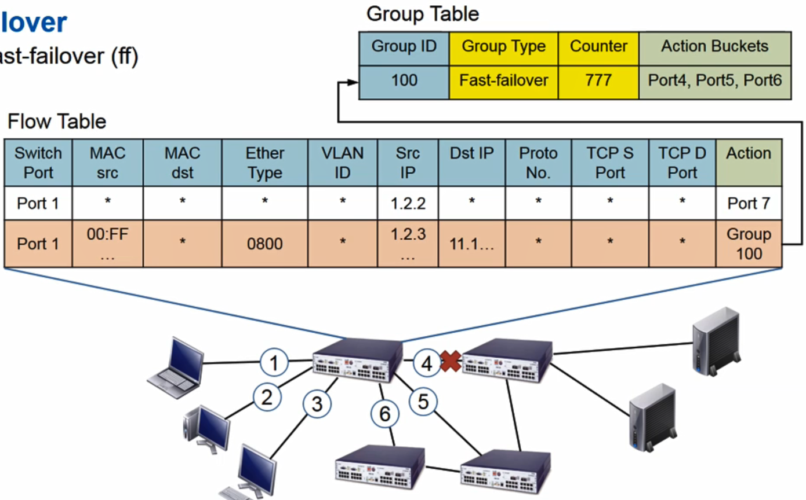

## OpenFlow Meter Table

- Meter Table(ver 1.3)

  - 미터테이블은 트래픽의 QoS를 보장하기 위해 설계

  


---

# 9. Operations in OpenFlow

## Packet Forwarding in OpenFlow

- Packet Forwarding 방법

  - Reactive flow insertion
  - Proactive flow insertion

  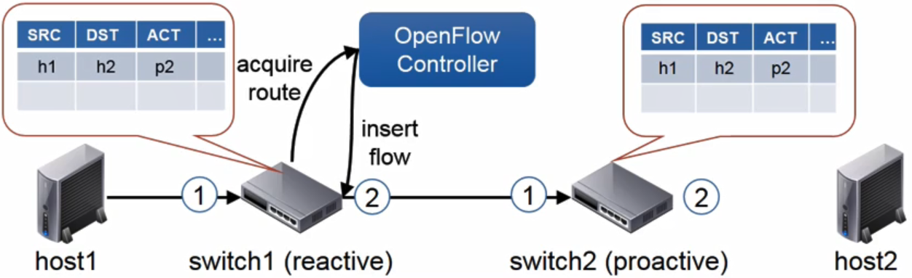

## Topology Discovery in OpenFlow

- 컨트롤러가 어떻게 오프플로우 네트워크에 위치한 스위치들과 경로들을 파악하는지

- Open Flow Discovery Protocol (OFDP)

  - 링크를 디스커버리하기 위해 토폴로지 정보를 만들어줌
  - 전체 네트워크 뷰를 construct

- 방법

  - Link Layer Discovery Protocol(LLDP) 프로토콜을 Packet-Out 페이로드에 포함하여 전송

  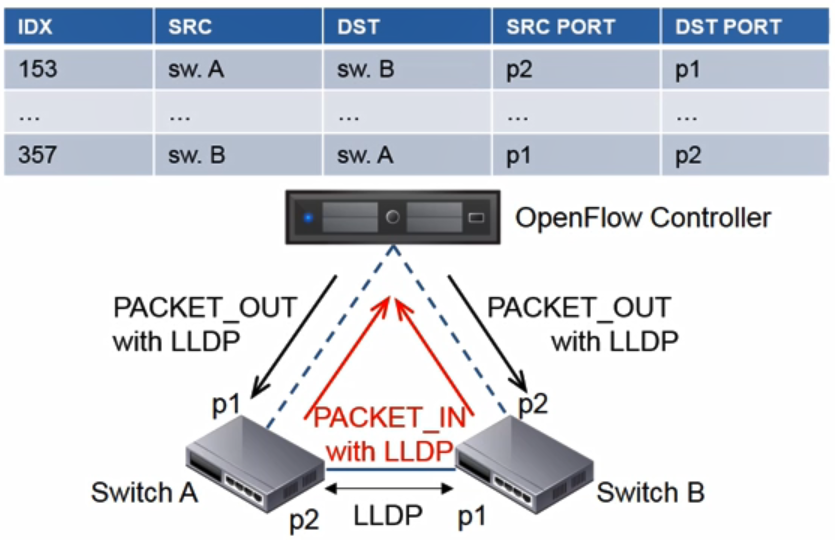

## Communication in Legacy Network

- Legacy 네트워크에서 어떻게 커뮤니케이션이 일어나는지

  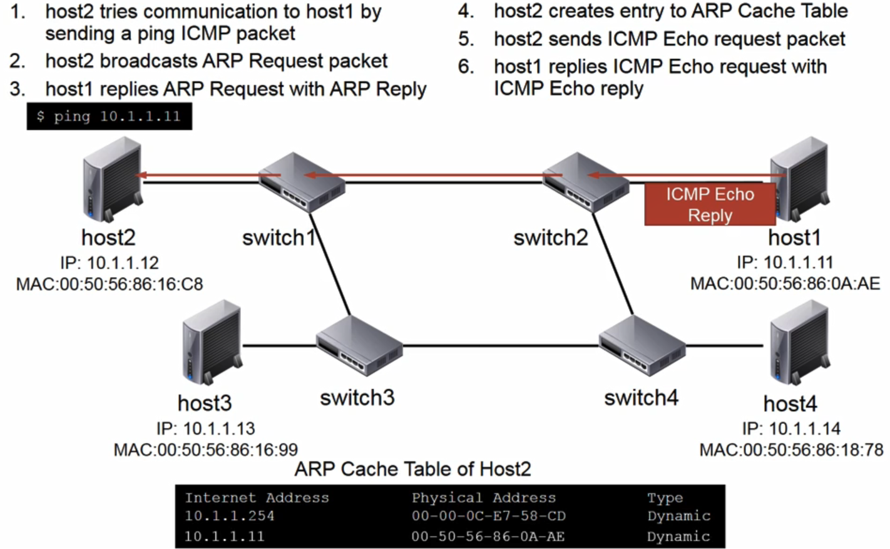

## Communication in OpenFlow

- OpenFlow 네트워크에서의 커뮤니케이션

  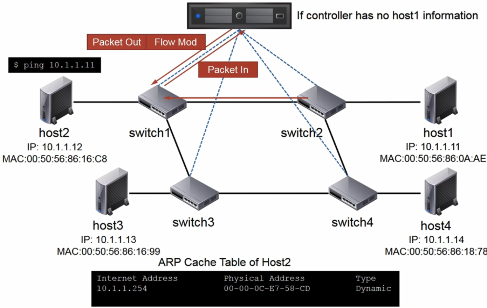

## OpenFlow Failover

- 오픈플로우 네트워크에서 장애 복구 방법

  - Protection
  - Restoration

- **Protection**

  - 빠른 장애 복구 가능
  - 컨트롤러 개입 없이 장애 처리
  - 프라이머리 패스만 전송하는 것이 아닌 백업 패스도 함께 전송

  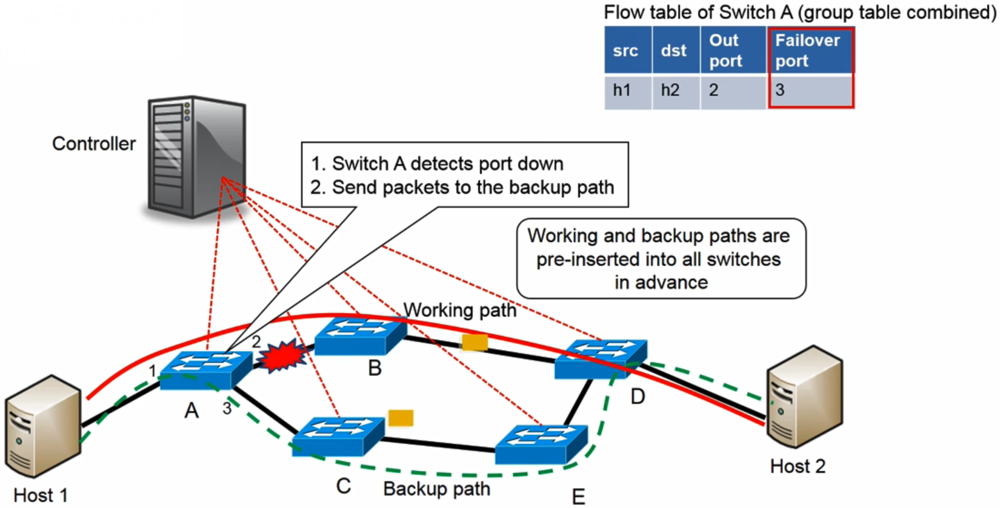

- **Restoration**

  - 컨트롤러 개입 필요
  - Port down & Link down Message를 컨트롤러에게 전송해 새로운 패스 설정

  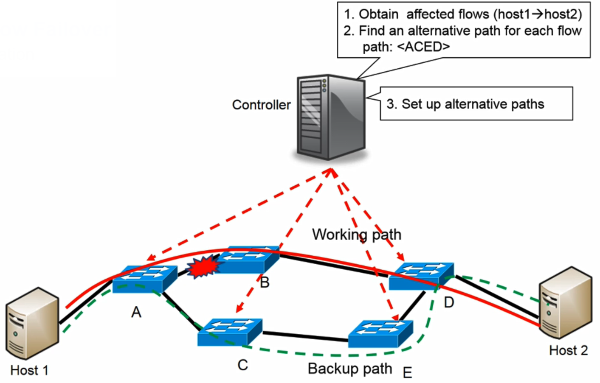


## Packet Processing Flowchart in OF Switch

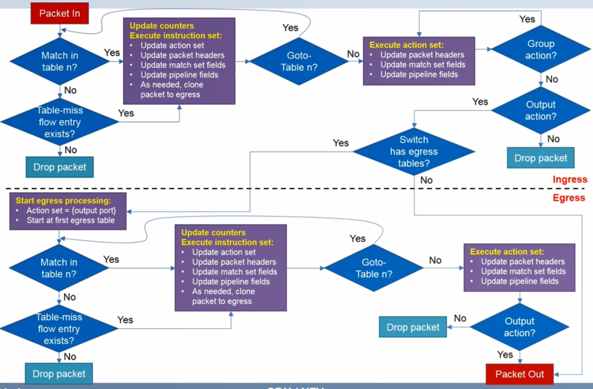


---

# 10. SDN Applications

## OpenFlow Example

- OpenFlow를 활용한 hop-by-hop routing

  - 서비스 체이닝(Service Chaining) : Firewall -> AAA -> Web Server

  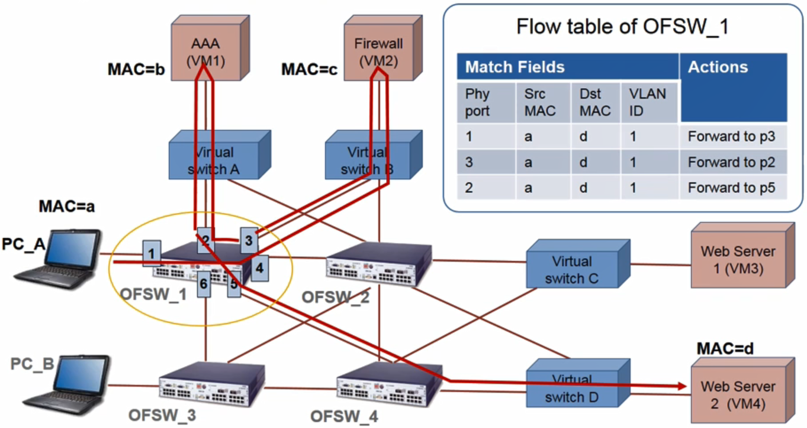

## Example : Kanazawa General Hospital (with NEC solution)

- Kanazawa 데몬에서 오픈플로우 스위치를 도입하기 전 네트워크 토폴로지

- 비싼 방화벽을 응급실과 수술실에 설치해야 함

  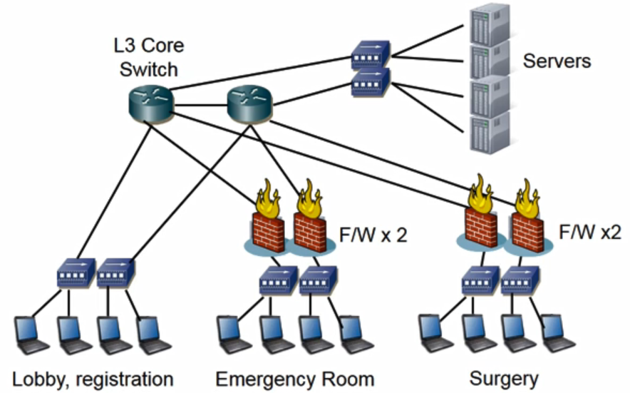

- 오픈플로우를 도입하면 방화벽같은 네트워크 기능들을 한 곳에서 집중적으로 관리 가능

- 장애 복구 속도도 빨라짐

  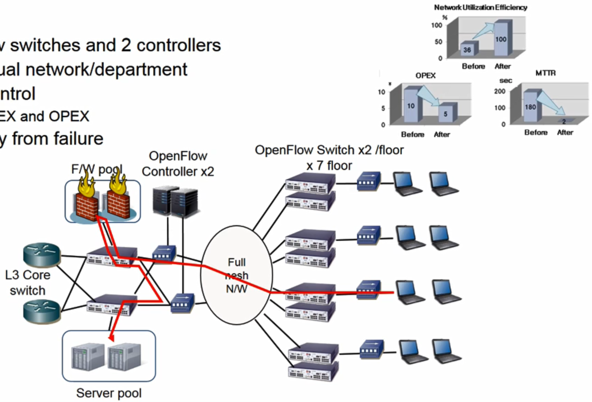

## MPLS using OpenFlow

- MPLS 기능을 이용하여 MPLS 라우팅 과정 도식화
- 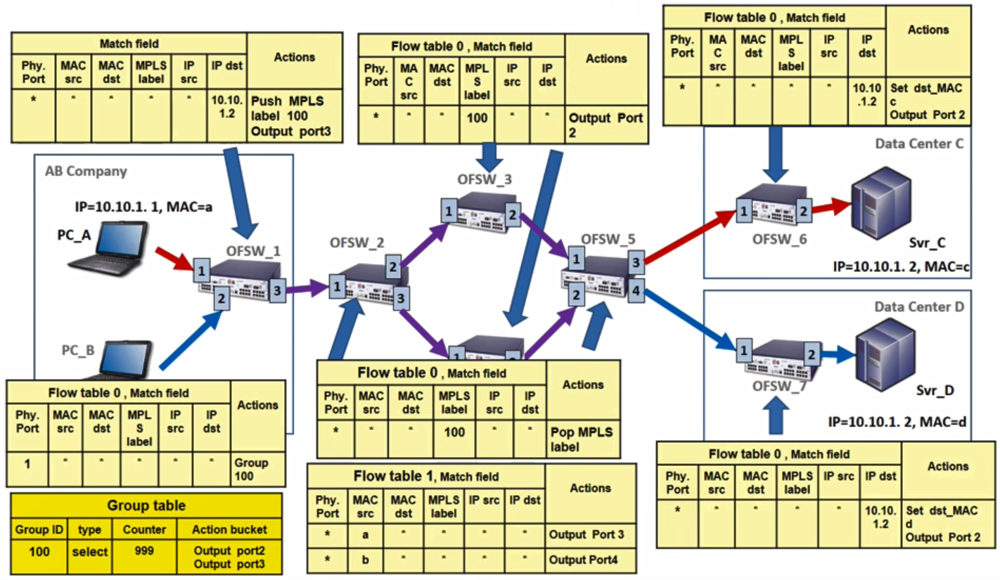

## VLAN using OpenFlow

- VLAN은 네트워크 isolation 및 가상화 목적으로 사용되는 프로토콜

  - 각 테넌트 별로 L2 브로드캐스트 도메인을 isolate하여 제공

- 오픈플로우는 VLAN 태그를 지원하여 오픈플로우 스위치에서 VLAN ID 매칭 및 설정을 할 수 있음

- VLAN의 문제점

  - VLAN ID 필드의 크기 문제로 클라우드 컴퓨팅 환경에서 다량의 테넌트를 지원할 수 없다는 한계를 가짐

- Solutions

  - VLAN ID를 확장한 VxLAN

  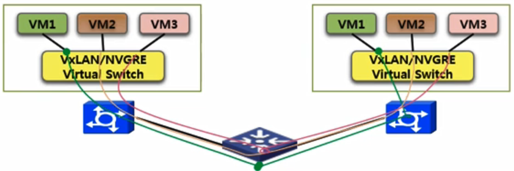

### VLAN implementation with OpenFlow

- 오픈플로우는 가상 네트워크를 구분하기 위해 VLAN ID 뿐만 아니라 출발지 및 목적지 맥 주소를 사용할 수 있음

- VLAN과 같이 MPLS 레이블을 사용할 경우 보다 많은 갯수의 테넌트 네트워크를 지원

  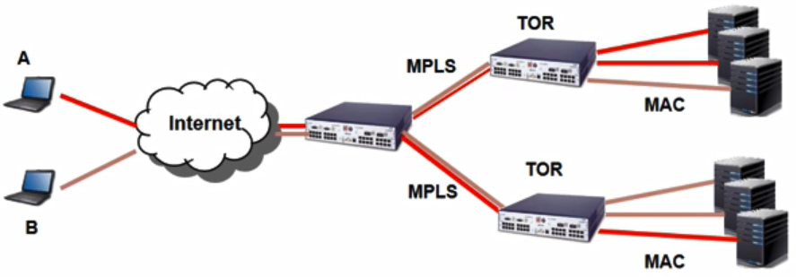

## Google SDN

- SDN을 도입한 계기
  - 구글 IP  트래픽
    - 해마다 40~45% 트래픽이 증가
      - 전체 인터넷 트래픽에서 10%를 차지
  - 36개 이상의 데이터 센터를 운영
    - 데이터 센터는 인터넷에 연결된 상태로 데이터 센터끼리 통신이 가능
  - 각 데이터 센터 사이의 동기화 속도를 높이기 위하여 데이터 센터는 해저 케이블을 통해 연결
    - 광케이블로 이루어진 전용선
      - 기존 네트워크 환경에서 케이블의 링크 utilization은 30~40% 정도 
- 문제점
  - 각 WAN Router는 트래픽을 동일시하여 처리
  - 링크 utilization이 너무 낮으
  - 멀티 벤더에서 생산한 라우터와 스위치를 사용하여 각각의 장비를 수동으로 관리하기 힘듬
  - 높은 가용성을 지원하는 상용 라우터는 단가가 비싸고 해마다 증가하는 트래픽을 처리하기 위해 값 비싼 장비를 제공해야 함
- SDN상에서 새로운 트래픽 엔지니어링 방법을 제안 및  도입
  - IP 기반의 WAN에서 발생하는 문제들을 깔끔히 해결
  - 상용 라우터들이 나날이 증가되는 구글의 트래픽을 처리할 수 없었지만 SDN 방법을 활용하여 네트워크 장비를 직접 제작하여 문제 해결
- B4 SDN
  - 구글에서 사용하는 어플리케이션 트래픽을 3가지 카테고리로 구분하여 관리
    - 사용자 트래픽(gmail, youtube) : QoS와 직결되는 트래픽이기 때문에 높은 우선순위로 전달
    - 빅데이터 분석에 사용되는 스토리지 접근 트래픽 : 우선순위가 사용자 트래픽보다 낮음
    - 멀티 데이터 센터 사이 동기화를 위해 사용되는 트래픽 : 우선순위가 가장 낮음
- OpenFlow Switch 제작
  - 구글은 자체적으로 B4 SDN 구축을 위해 제작
  - 스위치는 오픈플로우 에이전트가 설치되어 동작
- Design
  - 해저 케이블의 utilization을 높이기 위하여 새로운 SDN 기반으로 트래픽 엔지니어링 방법을 제안
  - 이를 통해 utilization ratio를 90%이상으로 올림
  - 트래픽 엔지니어링 알고리즘
    - 오픈플로우 컨트롤러 상에서 동작
    - Uses ECMP
    - 분산처리가 가능한 ONIX 분산 SDN 컨트롤러를 개발
      - ONIX는 대규모 SDN 네트워크 관리를 목표로 개발된 상용 컨트롤러


---

# 11. SDN Controllers 1

## Introduction to OpenFlow Controller

- Problem Statement

  - 기존 네트워크 장비에는 제어평면과 데이터평면이 같이 있기 때문에 제어평면에서 VNTag, TrustSet과 같은 새로운 기능을 추가할 경우 장비에 대한 수정이 필요한데 상용화하는데 시간이 많이 걸림
  - 네트워크 측면에서 제어 및 네트워크 주상화를 제공하는 프로그램 부재
    - 프로그래밍 방식으로 네트워크를 교체하기 어려움
  - 분산된 방식으로 네트워크를 제어하여 전체 네트워크 제어성이 많이 떨어짐
  - 이러한 문제를 해결하기 위하여 논리적 중앙 집중적 방식으로 네트워크를 제어할 수 있는 SDN Controller가 제안
    - SDN Controller와 Network Management Syste(NMS)의 차이점
      - NMS는 네트워크를 관리하기 위하여 설계가 된 시스템으로 SNMP, NetConf 등 인터페이스를 통해 네트워크 메트릭을 수집하고  네트워크 장치 설정을 바꾸는 작업만 수행
      - 실제 패킷 혹은 플로우 수준의 제어는 불가능

- Solution

  - 해결책으로 Network Operating System(NOS)가 제안되었음
    - 일관되고 중앙 집중화된 프로그래밍 인터페이스를 통하여 전체 네트워크를 제어하는 것을 목표로 하고 있음
  - NOS는 직접 네트워크를 제어하는 로직은 포함하지 않고 대신 네트워크를 제어하기 위한 다양한 프로그래밍 인터페이스를 제공

  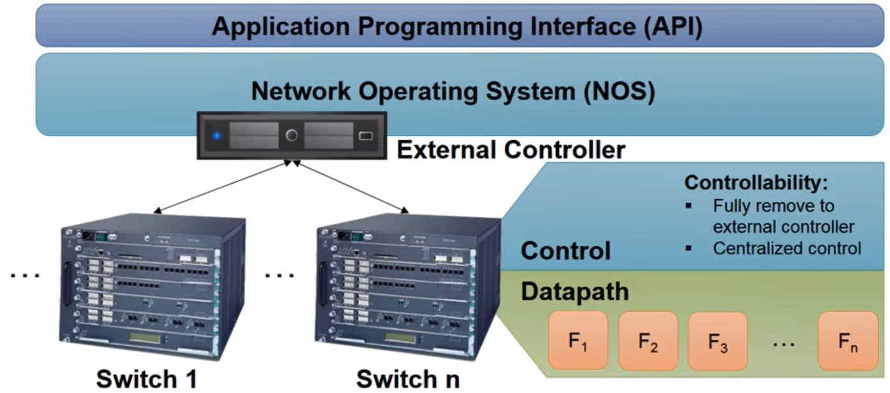

## Pedigree Chart of OpenFlow Controllers

- NOX는 최초로 개발된 오픈플로우 컨트롤러

  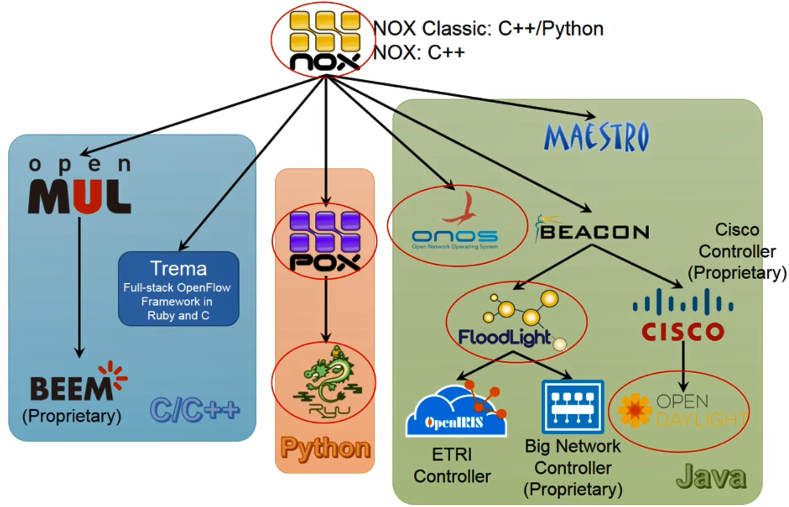

## Nox Classic vs NOX

- NOX는 배포된 시점을 기준으로 NOX Classic과 (new) NOX로 구분

  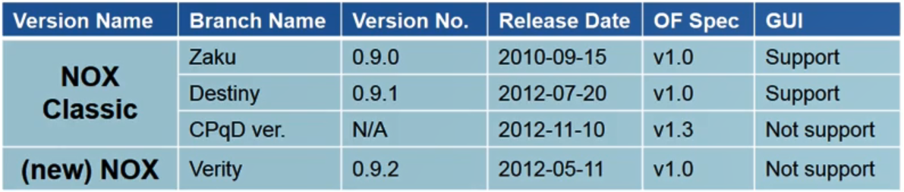

- NOX-Classic

  - C와 C++로 구현된 컨트롤러
  - 성능이 많이 떨어짐

- NOX

  - 기능은 NOX-Classic과 비슷하나 성능 개선을 목표로 개발
  - source에 대한 리팩토링을 거쳐 가독성을 높임
  - NOX-Classic과 다르게 GUI 제공하지 않음

## POX Overview

- POX는 NOX의 Python 버전
- 빠르게 puc 애플리케이션을 만들기 위한 목적으로 설계 및 개발
- POX 성능은 Python의 한계 때문에 C나 자바보다 떨어짐
  - PyPy를 이용하여 일부 성능 개선 가능
- 모든 운영체제에서 동작 가능

## NOX/POX Overview

- Components

  - Network Application Services
    - 네트워크를 제어하기 위한 다양한 사용자 어플리케이션들이 위치
  - Northbound API
    - 여러 네트워크 어플리케이션들을 통하여 네트워크를 제어할 수 있는 다양한 인터페이스 API 제공
    - 표준화가 이루어지지 않음
      - 각 컨트롤러마다 서로 다른 API 제공
  - NOX Controller - Network OS
    - 시스템 측면에서 네트워크 추상화 제공
    - 복잡한 네트워킹 문제를 소프트웨어로 단순화하는 역할
  - Southbound API
    - 표준 오픈플로우 프로토콜 지원
  - OpenFlow Enabled Switchs

  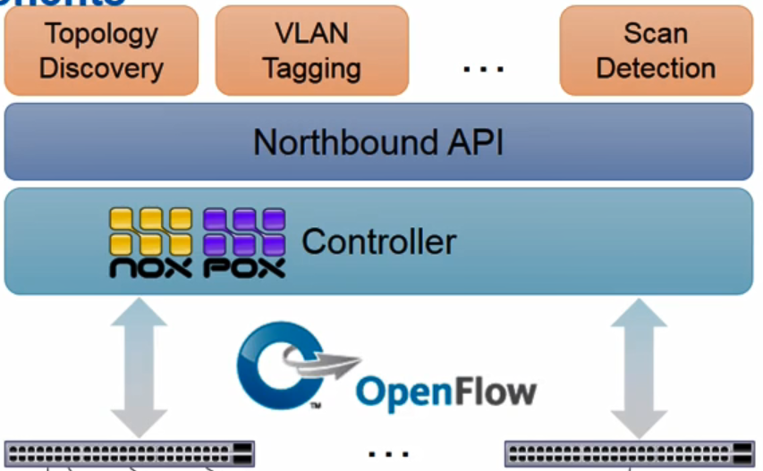

## NOX/POX Architecture

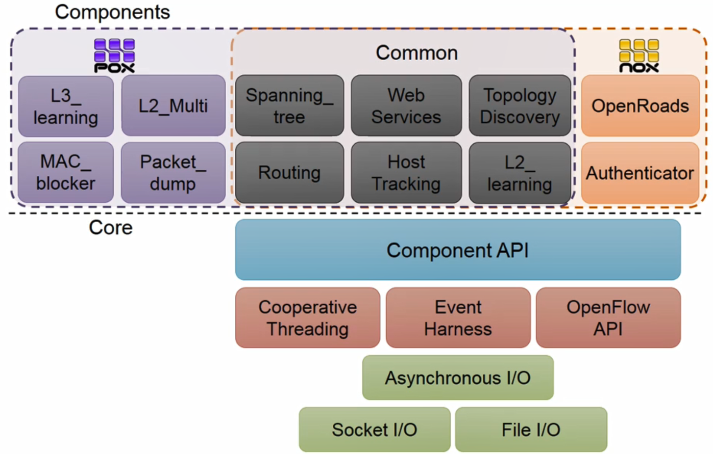


---

# 12. SDN Controllers 2

## Introduction to Floodlight

- Floodlight

  - 자바 기반의 SDN 컨트롤러

  - 현재는 연구 목적으로 일부만 사용

    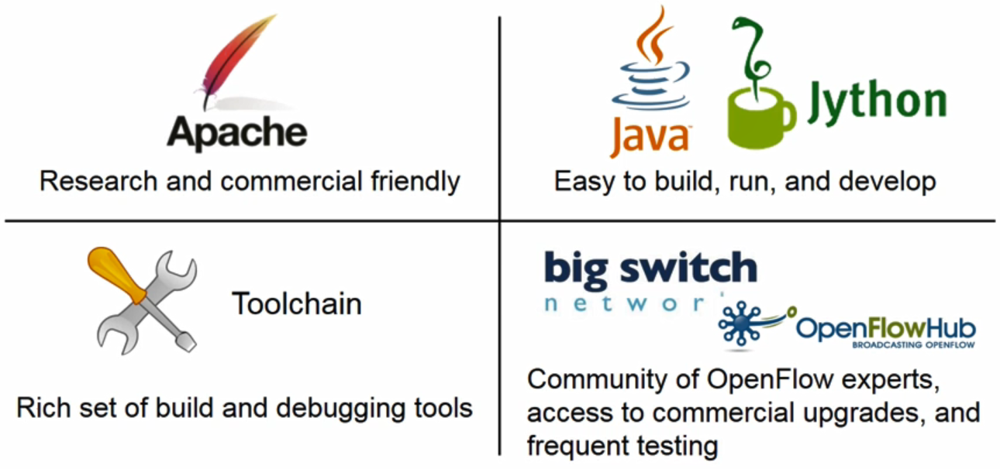

- Architecture

  

- Application Modules

  - Forwarding : 기본적으로 제공된 Reactive Forwarding 어플리케이션
  - Static Flow Entry Pusher : Proactive Forwarding 어플리케이션
  - Firewall : 사용자가 ACL(Access Control List) 룰을 정의하면 해당 룰을 참고해 특정 트래픽을 허용할지 말지를 결정
  - Virtual Network Filter(VNF) : MAC 기반의 네트워크 isolation을 해주는 어플리케이션

- Module Description(Core Service)

  

## Introduction to Ryu

- Ryu

  - 일본 엔티티에서 파이썬으로 개발한 SDN 컨트롤러
  - 오픈플로우 어플리케이션을 빌드하기 위한 플랫폼
  - 플로우에 대한 제어를 통해 네트워크를 지능적으로 관리
  - 특징
    - Vendor-neutral한 오픈 인터페이스 제공
    - 통합된 SDN 컨트롤러가 아닌 다양한 SDN 어플리케이션을 개발할 수 있는 플랫폼/프레임워크 제공
  - 제공하는 기능
    - 오픈플로우 프로토콜
    - 이외에도 NetCONF, SNMP, OVSDB
    - 어플리케이션/라이브러리
      - topology view, firewall, OpenFlow Restful 등등

- Architecture

  

## OpenDaylight Scope and Projects

- OpenDayLight Framework

  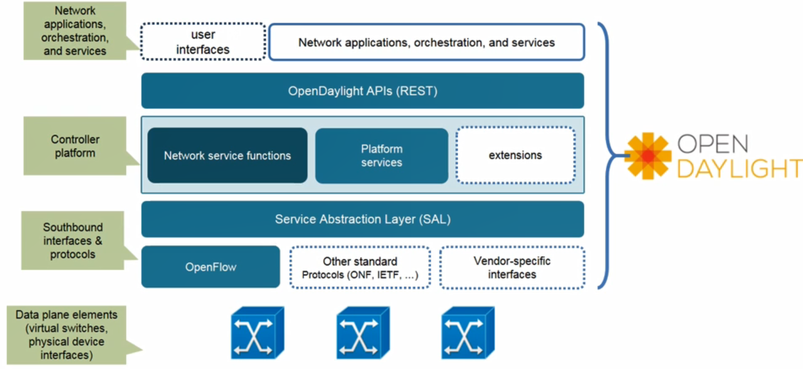

- OpenDaylight Projects

  - 오픈데이라이트는 초기 15개 이상의 서브 프로젝트를 수행

- 2차버전 Helium Architecture

  - 여러 하위 프로젝트를 통하여 더 많은 모듈들이 추가
    - 대표적으로 South-bound에는 SNMP, BGP-LS등이 추가
    - SAL 확장하여 오픈플로우 뿐만 아니라 다양한 South-bound 프로토콜 지원
  - Service Function Chaining(SFC), AAA, Virtual Tenent Network(VTN), OVS Neutron 등 실용성 있는 어플리케이션을 개발하여 컨트롤러와 통합

  

- Plugin Build Process

  

- Model-Driven Service Abstraction Layer(SAL)

  - 추상화 계층
  - MDSAL은 네트워크 장비의 복잡한 설정 내용을 모델을 통해 표준화하기 위해 제안
  - Maven 툴을 이용해 생성된 OSGI Bundle은 자바 SAL API에 해당하는 내용으로 컨트롤러 플랫폼에 정의된 서비스들을 이런 API를 호출을 통하여 관련된 오브젝트 생성
  - 생성된 오브젝트는 다시 관련된 South-Bound 인터페이스를 호출시 포함되어 특정 네트워크 장비와 통신시 사용
    - 오픈플로우 장비와 통신을 원하는 경우 MDSAL에 정의된 플로우 테이블, 플로우 등 오브젝트로 설치할 플로우 룰을 표현하고 이 오브젝트를 다시 오픈플로우 South-Bound 인터페이스를 통하여 오픈플로우 제어메시지에 포함시켜 관련된 오픈플로우 스위치에 내릴 수 있음
    - 스위치로부터 올라오는 제어메시지가 있을 경우 South-Bound 인터페이스를 통하여 플로우 룰 내용이 추출되고 MDSAL에 의하여 추상화되어 FlowObject로 변화된 후에 상위 서비스에 의하여 호출. YANG과 NetCONF도 비슷하게 동작

  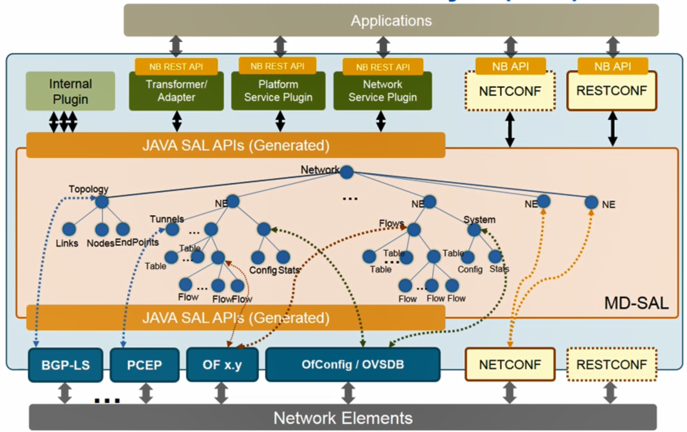


---

# 13. Introduction to Open Network Operating System(ONOS)

## Why are SPs Interested in SDN and ONOS?

- CAPEX/OPEX 감소

- Bring cloud-style agility, flexibility, scalability to their networks

- 서비스 빠르게 개발

- 복잡도 줄임

  Service Provider의 SDN 요구사항

- 무선, 유선 모두 가능한 호환성

- 고가용성, 이상이 발생했을 때 지속적으로 서비스가 가능하게

- 사용이 쉬움

- 가격이 싼 화이트 하드웨어로 제공

ONOS는 서비스 요구사항을 만족시키는 SDN 컨트롤러 오픈소스 플랫폼

## Service Provider Networks

- WAN core backbone

  - MPLS 그 위에 TE를 돌리는 형태
  - 200~300개의 라우터를 지원하고 10000개의 포트를 지원해야 함

- Metro Networks

- Cellular Access Networks

  - 모바일 네트워크
  - 많은 디바이스 관리
  - 10만개 디바이스를 관리

  SDN 컨트롤러는 많은 장비를 제어해야 한다

## ONOS Introduction

- ONOS : Open Network Operating System
  - 서비스 프로바이더 네트워크를 관리하고 제어하기 위해 제안된 컨트롤러
  - 디자인 목표
    - Code modularity
    - Configurability
      - 실시간으로 설정을 바꿀 수 있음
    - Separation of Concern
      - 각 계층에서 개발할 때 개발자는 자기가 개발하는 계층만 생각하고 개발하고 다른 계층은 신경쓰지 않음
    - Protocol agnosticism
      - 특정 프로토콜에 바인딩된 개발하지 않음

## ONOS Distributed Architecture

- 분산 컨트롤러

- 논리적으로 볼때 하나의 컨트롤러

  - 서로 연결되어 데이터를 공유

  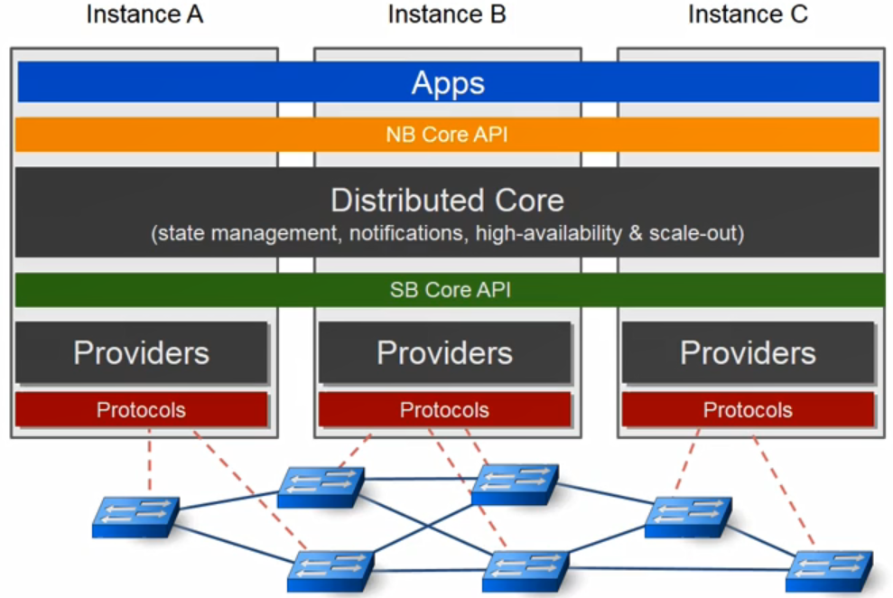

- 각 계층에서 사용되는 기능

  - High Availability(HA)
  - Load Balancing(LB)

  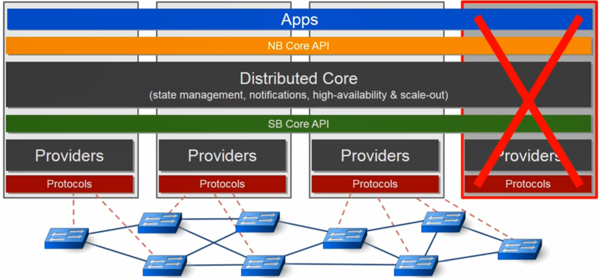

## ONOS Core Subsystem

- ONOS는 다양한 Subsystem으로 구성

- Subsystem = Service

- 기능에 따라 카테고리를 나눔

  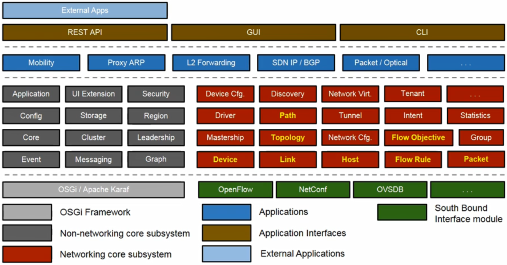

- Subsystem 구조

  - 3가지의 컴포넌트로 구성

  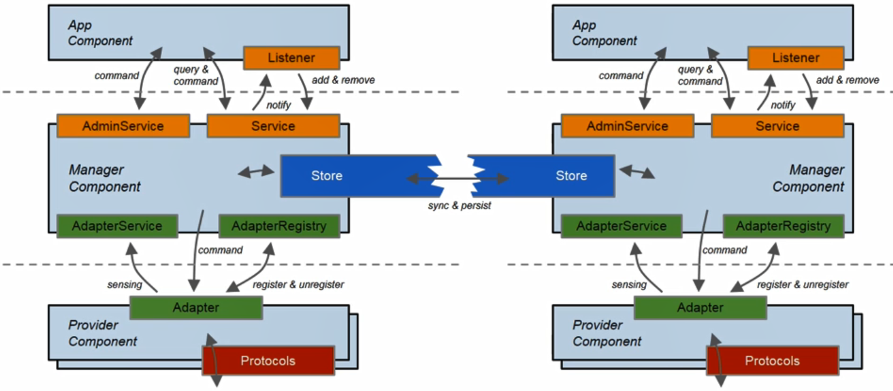

- Provider

  - ProviderService 인터페이스를 통한 코어 어플리케이션 제공 및  프로토콜 별 라이브러리를 통해 다양한 프로토콜 지원

- Manager

  - Core에서 Provider Component로부터 정보를 받아 어플리케이션 및 기타 서비스에 제공
  - 정보 저장

- Application

  - 다양한 기능 제공
  - Manager Component가 집계한 정보를 사용하고 제어

  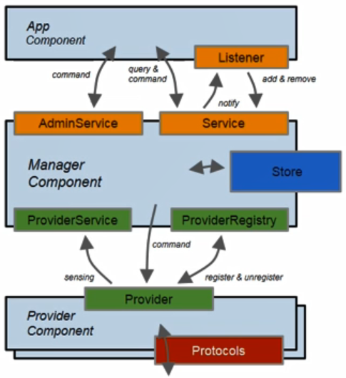


---

# 14. SDN Distributed Core

- 물리적으로 떨어진 각 ONOS 컨트롤러(노드)들끼리 서로 통신하고 네트워크 상태 메세지를 교환 및 동기화 할 수 있도록 처리해주는 가장 중요한 컴포넌트

## Distributed Architecture

- 특징

  - Distributed
    - 여러개의 분산 컨트롤러는 하나의 클러스터를 형성할 수 있음
  - Symmetric
    - 각 ONOS 인스턴스는 똑같은 소프트웨어 스택을 실행하고 있고 똑같은 설정을 가짐
  - Fault-tolerant
    - 스위치에서 보면 컨트롤러는 마스터 컨트롤러와 스탠바이 컨트롤러로 나뉨
    - 마스터 컨트롤러는 스위치에 대해 2가지 권한을 가짐
      - 해당 스위치의 상태를 받음
      - 스위치에 룰을 내려줄 수 있음
    - 스탠바이 컨트롤러
      - 상태를 받을 수 있지만 룰을 내려주거나 쓰기에 관련된 액션은 수행 못함
    - 만약 마스터 컨트롤러에 오류가 발생하면 스탠바이 컨트롤러가 일을 수행

  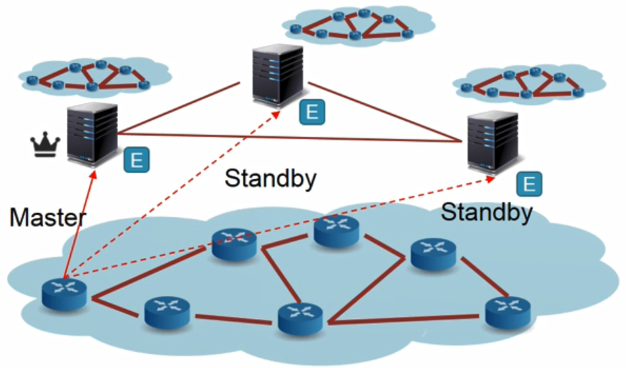

### 네트워크 상태 정보 저장 및 동기화

- 컨트롤러는 스위치로부터 받은 상태정보를 자바 오브젝트화하여 알고르짐을 이용해 분산 토폴로지 스토어에 저장

  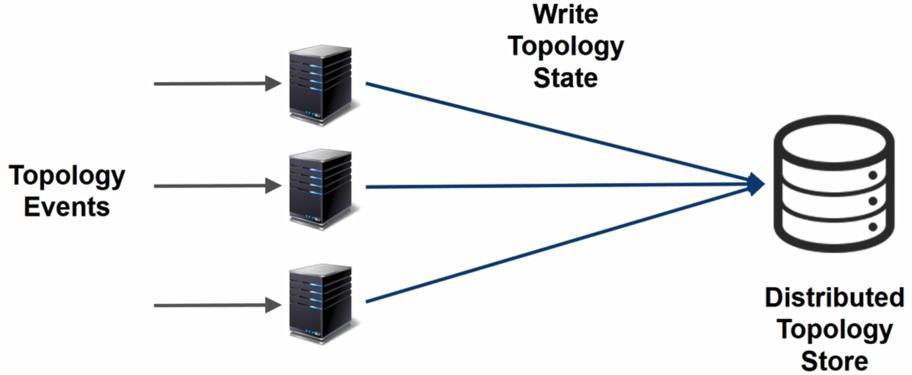

- 다른 컨트롤러는 분산 토폴로지 스토어에서 관련 정보를 쿼리해서 받음

  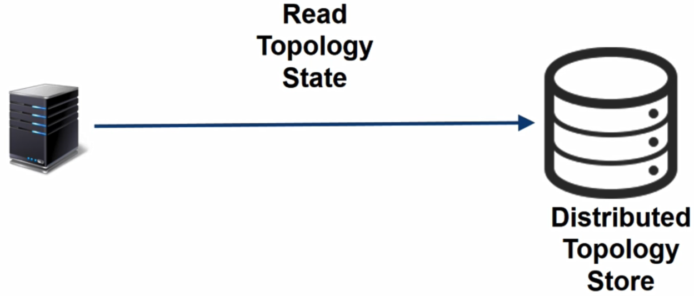

### Distributed Primitives

- 자기 자신의 UseCase에 맞게 분산 Primitives를 활용해 네트워크 상태 정보 동기화
- 대표적인 4가지 Primitives
  - EventuallyConsistentMap<K, V>
    - 상태정보를 저장하고 바로 동기화하지 않고 일정 시간 뒤에 동기화
  - ConsistentMap<K, V>
    - EventuallyConsistentMap보다 빠르게 동기화
  - DistributedQueue<E>
    - Map이 아닌 Queue 자료구조 방식으로 동기화
  - AtomicCounter
    - 자바의 AtomicLong을 분산버전으로 새로 구현한 Primitives

### 분산 아키텍처에서 정보 동기화 방법

- Strong Consistency

  - Strong Consistency를 보장하기 위하여 
    - Raft Consensus Protocol을 사용

- Eventual Consistency

  - Gossip Protocol

- Copycat

  - Strong Consistency를 구현하기 위한 다양한 오픈소스 중 하나
  - 자바로 구현된 Strong Consistency

- 동작과정

  - 클러스터에 컨트롤러가 5개가 있다고 할때 메시지를 5개 파트로 나눔
  - 하나의 파트를 3개의 노드에 복사
  - 3개에 복사해서 주는 이유
    - 하나의 노드가 동작하지 않아도 똑같은 메시지를 다른 노드에서 복사해오기 위하여
    - 3개 중 하나가 리더로 동작

  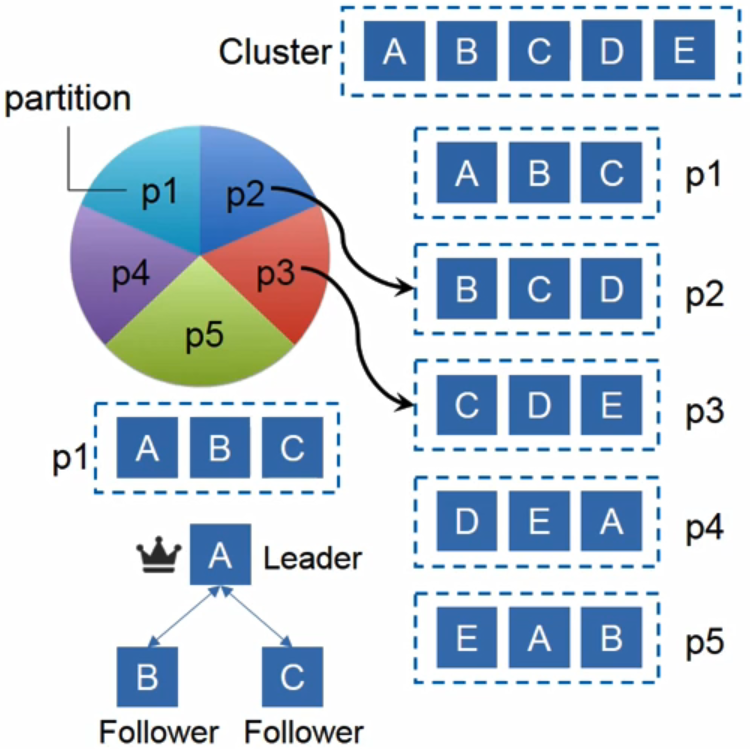

### Raft Consensus Protocol

- 리더선출법
  - 리더는 주변 노드들에게 주기적으로 하트비트를 전송
    - 주변 노드들은 리더가 정상적으로 동작하는 것으로 간주
  - 팔로워들은 주변 노드들에게 리더십 Voting 요청을 보냄
    - 받은 팔로워와 리더는 리퀘스트를 허용할지 말지를 보내줌
    - 대부분의 팔로워들로부터 긍정적인 결과를 받으면 해당 팔로워가 리더로 선출
    - valid leader에게 리퀘스트 vote를 받으면 해당 노드는 팔로워
    - 만약 아무도 선출에 성공하지 못하면 텀노드를 하나 증가하고 새로운 election을 시작

### Gossip Protocol(or Epidemic Protocol)

- EventuallyConsistentMap을 구현하기 위해 사용

- 전염병이 전파되는 상황을 모방하여 만듬

- Raft Consensus Protocol보다는 consistent 레벨이 낮고 동기화되는 시간이 느림

  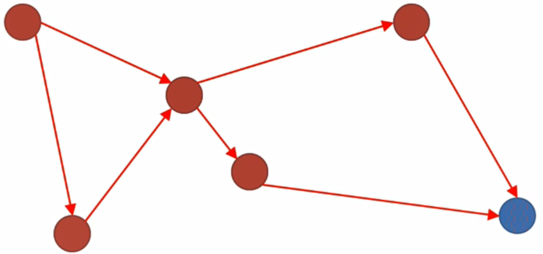


---

# 15. ONOS Northbound

- Northbound
  - ONOS Core와 어플리케이션 사이에 위치한 인터페이스
  - 3가지 종류의 추상화 Northbound 존재
    - Intents
    - Network Models
    - Flow Objectives
  - 각 Northbound의 컴포넌트들은 네트워크 상태에 대한 추상화를 제공
    - 애플리케이션 개발자들은 네트워크에 대한 지식이 없이도 자기자신의 애플리케이션 개발 가능

## Interact with GUI

- ONOS Web GUI
  - A sinigle-page web application
  - topology view를 제공

## Interact with ONOS CLI

- ONOS CLI
  - Karaf's 기반으로 개발
  - 자바의 프레임워크로서 전체 자바 VM을 재실행하지 않고도 새로운 자바 어플리케이션을 실시간으로 설치하고 삭제하고 활성화시킬 수 있음
  - ONOS는 karaf에서 제공하는 CLI extention을 이용해 사용자가 직접 ONOS 커맨드를 만들어 넣을 수 있음
- Access CLI
  - 로컬에 설치된 ONOS 실행 방법
    - `onos-karaf clean`
  - 원격에 설치된 ONOS 실행 방법
    - onos-pakage를 통하여 onos source로부터 바이너리를 패키징하고 패키징된 바이너리를 여러개의 onos들의 배포하기 위해 `stc setup` 명령어 실행
    - 배포된 후 각각의 원격 노드에 접속하여 `onos`명령어를 실행하면 gui에 접속 가능

## Interact with ONOS REST and gRPC

- REST API
  - onos와 서로 상호 연동 및 통신 가능
  - JSON과 HTTP/1.1 기반의 전통적 rest api 제공
  - Swagger라는 오픈소스를 이용해 소스코드로부터 Rest API 동적으로 생성해서 개발자가 직접 문서를 보고 시스템을 개발
  - 하지만 속도가 느림
    - JSON 포맷을 사용
    - HTTP/1.1을 사용하기 때문에 비동기식 통신 지원하지 않음
- gRPC
  - HTTP/2.0 기반으로 하기 때문에 비동기식 통신이 가능하고 스트리밍 가능
  - protobuf라고 부르는 형식으로 모든 데이터를 압축하여 바이너리 형태로 전달하기 때문에 전달할 데이터양이 줄어듬
    - 외부 시스템과 연동할 때 네트워크에 부하를 줄임
  - REST API보다 6배 좋은 성능을 보임

## Key Northbound Abstractions

- Network Graph
  - 네트워크 인프라 상에 위치한 여러 네트워크 장비, 링크, 호스트들을 추상화
- Flow Objective
  - 디바이스 중심에 추상화를 제공
  - data-plane의 프로그래밍하면서 테이블 파이프라인을 독립적으로 수행 가능
- Intent
  - 네트워크 중심의 추상화

### Network Graph

- 그래프 기반의 추상화

  - Ditected, cylic된 그래프
  - 각각의 노드들은 오브젝트(디바이스, 링크  등)
  - protocol-specific network element를 protocol-agnostic network element(Model Object)로 매핑
  - Model Objects
    - Topology
      - Device, Port, Hosts, Link
    - Control
      - Flow rule, role value
    - Packets
      - Outbound/Inbound packet

  

- Descriptions

  - 모델 오브젝트들을 묶어서 관리
  - Descriptions은 하나 혹은 하나 이상의 모델 오브젝트로 구성
    - Ex) HostDescription은 호스트의 MAC과 IP 주소에 대한 조합

- Events

  - 모델 오브젝트, Descriptions의 컨셉을 이용해서 네트워크에 발생하는 이벤트들을 protocol-agnostic한 이벤트로 전환해서 주변 스토어나 상위에 있는 어플리케이션에 제공

  

## Flow Objective Subsystems

- 같은 오픈플로우 버전을 사용하고 있어도 각 벤더들에서 장비를 실현하는 방법이 다름에 따라 스위치 파이프라인을 실행하는 방법도 다를 수 있음

- 새로운 장비 추상화 방법을 제안

  - **Flow Objective**

- 개발자는 스위치의 하드웨어 구성을 몰라도 원하는 기능을 프로그래밍 가능

  -  어떤 종류의 스위치를 사용해도 상관없이 개발자가 Flow Objective를 사용해서 어플리케이션을 개발하면 해당 어플리케이션은 거의 모든 스위치 파이프라인을 실행하는데 사용 가능

- 실현 방식은 PC의 드라이브와 매우 흡사

  - 윈도우에서 특정 개발자가 어플리케이션을 개발할 때 해당 윈도우가 설치된 하드웨어에 어떤 디바이스가 설치가 되었고 디바이스 스펙을 알 필요없이 윈도우에서 제공하는 추상화 API를 이용해서 개발 가능
  - Flow Objective는 내부적으로 디바이스라는 컨셉을 사용해 하나의 드라이버는 특정 스위치의 파이프라인에 1:1 매핑
    - 따라서 개발자는 Objective를 정의해서 내려주면 드라이버에 의해서 특정 디바이스에 맞는 플로우 룰로 자동으로 변환하여 ONOS Protocol 계층을 지나 원하는 디바이스에 전달

- 3가지 인터페이스

  - Filtering Objective
  - Forwarding Objective
  - Next Objective

  

## Intent Framework

- Intent Framework

  - 두 대의 호스트 사이에 연결을 하도록 프로그래밍할려면 4개 이상의 플로우 룰을 필요한 스위치에 모두 설정해야 함
  - 어플리케이션 개발자들이 이를 일일이 설정해야 하면 많은 노력이 들기 때문에 더 추상화시켜준 컨셉으로 만들어진 것이  Intent Framework
  - Intent를 이용해 복잡한 과정을 생략 가능
  - Intent는 policy기반의 관리를 할 수 있도록 제공
    - SDN Intent Framework를 통해 어플리케이션은 더 많은 밴드위스가 필요하거나 QoS를 보장하고 싶으면 복잡한 룰을 내리는게 아니라 얼마만큼의 밴드위스가 필요한지 정의만 해주면 됨

  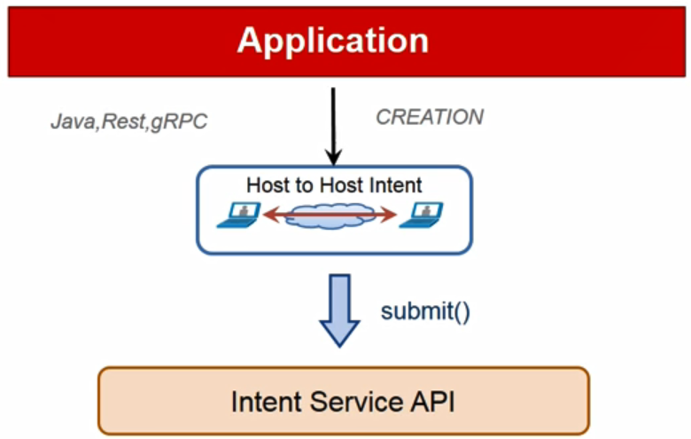

- Intent 동작과정

  - 컨트롤러가 Intent의 요청을 받으면 해당 Intent에 고유한 ID 할당
  - 해당 Intent를 내려주게 되면 Application ID를 할당
  - Intent는 컴파일링 과정을 거침
    - Host to Host Intent는 돌아오는 경로와 가는 경로의 두개의 Intent가 생성

  

## Network Programming

- 정리

  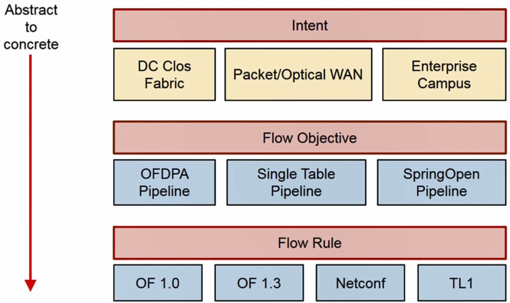

## Configuration

- ONOS 네트워크 설정 방법
- Network Configuration (netcfg)
  - 특정 서비스 등록, 설정에 대한 업데이트를 바꿀 수 있음
- Device Configuration
  - 특정 디바이스에 대한 설정을 바꿀 수 있음
- Dynamic Configuration (WIP)
  - YANG 기반의 서비스 모델을 이용해 ONOS가 동작하는 과정에서 특정 장비를 관리하기 위한 자바 인터페이스를 생성하고 해당 인터페이스를 통해 원하는 장비를 제어


---

# 16. ONOS Southbound & Application

- Southbound

  - protocol
    - 각 네트워크 장비와의 통신
    - 네트워크 장비에서 발생하는 컨트롤 메시지들을 관련된 네트워크 이벤트로 변환해서 provider로 전달
  - provider
    - onos 분산 코어와 통신
  - driver
    - 실제 디바이스의 behavior를 추상화

  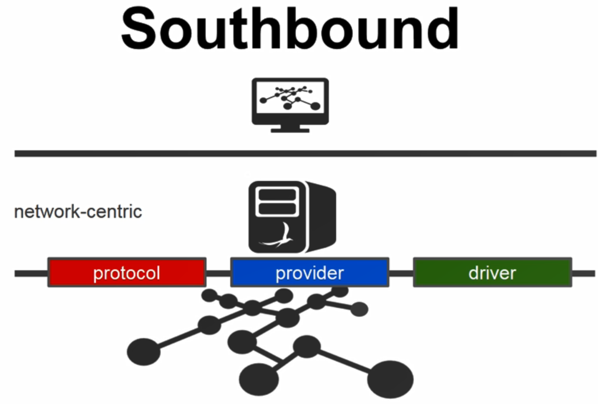

## Southbound Overview

- Southbound Protocols

  - OpenFlow
  - OVSDB
  - NETCONF+YANG
  - SNMP
  - P4
  - BGPLS, ISIS, OSPF
  - gRPC ...

- Southbound Interface Interactions

  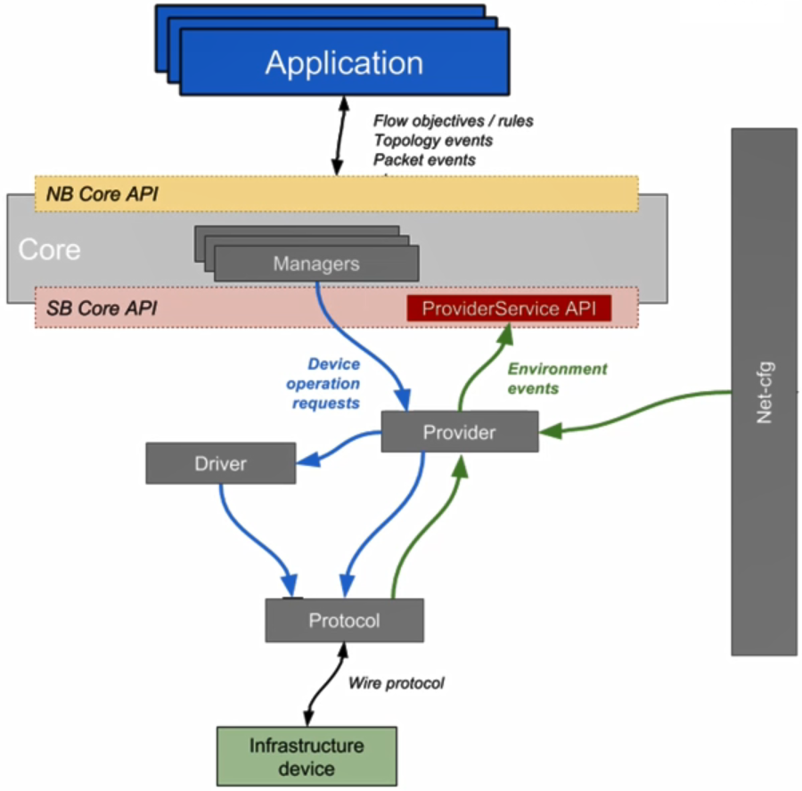

### Southbound Protocols

- 각 프로토콜 모듈은 ONOS와 디바이스의 통신에 필요한 여러가지 기능을 포함
- OpenFlow
  - FlowMods, GroupMods
- REST
  - Implements CURD operations
- NETCONF
  - Open/close session, setConfiguration, getConfiguration
- 대부분 이런 기능은 써드파티 라이브러리를 이용해 개발
  - Openflowj, snmp4j, thrift, gRPC, netty, etc.

## Applications

- Karaf application이라 볼 수 있음

  - onos는 apache karaf 프레임워크 위에서 동작하는 karaf bundle 어플리케이션

- Karaf 기반이기 때문에 onos 실행 중 어플리케이션ㄴ들을 동적으로 설치하고 삭제, 재시작하는 과정들이 가능

  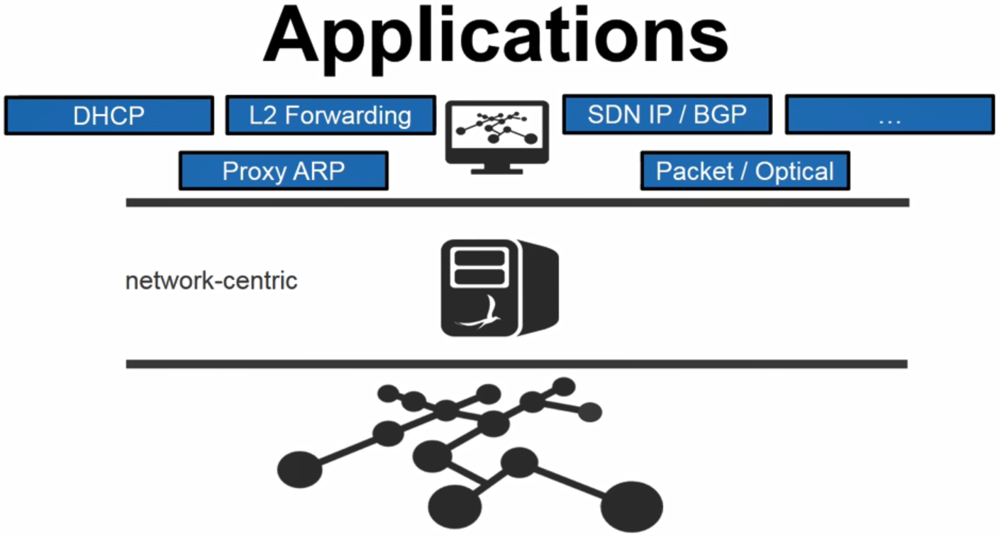

- Application Package

  - single .oar 파일로 패키징
    - oar파일은 JAR파일과 유사
      - 설정에 필요한 .xml 파일들과 번들들을 포함
    - onos-maven-plugin 파일을 통해 oar파일 생성

  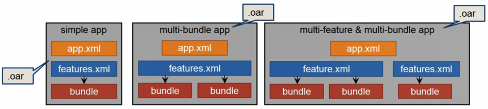


- Application Types
  - Application as a mere Component
    - 외부에 API 노출 x, self-contained
  - Application with Service Interface
    - 여러 API를 외부에 노출(CLI, REST API, web gui)
  - Application may have its own state
    - 자체적으로 상태를 갖고 어플리케이션이 실행되고 관리

### ONOS Recap

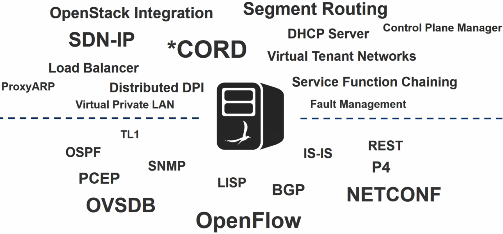


---

# 17. ONOS Code Walkthrough

- ONOS Northbound API
  - Web GUI
    - http://onos_ip:8181/onos/ui
  - CLI
    - local : karaf clean
    - remote : onos_ip
  - REST API
    - http://onos_ip:8181/onos/v1

## OSGi Bundles & Karaf Features

- OSGi Bundles
  - 번들 자체적으로 이름과 버전을 가짐
  - 번들 자체적으로 필요한 자바 라이브러리 임포트 가능
  - 번들에서 구현된 자바 패키지를 export 가능
- Karaf Features
  - 번들들을 그룹으로 설치/삭제를 쉽게하기 위해 만들어짐
  - XML 파일 형식

## Service Component Runtime(SCR)

- 싱글톤을 쉽게 구현하기 위해 annotation을 이용해서 구현
  - maven-scr-plugin이 컴파일 단계에서 OSGI-INF/*.xml 파일들을 추출해 관리
- `@Services`를 이용해 컴포넌트 싱글톤으로 생성
- `@Reference` 다른 싱글톤 인스턴스에서 참조하고 싶으면
- `@Activate`, `@Modified`, `@Deactivate` 해당 액션이 수행될 때 메소드 수행

## ONOS Application

- Maven archetypes
  - 어플리케이션을 자동으로 만들어줌
  - `onos-api-archetype`
  - `onos-bundle-archetype`
  - `onos-cli-archetype`
  - `onos-ui-archetype`
  - `onos-uitab-archetype`
  - `onos-uitopo-archetype`
- `mvn archetype:generate`를 이용해 생성
  - `onos-create-app` 같은 명령어

- 어플리케이션은 .oar 형식을 가짐
- ONOS 어플리케이션 관리 방법
  - REST API
  - shell tool
  - CLI
  - GUI

## BYON Application

- Bring Your Own Network

  - 스스로 가상 네트워크를 spawn할 수 있는 어플리케이션
    - 모든 디바이스가 연결된 full mesh 네트워크라고 가정
  - CLI commands를 이용해 BYON과 연결
    - `list-networks` : 생성된 가상 네트워크 나열
    - `create-network` : 가상 네트워크 생성(샘플코드로 제공)
    - `add-host` : 호스트 추가(샘플코드로 제공)
    - `remove-host` : 호스트 제거(구현)
    - `remove-network` : 네트워크 제거(구현)

  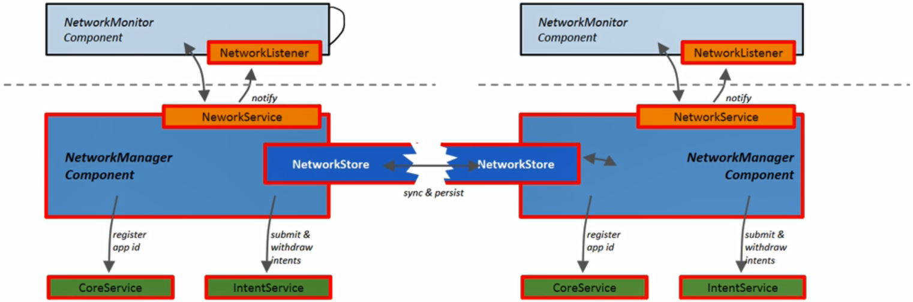

### Import & Build BYON App

- Follow Lab#1 of the Distributed Tutorial on the ONOS Wiki
  - https://goo.gl/5ezwoI
  - https://github.com/Andrea-Campanella/onos-byon-1.11


---

# 18. NFV-MANO #1

## Introduction

- 5G 기술 중에 핵심으로 꼽히는게 NFV

- NFV는 유무선 네트워크 장비에 가상화 기술을 적용하고 하드웨어 중심인 기능을 소프트웨어로 구현하는 기술

- 과거 새로운 네트워크 서비스나 기술이 등장할때마다 하드웨어에 종속된 소프트웨어 구조때문에 하드웨어, 소프트웨어를 모두 재설계하고 네트워크를 다시 구축해야 했음

  - NFV를 이용해 이를 해결

- NFVI

  - 하이퍼바이저에 의하여 하드웨어 리소스가 가상화된 형태로 제공

- 가상 리소스위에서 다양한 가상 네트워크 Function들이 개발되고 구동됨

  - VNF는 독립된 매니지먼트 시스템 EMS에 의하여 관리됨

- NFV Reference Architecture

  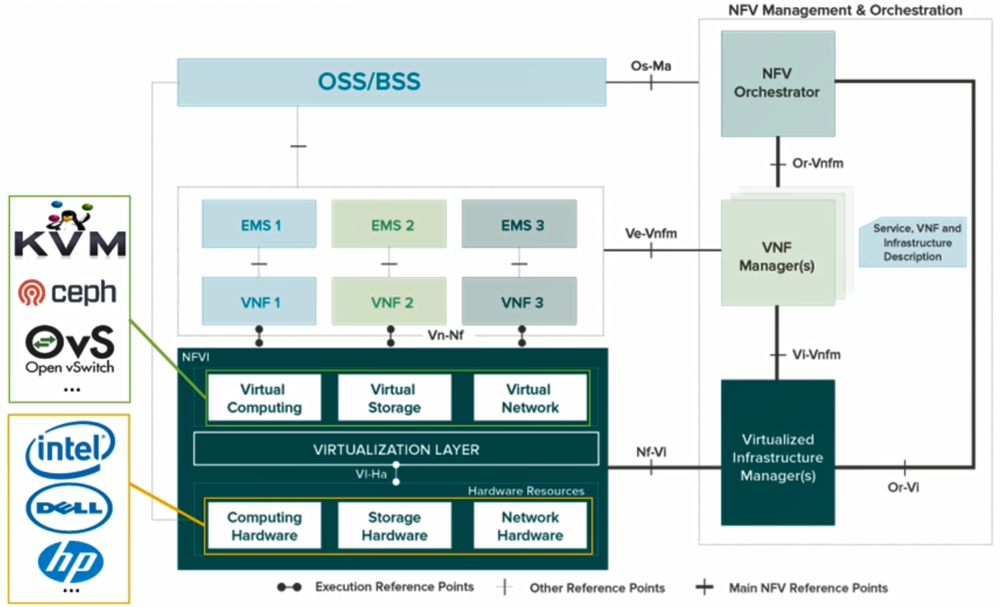

- NFV-MANO

  - MANO의 가장 큰 장점은 새로운 네트워크 기능을 배포하기 위하여 기존에는 오랜 시간이 걸렸지만 MANO에서는 새로운 네트워크 기능을 배포하기 위하여 수시간의 시간만 필요

  - 구성

    - NFV Orchestrator(NFVO)
      - VNF 생명주기, 전역 리소스 관리를 담당하고 NFVI 리소스 요청을 인증하고 validation하는 역할을 함
    - VNF Manager(VNFM)
      - NFVI와 EMS 사이의 설정과 이벤트 리포팅을 코디네이션하는 역할
    - Virtualized Infrastructure Manager(VIM)
      - NFVI 컴퓨트, 스토리지와 네트워크 리소스를 제어하고 관리

    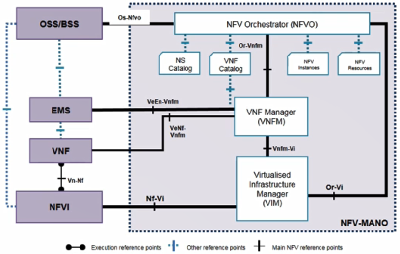

### NFV Orchestrator Summary

- NFV Orchestrator(NFVO)
  - VNF와 포워딩 그래프를 사용하여 VNF 오케스트레이션을 실현
  - 분할된 VNF들을 이용하여 end-to-end 네트워크 서비스를 템플릿화함
  - VNF가 사용하는 가상 리소스를 체크하고 할당
  - VNF는 포워딩 그래프를 통하여 서로 연결
    - 연결성 정보는 VNF Forwarding Graphs Descriptor를 통해 정의
    - VNF Forwarding Graph는 SDN Controller 혹은 SFC(Service Function Chaining) API를 통해 렌더링 
  - NFVO는 여러개의 VIMs 환경에서도 VNF를 오케스트레이션할 수 있음
- Example
  - OpenStack Tacker, Open Source MANO, OpenBaton, Open-O, etc.

### Virtual Infra Manager Summary

- Virtual Infra Manager (VIM)
  - NFVI 컴퓨트, 스토리지, 네트워크 리소스를 제어하고 관리
  - Northbound API를 외부에 노출하며 노출된 API는 VNFM에 사용됨
  - Operations
    - 물리 리소소와 가상 리소스의 매핑관리
    - 가상링크, 네트워크, 서브넷, 포트 및 시큐리티 그룹등을 정리하는 것을 통해 VNF 포워딩 그래프 관리에 필요한 부가 기능 제공
    - NFVI 하드웨어 리소스와 소프트웨어 리소스의 저장소를 관리
    - notification을 통하여 성능 및 장애 정보를 수집
    - 소프트웨어 이미지 관리
- Examples
  - OpenStack, CloudStack, VMware, WAS, etc.

### VNF Manager

- Functional Blcoks

  - 일부만 지원해도 VNFM이라고 할 수 있음

  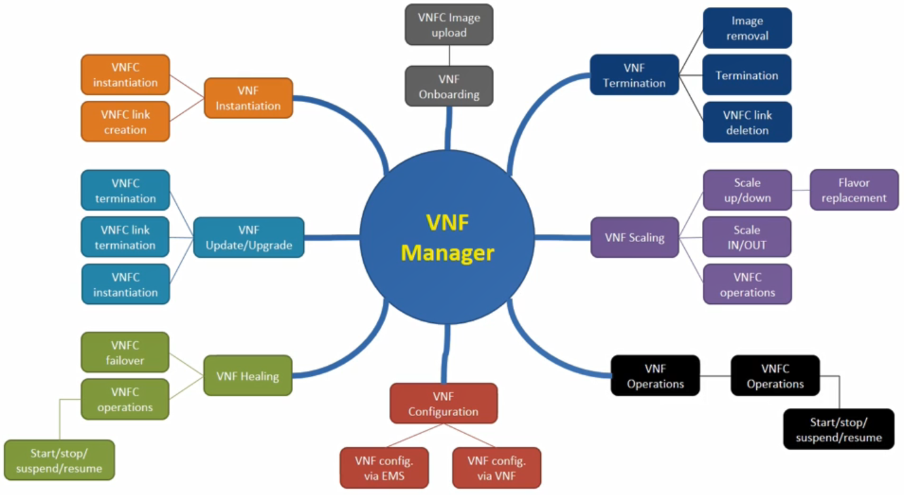


---

# 19. NFV-MANO #2

## NFVO and VNFM

- **Open Source NFVOs and VNFMs**

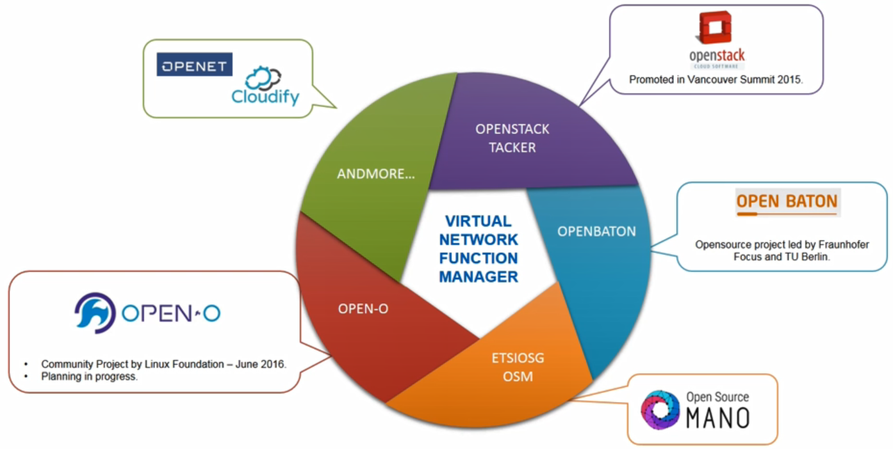

### **OpenStack Tacker**

- 오픈스택 커뮤니티에서 개발중인 NFV MANO
- NFVO와 VNFM을 통합한 형태
- 제공하는 기능
  - VNF Catalog - VNFDs in database
  - VNF 인스턴스화와 종료 기능 - HEAT and TOSCA
  - VNF specific한 관리 드라이버를 통하여 VNF 설정을 내릴 수 있음

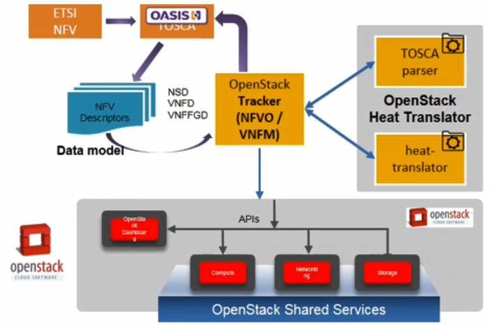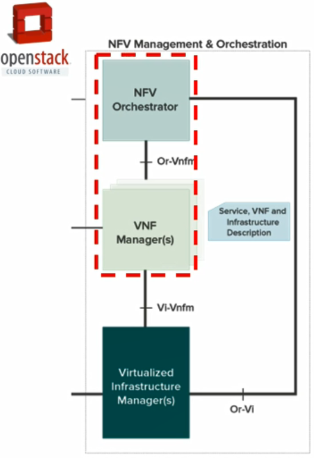

- Tacker Architecture

  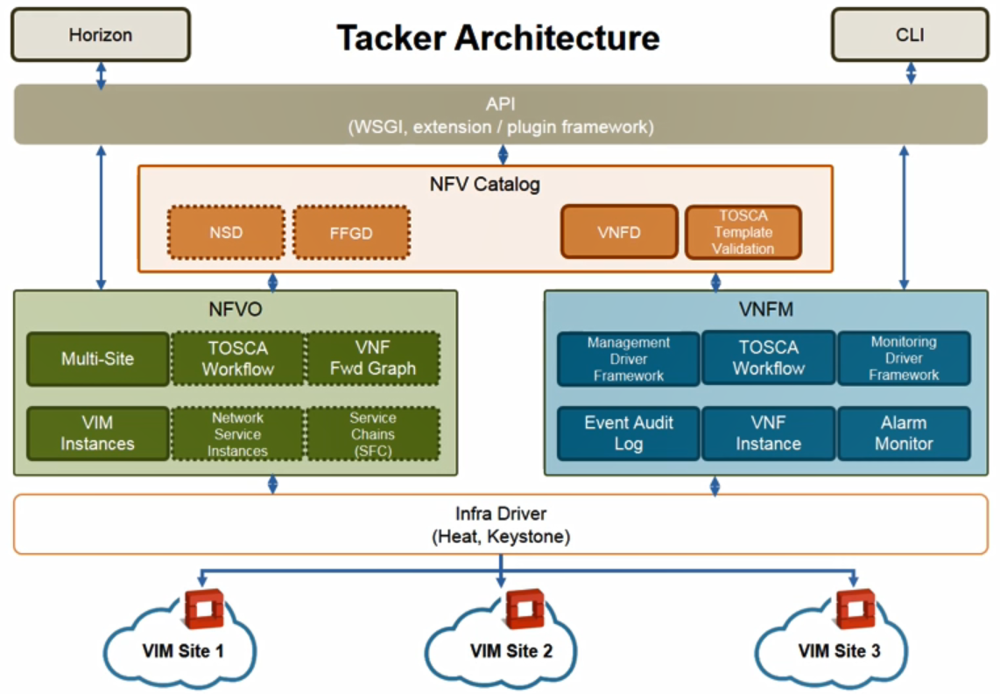

### OpenStack HEAT

- 오픈스택 컴포터는트 자체에 오케스트레이션을 담당하는 컴포넌트

  - MANO orchestrator에 일부 기능 커버

- 자동으로 리소스를 설정하고 스택에 배포할 수 있음

- 스택

  - 특정 템플릿에 연관된 일련의 리소스의 집합

- 템플릿

  - AWS CloudFormation
    - JSON 포맷
  - HOT(Heat Orchestration Template)
    - YAML 포맷

- 컴포넌트

  - heat-api
  - heat-api-cfn
  - heat-engine

  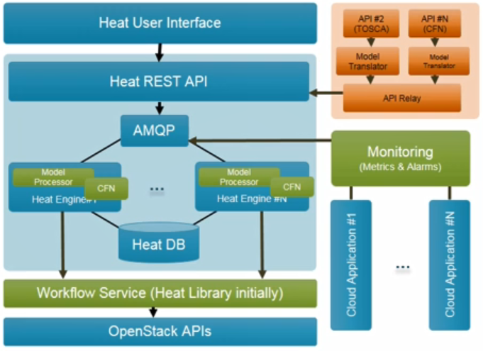

### Open Source MANO (OSM)

- 엣지에서 개발

- 서비스 프로바이더들에 의해 프로젝트가 시작

  - 기존의 기타 오픈소스들을 통합하는 것으로 시작

- OpenStack Tacker와 유사하게 NFVO와 VNFM을 구현

  - 새롭게 구현된 것이 아닌 기존의 오픈소스들을 참조하여 개발


#### NFVO

- Resource Orchestrator(RO) : **OpenMANO**
- Network Service Orchestrator(NSO) : **RIFTware**

#### VNFM

- VNF models & configuration
- Juju charms

- Multiple connectors

  - OpenVIM, OpenStack, VMWare, etc.
  - SDN
    - Support ODL and Floodlight

  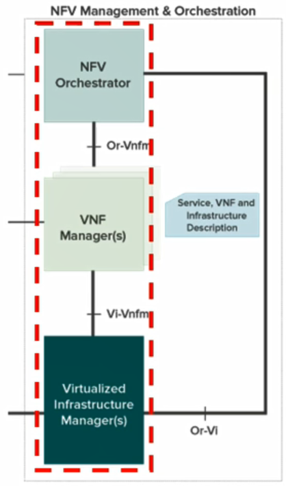

- Overall Architecture

  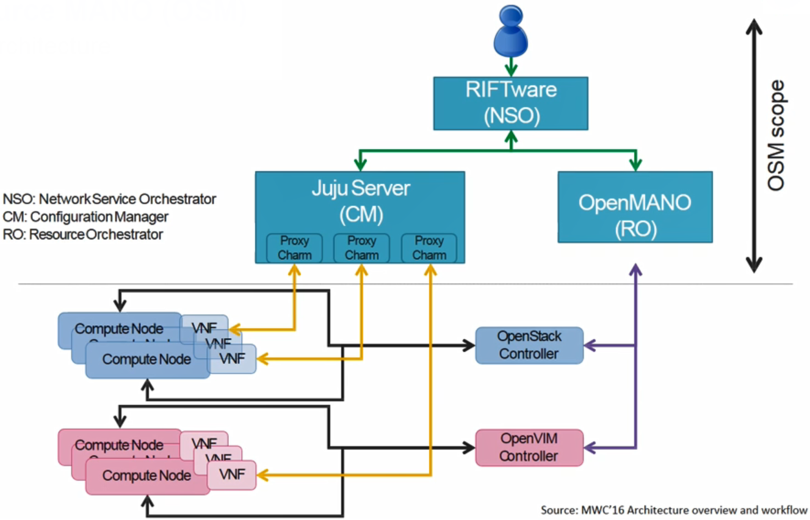

- 호환을 위한 다양한 기능 제공

  - OSM은 다양한 SDN 컨트롤러를 통합하기 위한 여러가지 플러그인 인터페이스 제공
    - 플로우 룰을 OpenVIM API를 통하여 네트워크 장비들에 내림
  - 다양한 VIM들을 통합하기 위한 플러그인 모델 제공
  - 제네릭한 VNFM과 Specific한 VNFM 모두를 지원
  - 레거시 미들웨어들과 호환성을 제공하기 위하여 Physical Network Function(PNF) 제공
  - Greenfield와 Brownfield Deployments 제공

  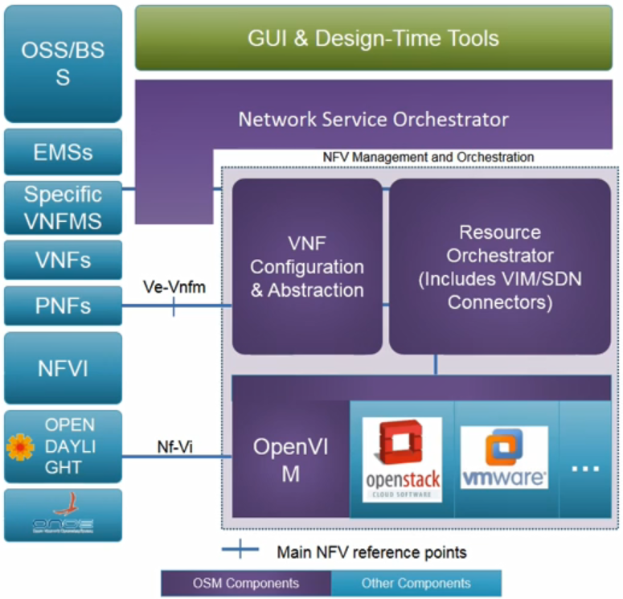


#### OpenMANO

- 리소스 오케스트레이션을 담당하는 컴포넌트
- OpenVIM
  - NFVI 테넌트, VM Image, Flavor 관리
- OpenMANO
  - VNF 카탈로그, 네트워크 서비스 카탈로그 관리
  - 네트워크 서비스와 VNF 배포를 담당
- OpenMANO-GUI

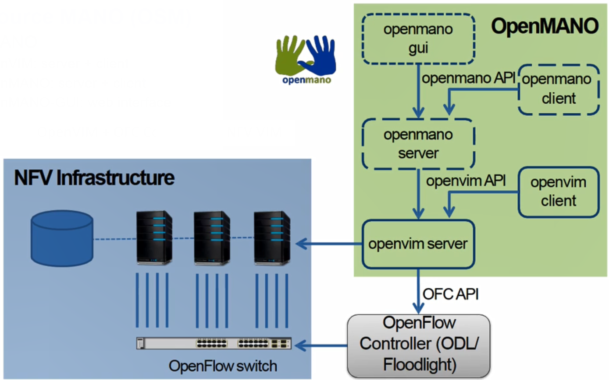

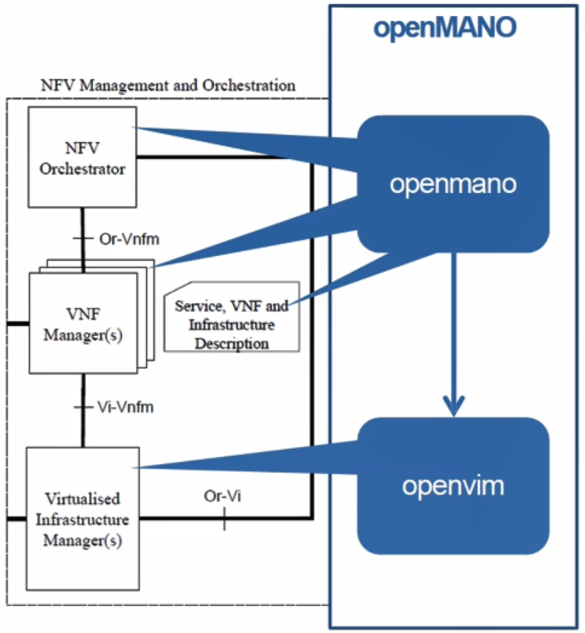

#### RIFTWare

- Network Service Orchestrator(NSO)
- 카탈로그 관리 기능을 통하여 네트워크 서비스(NS) 및 VNF 패키지를 생성하고 업데이트하는 역할 수행
- UI Composer
  - Catalog manager
  - Canvas
  - VNF/NS descriptor editor
- Data model translator
  - YANG Model 지원

#### Juju

- 오픈 소스 어플리케이션 모델링 툴로 Service-Oriented Architecture와 배포를 가능하게 함
- 개발된 서비스들은 Charms로 불림
- CHarms는 Charms Store 커뮤니티에서 제공
- 가장 큰 단점은 Ubuntu에서만 동작
- OSM에서의 Juju
  - 제네릭한 VNFM의 여러 기능을 제공

#### Juju Charm

- metadata.yaml
  - VNF 메타 정보와 charm에 의하여 제공해야 할 서비스 정보, 필수 파일
- config.yaml(optional)
  - 실행되는 서비스 혹은 어플리케이션 실행에 필요한 옵션들을 포함한 설정 파일
- Hooks
  - 특정 어플리케이션을 설치, 시작, 중지, 삭제, 설정

#### VNFD with Juju Charm의 관계

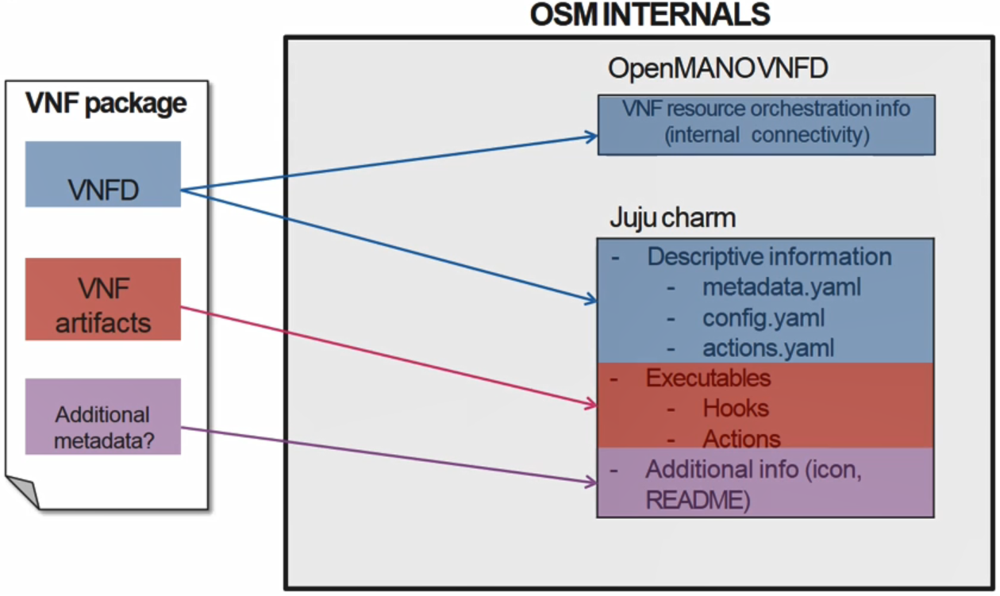


---

# 20. NFV-MANO 3

### Open Baton

- 특징
  - MANO
  - NFVO + VNFM
    - NFVO : NSD 생명주기 관리
    - VNFM : generic과 specific VNFM 둘 다 제공
  - Open Baton은 OSM과 다르게 TOSCA 템플릿을 통하여 VNF 프로비저닝 수행
  - 오토스케일링 엔진 탑재
  - 멀티 VIM 제공
  - 라이브러리 제공
    - 개발자들은 제공되는 라이브러리를 이용해 자신만의 VNFM을 개발하고 빌드할 수 있음
  - 대시보드 제공


#### **Generic VNFM**

- 사용자는 VNFM을 사용하여 NFVO로부터 특정 가상 인프라 리소스를 할당받을 수 있음
- 실행가능한 오퍼레이션
  - Instantiation, Modification, Starting and stopping of the virtual services
- generic EMS를 통하여 specific한 설정 스크립트 실행 가능
- Juju와 Juju 플러그인을 통해 연동 가능

- generic VNFM을 이용하여 사용자가 정의한 VNF를 통합 가능

  - Implements installation scripts
  - Builds custom VNF package
  - Configures OpenBaton EMS
  - Configures generic VNFM
  - Provides VNFD
  - Provides VM images

  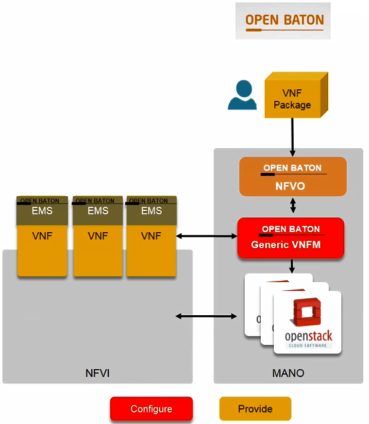


#### **Specific VNFM**

- 가상 리소스를 프로비저닝하는 두가지 방법 존재
  - VIM 드라이버를 통해 직접 프로비저닝
  - NFVO한테 프로비저닝 요청을 보내어 하는 방법
- specific VNFM이 NFVO와 상호 연동 방법
  - 메시지 큐를 통한 Publish/Subscribe 방법
  - RESTful API

- VNFM 구현 방법

  - Solution 1
    - NFVO에서 제공하는 REST API를 조사하여 해당 API에 맞는 VNFM 구현
    - 통신 한계 때문에 다량의 데이터나 요청에 짧은 시간에 그걸 처리하기 위해 오버헤드 발생
  - Solution 2
    - OpenBaton에서 지원하는 Java SDK를 사용하는 방법
    - Java SDK를 사용하면 Native JAVA API를 직접 호출할 수 있기 때문에 성능상 많은 이득

  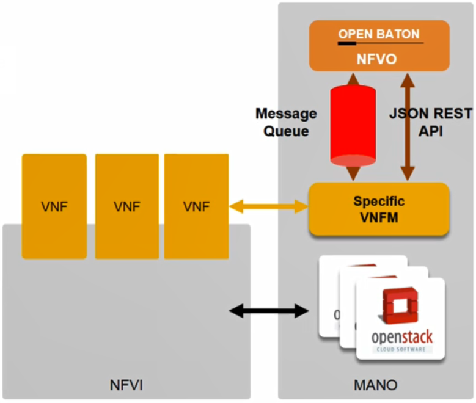

- **모니터링 기능**

  - Zabbix 모니터링 툴을 사용하여 NFVI와 VNF에 대한 모니터링 수행
  - Autoscaling Engine(AE)를 이용하여 Zabbix에서 모니터링된 결과를 근거하여 Scail in/out 수행
  - Network Slicing Engin(NSE)를 사용하여 VM간 통신을 수행

  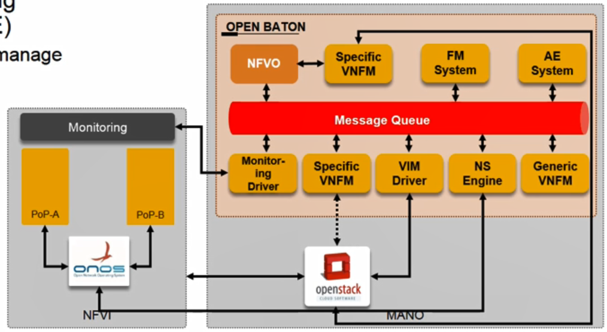

### Open-O

- 오픈소스 MANO 프로젝트

  - 실제 실현하고자 하는 범위가 MANO 이상

- Open-O가 추구하고자 하는 것

  - Open-O를 통하여 carrier로 하여금 OSS(Operation Support System)부터 OSS(Open Source Software)로 진화하는 것

- 드라이버를 통하여 NFVO, VNFM, EMS와 VIM 등을 지원

  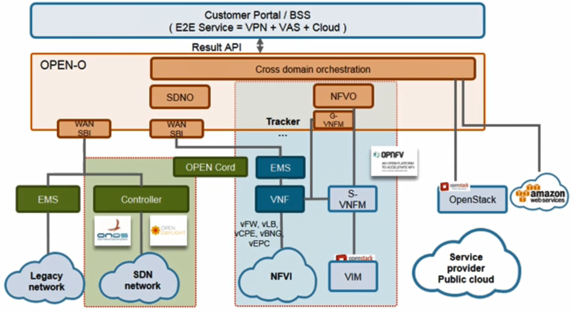

  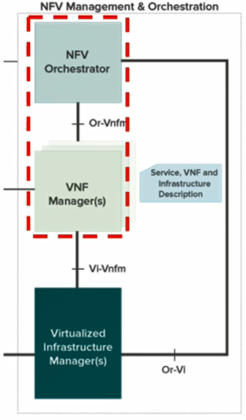

### OPENT "Weaver"

- VNF 생명주기 관리 제공
- VNFM 기능 제공
- 모든 VNF상에 위치한 VNF를 단일 포인트 제어 및 설정으로 관리하고 API 형태로 외부에 노출

### Cloudify

- TOSCA 기반
- generic VNFM만 지원
- 강력한 모니터링, 로그 수집, 힐링, 스케일링 기능 제공

### Summary

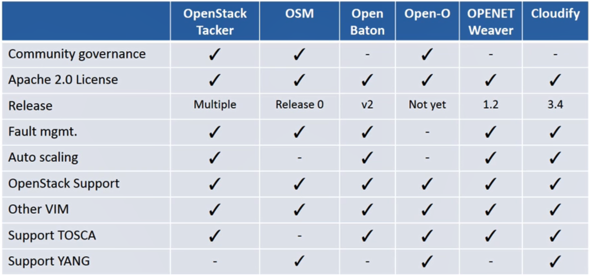


---

# 21. Fast Packet Processing Methods

### Software Packet Switching

- NFV

  - 고속 패킷 프로세싱을 위한 기술 필요

  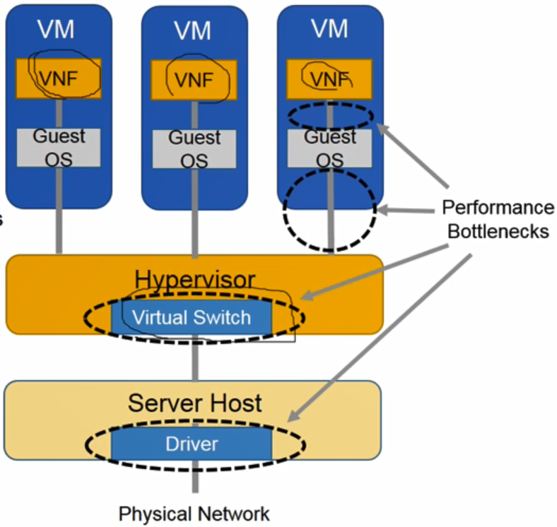

### DPDK

- DPDK(Data Plane Development Kit)

  - 리눅스 운영체제로 동작하는 서버에서 패킷 프로세싱에 리눅스 커널 내부에 존재하는 네트워킹 스택 사용
    - 패킷 단위로 인터럽트를 발생시킴
    - kernel networking stack과 실제 응용 프로그램이 존재하는 user space 사이를 오고가기 때문에 context switching이 많이 발생
    - 그에 따른 메모리 카피가 많이 발생
    - 일반적인 용도의 서버로 사용할 때는 동작할 때 성능에 큰 문제가 없음
    - NFV환경의 VNF를 사용하려면 VNF에 패킷을 빠르게 공급하거나 입출력하기에는 이러한 기존 방식에는 성능에 제약이 있음
  - 고속 패킷 프로세싱을 위한 유저 스페이스의 라이브러리 집합 혹은 DPDK 기반의 네트워크 응용 개발을 위한 프레임워크라고 정의할 수 있음
    - 패킷은 cpu interrupt를 발생시키지 않고 dpdk 전용 user space로 전달
    - 고속 패킷 프로세싱을 위한 CPU affinity, huge page, multi-queue와 같은 다양한 네트워크 커스터마이제이션 기술들을 지원

  

- **DPDK Features**

  - Environment Abstraction Layer(EAL)
    - 하드웨어 환경 추상화
  - Poll Mode Drivers(PMD)
    - 네트워크 I/O를 하기 위한 Direct Memory Access 기술
    - 네트워크 카드로 수신되는 패킷들이 기존 linux 네트워크에 커널 네트워크 스택을 거치지 않고 바로 user space의 dpdk 응용 프로그램이나 네트워크 인터페이스 카드로 전달되도록 하는 핵심적인 역할을 수행하는 컴포넌트
  - Memory Manager
  - Buffer Manager
  - Queue Manager
  - Packet Flow Classification
    - 수신된 패킷의 헤더를 분석해 그룹핑

  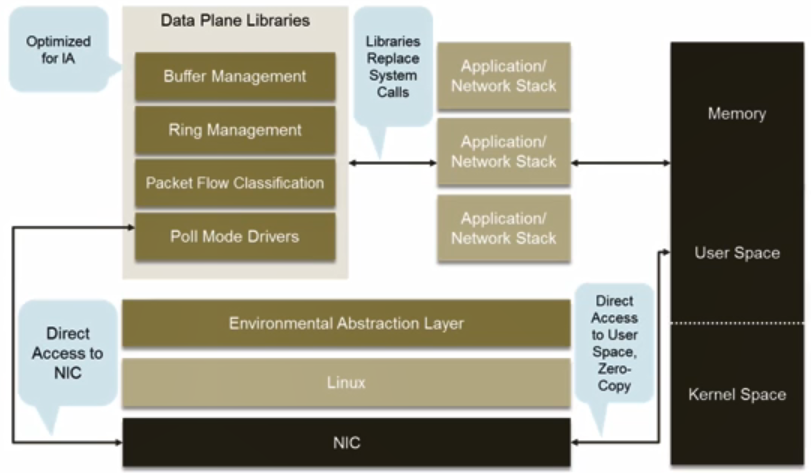

### Open vSwitch

- Open vSwitch(OVS)

  - NFV 구성을 위해서 서버 가상화 환경에서 가장 일반적이고 많이 사용하는 가상 소프트웨어 스위치
  - VM간의 통신, VM과 외부와의 통신을 위해서 호스트 서버 내에서 기본적인 패킷 스위칭 기느을 수행
  - 관리 프로토콜을 통한 다양한 네트워킹 서비스 및 SDN 제어 매커니즘 지원
    - IPv6, tunneling, NIC bonding, 포트 미러링 등의 다양한 네트워크 기능들을 지원
    - 오픈플로우, OVSDB, NetFlow, sFlow, (R)SPAN, etc
  - Key Components
    - kernel module : forwarding, de/encapsulation, cache lookup
    - ovs-vswitchd : overall forwarding logic management (from remote)
    - ovsdb-server : an access to configuration details (ovsdb)

  

- OvS의 패킷 프로세싱

  - 가상 인터페이스에 패킷이 도착했을 때 해당 패킷을 어떻게 처리하는 가
  - **Fast path**
    - ovs kernel module이 해당 패킷에 매칭되는 플로우 룰을 캐시 테이블에서 찾음
    - 캐시 테이블에 해당 룰이 존재하면 룰에 따라 처리
  - **Slow path**
    - 만약 해당 포워딩 룰이 캐시에 없으면 커널 모듈은 vswitch 데몬에 해당 패킷 정보를 제공
    - vswitchd는 그 정보를 바탕으로 사용자가 설정한 모든 포워딩 룰들을 포함하고 있는 포워딩 테이블에서 해당 패킷을 처리할 수 있는 포워딩 룰을 찾아 이를 다시 커널 모듈에 캐시 테이블에 등록
    - 이후 커널 모듈은 방금 등록된 포워딩 룰을 바탕으로 패킷을 처리
    - 추가적인 과정이 포함되어 Slow path
    - context switching 이 빈번하게 일어나고, 메모리 카피와 전체 테이블을 lookup해야된다는  요구사항이 있어 Throughput, PPS, delay 성능 저하

  


### OVS-DPDK

- Open vSwitch with DPDK (OVS-DPDK)

  - DPDK 기반으로 유저 스페이스에서 DPDK를 이용해 다시 구현된 Open vSwitch
  - 기존의 OVS는 user space와 kernel space에서 ovs의 주요 컴포넌트들이 따로 동작
  - DPDK로 재구현되면서 user space에서 모든 컴포넌트 구현됨

- Features

  - EAL
  - vHost-user port (Virtual switch <-> VM virtual NIC)
  - Multi-queue support in vHost-user
  - Tunneling support : VxLAN, GRE, Geneve
  - QoS support
  - DPDK statistics

  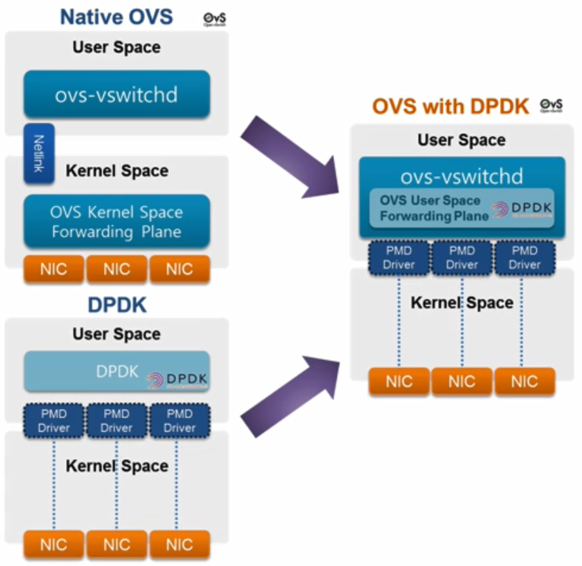

- OVS-DPDK Details

  - Native OVS와 달리 패킷 포워딩을 위한 패스가 계층화되지 않고 모두 user space 처리
  - 기본적으로 DPDK의 PMD를 기반으로 동작하기 때문에 context switching, memory copy에 따른 성능 저하를 대폭 줄임
  - OVS-DPDK는 대표적으로 3개의 쓰레드
    - Packet reception
      - PMD 기반으로 특정 DPDK 기반 인터페이스로부터 패킷을 수신하거나 그쪽으로 패킷을 송신하는 역할을 담당
    - Flow classification / lookup
      - 패킷 헤더 정보를 고속으로 판단해서 이를 네트워크 플로우라는 개념으로 분류
    - Packet transmission
      - PMD 기반으로 특정 DPDK 기반 인터페이스로부터 패킷을 수신하거나 그쪽으로 패킷을 송신하는 역할을 담당
  - 호스트 서버가 제공하는 공유 메모리 위에서 RING기반의 queue를 사용해서 DPDK 쓰레드들과 위에서 동작하는 DPDK 응용프로그램 간의 커뮤니케이션 및 연산 처리를 고속으로 수행

  

### SR-IOV

- SR-IOV(Single Root I/O Virtualization)

  - 고속 패킷 프로세싱을 위해 하드웨어적인 접근 방식
  - NIC 가상화하는 기술
  - SR-IOV로 구성된 데이터 패스는 호스트 서버의 하이퍼바이저, 가상 스위치를 일체 경유하지 않고 호스트 서버의 물리적인 네트워크 카드와 VM을 직접 연결
    - 서버 가상화에 따른 오버헤드가 발생하지 않음
    - 속도면에서 가장 빠름
  - 여러 개의 VF들로부터 굉장히 많은 I/O가 발생하는데 이를 처리하기 위해 단일 큐를 사용하면 Single Root IOV라고 하고 multi queues를 이용해 처리하며 Multi Root IOV라고 함

  

#### Hybrid Approach

- 하지만 SR-IOV의 구조상 가상 스위치를 경유하지 않기 때문에 호스트 내부에서 VM들간의 통신이 필요할 때 패킷 스위칭을 제공할 수 없고 가상 스위치가 제공하는 각종 부가적인 네트워크 서비스 및 별도의 제어 평면 기능 사용 불가

- 사용목적에 따라 SR-IOV와 가상 스위치를 결합시켜 사용할 필요가 있음

  - VM 0,1 : 호스트 박스, 호스트 외부와의 고속 통신을 요구하는 VNF를 배치하고 있음
  - VM 2,3 : VM 상호간의 통신을 하거나 추가적으로 외부와의 통신이 필요한 VNF가 동작

  


---

# 22. Datapath Composition

### Datapath 구성 방안

#### (1) Original OVS in Host + Virtio in VM

- 일반적인 모드로 동작하는 OVS를 호스트 서버에 가상스위치로써 배치

- VM을 Virtio 기반의 가상 네트워크 인터페이스를 가지도록 구성

  - Virtio : VM의 가상 네트워크 인터페이스 카드를 위한 표준화된 가상 드라이버

- 일반적으로 가장 많이 사용되고 쉽게 구현 가능한 방법

- VM 마이그레이션, 특히 라이브 마이그레이션할때도 구성이 단순해 유리한 방법

  - 하지만 고속 패킷 프로세싱 기술이 사용되지 않기 때문에 VM에서 동작하는 VNF를 위한 속도 측면에서 한계점 존재 

  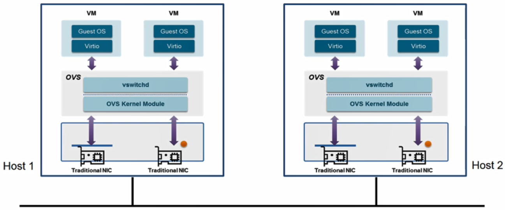

#### (2) OVS-DPDK in Host + DPDK PMD in VM

- 가상스위치로써 OVS-DPDK를 사용

- DPDK 라이브러리를 이용해서 DPDK로 구현된 응용을 VM 동작하는 VNF로 구현한 datapath 구성

  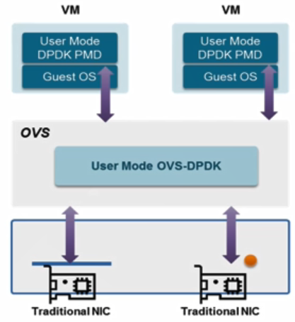

#### (3) SR-IOV in Host + VF Driver in VM

- 호스트 서버에서 SR-IOV 지원하는 카드를 이용해서 Virtual Function(VF)을 만들고 만든 VF를 VM에 가상 인터페이스에 바로 연결하는 방법

- 가상스위치를 경유하지 않고 패킷 프로세싱을 할 수 있어 패킷 전달 속도 면에서 가장 우수

- 가상스위치가 제공하는 여러 네트워크 기능들을 사용할 수 없음

- VF과 VM간에 바인딩 정보가 존재하여 VM을 다른 호스트 서버로 마이그레이션할 때 fix된 정보들 때문에 마이그레이션하는데 제약사항이 있음

  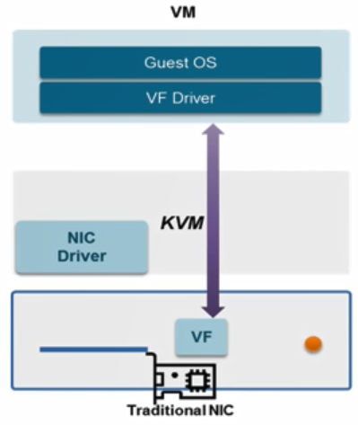

#### (4) SR-IOV in Host + DPDK in VM

- 가장 높은 수준의 고속 패킷 프로세싱을 요구하는 VNF에 적합한 데이터패스 구성

- 호스트서버에 물리 네트워크 인터페이스 카드를 SR-IOV로 지원하는 카드를 사용해서 VF를 구성

- VF를 VM에 Virtual Interface 혹은 VF Driver에 다이렉트하게 연결하는 SR-IOV 구성

- VM에서는 DPDK PMD thread를 이용해서 수신된 패킷을 DPDK 기반 응용으로 고속으로 패킷 프로세싱하는 구조

- 이러한 수준의 구성을 요구하는 VNF의 예

  - 패킷 헤더 및 페이로드를 인스펙션하는 DPI과 같은 네트워크 기능들이 VNF로 구현되었을 때 적합

  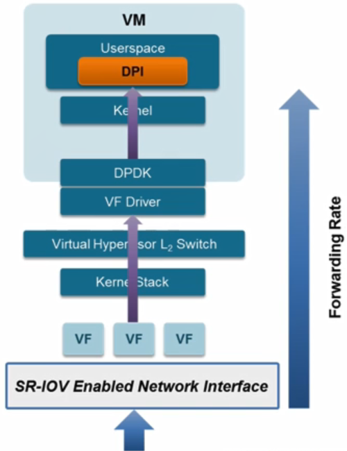

#### Datapath Composition Comparison

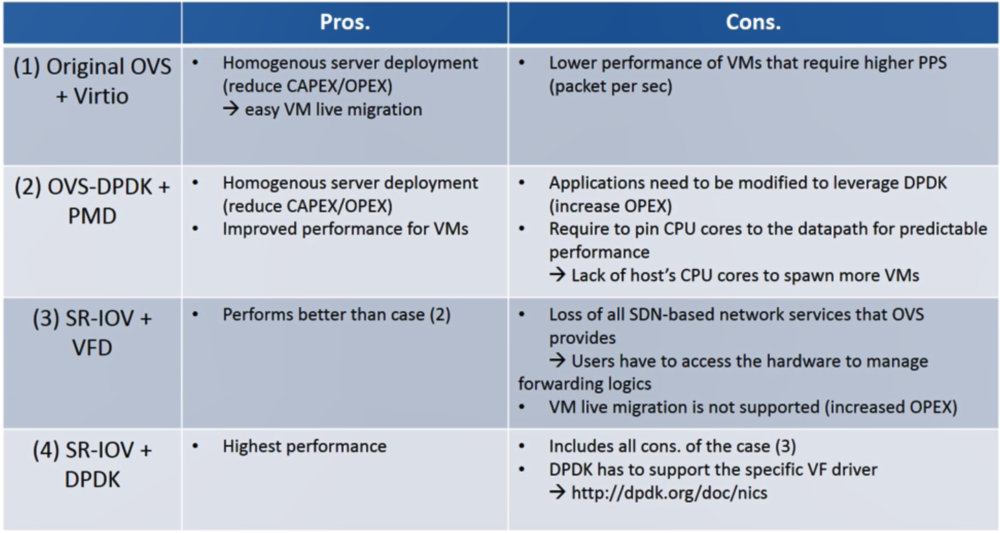

### Performance Evaluation

- (3)과 (4)의 성능 비교

  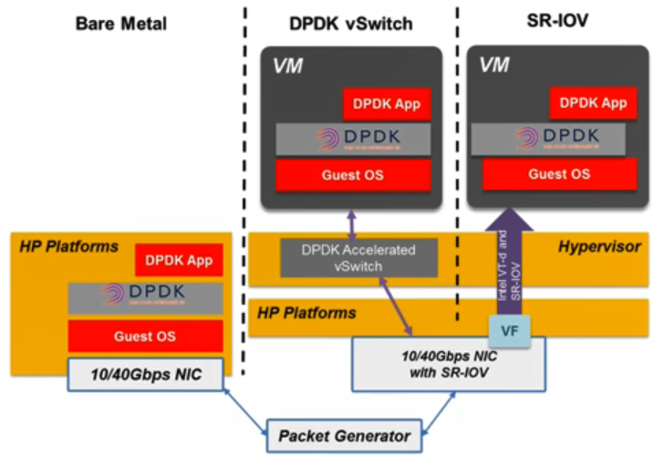

#### Bare Metal

- 추가적인 패킷 프로세싱 없이 단순히 throughput 측정

- 20G/bps의 throuput을 패킷 사이즈에 관계없이 보여줌

  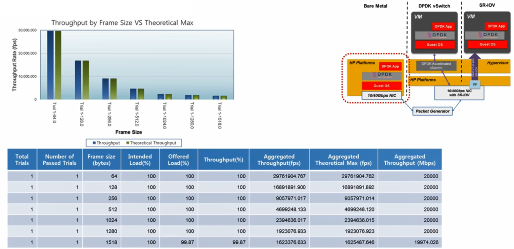

#### SR-IOV (with DPDK)

- 64바이트 패킷에서 성능이 떨어짐

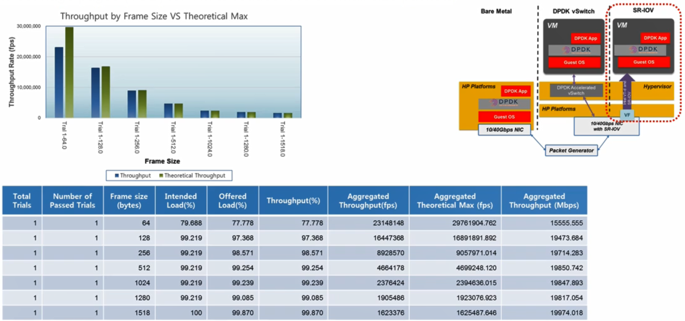

#### OVS-DPDK

- 다른 패킷 사이즈에서는 비슷한 성능을 보이지만 64바이트 패킷에서 50% 정도의 성능을 보임

- 성능이 감소하는 이유

  - DPDK에 PMD thread가 잘 동작하기 위해서는 호스트 서버에 CPU 코어를 전용해서 사용해야함
  - 이때 코어가 감당할 수 있는 수준 이상으로 패킷이 많이 발생해 pps값이 급증하게 되면 CPU 코어에 대한 감당할 수 있는 이상으로 부하가 발생해 패킷 드랍이 발생 

  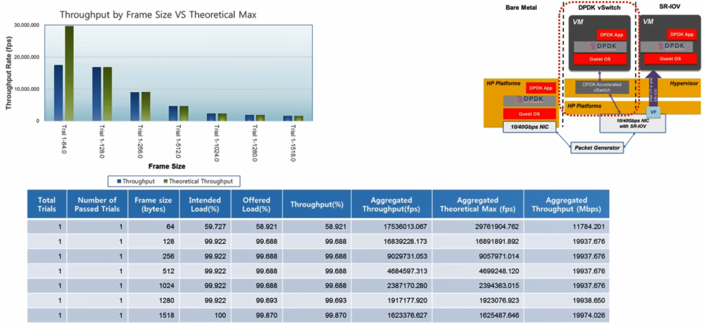

#### Conclusion

- OVS-DPDK 기반 데이터 패스 구성이 SR-IOV 구성에 비해서 평균 90% 정도 수준의 throughput을 보여주는 것을 확인 가능
- 반면에 OVS-DPDK가 가장 좋은 성능을 낸다고 보이는 SR-IOV 기술 대비 굉장히 근접한 성능을 보이기 때문에 실효성에 대해 설명할 수 있음
- SR-IOV에서 제공하지 못하는 다양한 SDN 기반 가상 스위치 제어 기능을 OVS-DPDK에서 사용 가능
  - 따라서 다양한 VNF 예제들에 적용할 수 있음
- 또한 OVS-DPDK가 버전 업을 하고 있기 때문에 성능 수준이 증가
- https://download.01.org/packet-processing/
- 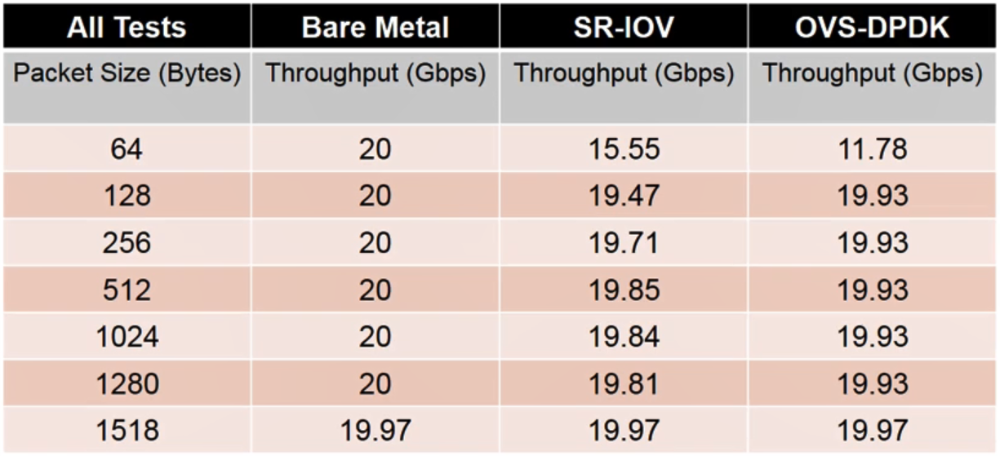


---

# 23. OpenStack Introduction

### OpenStack Overview

- 오픈스택은 Rackspace와 NASA의 공동 프로젝트

  - 2015년부터 OpenStack Foundation에 의해 관리

- Intel, HP, RedHat, IBM 등 참여

- 클라우드 컴퓨팅 매니지먼트 / OS

  - 인프라 서버들을 클러스트화하고 이것들을 가상화해서 서버위에서 승인된 사용자가 VM들을 생성하고 VM 간의 네트워크 구축하는 등의 기능을 수행할 수 있음
  - 그 외에도 가상화된 인프라에서 Hadoop, bare metal provisioning 등의 기술 지원

  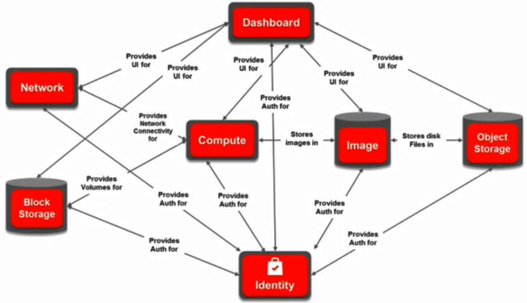

### OpenStack Core Components / Services

- OpenStack이 제공하는 주요 기술들은 주요 서비스 컴포넌트들에 의해서 실행

#### Keystone(Identity, Authentication)

- 오픈스택 관리자, 사용자들의 권한 부여 및 서비스 실행을 위한 접근 제어 및 인증 기능을 수행
- 오픈스택에 모든 대부분의 서비스들은 내부적으로는 REST API를 사용
- REST API 과정에 필요한 토큰들도 관리

#### Glance(Image service)

- VM 생성시 사용되는 기본 VM 이미지들을 관리하는 서비스
- Glance에 등록된 VM 이미지들마다 서로 다른 OS 가질 수도 있고 어플리케이션 스택 등을 가지게 구성할 수 있음
- NFV에 관해서는 네트워크 기능 수행을 위해서 이미 구현된 VNF이 VM 이미지 형태로 Glance에 등록되어 오픈스택과 연동된 NFV MANO 컴포넌트, 외부 컴포넌트에 의해서 VM 형태로 생성되고 삭제되고 갱신되는 라이프 사이클 매니지먼트가 될 수 있음

#### Cinder(Block storage)

- 생성된 VM을 위해서 하드디스크 기반의 스토리지 서비스 제공
- VM 생성시 기본적으로 할당된 스토리지 이외에 Cinder 컴포넌트를 이용해 별도의 스토리지 공간에서 대여해 VM에 할당

#### Swift(Object storage)

- 오픈스택 사용자의 VM에 저장되고 있는 데이터들을 복제해서 오픈스택의 다른 머신에 데이터들을 분산 저장함으로써 데이터를 안전하게 백업하고 보관하는 서비스 제공

#### Neutron(Network management)

- 관리자 입장에서 전체 인프라의 네트워크를 구성하고 관리할 때 사용자 입장에서는 사용자에게 isolate된 VM간에 네트워크를 구성할 때 VM간의 연결성을 설정하고 네트워크 전반에 걸친 매니지먼트 시스템을 제공
- virtual router, virtual switch, virtual NIC

#### Nova(Compute)

- VM 생성, 제거, 중단, 마이그레이션 등 VM 라이프 사이클 전반에 관련된 관리 수행
- VM 생성 요청시에 VM이 배치가 되는 가장 적절한 호스트 서버를 찾아 생성
  - 이 과정에서 해당 VM의 Glance를 통해 제공되는 설치 이미지, Neutron을 통해 제공되는 네트워크 구성, Cinder나 Swift를 통한 스토리지 구성 등을 반영하기 위해 다른 컴포넌트와 상호작용하면서 동작

#### Horizon(Dashboard)

- 앞서 소개된 주요 서비스 및 이에 대한 전반적인 구성을 감시, 관리할 수 있도록 오픈스택의 관리자, 사용자들에게 웹 브라우저 기반의 대시보드 제공
- 사용자 권한에 따라 CLI를 사용해서 보다 세부적인 구성 및 관리가 가능하지만 Horizon이 제공하는 대시보드를 통해서 보다 유저 친화적이고 중앙 집중화된 환경에서 오픈스택 활용 가능

### External Access

- 오픈스택 외부에서 오픈스택 서비스를 사용하기 위해서는 오픈스택 CLI를 사용하거나 Horizon의 대시보드를 사용하는 2가지 방법 존재

- 2가지 방법 모두 각 서비스 컴포넌트에 정의된 서비스 별 REST API를 호출하는 것으로 변환

  - ex) VM을 생성하기 위해서는 CLI나 대시보드를 사용해서 요청을 했을 때 내부적으로는 NOVA 컴포넌트의 REST API를 호출하는 것으로 변환

  

### Internal Communication 

- AMQP(Advanced Message Queuing Protocol)
  - AMQP 방식을 지원하기 위한 Message broker로써 자바로 구현된 RabbitMQ 사용
- SQL
  - 오픈스택의 사용자 메타 데이터, 인증 정보, 사용자 정보, 네트워크 구성 정보, VM들의 프로파일들 그외에 사용자 수준의 다양한 정보 존재
  - 이러한 정보를 저장하기 위한 SQL 기반의 MySQL/MariaDB 같은 데이터베이스 사용
  - 서비스가 실제로 사용되기 위해서는 다른 서비스와 서로 상호작용을 통해서 실행되는데 그때 AMQP 방식의 Message Queuing과 더해서 데이터베이스에 필요한 정보를 조회해 활용하고 저장

### General Architecture

- 오픈스택에서는 인프라를 구성하기위한 서버들을 일반적으로 노드(node)라고 지칭


#### Controller node

- 오픈스택의 주요 서비스들의 컴포넌트를 구동시키는 서버로써 오픈스택 외부에서 인터넷을 타고 들어오는 요청은 모두 컨트롤러 노드로 전달되서 각 서비스 컴포넌트의 REST API를 호출시킴으로써 실행
- AMQP와 SQL기반의 데이터베이스 등도 다 컨트롤러 노드에 설치되고 운영 

#### Network node

- 오픈스택 네트워크(Neutron 서비스 컴포넌트)를 실행하고 있으며 오픈스택 사용자를 위한 가상 라우터 서비스 (DHCP) 제공
- 오픈스택 사용자를 위한 네트워킹 구성을 위한 다양한 네트워크 기술들과 기술들을 구현하고 있는 구현체들을 통합, 관리, 운영하는 노드

#### Compute node

- VM이 생성되고 동작하는 호스팅 서버를 의미
- 이를 위해 Nova 컴포넌트가 설치되어서 동작하는 VM의 라이프사이클을 관리하고 서버의 자원관리 수행
- VM을 많이 생성할 수록 컴퓨트 노드가 많이 필요
  - 스케일이 커짐에 따라 컨트롤러 노드와 네트워크 노드도 여러 개가 사용

#### Management Network

- 노드들이 물리적으로 떨어져 있는데 노드들간에 서비스 실행을 위해 상호 필요한 부분을 API 호출을 통해 서비스를 실행
- 오픈스택에 내부 컨트롤 메시지들을 위한 전용 네트워크

#### Data (guest) Network

- 물리적으로 떨어진 컴퓨트 노드에 위치한 VM들간에 트래픽을 주고 받기 위한 네트워크
- 이를위해 VXLAN, VLAN과 같은 터널링 기술들 사용
- VM에서 오픈스택 외부와의 통신을 위해 네트워크 노드와의 업링크, 다운링크의 역할 수행

#### External Network

- 네트워크 노드를 통해서 제공되는 컴퓨트 노드에 VM과 외부 인터넷에 연결성을 위한 네트워크

#### API Network

- 오픈스택 외부에서 대시보드, CLI를 이용한 요청이 오픈스택에 들어왔을 때 컨트롤러 노드로 전달하기 위한 네트워크로써 외부의 요청은 컨트롤러 노드에 전달되서 각 컨트롤러 노드의 서비스 컴포넌트의 API 서버를 통해서 각 서비스 실행을 위한 노드들에 실행을 위해 Management Network로 요청이 전달

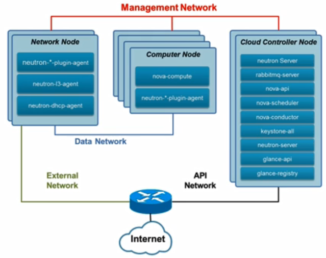


---

# 24. OpenStack Networking

## OpenStack Networking (Neutron)

### Modular Layer 2 (ML2) plugin

- 네트워크 구성의 타입(GRE, VXLAN...)과 이러한 네트워크 타입을 구현하는 기술들 Mechanism(Linux Bridge, OvS, Vendor...)을 통해 이러한 Type의 네트워크를 구성할 수 있다는 것이 기본 컨셉

- ML2는 Type과 Mechanism에 대해서 통합하는 공통의 인터페이스를 제공하며 이를 통해서 Neutron이 Layer 2 네트워킹 서비스를 사용할 수 있게 함

  - 이러한 공통 인터페이스 덕분에 새로운 네트워크 타입이나 기존 구현 기술외에 벤더 specific한 추가적인 구현 기술을 인터페이스에 맞게 쉽게 추가 가능
  - 새로 추가된 기술도 기존 구현 기술과 동시에 사용되더라도 문제없이 동작

- 오픈스택에서 게스트가 고유의 네트워크를 구성하고자 할 때 네트워크 타입과 네트워크 타입을 구현하기 위한 Mechanism을 설정해야 함

  - 기본적으로 사용하는 네트워크 타입 : GRE, VLAN, VXLAN
  - 구현하는 기술 : OvS, Linux Bridge ...

- ML2는 Neutron 서버로부터 서비스 요청을 수신해서 해당 게스트의 네트워크 타입 및 구현 기술에 맞게 서비스가 실행이 되도록 실제 컴퓨트 노드나 네트워크 노드에 설치되어 있는 Mechanism 에이전트들에게 명령을 전달하는 역할도 수행

  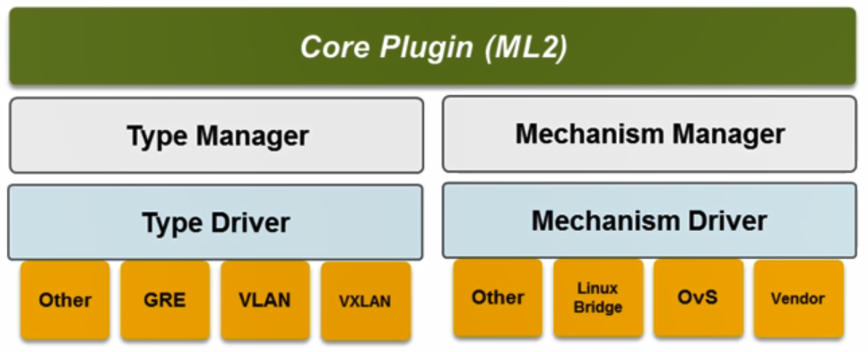

  

### ML2이외에 Neutron에 포함되는 다른 구성요소

- Layer 2 agent
  - 네트워크 노드 및 컴퓨트 노드에 설치가 되어서 ML2로부터 전달받은 서비스 요청을 실제 설치된 해당 노드에서 수행하는 역할
  - ex) 컴퓨트 노드에서 VM과 가상 스위치 연결을 구성할 때 OVS나 Linux bridge를 사용할 수 있는데 이러한 Mechanism들이 오픈스택에 관리자/사용자로부터 서비스 요청에 따라서 동작하도록 하는 에이전트가 설치됨
  - Agent for OVS / Linux bridge / SR-IOV NIC Switch / MacVTap / Hyper-V / other...
- Layer 3 agent
  - 네트워크 노드에 설치되고 게스트를 위한 가상 라우터 기반 L3 라우팅을 제공
  - 추가적인 서비스로 가상 라우터, NAT, VPN, load balancer를 제공
- DHCP agent
  - 컴퓨트 노드에 설치되서 거기에 배치되는 VM 인스턴스에 대해서 DHCP 관련된 작업들을 수행
  - 오픈스택 환경에서 게스트, tenant 들은 고유의 isolate된 네트워킹을 구성 가능
- Metadata agent
  - 공통의 인프라로부터 고유의 isolated된 인프라를 구성할 수 있는데 따라서 특정 tenant에 귀속되는 정보들을 metadata agent를 통해서 따로 관리
  - 그 정보들은 tenant, private ip 대역, ssh-keys, tenant에 할당된 namespace
- Security group
  - tenant 수준에서 정의된 일종의 방화벽 정책
  - 여러개 생성 가능
  - 추가적으로 생성되는 VM들도 생성된 여러개 Security group 중에서 원하는 정책을 해당 VM에 적용 가능
  - 기본적인 역할은 특정 VM 인스턴스에서 송신하고 수신하는 트래픽들을 제어하는 역할
    - 방화벽에 가까운 역할을 수행


### 오픈스택 네트워킹 구성 예제

- 네트워크 타입은 VLAN

- 구현 기술은 OVS

- 아래 그림과 같이 구성됨

- 이러한 네트워크 구성은 2가지로 구분됨

  - **Provider Network**
    - 컴퓨트 노드 외부로 나가는 트래픽의 라우팅 기능을 오픈스택 관리자 혹은 서비스를 공급하는 공급자에 의해서 이미 설치된 라우터나 장비들의 라우팅 기능을 전적으로 의존하는 네트워크

  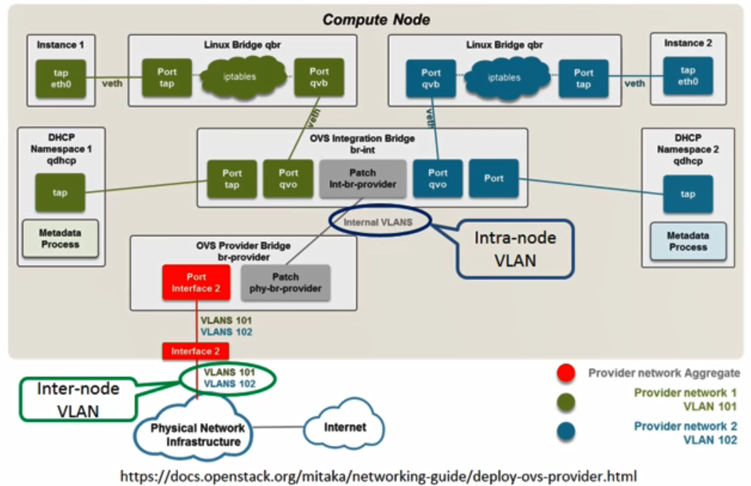

  - **Self Service Network**
    - Neutron의 L3 Agent의 가상 라우터를 통해서 Provider Network와 달리 Physical한 네트워크 장비 인프라에 의존하지 않고 Virtual Router를 통해서 오픈스택 외부와의 통신을 수행

  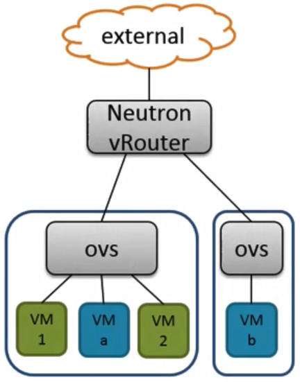

  - **North-south network traffic flow**

    - VM에서 오픈스택 외부로 혹은 외부에서 VM으로 들어오는 트래픽의 진행경로를 표현
    - VM에서 외부로 나가는 트래픽
      - VM에서 발생한 트래픽이 Security 그룹을 구성하고 있는 Linux Bridge qbr를 통과
      - 그 다음 Integration Bridge를 통과한 다음 Provider Bridge로 전달
      - 이때 컴퓨트 노드를 벗어나서 외부로 나가기 때문에 해당 VM에 속하는 테넌트에 할당된 VLAN ID(101)가 태깅이 되서 외부로 나감
      - 외부에서는 기존에 이미 배치되어 있던 관리자에 의해서 네트워크 인프라 스트럭쳐(라우터 및 스위치)들이 해당 트래픽을 수신
      - 실제 라우터를 통해서 오픈스택 외부로 트래픽을 전달
    - https://docs.openstack.org/mitaka/networking-guide/deploy-ovs-provider.html

    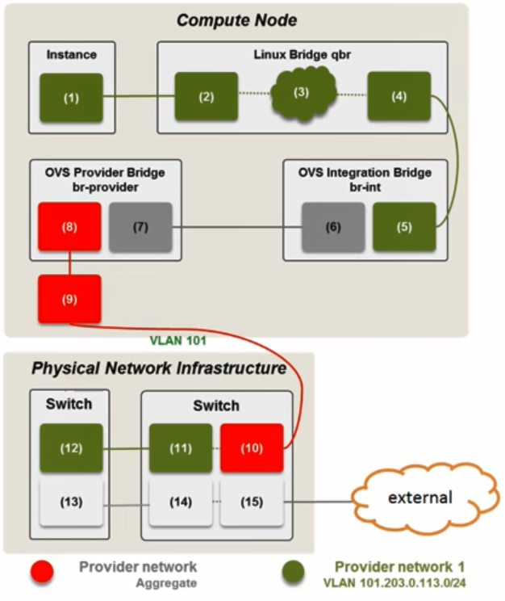

  - **East-West 트래픽**

    - 오픈스택 내부에서 VM과 VM 사이에 내부 트래픽에 대한 설명
    - 동일한 테넌트 네트워크에 속해 있는 두 개의 VM 인스턴스가 물리적으로 떨어져 있는 Compute Node에 존재할 때 VM 사이에 트래픽 흐름을 보여줌
    - 컴퓨트 노드 내부에서의 트래픽 흐름은 앞에 내용과 동일
    - Compute Node 1에서 외부로 나갈 때 해당 VM이 속하는 테넌트에 할당된 고유의 VLAN ID가 태깅이 되어 외부로 나감
    - 이때 Physical Network Infrastructure, 즉 오픈스택 관리자 혹은 서비스 제공자가 구축해 놓은 스위치에서는 해당 VLAN ID를 통해서 테넌트 트래픽을 식별
    - VLAN ID를 통해서 L2 터널링을 구현. 구현함으로써 해당 스위치를 기점으로 동일한 네트워크를 구성하고 있는 다른 컴퓨트 노드 2로 트래픽을 전달
    - 컴퓨트 노드 2에서는 컴퓨트 노드 1의 역순으로 트래픽 전달

    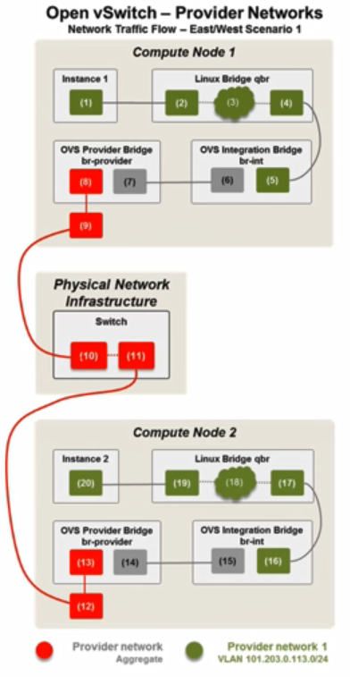

  - **VM간에 East-West 트래픽에 대한 설명**

    - 이 경우 서로 다른 테넌트 네트워크에 속하는 VM이 동일한 Compute Node에 존재할 때의 VM간의 트래픽 흐름을 나타냄
    - 인스턴스 1에서 인스턴스 2로 향하는 트래픽이 br-int에 도착했을 때 기본적으로 OVS Bridge는 L2 기능만 제공하기 때문에 해당 트래픽을 바로 인스턴스 2로 보내지 못함
    - 해당 트래픽을 컴퓨트 노드 외부로 전달
    - 트래픽이 컴퓨트 노드 외부로 나갈 때 인스턴스 1이 속한 테넌트의 고유 VLAN ID가 태깅이 되어 나감
    - 이 트래픽 Physical Network Infrastructure가 수신해서 VLAN ID를 확인하고 제거
    - 스위치에서는 해당 라우팅을 제공하지 못해 라우터로 트래픽을 전달
    - 라우터에서는 인스턴스 1이 속한 네트워크와 인스턴스 2가 속한 네트워크 사이에 라우팅을 제공함으로써 라우터에서는 다시 컴퓨트 노드에 연결된 스위치로 트래픽을 전달
    - 이때 스위치에서는 해당 트래픽의 목적지 IP를 보고 인스턴스 2가 속하는 테넌트 네트워크에 할당된 VLAN ID를 태깅하여 다시 컴퓨트 노드로 전달
    - 컴퓨트 노드에서는 br-provider를 거쳐 br-int에 도착했을 때 해당 트래픽이 VLAN ID 102(인스턴스 2가 속하는 테넌트)이기 때문에 인스턴스 2로 트래픽을 전달

    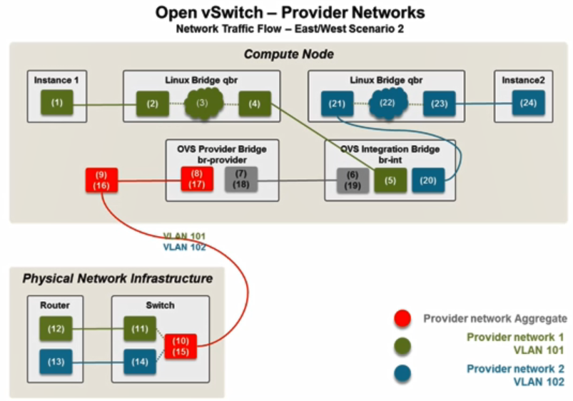


---

# 25. OpenStack Installation

## Environment Overview

​	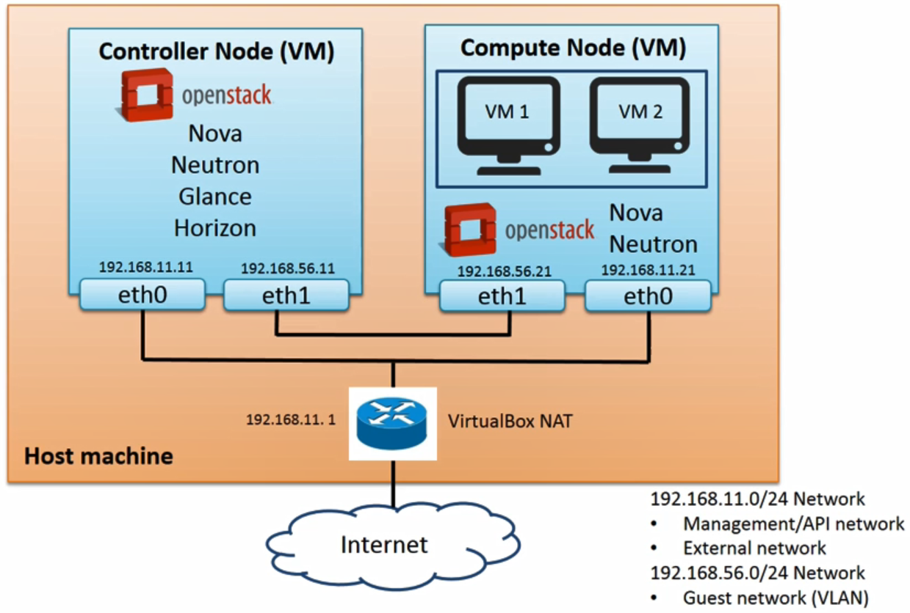

### Preparation

- Host machine
  - 12 core, 24 GB memory, 1TB HDD
  - X11 forwarding support for VirtualBox GUI in Linux
- Linux shell client
  - 호스트 머신에 접속하거나 VM위에서 설치될 컨트롤 노드, 컴퓨트 노드에 접속하기 위한 목적
  - Window : Putty (+ Xming), Xshell (+ Xmanager)
  - Mac OS : Xquartz
- VirtualBox
  - 호스트 머신에 설치되며 가장 최근 버전 설치
- VM Images
  - 강의에서 제공되는 VM
  - CentOS 7.3
  - Controller node : 2 vCPU, 4GB memory, 10GB HDD
  - Compute node : 4 vCPU, 4GB memory, 10GB HDD
  - 사용하는 호스트 서버의 자원이 충분하다면 이것보다 더 많은 리소스를 할당

### VM Image Import

- Virtual Box에 Controller VM, Compute VM 차례대로 임포트
- Reinitialize the MAC address of all network cards 선택

### NAT Network Setup

- File - Preferences - Network - NAT Networks

- Add a new NAT network and edit it

- Uncheck "Supports DHCP"

  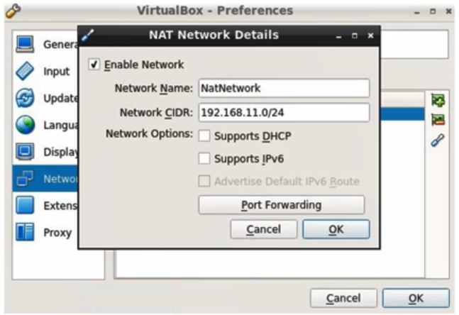

### Host-only Networks Setup

- Create two host-only networks

  - vboxnet0 (192..168.56.0/24) - 오픈스택 설치 이후에 VM 인스턴스들 간에 통신을 위한 커뮤니케이션 링크로써 게스트 네트워크 구성(VLAN)
  - vboxnet1 (10.10.1.0/24) - 오픈스택과는 별개로 호스트서버에서 컨트롤 노드와 컴퓨트 노드의 제어를 하기 위한 SSH connection을 위한 목적

- File - Preferences - Network - Host-only Networks

- Edit the selected network

- Disable DHCP server

  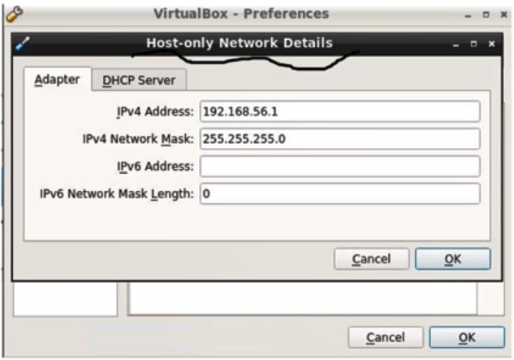

### VM Network Setting

- Machine - Settings - Network

- Check the adapter 1~3 of the given two VMs

  - Adapter 1 : NAT Network (192.168.11.0/24), Adapter Type (virtio-net), Promiscuous Mode(Allow All, only for Controller VM)

    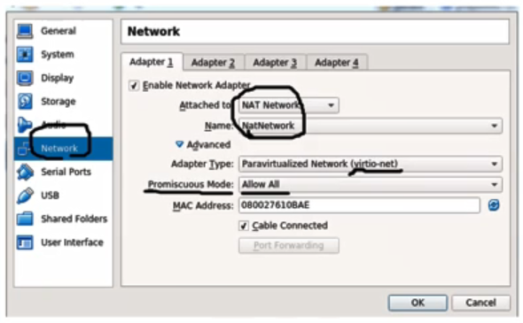

  - Adapter 2 : Host-only Adapter (vboxnet0, 192.168.56.0/24), Adapter Type(virtio-net), Promiscuous Mode (Allow All for both nodes)

    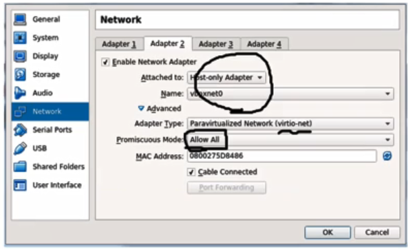

  - Adapter 3 : Host-only Adapter (vboxnet1, 10.10.1.0/24), Adapter Type (virtio-net)

    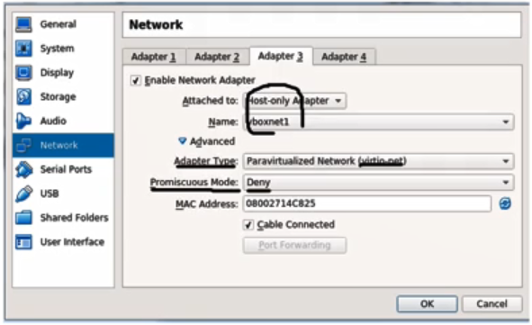

### Packstack Installation

- Stat the two VMs(Host-only ssh 접속을 위한 VM)

- Stop NetworkManager, firewalld service stop, SELinux가 permissive mode로 동작하도록 설정

  ```bash
  $ systemctl disable NetworkManager
  $ service NetworkManager stop
  $ systemctl disable firewalld
  $ service firewalld stop
  $ setenforce 0
  ```

- Install Packstack package( only in the Controller VM)

  - Packstack : 레드햇 기반의 리눅스 서버에서 오픈 스택을 자동으로 설치해주는 툴
  - Packstack을 통해서 설치할 오픈스택은 오픈스택 Mitaka 버전 사용

  ```bash
  $ vim /etc/environment
  LANG=en_US.utf-8
  LC_ALL=en_US.utf-8
  $ yum install -y centos-release-openstack-mitaka
  $ yum update -y
  $ yum install -y openstack-packstack
  $ yum install -y openstack-utils
  ```

### Packstack Answer File

- Packstack은 설치 툴이고 Packstack이 자동 설치를 하기 위해서 참고하는 configuration 파일

  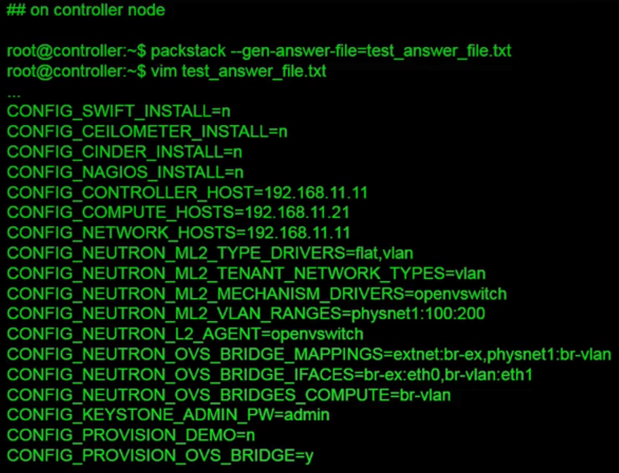

#### Details on the Answer File Configurations

- `_SWIFT_INSTALL=n`, `_CEILOMETER_INSTALL=n`, `_CINDER_INSTALL=n`, `_NAGIOS_INSTALL=n`
  - 오픈스택의 부가적인 서비스 컴포넌트들 설치할지
  - 튜토리얼이기 때문에 자원이 한정적이라 필수적인 컴포넌트만 설치하고 부가적인 컴포넌트들은 설치하지 않음
- `_CONTROLLER_HOST=192.168.11.11`, `_COMPUTE_HOSTS=192.168.11.21`, `_NETWORK_HOSTS=192.168.11.11`
  - Management network IP on controller node, List of management network IPs on compute nodes, Management network IP on network nodes
- `_NETWORK_OVS_BRIDGE_MAPPINGS=extnet:br-ex,physnet1:br-vlan`, `_NEUTRON_OVS_BRIDGE_IFACES=br-ex:eth0,br-vlan:eth1`
  - ,를 기준으로 구분하고 :값으로 페어를 이룸
  - 앞에는 네트워크 이름, 뒤에는 해당 네트워크에 연결되는 브릿지 이름
  - extnet은 br-ex로 매핑되고 br-ex는 eth0인터페이스로 매핑됨
    - VM으로 생성한 NAT Network(eth0)에 물리는 노드의 네트워크 인터페이스가 br-ex브릿지로 연결이되고 br-ex 브릿지는 오픈스택 설치 이후에 생성되는데 br-ex 브릿지는 extnet이라는 네트워크로 연결
- `_NEUTRON_ML2_TENANT_NETWORK_TYPES=vlan`, `_NEUTRON_ML2_MECHANISM_DRIVERS=openvswitch`, `_NEUTRON_ML2_TYPE_DRIVERS=flat,vlan`
  - 테넌트 네트워크 타입은 vlan
    - 테넌트 트래픽을 구분하기 위해 vlan id 사용
  - ML2 메커니즘 드라이버는 openvswitch를 이용해 네트워크를 구현
  - TYPE Driver는 flat과 vlan 두 가지 유형의 네트워크를 오픈스택 구성할 때 사용하겠다고 명시
    - vlan은 게스트 네트워크를 위해서 사용
    - flat은 NAT Network(extnet)를 flat 타입으로 사용하기 때문에 명시
- `_NEUTRON_L2_AGENT=openvswitch`
  - 각 노드에서 openvswitch 에이전트를 설치하겠다고 명시
- `_NEUTRON_OVS_BRIDGES_COMPUTE=br-vlan`
  - 컴퓨트 노드가 추가됬을 때 컴퓨트 노드에 생성되는 VM 인스턴스들 간에 br-vlan에 연결되는 게스트 네트워크를 통해서 통신하겠다고 선언
- `_PROVISION_DEMO=n`
  - yes값으로 두면 샘플 환경(데몬 환경)이 구성됨
- https://github.com/openstack/packstack/blob/master/docs/packstack.rst


---

# 26. OpenStack Installation 2

## OpenStack Installation 

- 컨트롤러 노드의 콘솔에서 packstack 명령어 입력

  - 컨틀로러 노드에서 실행하면 packstack이 원격으로 Puppet이나 SSH 접근을 통해서 연결된 컴퓨트 노드에도 관련된 오픈스택 구성요소를 설치함

  `packstack --answer-file=packstack-sample-answer.txt`

  packstack-sample-answer 파일은 강의에서 제공하는데 현재 없음

- 설치 완료 모습

  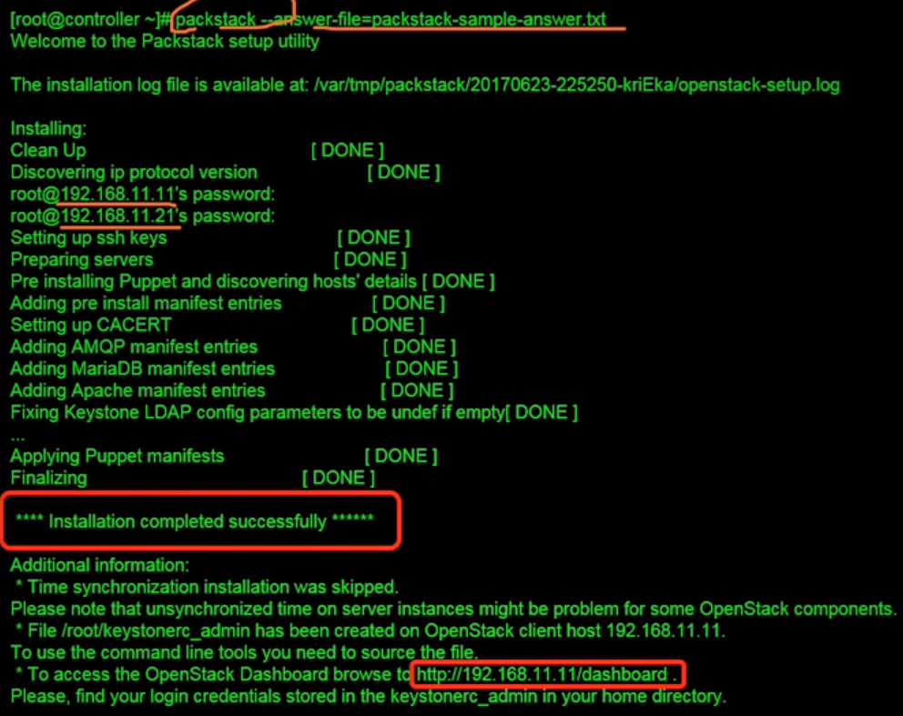

- 오픈스택을 설치했을 때 구성되는 환경

  - NAT G/W라는 일종의 오픈스택 외부의 장치에 의해서 오픈스택 환경에서 외부로 나가는 라우팅 기능
    - 오픈스택의 네트워크 유형 중 Provider 네트워크에 해당
    - G/W 라우터가 컨트롤러 노드, 컴퓨트 노드에 직접 인터페이스를 통해서 계층화 과정없이 바로 물려있는데 이를 오픈스택에서 플랫 타입으로 부름

  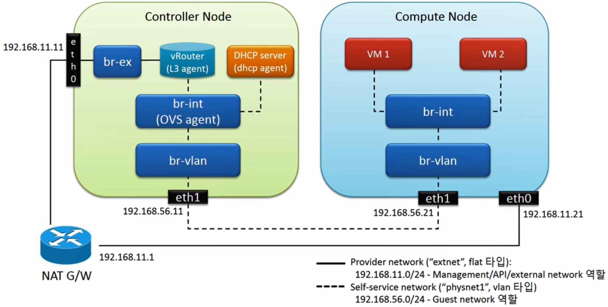

- `ip addr`, `route -n` 확인

  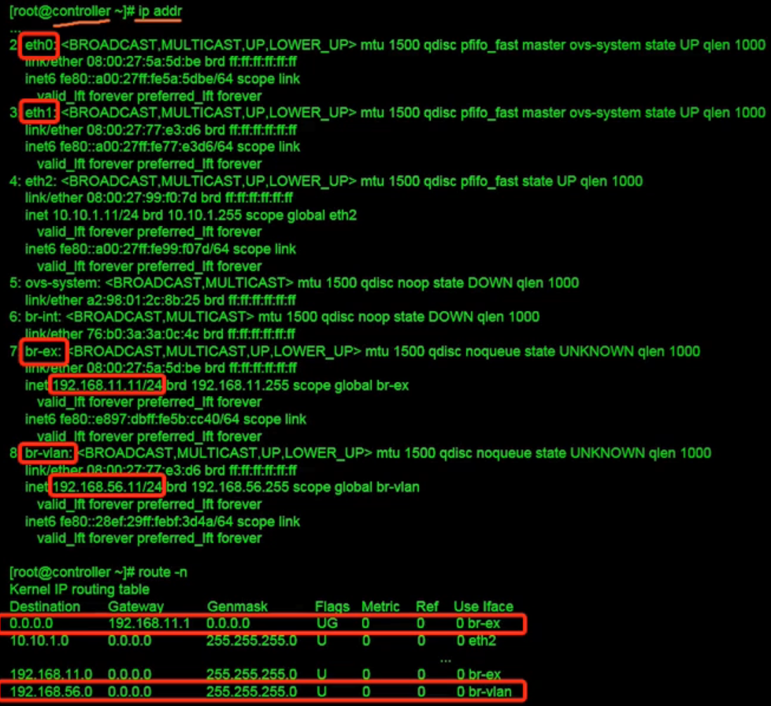

- `ovs-vsctl show` 명령어를 통해서 브릿지들 생성 확인

  - 여기서 컨트롤러 노드에만 br-ex가 있는 이유
    - 실제적으로 오픈스택에서 생성된 VM 인스턴스들과 오픈스택 외부와의 external connectivity를 위한 역할을 하는게 네트워크 노드에서 담당
    - 컨트롤러 노드가 네트워크 노드의 역할을 동시에 수행

  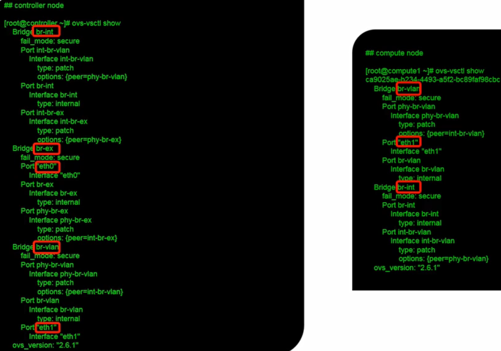

## Dashboard Access

- 오픈스택 설치 완료 후 대시보드를 통해서 GUI 환경에서 오픈스택 제어 가능

- OpenStack Dashboard(Horizon) URL

  - 컨트롤러 노드의 API 주소를 사용
  - http://192.168.11.11/dashboard
    - 하지만 해당 IP는 Virtual Box NAT 네트워크의 내부에서만 private network

- 어느 위치에서든 웹으로 접근이 가능하도록 Virtual Box에 포트 포워딩 룰 설정

  - File - Preferences - Network - NAT Networks - Edit "NatNetwork"

- 대시보드 내용 수정

  - 컨트롤러 노드에서 다음 파일을 수정하여 외부 어떤 요청이든 허용

  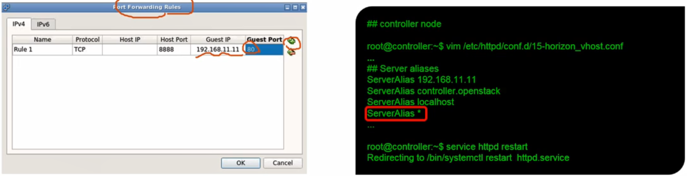

- web browser를 이용해  접속

  - URL : http://{HOST_SERVER_IP}:8888/dashboard
  - ID : admin, PW : admin

  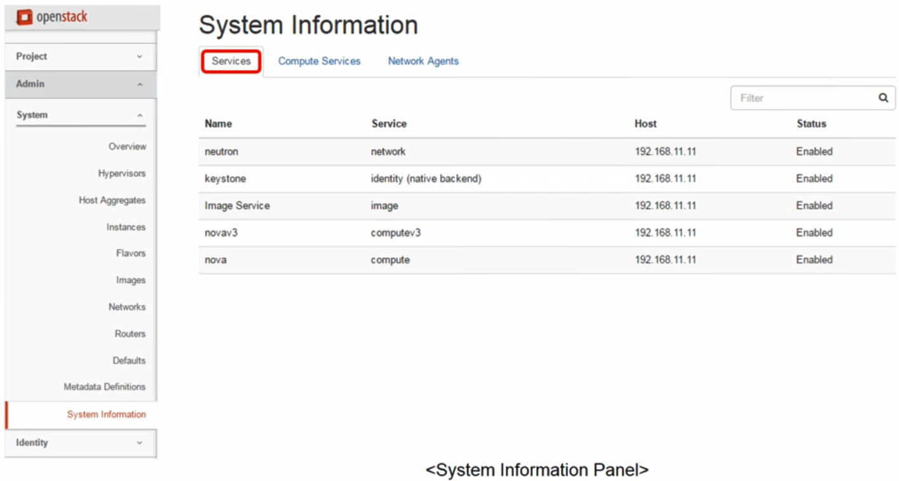

  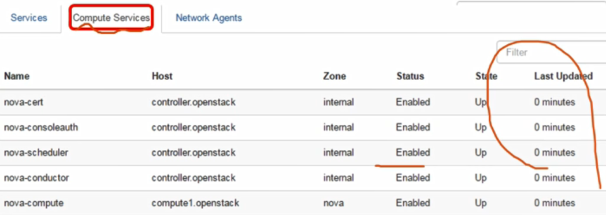

  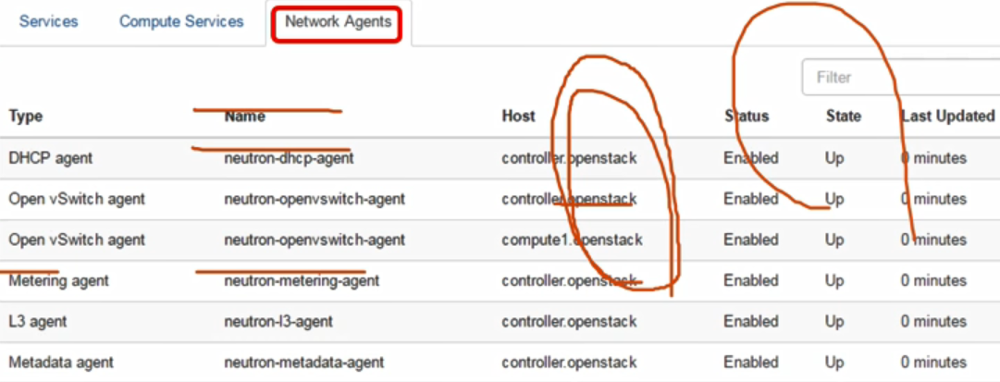

## Compute Node Setup

- Compute 노드는 VM으로 설치되어 있음, 실제 환경에서는 bare metal 서버를 사용하여 구성

- bare metal 서버에 컴퓨트 노드를 사용하는 경우

  - QEMU라는 하이퍼바이저를 기반으로 bare metal 서버의 KVM이 제공하는 다양한 기능들을 이용해서 오픈스택에 VM 인스턴스를 생성하고 매니지먼트함 

- 본 환경은 컴퓨트 노드가 VM 위에 있기 때문에 그리고 VM 위에서 오픈스택을 통해서 VM 인스턴스를 생성하게 되면 VM위에 VM을 생성하는 개념

- 이러한 환경에서는 호스트서버에서 사용하는 Virtual Box가 호스트 서버의 KVM에 제공하는 기능들을 활용을 못함

  - KVM을 사용하지 않고 QEMU를 사용

  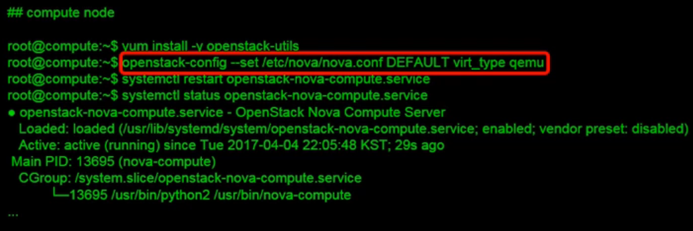


---

# 27. OpenStack Setup using Horizon 1

## VM Image (admin)

- VM의 이미지들은 등록이 되면 오픈스택에 Glance 서비스에 등록

- 대시보드에서 설정

  - System-Images-Create Image

- Image Source

  - http://download.cirros-cloud.net/0.3.4/cirros-0.3.4-x86_64-disk.img

  

## VM Flavor (admin)

- VM 인스턴스를 위한 리소스 명세서

- System-Flavors-Create Flavor

- Flavor를 이용해서 생성되는 VM이 cpu, 메모리, 디스크 등의 자원 값을 지정

  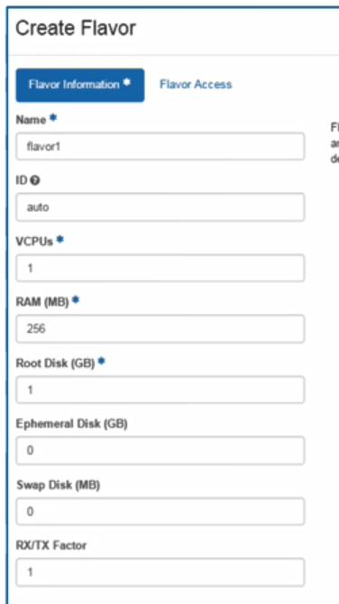

## Project (admin)

- 프로젝트는 OpenStack 서비스를 제공하는 서비스 제공자가 사용자들에게 고유의 OpenStack 네임 스페이스를 제공

  - 네임 스페이스가 제공되는 단위가 프로젝트
  - 클라우드의 테넌트

- Identity-Projects-Create Project

  

  

## Provider Network (admin)

- 프로바이더는 오픈스택 환경을 구성하는 서비스 프로바이더에 의해서 이미 구축이 되어있는 인프라스트럭쳐 네트워크 혹은 언더레이 네트워크

  - VirtualBox NAT Network (192.168.11.0/24)
  - 내부적인 구현이 되어 있는데 이것을 오픈스택 수준에서 프로바이더 네트워크라는 이름으로 불림

- System-Networks-Create Network

  - Flat과 extnet은 Packstack에서 설정함

  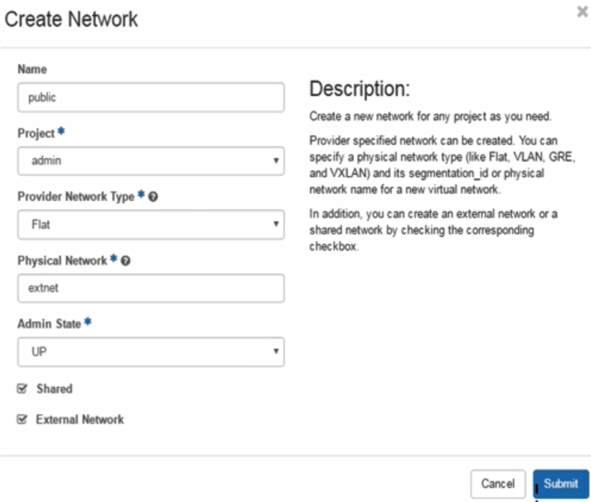

## Floating IP Pool (admin)

- Floating IP란 오픈스택 환경에서 생성되는 VM 인스턴스들이 외부와 통신을 하기 위한 오픈스택에서 사용하는 퍼블릭 IP

- 프로바이더 네트워크에 할당된 IP 대역에서 그 일부를 Floating IP를 위한 Pool로써 활용 가능

  - 프로바이더 네트워크의 서브넷 생성

- System-Networks-"provider network"-Create Subnet

  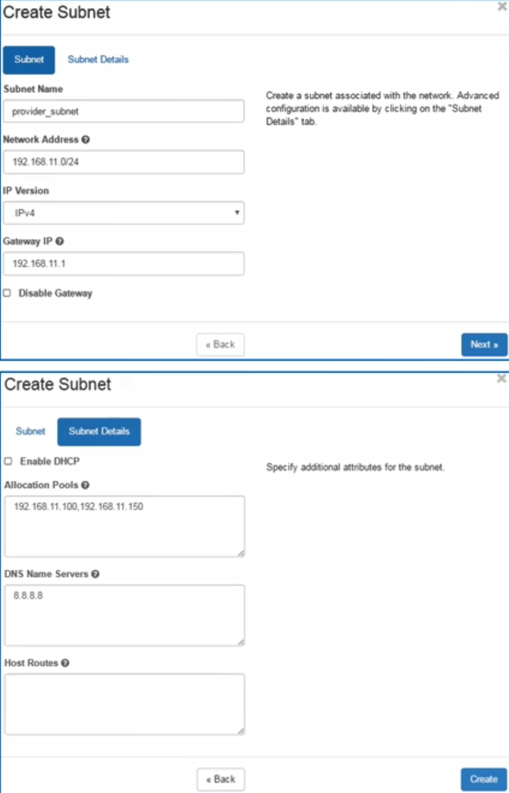

## Floating IP

- 일종의 Connectivity를 제공하는 수단

- External -- OpenStack Provider network -- Virtual router (NAT) -- VM

  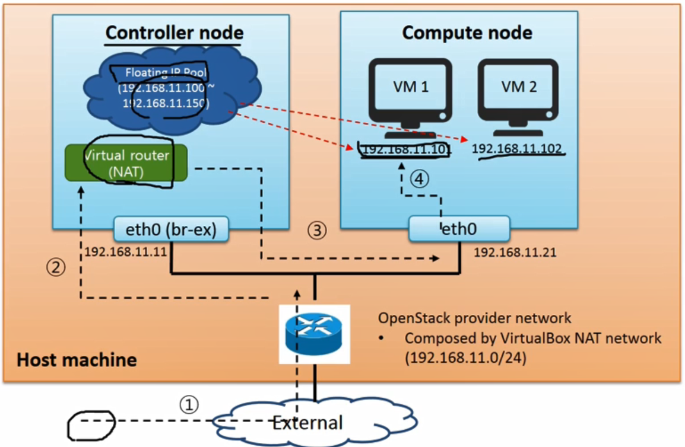


---

# 28. OpenStack Setup using Horizon 2

- 오픈스택에 관리자 입장이 아닌 관리자가 제공한 인프라를 사용하는 tenant 입장에서 오픈스택을 설정하기 때문에 Demo 프로젝트로 변환해서 진행

  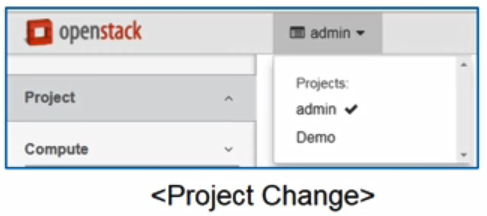

## Tenant Network (Demo)

- tenant network란 오픈스택의 사용자들을 위한 Private Network

- 많은 테넌트들이 존재할 수 있는데 각각의 테넌트에 대해서 논리적으로 독립된 네트워크 환경을 제공

  - 내부적으로는 오픈스택 서비스 제공자가 Provider Network를 구축
  - 실제 사용자들은 그런 인프라를 공유하면서 각각 자신들 고유의 address space, network topology 등을 가지는 독립된 네트워크를 구성 가능
  - 구현 방식은 오픈 스택 설치 및 설정시 다양하게 설정 가능
    - 실습에서는 VLAN 기술을 기반으로 오버레이 네트워킹을 통해서 테넌트 네트워크를 구축

- Network - Networks - Create Network

- Subnet

  - 테넌트를 위한 Private Network를 설정하는 것이기 때문에 네트워크 주소는 맘대로 설정
  - 게이트웨이 IP도 임의로 설정할 수 있지만 일반적으로는 할당했던 네트워크 대역의 첫번째 주소를 사용

- Subnet Details

  - 테넌트 네트워크가 구축 이후에 테넌트가 생성하는 VM 인스턴스들에게 IP 대역에 속하는 IP를 자동으로 할당하기 위해 DHCP 활성화
  - Allocation pools
    - 테넌트에 의해서 생성될 VM 인스턴스들이 가질 수 있는 Private IP의 서브넷 어드레스 풀

  

- 테넌트 네트워크 생성 완료 모습

  - Demo 프로젝트로 생성하지만 Demo 프로젝트로는 이러한 시스템에 있는 네트워크 패널에 정보가 안보임
  - 생성된 정보를 확인하기 위해서는 admin으로 변경 후 확인

  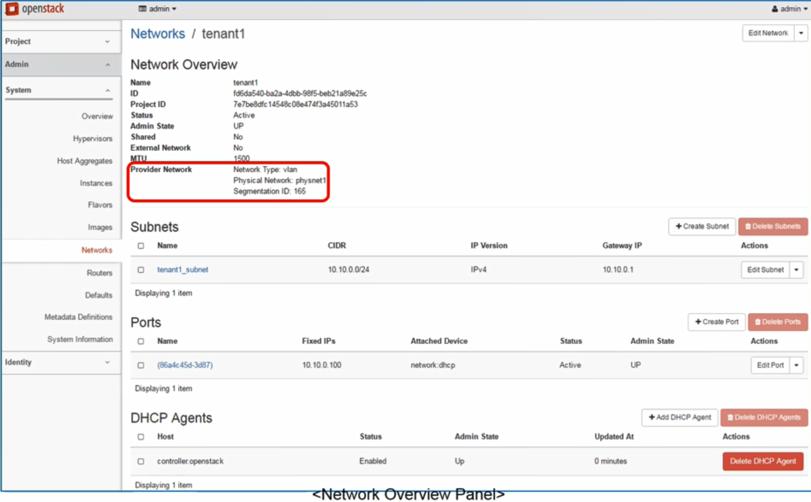

## Virtual Router

- 뉴트론에 L3 에이전트에서 담당하는 기능

- Virtual Router는 컨트롤러 노드의 뉴트론의 L3에 설치

  - 실제는 네트워크 노드에 설치되지만 실습에서는 컨트롤러 노드가 역할을 동시에 수행되어 컨트롤러 노드에 설치

- Virtual Router는 Provider Network(Public Network)와 Tenant Network(Private Network)을 연결해주는 역할을 수행

- Virtual Router에서 NAT 기술 수행

  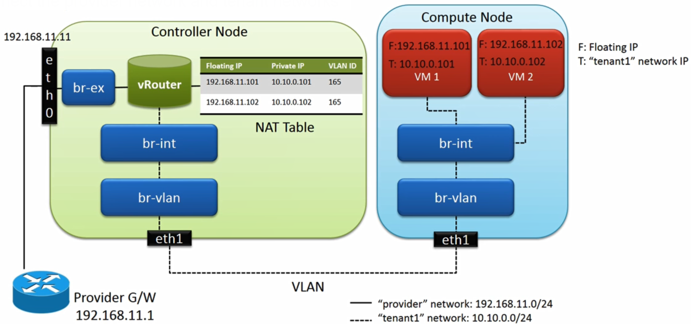

## Virtual Router 생성 (Demo)

- NAT테이블을 가지고 floating IP와 private IP사이의 변환을 담당

- Neutron L3 agent를 통해 구현

- Network - Routers - Create Router

- External Network

  - provider network 선택

- Select "router1" - interfaces - Add Interface

  - Virtual Router의 private network 쪽 인터페이스를 생성하는 단계
  - tenant1 서브넷 설정

  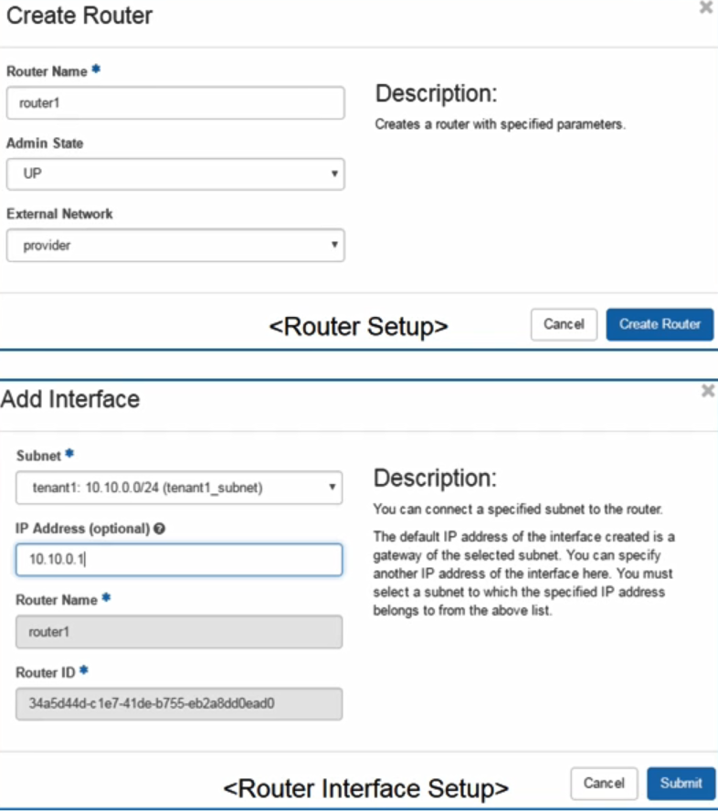

## Key Pairs (Demo)

- 키페어 유닛 생성 단계

- Key Pair가 필요한 이유는 tenant가 VM 인스턴스를 생성했을 때 외부에서 이 인스턴스를 접근하기 위해서 필요한 private key와 public key의 pair

- VM을 실제로 생성하는 단계에서 어떠한 Key Pair를 사용하겠다고 선택을 해야하여 미리 생성

- tenant의 VM 인스턴스에 SSH 접속을 위해 필요

- public key는 Keystone 서비스에 등록

- private key는 생성된 VM 인스턴스에 shell을 통해서 접근하는데 이용될 머신에 저장

- Compute - Access & Security - Key Pairs - Create Key Pairs

  

## Security Groups (Demo)

- Tenant-level에서의 방화벽 규칙

- 각각의 VM 인스턴스들은 여러 개의 Security Group 인스턴스 중에서 선택하여 적용

- Compute - Access & Security - Security Groups - Manage rules for "default" Security Group - Add Rule

- 들어오고 나가는(ingress/egress) 모든 ICMP와 SSH 트래픽을 허용

  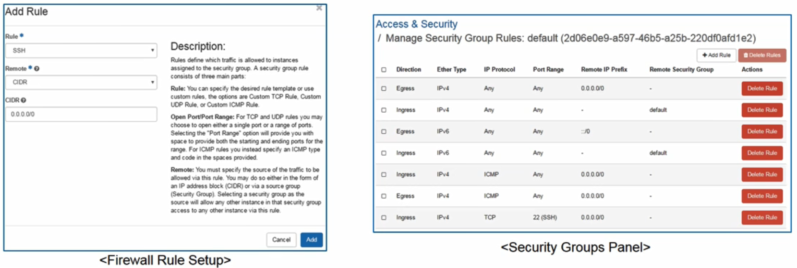


---

# 29. OpenStack Setup using Horizon 3

- tenant network위에서 실제 사용자가 VM 인스턴스를 생성하고 생성된 VM 인스턴스들 간에 네트워크를 구축

## VM Instance (Demo)

- 오픈스택의 테넌트 입장에서 VM을 생성

- 2개의 VM 인스턴스를 Demo tenant에 생성하고 실행

- 생성한 compute node의 VM위에 VM 인스턴스를 생성

- Compute - Instances - Launch Instance

  1. Details : 인스턴스 이름 설정
  2. Source : Glance에 업로드했던 VM 이미지를 선택
  3. Flavor : 생성했던 flavor 1을 선택
  4. Networks : 생성한 tenant network 선택

  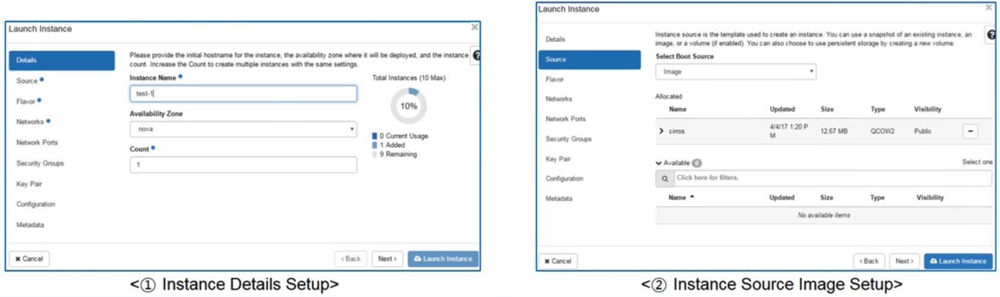

  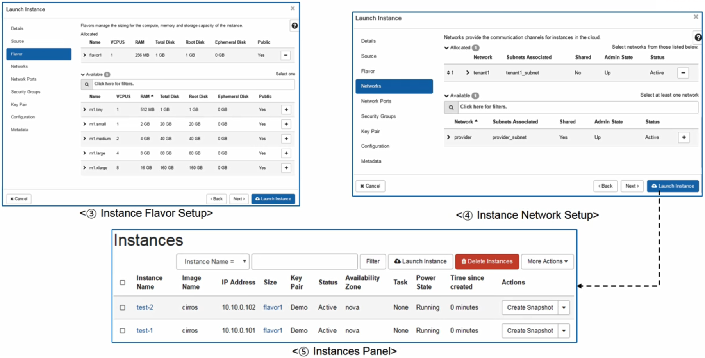

## Floating IP Allocation (Demo)

- 생성한 VM 인스턴스들이 외부와의 통신을 위해 사용하는 public ip인 Floating IP 설정

- Compute - Instances - Drop down the "Actions" tap - Associate Floating IP - Push "+" button in IP Address

- "Port to be associated" : 현재 선택된 VM 인스턴스의 네트워크 인터페이스 중에서 tenant1 네트워크와 연결된 IP가 할당된 인터페이스를 선택

  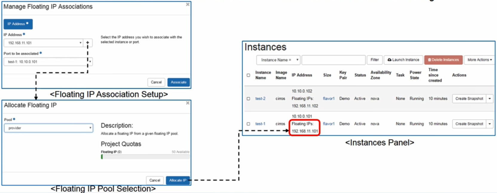

## Port Forwarding Rules for Remote Access to VMs

- 오픈스택 외부에서 생성한 VM 접속

- 접속하기 위해서는 Floating IP 대역이 호스트 서버의 NAT 네트워크로 구현되어 있기 때문에 오픈스택 설치 후에 대시보드에 접근하기 위해서 Virtual Box를 이용해서 PortFowarding Rule을 설정한 것 처럼 동일하게 VM 인스턴스들에 대해서도 룰 추가

  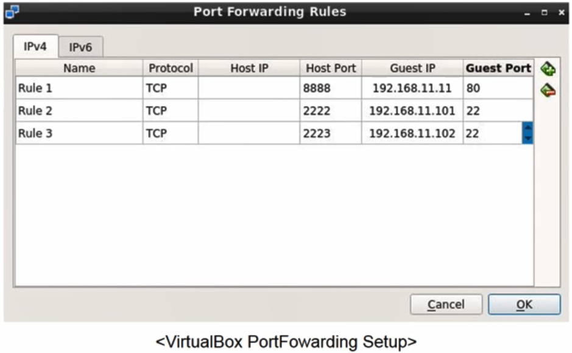

## OpenStack Setup using Horizon

- 구성완료 모습

  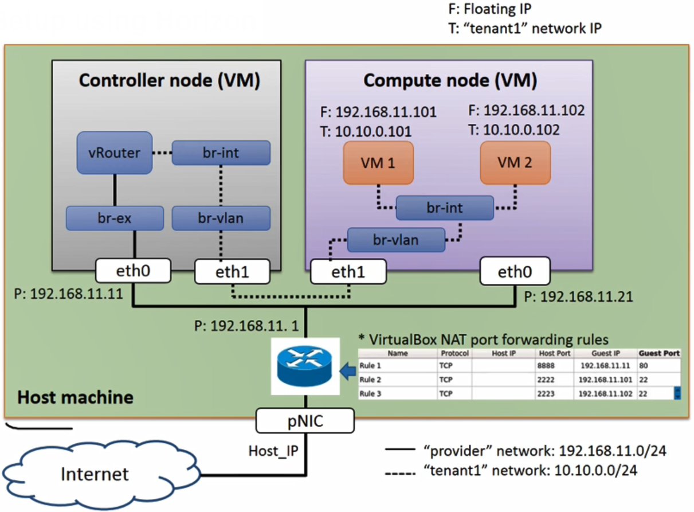

## SSH Connection to VM Instances

- Virtual Box가 구동되는 호스트 서버를 클라이언트 머신이라고 하고 접근

- 생성한 Key Pairs에서 다운로드한 private key를 이용해 접근

  - demo.pem

  ```bash
  $ sudo chmod 600 demo.pem
  $ sudo ssh -i demo.pem -p 2222 cirros@{HOST_IP}
  $ ip a
  $ sudo ssh -i demo.pem -p 2223 cirros@{HOST_IP}
  $ ip a
  ```

  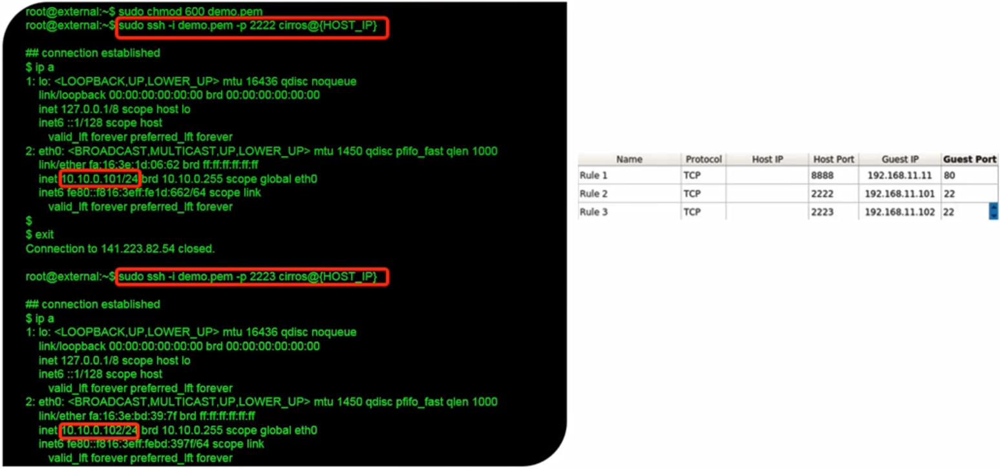

## Networking test on VM instance

- ping test

  

### Network Topology

- 지금까지 설정했던 내용이 표현됨

  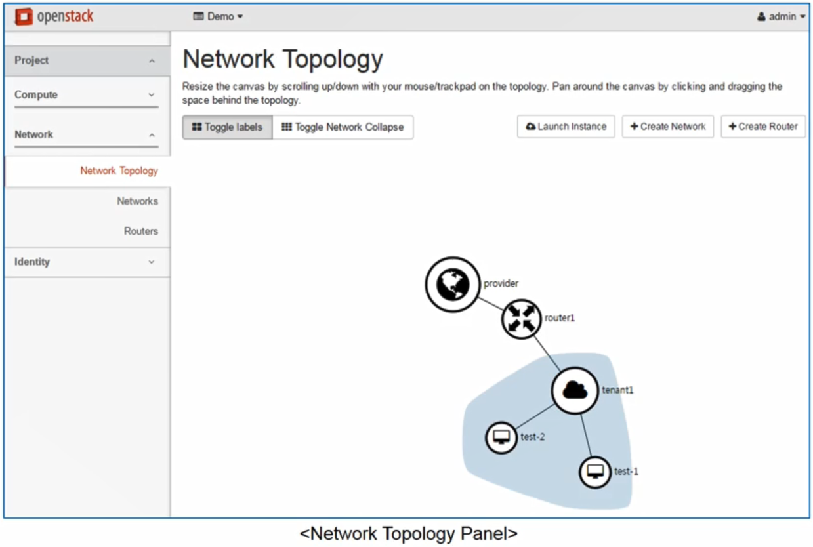


---

# 30. OpenStack Additional Setup 1

## Environment Overview

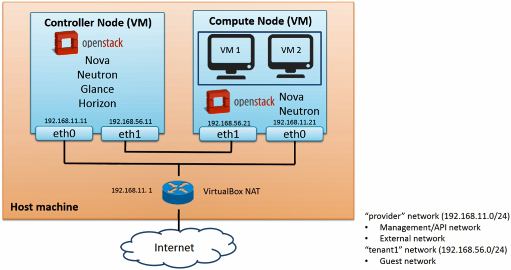

## Add a New Compute Node

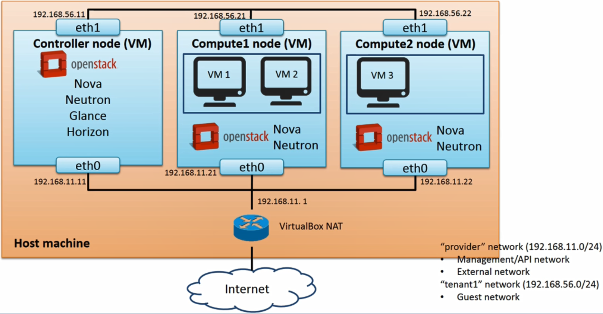

- Virtual Box 인터페이스

  - File - Import Appliance - select "compute1.ova"

- Rename compute1 - compute2

- Check "Reinitialize the MAC address of all network cards"

  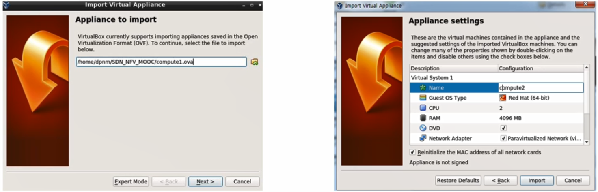

- compute2 노드의 VM을 시작하고 login

  - USER: root, PW: stack

- 네트워크 인터페이스 설정

  - eth0 : 192.168.11.22

  - eth1 : 192.168.56.22

  - eth2 : 10.10.1.22

    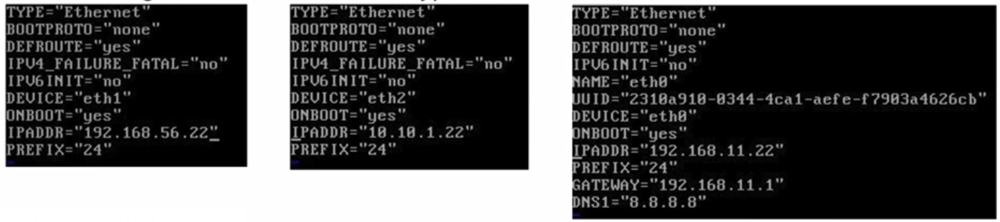

- 호스트 서버에서 해당 VM으로 ssh 접근

  - 컨트롤러 노드와 compute1 노드랑 연결확인

    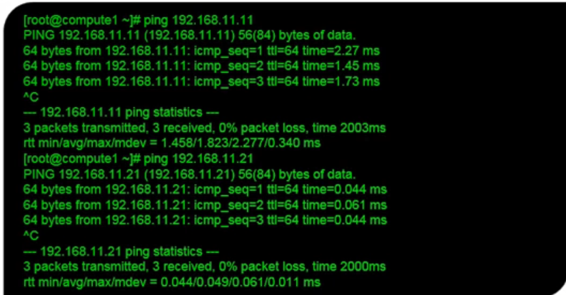

- compute2 노드에도 오픈스택을 설치하기 위해 기본적인 설정

  ```bash
  $ service NetworkManager stop
  $ service firewalld stop
  $ setenforce 0
  $ hostnamectl set-hostname compute2.openstack && su -
  ```

  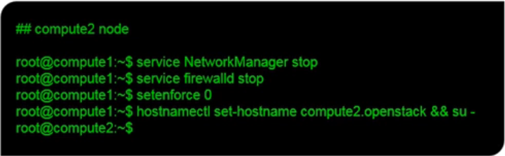

- 컨트롤러 노드에서 compute2 노드에도 오픈스택의 컴퓨트 노드로 동작하게 오픈스택 재설치

  ```bash
  $ cp packstack-sample-anser.txt packstack-adding-compute.txt
  $ vim multi-nodes-2computes.txt
  $ packstack --answer-file=packstack-adding-compute.txt
  ```

  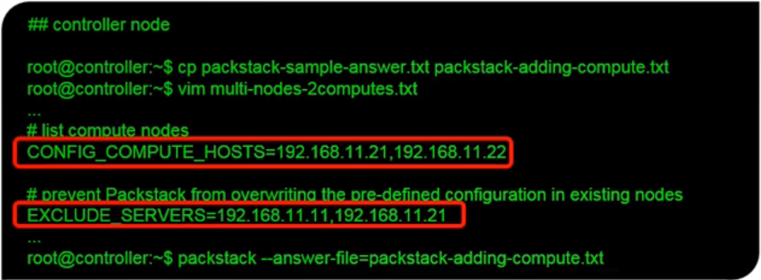

- 설치 완료 모습

  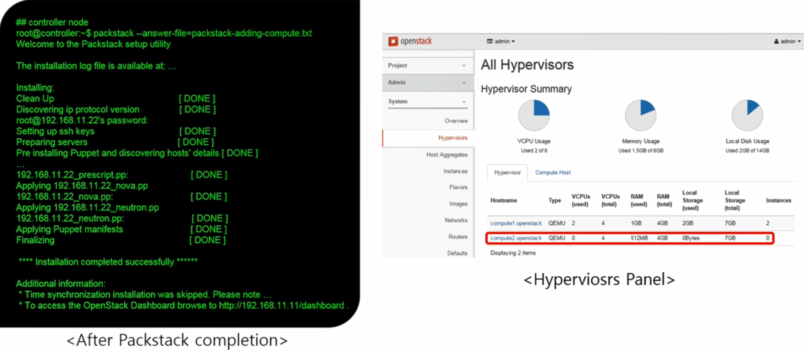

  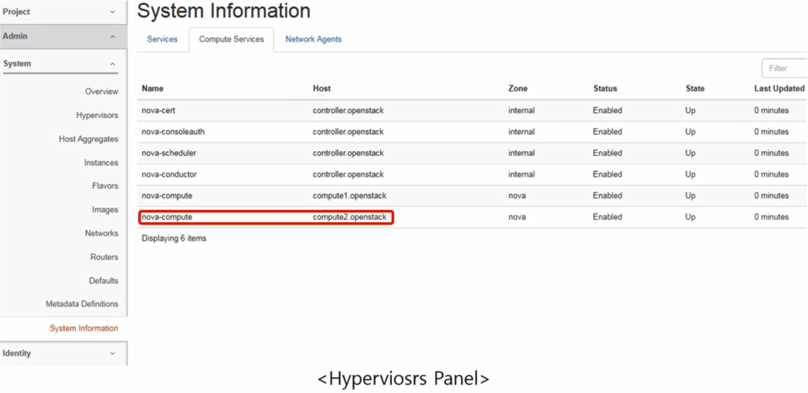

  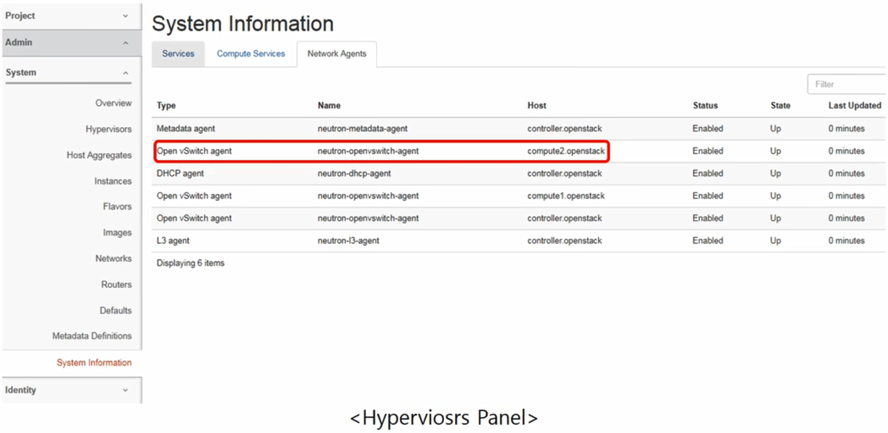

### Compute Node 추가 모습

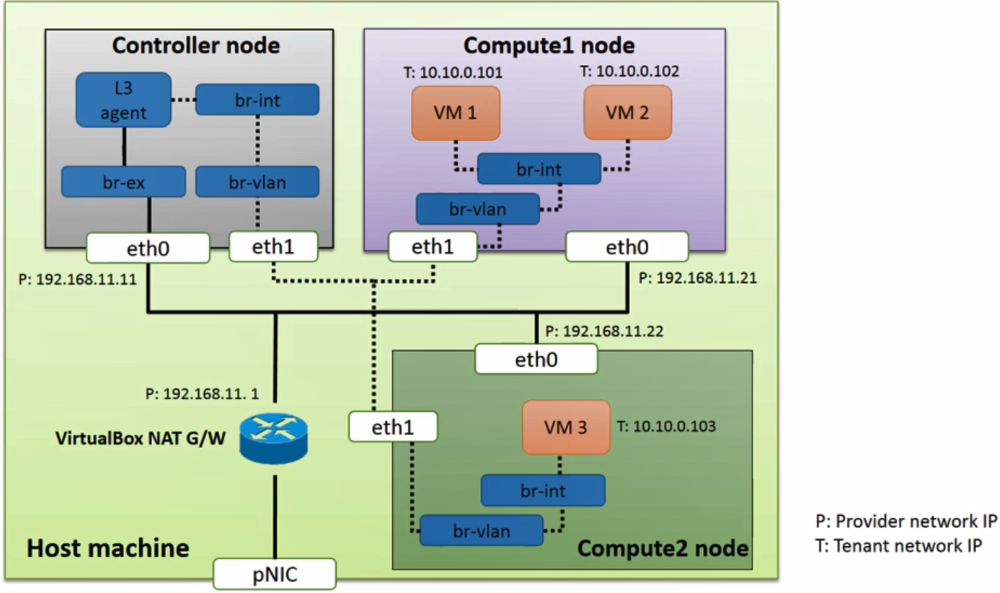


---

# 31. OpenStack Additional Setup 2

## Availability Zone & Host Aggregates

- 실제 오픈스택 설치 후 운용 단계에서 오픈스택 사용자가 어떤 VM 인스턴스를 생성하려면 VM 인스턴스가 디플로이되는 특정 컴퓨트 노드를 지정하려는 요구사항 발생

  - 특정 VNF가 하이 퍼포먼스를 요구하면 서포트해줄 수 있는 고사양의 VM 인스턴스가 생성되어야 함
  - 따라서 그런 VM 인스턴스를 실제로 디플로이하는 컴퓨트 노드 또한 고사양의 컴퓨트 노드를 활용해야 됨

- 오픈스택에서는 Availability Zone과 Host Aggregates라는 개념으로 제공

- Availability Zone

  - 물리적으로 인접한 컴퓨트 노드를 클러스터링하는 단위

- Host Aggregates

  - 좀 더 논리적인 개념으로써 특정한 특성을 가진 컴퓨트 노드들을 물리적인 위치와 관계없이 서로 클러스터링하는 단위

  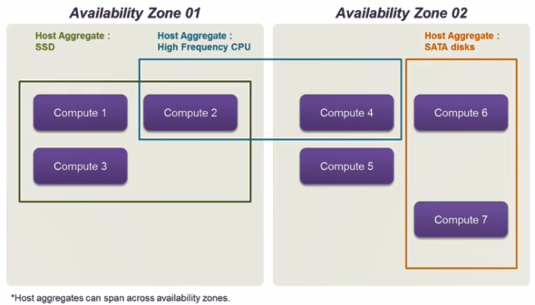

## Host Aggregate (admin)

- 기본적으로 오픈스택 설치 이후에 모든 컴퓨트 노드들은 모두 "nova"라는 Availability Zone(AZ)에 포함되어 있음

- default AZ을 이용해 VM 인스턴스를 생성을 했을 때

  - Nova-scheduler라는 노바의 서브 컴포넌트가 자체적인 알고리즘을 가지고 Nova AZ에 속해있는 컴퓨트 노드 중에서 가장 자원 측면에서 효율적인 컴퓨트 노드를 선택해 VM 인스턴스를 생성
  - Nova-scheduler 알고리즘에 의존하지 않고 특정 컴퓨트 노드를 선택에서 VM 인스턴스를 생성하고 싶은 요구사항 필요

- Host Aggregate와 AZ 개념을 이용해 요구사항 만족

  - System - Host Aggregates - Create Host Aggregate

  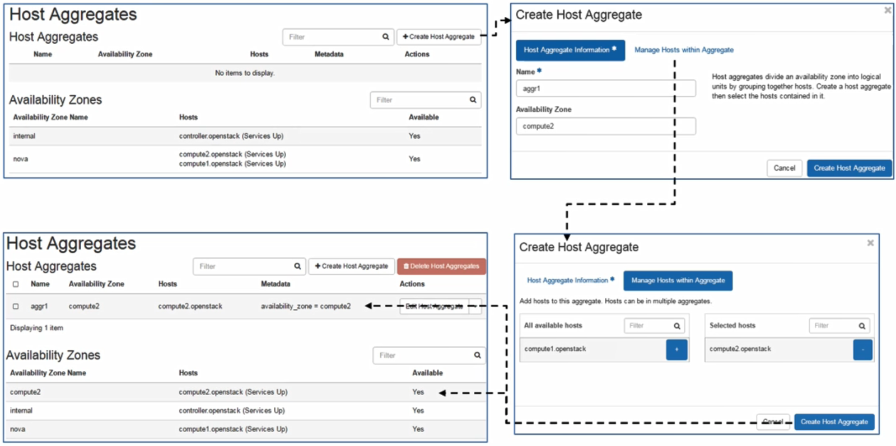

## Lanch a VM Instance on a Certain Availability Zone (Demo)

- Availability Zone - "compute2"

  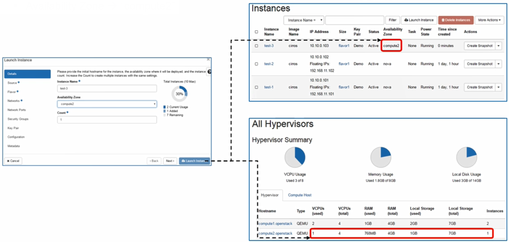

## VM Live Migration

- VM Migration은 특정 호스트 서버에서 동작 중인 VM을 오퍼레이션을 중단시키고 다른 데스티네이션 호스트 서버로 VM을 이주시킨 다음에 VM 런치해서 다시 동작

- VM Live Migration은 VM Migration 과정중에서 VM 라이프 사이클을 건드리지 않고 동작 중인 상태에서 원하는 호스트 서버로 Migration하는 개념


#### VM Live Migration이 필요한 이유

- System maintenance
  - 컴퓨트 노드가 커널 업그레이드나 고장시 shutdown이 필요해 재시작을 해야 하면 그 위에 동작 중인 VM 인스턴스는 중단되어야 함
  - 하지만 VM Live Migration을 통해서 대상 컴퓨트 노드로 해당 VM의 라이프 사이클을 변경시키지 않고 동작 중인 상태로 이전
- Resource reallocation
  - 컴퓨트 노드에 VM 인스턴스가 많이 생성될 수 있고 그 위에 동작 중인 어플리케이션(VNF)이 하이 퍼포먼스를 요구하는데 VM이 많으면 VNF의 퍼포먼스를 유지할 수 없음
  - 그런 상황에서 VNF의 동작 상태에 영향을 미치지 않고 유휴 자원이 많은 컴퓨트노드로 해당 VM을 마이그레이션 하거나 새로운 컴퓨트 노드를 추가해 해당 컴퓨트 노드에 마이그레이션을 진행하여 퍼포먼스를 보장

#### VM live migration types in OpenStack

- Shared storage-based live migration
  - network 파일 시스템 혹은 Distribute 파일 시스템 같은 스토리지를 필요로 함
  - source 컴퓨트 노드와 destination 컴퓨트 노드 사이에 공유 스토리지가 필요
  - 스토리지는 필요없고 VM의 memory 파트만 카피
  - 마이그레이션 속도가 빠르지만 shared storage를 사용한기 때문에 VM의 I/O 스피드가 떨어지는 단점이 존재
- Block live migration
  - VM의 memory와 disk(storage)까지 모두 카피
  - 마이그레이션 속도가 상대적으로 느리지만 shared storage가 필요 없음

#### Migration을 위한 노드 설정

- 관리자 입장에서 하기 때문에 OpenStack CLI를 이용

- 모든 노드에 공통적으로 설정해야 하는 사항

  1. SELinux를 permissive 모드로 설정
  2. hostname과 IP address 간에 바인딩을 설정
  3. 각각의 설정된 hostname들을 가지고 핑 테스트

  ```bash
  ## controller node
  
  $ setenforce 0
  $ vim /etc/hosts
  $ ping compute1.openstack
  $ ping compute2.openstack
  ```

  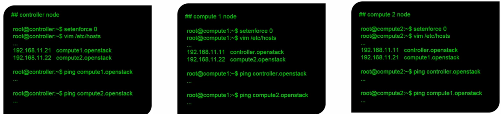

- 각각의 컴퓨트 노드에 설정

  - Modify nova-compute component and restart it

    ```bash
    $ vim /etc/nova/nova.conf
    $ service openstack-nova-compute restart
    $ service openstack-nova-compute status
    ```

    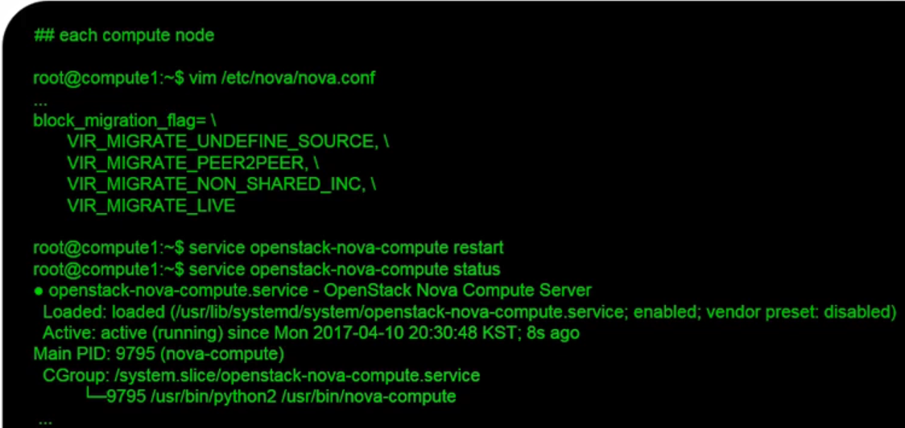

## Open Stack CLI

- 컨트롤러 노드로 접속하여 Packstack을 통해서 OpenStack 설치가 완료되면 "keystonerc_admin" 스크립트 파일이 자동 생성

- 설치된 오픈스택의 admin 계정에 대한 Authentication을 포함하는 스크립트를 실행시켜 어드민 계정으로 CLI를 사용

- Blcok live migration 사용

- Compute node 1의 VM을 Compute node 2로 마이그레이션

  ```bash
  $ source keystonerc_admin
  $ nova live-migration --block-migrate <instance id> <dest host name>
  ```

  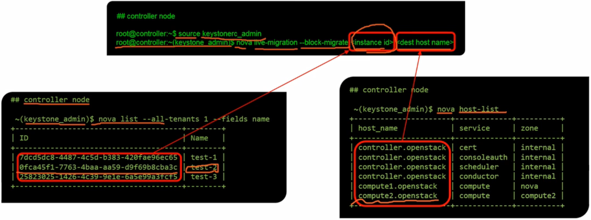

- Migrate "test-2" VM (192.168.11.102) in "compute1" to "compute2" node

- 중단없이 이전하기 때문에 ping이 끊기지 않고 전송됨

  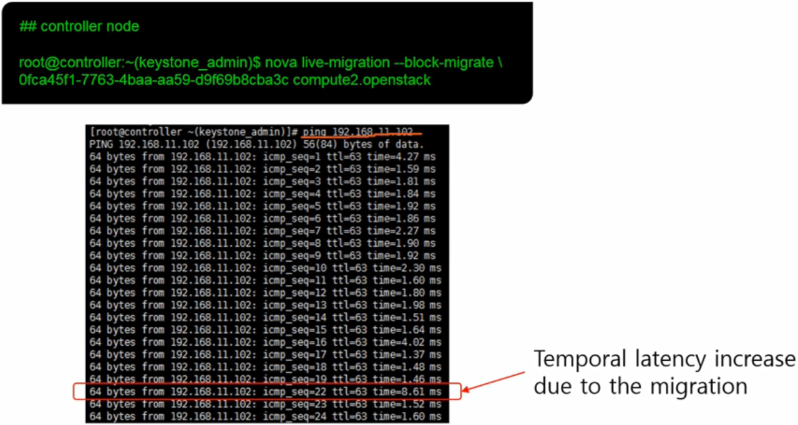

## After VM Live MIgration

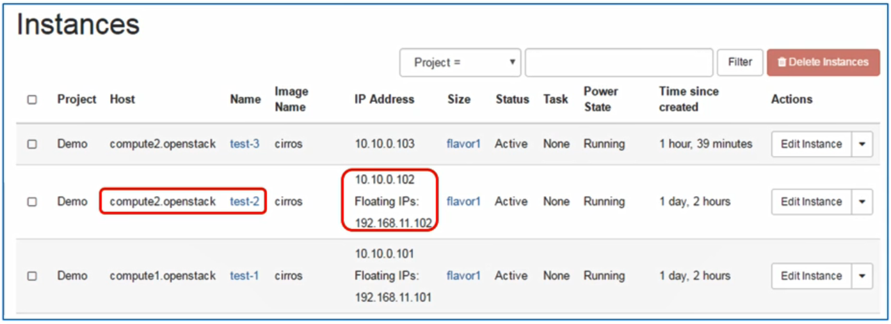


---

# 32. OpenStack CLI

### OpenStack API

- 오픈스택 API가 기본적으로 각각의 서비스 컴포넌트들은 각각의 API 서버를 가지고 있음

- 컴포넌트들에 대해서 사용자나 관리자가 RESTful API 형태로 접근하거나 요청하거나 CLI 형택로 사용

- 오픈스택의 클라이언트라 함은 tenant나 관리자가 될 수 있음

  - dashboard와 CLI를 이용해 접근

  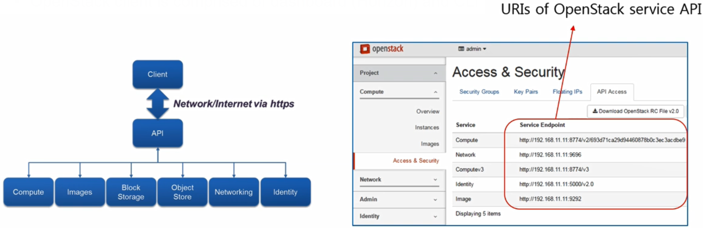

### OpenStack CLI

- OpenStack CLI에는 2가지 유형으로 구성
  - Unified CLI Client
  - Legacy CLI Clients
- 두 CLI 클라이언트 모두 CLI command를 입력하면 API 서버에 대한 request를 생성
  - 이때 기본적으로 서비스 컴포넌트들이 서비스를 RESTful API로 제공
  - 컴포넌트들에 요청에 대해서 HTTP(GET/POST, URI, media type) 메시지로 변환
  - 완료가 되면 내부적으로는 cURL을 이용해 서비스 컴포넌트에 전달
- CLI command를 입력할 때 debug 옵션을 사용하면 command가 실행되는 과정을 debuging log를 이용해 보여줌
  - OpenStack API call이 다수의 오픈스택 컴포넌트들을 거쳐서 순차적으로 발생하는 command의 request와 response 과정을 확인 가능

#### Unified CLI client

- 대부분의 오픈스택 서비스에서 이용가능한 방식
  - 오픈스택의 release 버전에 따라서 지원하지 않을 수 있음
- 특징
  - command들이 가지는 syntax들이 일정한 form을 가짐
    - (Take) OBJECT1 (and perform) ACTION (using) OBJECT2 (to it)
    - 편의상 해석 - object1을 취해서 action을 수행하고 optional하게 object2라는 것을 이용
    - `$ openstack [<global-options>] <object1> <action> [<object-2][<command-arguments>]`
    - Objects and action : https://docs.openstacak.org/developer/python-openstackclient/
  - 기존의 Legacy CLI와 Unified CLI를 매핑하기 위한 가이드가 존재
    - https://docs.openstack.org/developer/python-openstackclient/decoder.html

#### Legacy CLI client

- Nova CLI, Neutron CLI, ... 등의 서로 다른 컴포넌트들이 별도로 자신의 API 서버에 요청받을 수 있도록 별도의 CLI를 제공하는 것
  - syntax가 컴포넌트 별로 다 다름
- Keyston 서비스와 관련된 CLI는 사용하지 않음
- Command specifications
  - https://docs.openstack.org/cli-reference/

#### CLI 예제

**VM Instance의 description 요청**

- Legacy CLI
  - `nova show <instance_ID>`
- Unified CLI
  - `openstack server show <instacnce_ID>`

**floating IP의 description 요청**

- Legacy CLI
  - `neutron floatingip-show <floatingip_ID>`
- Unified CLI
  - `openstack floating ip show <floatingip_ID>`

**특정 서비스를 CLI를 통해 실행시켰을 때 debug 옵션 사용**

- `openstack server show <instance id> --debug`

  1) http를 생성해 Keystone API server로  요청을 보냄. CLI를 입력한 사용자가 권한이 있는지 확인하기 위하여 Keystone에 인증 과정을 요청

  2) Nova API server로 전달하여 응답으로 VM 인스턴스의 description 정보를 받아옴

  3) http 메시지를 생성해 Nova API server로 전송되며 이 메시지에 대한 응답은 VM 인스턴스가 사용하는 이미지의 description을 받아옴

  4) http 메시지를 생성해 Nova API server로 전달되며 응답은 VM 인스턴스에서 사용하는 flavor에 대한 description에 대한 결과를 받아옴

  5) CLI Client는 각각의 서비스들의 응답을 정리하여 사용자가 보기 쉽게 user-friendly한 format으로 변환

### Searching for CLI Commands

- 관리자 입장에서 서비스에 대한 요구사항이 발생했을 때 오픈스택의 GUI 환경에서 제공되지 않을 수 있음
  - 그때 그것을 대신하여 CLI command로 서비스를 실행시키는 방법을 찾는 법
- 상황 과정 : "Demo" tenant가 생성할 수 있는 VM 인스턴스의 개수 제한을 해제하는 방법에 대한 요구사항 발생
  - 요구되는 서비스의 키워드들을 정리하여 CLI specification에서 찾음
    - 해당 상황에서는 restriction, resource
    - https://docs.openstack.org/developer/python-openstackclient/commands.html
    - "quota" object와 관련되어 있다는 힌트를 얻음
  - quota를 이용한 명령어의 syntax들을 얻음
    - `openstack --help | grep quota`
    - `openstack quota set --help`
  - 더 많은 관련 정보
    - https://docs.openstack.org/developer/python-openstackclient/command-list.html
  - 얻은 정보를 이용해 VM 인스턴스의 개수 제한을 늘림
    - `openstack quota set --instances 20 "Demo"


---

# OVS-DPDK Installation on OpenStack 1

### Open vSwitch with DPDK(OVS-DPDK)

- Intel의 DPDK vSwitch 프로젝트에서 시작

- OVS 프로젝트와 통합하여 2.4 버전 이상부터 지원

  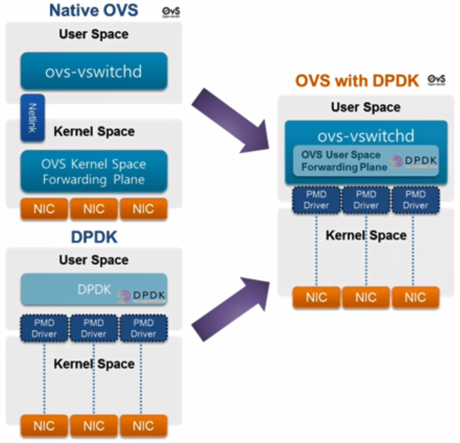

### Features

- DPDK-based implementation
  - Running based on EAL setups
- vHost-user port(vSwitch<->VM NIC)
- Multi-queue support in vHost-user
- Tunneling support : VxLAN, GRE, Geneve
- QoS support
  - VLAN / MPLS
  - Ingress / egress policing
- DPDK statistics


## Detailed Overview

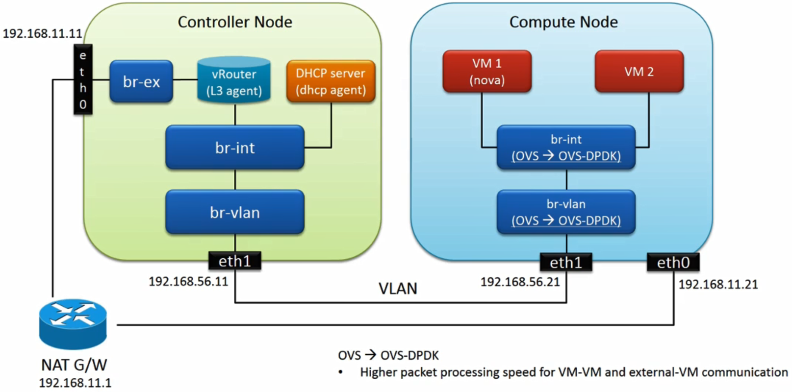


## OpenStack 구성

### Compute Node Resource

- 6 vCPUs
  - NUMA(Non-Uniform Memory Access)
    - 각 코어별로 물리적으로 위치가 다르고 각 코어에서 물리적으로 가까운 메모리들이 존재
    - 물리적으로 가까운 메모리를 이용해서 해당 코어가 동작하면 좀 더 빠른 처리 속도를 보임
    - `numactl --hardware`
- 8GB RAM

### Hugepage Pool Reservation

- Compute Node와 Guest VM 인스턴스들이 DPDK 기반 고속 패킷 프로세싱을 위한 공유하는 공유 메모리 풀

- Allocate 2MB (page size) * 2048 = 4GB (depending on host resource)

  - http://dpdk-guide.gitlab.io/dpdk-guide/setup/hugepages.html

  ```bash
  $ echo 'vm.nr_hugepages=2048' > /etc/sysctl.d/hugepages.conf
  $ reboot now
  $ grep Huge /proc/meminfo
  $ mount -t hugetlbfs none /dev/hugepages
  ```


## Open vSwitch 2.6 with DPDK 16.11

- Packstack for OpenStack Mitaka installs OVS 2.6.1 with DPDK 16.11 by default

  - packstack을 이용해 openstack을 설치하면 ovs와 dpdk가 기본적으로 설치

- OVS rpm package 체크

  - Compute Node 실행

    ```bash
    $ rpm -qa | grep openvswitch
    $ service openvswitch stop
    $ rpm -e openvswitch-2.5.0-2.el7.x86_64 --nodeps
    $ curl -O http://cbs.centos.org/kojifiles/packages/openvswitch/2.6.1/4.1.git20161206.el7/x86_64/openvswitch-2.6.1-4.1.git20161206.el7.x86_64.rpm
    $ rpm -i openvswitch-2.6.1-4.1.git20161206.el7.x86_64.rpm
    $ rpm -qa openvswitch
    $ ovs-vsctl show
    ```

### Configuration on QEMU

- QEMU는 user space에서 동작하는 하이퍼바이저

- QEMU의 설정을 변경

  - 하이퍼바이저에 의해 생성되는 VM 인스턴스들이 기존에 VM 네트워크 인터페이스가 아닌 DPDK 기반의 virtual interface를 생성하여 ovs-dpdk에 연결

  ```bash
  #compute node
  $ vim /etc/libvirt/qemu.conf
  ...
  user = "root"
  group = "root"
  ...
  hugetlbfs_mount = "/dev/hugepages"
  ...
  $ service libvirtd restart
  $ service openstack-nova-compute restart
  ```

### Configuration on Neutron Open vSwitch Agent

- Agent의 설정을 바꿔 컴퓨트 노드에서 동작하는 ovs가 ovs-dpdk로 동작한다고 명시

- DPDK 기반의 virtual interface를 생성하는데 그때 VM에서도 생성을 하고 클라이언트 서버 형태로 인스턴스가 구성

  - VM 쪽은 클라이언트 형태로 생성되고 실제 ovs-dpdk가  배치된 컴퓨트 노드는 ovs-dpdk가 서버 역할을 하면서 서버 소켓을 생성

- Notify the OVS agent that the OVS will be run in DPDK mode

- Define the location for server sockets of DPDK-based virtual interface that will be created  by OVS-DPDK

  ```bash
  $ vim /etc/neutron/plugins/ml2/openvswitch_agent.ini
  ...
  datapath_type = netdev
  vhostuser_socket_dir = /var/run/openvswitch
  ```

#### Deployment of OVS-DPDK

- OVS를 OVS-DPDK 모드로 동작하기 위해 OVS 설정을 변경

```bash
#compute node
$ ovs-vsctl --no-wait init
$ ovs-vsctl --no-wait set Open_vSwitch . other_config:dpdk-init=true
$ ovs-vsctl --no-wait set Open_vSwitch . other_config:dpdk-lcore-mask=0X1
$ ovs-vsctl --no-wait set Open_vSwitch . other_config:pmd-cpu-mask=0x6
$ ovs-vsctl --no-wait set Open_vSwitch . other_config:dpdk-socket-mem="1024"
$ ovs-vsctl --no-wait set Open_vSwitch . other_config:dpdk-hugepage-dir="/dev/hugepages"
$ service neutron-openvswitch-agent stop
$ service openvsiwthc stop
$ service neutron-openvswitch-agent start
```

- Specifications on "other_config"
  - If it is not set explicitly, OVS uses default values for the configuration items
- Configuration items
  - dpdk-init : OVS를 DPDK 모드로 동작
  - dpdk-lcore-mask : lcore threads를 컴퓨트 노드의 특정 CPU 코어에 마스킹
    - lcore threads - OVS-DPDK의 internal communication과 logging 역할
    - 0x1(0000 0001) : pinning a lcore thread to the first core on each NUMA node
  - pmd-cpu-mask : pmd threads에 대한 CPU 코어 마스킹
    - pmd threads - Poll Mode Driver라고 해서 DPDK 성능 향상을 위해서 하드웨어 인터럽트 없이 NIC에 도착한 패킷들을 User space 메모리로 올려서 고속으로 처리
    - 0x6(0000 0110) : pining two PMD threads to the second and third core on each NUMA node
  - dpdk-socket-mem : hugepage allocation한 것 중에서 일부를 OVS-DPDK가 고속 패킷 프로세싱을 위해 사용
    - 1024, 1024 : 1024MB for NUMA 0 and 1024MB for NUMA 1
  - dpdk-hugepage-dir : 컴퓨트 노드의 호스트 서버에 할당한 hugepage가 존재하는 디렉토리를 명시함으로써 OVS-DPDK가 해당 hugepage를 활용할 수 있도록 함
    - /dev/hugepage : the same location as QEMU setting for hugepage allocation to VMs
  - More details : http://openvswitch.org/support/dist-docs/ovs-vswitchd.conf.db.5.html

#### Confirmation

- OVSDB

  ```bash
  $ ovs-vsctl get Open_vSwitch.iface_type
  $ ovs-vsctl get Open_vSwitch.other-config
  ```

- ovs-vswitchd log

  ```bash
  $ vim /var/log/openvswitch/ovs-vswitchd.log
  ```

- Flow rules for the existing OpenStack networking

  ```bash
  root$ ovs-ofctl dump-flows br-vlan
  root$ ovs-ofctl dump-flows br-int
  ```

- User space datapath for OVS-DPDK

  - "netdev" : user space datapath
  - "system" : kernel space datapath

  ```bash
  $ ovs-vsctl list bridge | grep -P "netdev|name"
  datapath_type :netdev
  name :br-int
  datapath_type :netdev
  name :br-vlan
  ```

  