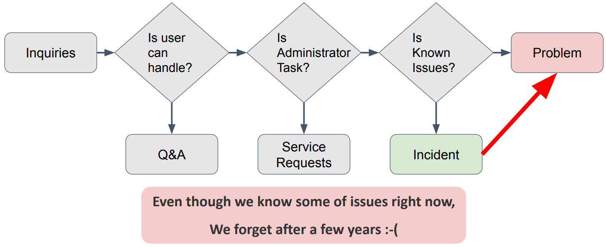

# OpenInfra & Cloud Native Days Korea 2022

11월 1일날 진행한 컨퍼런스인 OpenInfra & Cloud Native Days Korea 2022에서 발표된 세션중에 현재 업무와 연관되고 재미있게 들었던 세션에 대해서 소개드립니다.

- 컨퍼런스 링크 : https://2022.openinfradays.kr/

해당 세션은 카카오에서 발표한 세션으로 쿠버네티스에서 발생하는 이슈를 처리하기 위한 방법을 소개합니다.

- 세션 제목 : 7천개가 넘어가는 클러스터에서 쏟아지는 온콜 이슈 처리하기
- 발표자 : 홍석용 & 이완해, 카카오

- 세션 링크 : https://2022.openinfradays.kr/session/21

## 발표 내용 요약

### Kakao and Kubernates

- 카카오의 많은 서비스들을 쿠버네티스로 운영
- 2018년부터 서비스들을 쿠버네티스로 전환하여, 현재 99% 이상의 서비스를 전환

### Kubernetes in Kakao

- 카카오 쿠버네티스는 하나의 큰 클러스터가 아닌 많은 작은 클러스터로 운영
  - Isolation과 Security를 위해
- 이를 위해 **private Kubernetes as a Service**인 DKOS(Datacenter of Kakao Operating System)을 만듬

#### Good News

- 클러스터는 계속해서 증가하여 7000개 이상의 클러스터 운영

#### Bad News

- 그만큼 온콜 이슈도 꾸준히 증가

### Problem

- **사용하지 않는 클러스터 너무 많이 존재**
  - 테스트를 위해 만들고 삭제하지 않거나
  - 담당자가 이동하거나
  - 삭제하지 않고 새로 생성하거나
- **많은 온콜 이슈**
  - 하루에 10개 이상의 온콜 이슈 존재
  - 이러한 이슈들은 모든 개발자들이 쿠버네티스를 모르고, 디테일하게 모르는 등의 이슈
- **알려진 이슈도 후에 잊음**
  - 이미 해결된 이슈들에 대해서도 1년이 지나면 이슈로 다시 옴
    - 이 부분이 가장 공감되었습니다. 실제로 발생한 이슈들에 대해 문서에 작성은 해놓지만 시간이 지나면 관리도 안되고 다시 문의가 오기 때문입니다.
  - 

### Automation for Operation

- **"Detection as a Code"**를 개발
- 발견된 이슈들을 코드로 정의하여 자동으로 이슈들을 디텍팅하고 해결 방법을 제공

### detek

- detek : detecting Kubernetes known issues

- Collectors와 Detectors가 존재
  - Collectors는 쿠버네티스에서 pods나 Deployment Manifest 등의 정보들을 수집
  - Detectors는 수집한 정보들을 이용하여 이슈가 있는지 찾고 해결 방법을 보여줌
- 해당 결과를 html, json, table 중 하나로 출력(default html)

## detek에 OpenStack 적용

- 현재 detek은 오픈소스로 받아서 수정하고 사용해 볼 수 있다.
  - https://github.com/kakao/detek
- 해당 코드를 이용하여 쿠버네티스가 아닌 openstack의 이슈를 자동으로 감지하도록 개발하였습니다.
  - collector : openstack 인증 토큰과 VM 정보 수집
  - detector : VM 중 fail인 상태 감지 & 실행한 호스트에서 VM과 ping이 안되는 VM들 감지
- 사용한 openstack go sdk
  - https://github.com/gophercloud/gophercloud
- 전체 코드
  - https://github.com/JangYeHoon/detek

### 실행 방법

- go는 설치가 되어 있다고 가정합니다.
- 터미널 실행
  - detek 폴더 안에서 `go install github.com/gophercloud/gophercloud`
  - `go run .\main.go run -f html > report.html` < 실행 코드

### OpenStack Automation Code

#### Collector

- openstack_client.go
  - 해당 코드는 openstack에서 인증 토큰을 받아와 저장하는 코드입니다.
  - 간략히 인증하는 부분만 보여드리고 전체 코드는 git을 확인해 주시기 바랍니다.

```go
func (c *OpenStackCollector) Do(ctx detek.DetekContext) error {
	opt := gophercloud.AuthOptions{
		IdentityEndpoint: "http://{openstack_ip}:5000/v3",		// keystone ip
        Username:         "{user_name}",						// 사용자 이름(ex. admin)
		Password:         "{user_password}",					// 사용자 비밀번호
        DomainID:         "{default}",							// 프로젝트의 도메인 ID(ex. default)
	}

	provider, err := openstack.AuthenticatedClient(opt)			// 정의한 Auth Option을 이용해 토큰 가져옴

	if err != nil {
		return fmt.Errorf("fail to get openstack client : %w", err)
	}

	if err := ctx.Set(KeyOpenStackClient, provider); err != nil {	// 가져온 토큰 KeyOpenStackClient에 저장
		return err
	}

	return nil
}
```

- openstack_core.go
  - 해당 코드는 위에서 가져온 토큰을 이용해 VM 리스트를 받아와 저장하는 코드입니다.

```go
func (*OpenStackCoreCollector) Do(dctx detek.DetekContext) error {
	c, err := detek.Typing[*gophercloud.ProviderClient](			// KeyOpenStackClient에 저장된 토큰 가져옴
		dctx.Get(KeyOpenStackClient, nil),
	)
	if err != nil {
		return fmt.Errorf("fail to get openstack client: %w", err)
	}

	client, err := openstack.NewComputeV2(c, gophercloud.EndpointOpts{		// compute 정보 가져옴
		Region:       "RegionOne",
		Name:         "nova",
		Type:         "compute",
		Availability: gophercloud.AvailabilityInternal,
	})
	if err != nil {
		return fmt.Errorf("fail to get openstack compute client: %w", err)
	}
	var errs = &multierror.Error{}

	serverPager := servers.List(client, servers.ListOpts{})		// VM 리스트 정보 rest api를 통해 가져옴
	err = serverPager.EachPage(func(page pagination.Page) (bool, error) {
		serverList, err := servers.ExtractServers(page)
		errs = multierror.Append(errs, err)
		errs = multierror.Append(errs,
			dctx.Set(KeyOpenStackServerList, serverList),		// VM 리스트 정보 KeyOpenStackServerList에 저장
		)
		return true, nil
	})

	if err != nil {
		return fmt.Errorf("fail get server list : %w", err)
	}

	return errs.ErrorOrNil()
}
```

#### Detector

- failed_server.go
  - Collector에서 가져온 VM 정보에서 상태가 fail인 VM 감지해서 출력

```go
func (i *FailedServer) Do(ctx detek.DetekContext) (*detek.ReportSpec, error) {
	serverList, err := detek.Typing[[]servers.Server](		// KeyOpenStackServerList에 저장된 VM 정보 가져옴
		ctx.Get(collector.KeyOpenStackServerList, nil),
	)

	if err != nil {
		return nil, err
	}

	type Problem struct {
		Id, Name, Reason string			// 보여줄 필드 정의
	}
	problems := []Problem{}

	for _, s := range serverList {
		if s.Status == "ERROR" {			// 상태가 ERROR인 VM 찾음
			problems = append(problems, Problem{		// ERROR VM 정보 저장
				Id:     s.ID,
				Name:   s.Name,
				Reason: "server status error",
			})
		}
	}

	report := &detek.ReportSpec{
		HasPassed:  len(problems) == 0,
		Attachment: []detek.JSONableData{{Description: "# of Servers", Data: len(serverList)}},
	}
	if len(problems) != 0 {		// ERROR인 VM이 0개가 아니면 오류로 발견 이슈와 해결 방법들 출력
		report.HasPassed = false
		report.Problem = detek.JSONableData{
			Description: "Failed server list",
			Data:        problems,
		}
	}

	return report, nil
}
```

- faild_ping_vm_from_host.go
  - 해당 코드를 돌리는 호스트에서 vm으로 ping을 전송하여 실패하는 VM 감지
  - icmp 라이브러리를 사용하면 좋지만 간단히 확인을 위해 터미널로 명령어를 날려 출력되는 정보로 탐지

```go
...
	for _, s := range serverList {
		if s.Status == "ACTIVE" {		// ACTIVE인 상태의 VM에 대해서만 ping을 전송
			var ipList []string
			for _, val := range s.Addresses {		// VM Addresses에서 ip만 뽑는 코드
				str := fmt.Sprintf("%v", val)
				first_num := strings.LastIndex(str, "addr:") + 5
				last_num := strings.LastIndex(str, "version") - 1
				ipList = append(ipList, str[first_num:last_num])
			}

			for _, value := range ipList {
				ping_result, _ := exec.Command("ping", value, "-c 1").Output()
                		// 명령어로 VM에 ping을 날려 출력되는 결과를 ping_result에 저장
				if strings.Contains(string(ping_result), "Destination Host Unreachable") ||
					strings.Contains(string(ping_result), "Request Timed Out") {
                        	// 출력된 정보 중 실패한 결과가 있으면 problems에 저장
					problems = append(problems, Problem{
						Id:     s.ID,
						Name:   s.Name,
						Ip:     value,
						Reason: "ping fail",
					})
				}
			}
		}
	}
...
```

